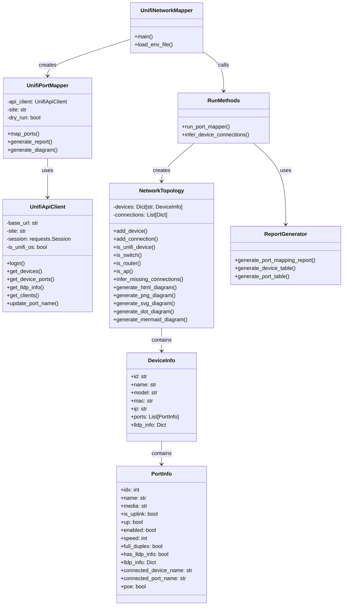
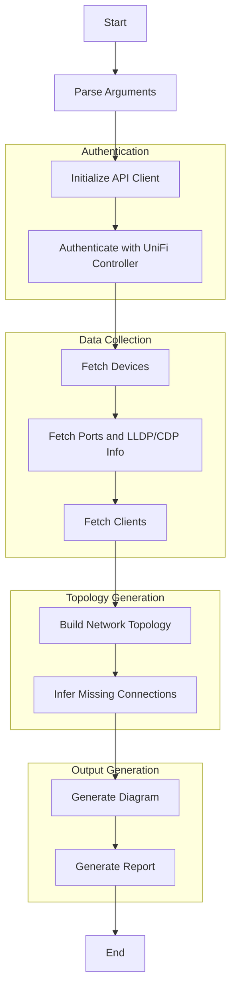

# UniFi Network Topology Visualization Toolkit

A comprehensive toolkit for visualizing and managing UniFi network topologies, including automatic port mapping, network diagram generation, and device management.

## Purpose

This toolkit helps UniFi network administrators visualize their network topology, automatically map and name ports based on connected devices, and generate comprehensive reports. It leverages LLDP/CDP information to build accurate network maps and supports multiple visualization formats including interactive HTML diagrams.

## Key Features

- **Complete Device Discovery**: Automatically identifies all UniFi devices (routers, switches, APs)
- **Intelligent Port Mapping**: Names ports based on connected devices
- **Multiple Visualization Formats**: PNG, SVG, DOT, Mermaid, and interactive HTML
- **Interactive Diagrams**: Drag-and-drop interface with zoom, pan, and custom layout saving
- **Flexible Authentication**: Supports both API token and username/password
- **Dry Run Mode**: Test port naming changes without applying them

## Code Structure

### Main Components

- **unifi_network_mapper.py**: Main entry point and command-line interface
- **src/unifi_mapper/**: Core modules for API communication, topology generation, and port mapping
- **src/scripts/**: Command-line utilities for specific tasks

### Core Modules

- **api_client.py**: Handles communication with the UniFi Controller API
- **models.py**: Data models for devices and ports
- **enhanced_network_topology.py**: Network topology visualization with advanced features
- **run_methods.py**: Helper methods for running the port mapper
- **port_mapper.py**: Port mapping and naming logic
- **report_generator.py**: Generates detailed reports
- **device_definitions.py**: Device model definitions and port configurations

## Class Diagram



## Process Flow



## Usage Examples

### Basic Usage

```bash
# Using environment variables from .env file
python unifi_network_mapper.py --env

# Using command line arguments
python unifi_network_mapper.py --url https://192.168.1.1 --token your_api_token
```

### Advanced Options

```bash
# Generate interactive HTML diagram
python unifi_network_mapper.py --env --format html --diagram diagrams/network.html

# Include all connected devices (not just UniFi devices)
python unifi_network_mapper.py --env --format html --diagram diagrams/all_devices.html --connected-devices

# Dry run mode (doesn't apply changes)
python unifi_network_mapper.py --env --dry-run
```

## Configuration

Create a `.env` file with your UniFi Controller credentials:

```
UNIFI_URL=https://192.168.1.1
UNIFI_SITE=default
UNIFI_CONSOLE_API_TOKEN=your_api_token
# Or use username/password authentication
UNIFI_USERNAME=your_username
UNIFI_PASSWORD=your_password
UNIFI_VERIFY_SSL=false
UNIFI_TIMEOUT=10
```

## Installation

1. Clone the repository
2. Create a virtual environment: `python -m venv .venv`
3. Activate the environment: `source .venv/bin/activate` (Linux/Mac) or `.venv\Scripts\activate` (Windows)
4. Install dependencies: `pip install -r requirements.txt`
5. Configure your UniFi Controller credentials
6. Run the toolkit: `python unifi_network_mapper.py --env`

## Troubleshooting

- **SSL Certificate Errors**: Use `--no-verify` or set `UNIFI_VERIFY_SSL=false`
- **Authentication Failures**: Verify your API token or username/password
- **Missing Access Points**: Ensure the code is properly detecting all device types
- **Layout Issues**: Try different diagram formats or adjust layout algorithms

For more detailed information, see the [DETAILED_README.md](DETAILED_README.md) file.

## Dependencies

The project uses the following dependencies:

### Core Dependencies

- **requests**: Used by the `api_client.py` module to communicate with the UniFi Controller API
- **python-dotenv**: Used to load environment variables from `.env` files
- **pyunifi**: The Python library for UniFi Controller API

### HTML Parsing

- **beautifulsoup4**: Used in `html_parser.py` for parsing HTML content
- **lxml**: Used as the HTML parser backend for BeautifulSoup

### Visualization

- **d3.js**: Used for interactive HTML visualizations (loaded via CDN in the HTML output)

### Optional Dependencies

These are included as commented options in requirements.txt since they're not actively used in the current codebase but were in the original requirements:

- **networkx**: For graph representation and algorithms
- **matplotlib**: For generating PNG/SVG diagrams
- **pydot**: For DOT format diagrams
- **pygraphviz**: Alternative for DOT format diagrams

### Utilities

- **rich**: For enhanced console output formatting

## License

This project is licensed under the MIT License - see the LICENSE file for details.
