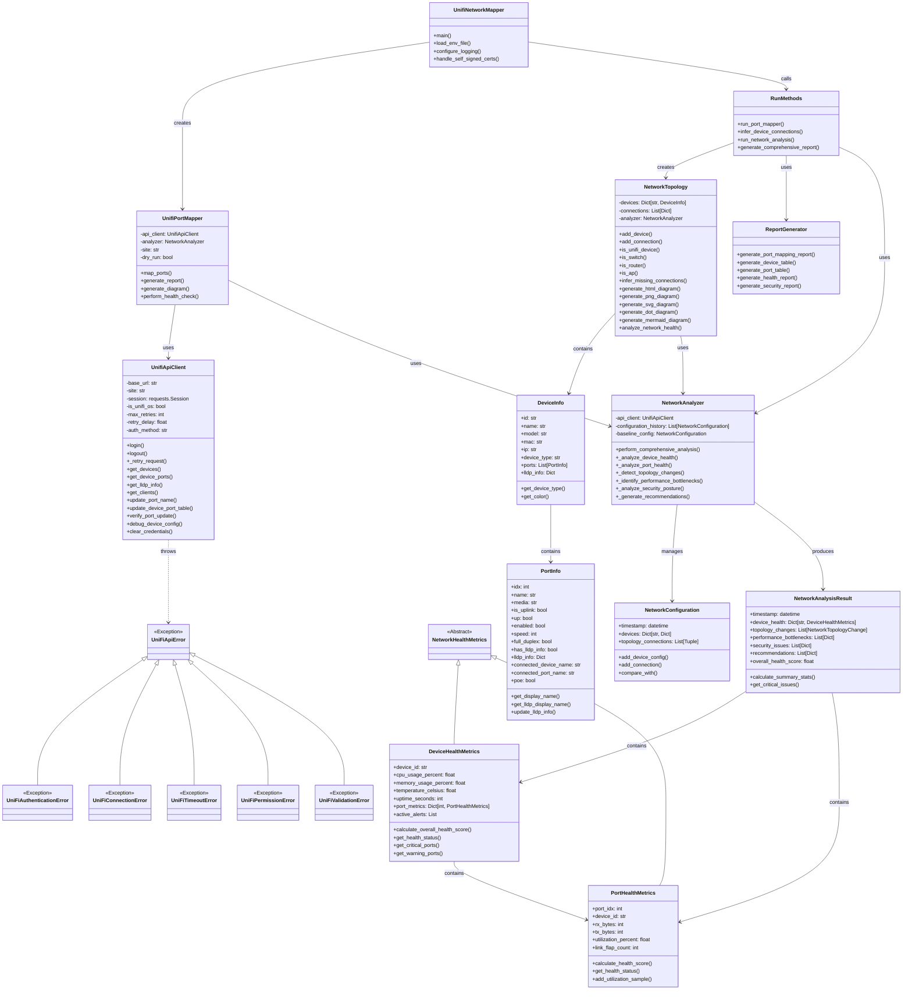

# UniFi Network Topology Visualization Toolkit

🚀 **UV Project**: Modern Python tooling with fast dependency management and global installation support.

A comprehensive toolkit for visualizing and managing UniFi network topologies, including automatic port mapping, network diagram generation, and device management.

## Purpose

This toolkit helps UniFi network administrators visualize their network topology, automatically map and name ports based on connected devices, and generate comprehensive reports. It leverages LLDP/CDP information to build accurate network maps and supports multiple visualization formats including interactive HTML diagrams.

## Installation

### Method 1: Global UV Tool Installation (Recommended)

Install once, run from anywhere with different config files:

```bash
# Install globally with UV
uv tool install .

# Or from git
uv tool install git+https://github.com/NetDevAutomate/unifi-network-mapper

# Run from anywhere
unifi-mapper --help
unifi-mapper --config ~/.unifi/prod.env --format png
```

### Method 2: Local Development

```bash
# Create UV virtual environment
uv venv

# Install project
uv pip install -e .

# Install dev dependencies
uv pip install --group dev

# Run with uv
uv run unifi-mapper --config .env
```

### Method 3: Traditional (Legacy)

```bash
python unifi_network_mapper.py --env
```

## Usage

### Global Tool (After uv tool install)

```bash
# Basic usage with config file
unifi-mapper --config ~/.unifi/production.env

# Generate PNG diagram
unifi-mapper --config ~/.unifi/prod.env --format png

# Multiple configs for different networks
unifi-mapper --config ~/.unifi/office.env --output ~/reports/office.md
unifi-mapper --config ~/.unifi/homelab.env --output ~/reports/homelab.md

# Run from any directory - outputs relative to current location
cd ~/Documents/network-reports
unifi-mapper --config ~/.unifi/prod.env  # Creates ./reports and ./diagrams here
```

## Key Features

- **Complete Device Discovery**: Automatically identifies all UniFi devices (routers, switches, APs)
- **Intelligent Port Mapping**: Names ports based on connected devices
- **Multiple Visualization Formats**: PNG, SVG, DOT, Mermaid, and interactive HTML
- **Interactive Diagrams**: Drag-and-drop interface with zoom, pan, and custom layout saving
- **Flexible Authentication**: Supports both API token and username/password
- **Dry Run Mode**: Test port naming changes without applying them
- **IP Conflict Detection**: Identifies duplicate IP addresses in your network

## Code Structure

### Main Components

- **unifi_network_mapper.py**: Main entry point and command-line interface
- **src/unifi_mapper/**: Core modules for API communication, topology generation, and port mapping
- **src/scripts/**: Command-line utilities for specific tasks

### Core Modules

- **api_client.py**: Handles communication with the UniFi Controller API
- **models.py**: Data models for devices and ports
- **enhanced_network_topology.py**: Network topology visualization with advanced features
- **run_methods.py**: Helper methods for running the port mapper
- **port_mapper.py**: Port mapping and naming logic
- **report_generator.py**: Generates detailed reports
- **device_definitions.py**: Device model definitions and port configurations

## Enhanced Architecture Diagram

### Core System Architecture



### Security Architecture


## Enhanced Process Flow with Network Analysis


### Network Health Monitoring Workflow


## Usage Examples

### Basic Usage

```bash
# Using environment variables from .env file
python unifi_network_mapper.py --env

# Using command line arguments
python unifi_network_mapper.py --url https://192.168.1.1 --token your_api_token
```

### Advanced Options

```bash
# Generate interactive HTML diagram
python unifi_network_mapper.py --env --format html --diagram diagrams/network.html

# Include all connected devices (not just UniFi devices)
python unifi_network_mapper.py --env --format html --diagram diagrams/all_devices.html --connected-devices

# Dry run mode (doesn't apply changes)
python unifi_network_mapper.py --env --dry-run

# Enable comprehensive network health analysis
python unifi_network_mapper.py --env --analyze-health --save-analysis

# Generate security-focused report
python unifi_network_mapper.py --env --security-analysis --output-format json
```

### Network Health Analysis

The toolkit now includes comprehensive network health monitoring and analysis capabilities:

```bash
# Perform network health check with detailed metrics
python unifi_network_mapper.py --env --health-check

# Generate performance bottleneck report
python unifi_network_mapper.py --env --performance-analysis

# Track configuration changes over time
python unifi_network_mapper.py --env --config-drift-analysis

# Security posture assessment
python unifi_network_mapper.py --env --security-audit
```

The network analyzer provides:

- **Device Health Monitoring**: CPU, memory, and temperature tracking
- **Port Performance Analysis**: Utilization, error rates, and link stability
- **Topology Change Detection**: Automatic detection of network changes
- **Security Assessment**: Firmware version checks and vulnerability analysis
- **Performance Bottleneck Identification**: Resource utilization and capacity planning
- **Configuration Drift Analysis**: Historical comparison and stability scoring

### Client Lookup Tool

The toolkit includes a client lookup tool that allows you to search for clients by name, MAC address, or IP address:

```bash
# Using the wrapper script (recommended)
./tools/unifi_lookup "macbook" --env

# Search for clients using environment variables from .env file
python src/scripts/unifi_lookup.py "macbook" --env

# Search using command line arguments
python src/scripts/unifi_lookup.py "192.168.1" --url https://unifi.local:8443 --token your_api_token

# Enable debug logging
python src/scripts/unifi_lookup.py "printer" --env --debug

# Enable SSL verification (disabled by default)
python src/scripts/unifi_lookup.py "printer" --env --verify-ssl
```

### IP Conflict Detector

The toolkit includes an IP conflict detector that identifies duplicate IP addresses in your network:

```bash
# Using the wrapper script (recommended)
./tools/unifi_ip_conflict --env

# Using environment variables from .env file
python src/scripts/unifi_ip_conflict_detector.py --env

# Using command line arguments
python src/scripts/unifi_ip_conflict_detector.py --url https://unifi.local:8443 --token your_api_token

# Include historical clients (may include stale data)
python src/scripts/unifi_ip_conflict_detector.py --env --include-historical

# Enable debug logging
python src/scripts/unifi_ip_conflict_detector.py --env --debug
```

The IP conflict detector displays detailed information about conflicting devices including:
- IP Address
- Device Names
- MAC Addresses (prominently displayed)
- Connection Points (which switch/port or AP)
- Interface Details (port number for wired connections)
- Connection Status (wired, wireless, guest, offline)

The tool provides three different views:
1. A hierarchical tree view showing conflicts grouped by IP address
2. A summary table with IP addresses, device counts, MAC addresses, and names
3. A detailed table with connection information for easy troubleshooting

### Configuration Validator & Auto-Fix

The toolkit includes powerful configuration validation and auto-fix capabilities that detect and remediate common UniFi misconfigurations:

```bash
# Validate configuration against best practices
uv run unifi-config-validator -c ~/.config/unifi/prod.env

# Check only trunk/VLAN routing issues
uv run unifi-config-validator -c ~/.config/unifi/prod.env --check trunk

# Show only critical and high severity issues
uv run unifi-config-validator -c ~/.config/unifi/prod.env -s critical,high

# Generate markdown report
uv run unifi-config-validator -c ~/.config/unifi/prod.env -o report.md
```

**Auto-Fix VLAN Blocking Issues:**

```bash
# ALWAYS dry-run first to preview changes
uv run unifi-config-autofix -c ~/.config/unifi/prod.env --dry-run

# Fix all VLAN blocking issues
uv run unifi-config-autofix -c ~/.config/unifi/prod.env --fix-all

# Fix specific device only
uv run unifi-config-autofix -c ~/.config/unifi/prod.env --fix-all -d "Dream Machine Pro"

# Generate rollback script for safety
uv run unifi-config-autofix -c ~/.config/unifi/prod.env --fix-all --rollback-script rollback.sh
```

**Validators Included:**

| Validator | Description |
|-----------|-------------|
| **TrunkPortValidator** | Detects `forward: native` and `tagged_vlan_mgmt: block_all` that silently drop VLAN traffic |
| **STPValidator** | Checks for non-deterministic STP root bridge selection |
| **SecurityValidator** | Guest isolation, DHCP guard, IoT segregation |
| **OperationalValidator** | Device naming, firmware consistency, PoE budget |
| **DHCPValidator** | Gateway enabled, DNS settings, lease times |

See [Configuration Validation Documentation](docs/config-validation.md) for detailed usage.

## Configuration

Create a `.env` file with your UniFi Controller credentials:

```
UNIFI_URL=https://192.168.1.1
UNIFI_SITE=default
UNIFI_CONSOLE_API_TOKEN=your_api_token
# Or use username/password authentication
UNIFI_USERNAME=your_username
UNIFI_PASSWORD=your_password
UNIFI_VERIFY_SSL=false
UNIFI_TIMEOUT=10
```

## Security Features

The toolkit implements comprehensive security controls for safe operation with UniFi Controllers:

### Authentication Security
- **Multi-method Authentication**: Supports both API tokens and username/password with automatic detection
- **Session Management**: Secure session handling with automatic cleanup
- **Credential Sanitization**: All sensitive data is sanitized in logs and memory
- **Retry Logic**: Exponential backoff with authentication failure detection

### Network Security
- **Self-signed Certificate Support**: Proper handling of UniFi Controllers with self-signed certificates
- **SSL/TLS Validation**: Configurable SSL verification with security warnings
- **Input Validation**: All user inputs are validated and sanitized to prevent injection attacks
- **Response Sanitization**: API responses are sanitized before logging

### Data Protection
- **Secure Memory Management**: Credentials are overwritten in memory when no longer needed
- **Logging Security**: Sensitive information is never logged in plain text
- **Error Handling**: Comprehensive error handling without exposing sensitive details

## Troubleshooting

- **SSL Certificate Errors**: Use `--no-verify` or set `UNIFI_VERIFY_SSL=false` (the toolkit is designed for self-signed certificates)
- **Authentication Failures**: Verify your API token or username/password - the toolkit will attempt both methods
- **Connection Issues**: The toolkit includes retry logic with exponential backoff for transient network issues
- **Missing Access Points**: Ensure the code is properly detecting all device types
- **Layout Issues**: Try different diagram formats or adjust layout algorithms
- **Port Name Updates Not Persisting**: See [Port Update Persistence Fix](docs/port_update_persistence_fix.md) for comprehensive solutions

### Port Name Update Issues

If you're experiencing issues where port name updates return HTTP 200 but don't persist in the UniFi UI:

```bash
# Debug a specific device
./tools/debug_port_updates --env --device-id <device_id>

# Fix persistent port naming issues
./tools/fix_port_persistence --env --device-id <device_id> --port-updates '{"2": "DeviceName"}'
```

See the [detailed port persistence fix documentation](docs/port_update_persistence_fix.md) for more information.

For more detailed information, see the [DETAILED_README.md](DETAILED_README.md) file.

## Dependencies

The project uses the following dependencies:

### Core Dependencies

- **requests**: Used by the `api_client.py` module to communicate with the UniFi Controller API with comprehensive error handling and retry mechanisms
- **python-dotenv**: Used to load environment variables from `.env` files
- **pyunifi**: The Python library for UniFi Controller API

### Analysis and Monitoring

- **statistics**: Used for statistical analysis in network health monitoring and performance metrics
- **datetime/timedelta**: Used for time-based analysis, configuration drift detection, and historical data tracking
- **pathlib**: Used for file system operations in analysis result storage

### HTML Parsing

- **beautifulsoup4**: Used in `html_parser.py` for parsing HTML content
- **lxml**: Used as the HTML parser backend for BeautifulSoup

### Visualization

- **d3.js**: Used for interactive HTML visualizations (loaded via CDN in the HTML output)

### Optional Dependencies

These are included as commented options in requirements.txt since they're not actively used in the current codebase but were in the original requirements:

- **networkx**: For graph representation and algorithms
- **matplotlib**: For generating PNG/SVG diagrams
- **pydot**: For DOT format diagrams
- **pygraphviz**: Alternative for DOT format diagrams

### Utilities

- **rich**: For enhanced console output formatting

## Advanced Diagnostics & Analysis Tools

The toolkit includes a comprehensive suite of advanced network diagnostics, validation, and analysis tools. See [Advanced Diagnostics Documentation](docs/ADVANCED_DIAGNOSTICS.md) for full details.

### Quick Reference

| Tool | CLI Command | Purpose |
|------|-------------|---------|
| MAC Table Analyzer | `unifi-mac-analyzer` | Detect MAC flapping, loops, unauthorized devices |
| Link Quality Monitor | `unifi-link-quality` | Physical layer health, CRC errors, SFP diagnostics |
| Storm Detector | `unifi-storm-detector` | Broadcast/multicast storm detection |
| Client Path Tracer | `unifi-client-trace` | Trace client connectivity through switch fabric |
| Capacity Planner | `unifi-capacity-planner` | Port utilization, PoE budget, growth forecasting |
| QoS Validator | `unifi-qos-validator` | DSCP trust, voice VLAN, queue configuration audit |
| LAG Monitor | `unifi-lag-monitor` | Link aggregation health and load balance |
| Config Backup | `unifi-config-backup` | Configuration snapshots and change tracking |
| Firmware Advisor | `unifi-firmware-advisor` | Firmware security assessment and CVE checking |

### Diagnostics Architecture


### Example Usage

```bash
# Detect MAC flapping and unauthorized devices
unifi-mac-analyzer --env --allowed-macs /path/to/allowed.txt

# Check physical layer health
unifi-link-quality --env --output link_report.md

# Detect broadcast storms
unifi-storm-detector --env --broadcast-threshold 500

# Trace client path through network
unifi-client-trace --env --mac aa:bb:cc:dd:ee:ff

# Validate QoS configuration
unifi-qos-validator --env --strict

# Monitor LAG health
unifi-lag-monitor --env

# Backup and compare configurations
unifi-config-backup --env backup -d "Before maintenance"
unifi-config-backup --env diff backup_20241228_120000

# Firmware security assessment
unifi-firmware-advisor --env --min-score 70
```

All tools support common options: `--env`, `--config <file>`, `--json`, `--output <file>`, `--debug`

---

## Port Update Debugging Tools

### Port Update Debugging

The toolkit includes advanced debugging tools for troubleshooting UniFi API port update persistence issues:

- **debug_port_updates**: Comprehensive device configuration analysis and API endpoint testing
- **fix_port_persistence**: Enhanced port update methods with verification and fallback strategies

These tools address the common issue where UniFi API calls return HTTP 200 success but port name changes don't persist in the UI.

## License

This project is licensed under the MIT License - see the LICENSE file for details.
