# Advanced Diagnostics & Analysis Tools

This document covers the advanced network diagnostics, validation, and analysis tools available in the UniFi Network Mapper toolkit.

## Table of Contents

- [Overview](#overview)
- [Architecture](#architecture)
- [Tools Reference](#tools-reference)
  - [MAC Table Analyzer](#mac-table-analyzer)
  - [Link Quality Monitor](#link-quality-monitor)
  - [Storm Detector](#storm-detector)
  - [Client Path Tracer](#client-path-tracer)
  - [Capacity Planner](#capacity-planner)
  - [QoS Validator](#qos-validator)
  - [LAG Monitor](#lag-monitor)
  - [Config Backup & Diff](#config-backup--diff)
  - [Firmware Security Advisor](#firmware-security-advisor)
- [Integration Patterns](#integration-patterns)
- [Troubleshooting Workflows](#troubleshooting-workflows)

---

## Overview

The advanced diagnostics suite provides comprehensive network analysis capabilities beyond basic topology mapping. These tools help network administrators:

- **Detect problems proactively** before they impact users
- **Validate configurations** against best practices
- **Track changes** over time with configuration backups
- **Plan capacity** to avoid resource exhaustion
- **Ensure security** with firmware vulnerability analysis

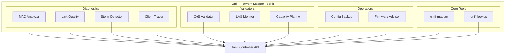

---

## Architecture

### Module Structure

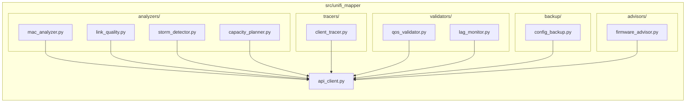

### Data Flow

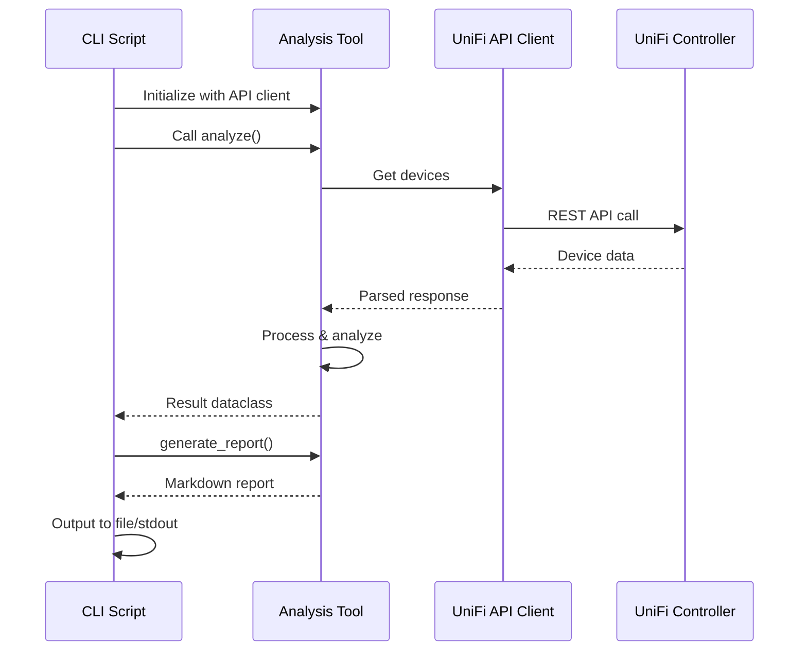

---

## Tools Reference

### MAC Table Analyzer

**CLI Command:** `unifi-mac-analyzer`

**Purpose:** Analyzes MAC address tables across switches to detect security issues and network problems.

#### Key Features

- **MAC Flapping Detection** - Identifies MAC addresses moving between ports (indicates loops or misconfiguration)
- **Unauthorized Device Detection** - Compares against allowed MAC list
- **Capacity Analysis** - Flags ports with excessive MAC addresses
- **Historical Tracking** - Tracks MAC movements over time

#### Architecture

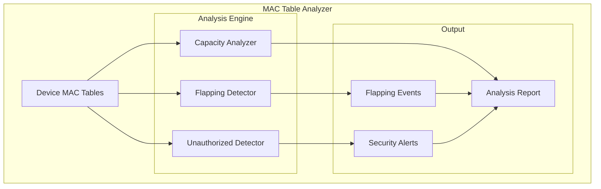

#### Usage

```bash
# Basic analysis
unifi-mac-analyzer --env

# With allowed MAC list
unifi-mac-analyzer --env --allowed-macs /path/to/allowed.txt

# JSON output for integration
unifi-mac-analyzer --env --json --output mac_analysis.json
```

#### Detection Logic

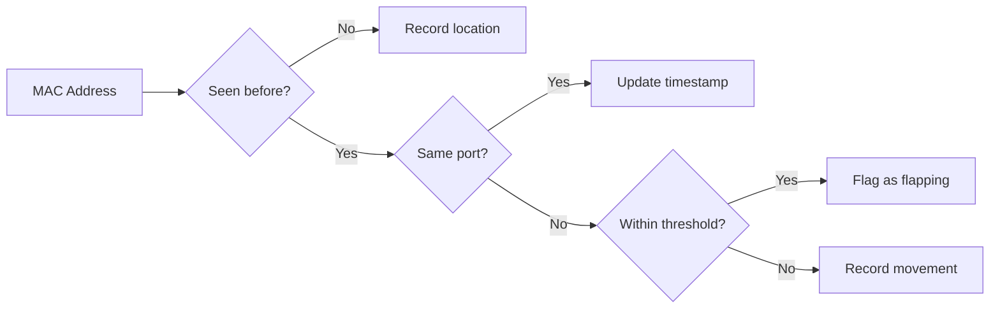

---

### Link Quality Monitor

**CLI Command:** `unifi-link-quality`

**Purpose:** Monitors physical layer health including errors, SFP diagnostics, and link stability.

#### Key Features

- **CRC Error Tracking** - Detects cable/connector issues
- **Duplex Mismatch Detection** - Identifies mismatched port settings
- **SFP/SFP+ Diagnostics** - Temperature, power levels, DOM data
- **Link Stability Analysis** - Tracks flapping links

#### Architecture

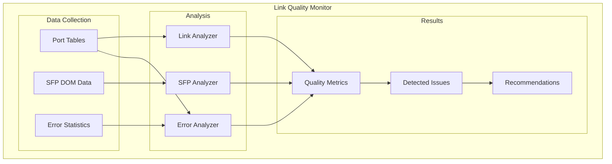

#### Severity Levels

| Level | Condition | Example |
|-------|-----------|---------|
| Critical | Service impacting | SFP temperature >85°C |
| Warning | Degraded performance | CRC errors >1000 |
| Info | Suboptimal | Half-duplex detected |

#### Usage

```bash
# Full link quality report
unifi-link-quality --env

# Output to file
unifi-link-quality --env --output link_report.md
```

---

### Storm Detector

**CLI Command:** `unifi-storm-detector`

**Purpose:** Detects broadcast and multicast storms that can degrade network performance.

#### Key Features

- **Real-time Storm Detection** - Identifies excessive broadcast/multicast traffic
- **Per-port Analysis** - Pinpoints storm source
- **Configurable Thresholds** - Adjust for your environment
- **Storm History** - Track patterns over time

#### Storm Detection Flow

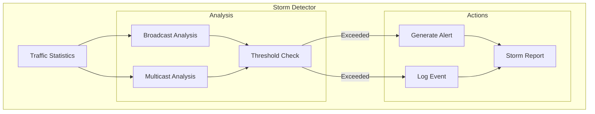

#### Default Thresholds

| Traffic Type | Warning (pps) | Critical (pps) |
|--------------|---------------|----------------|
| Broadcast | 1,000 | 5,000 |
| Multicast | 5,000 | 25,000 |

#### Usage

```bash
# Default thresholds
unifi-storm-detector --env

# Custom thresholds
unifi-storm-detector --env --broadcast-threshold 500 --multicast-threshold 2500
```

---

### Client Path Tracer

**CLI Command:** `unifi-client-trace`

**Purpose:** Traces the path of a client through the switch fabric to identify connectivity issues.

#### Key Features

- **End-to-End Path Tracing** - From client to gateway
- **VLAN Verification** - Ensures proper tagging throughout path
- **Hop Analysis** - Details each switch hop
- **Issue Detection** - Identifies path problems

#### Path Trace Visualization

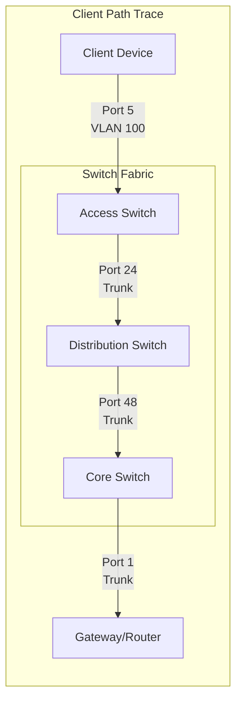

#### Usage

```bash
# Trace by MAC address
unifi-client-trace --env --mac aa:bb:cc:dd:ee:ff

# Trace by IP
unifi-client-trace --env --ip 192.168.1.100

# Trace by hostname
unifi-client-trace --env --hostname "johns-laptop"

# With destination
unifi-client-trace --env --mac aa:bb:cc:dd:ee:ff --destination 10.0.0.1
```

---

### Capacity Planner

**CLI Command:** `unifi-capacity-planner`

**Purpose:** Analyzes port utilization, PoE budget, and growth trends for capacity planning.

#### Key Features

- **Port Utilization Tracking** - Current and trend analysis
- **PoE Budget Monitoring** - Power consumption vs capacity
- **Growth Forecasting** - Predicts exhaustion dates
- **Upgrade Recommendations** - Based on trends

#### Capacity Analysis Flow

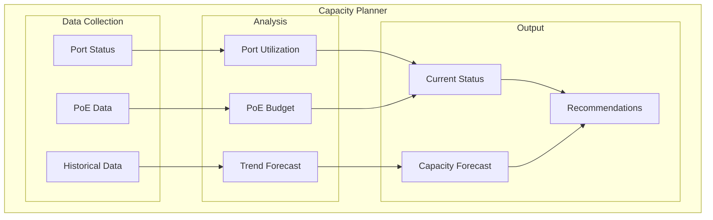

#### Utilization Thresholds

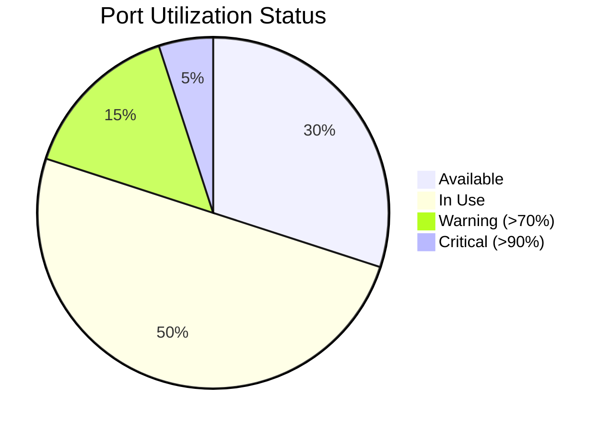

#### Usage

```bash
# Default analysis
unifi-capacity-planner --env

# Custom thresholds
unifi-capacity-planner --env --warning-threshold 60 --critical-threshold 80
```

---

### QoS Validator

**CLI Command:** `unifi-qos-validator`

**Purpose:** Validates Quality of Service configuration for consistent network behavior.

#### Key Features

- **DSCP Trust Verification** - Ensures proper QoS marking preservation
- **Voice VLAN Validation** - Checks voice traffic configuration
- **Queue Consistency** - Verifies uniform QoS across devices
- **Rate Limit Analysis** - Identifies bandwidth constraints

#### QoS Validation Points

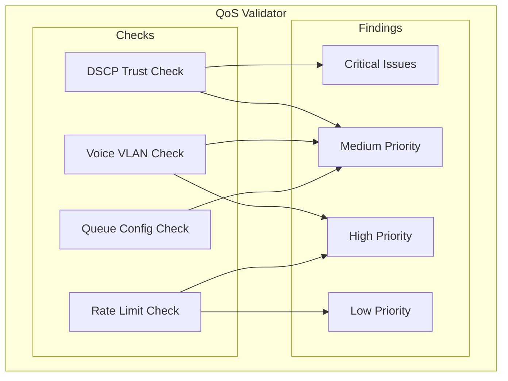

#### Common Issues Detected

| Issue | Severity | Impact |
|-------|----------|--------|
| DSCP not trusted on uplink | Medium | QoS markings stripped |
| Voice VLAN without trust | High | Poor call quality |
| Rate limit on uplink | High | Bandwidth bottleneck |
| Inconsistent queue config | Medium | Unpredictable behavior |

#### Usage

```bash
# Standard validation
unifi-qos-validator --env

# Strict mode (fail on warnings)
unifi-qos-validator --env --strict
```

---

### LAG Monitor

**CLI Command:** `unifi-lag-monitor`

**Purpose:** Monitors Link Aggregation Groups for health and performance.

#### Key Features

- **LACP State Monitoring** - Verifies partner relationships
- **Load Balance Analysis** - Detects traffic imbalance
- **Member Health** - Tracks individual port status
- **Bandwidth Efficiency** - Active vs total capacity

#### LAG Health States

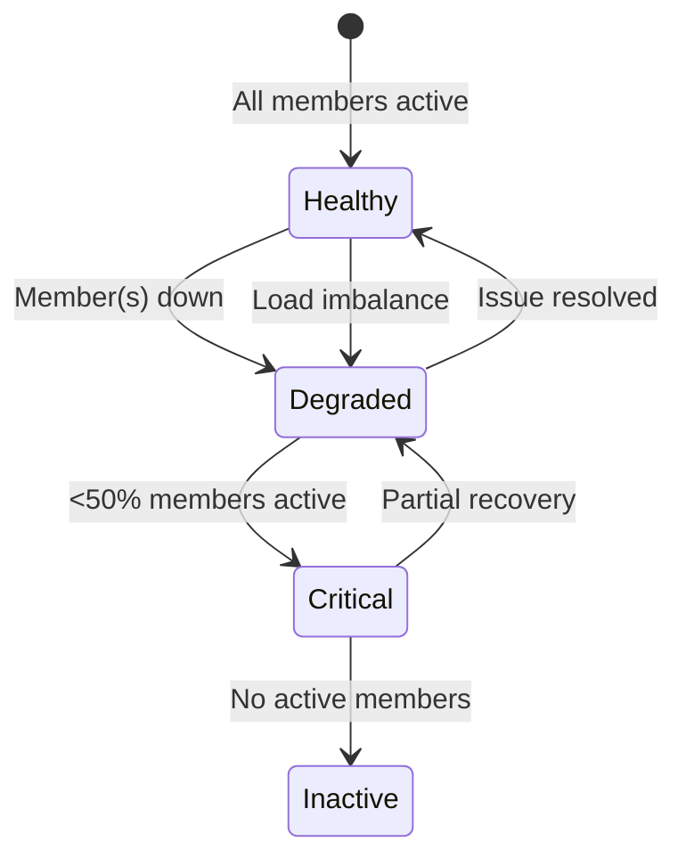

#### Load Balance Scoring

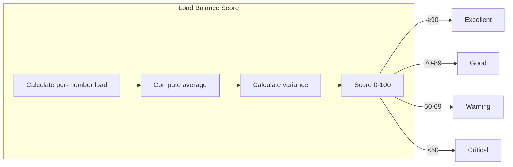

#### Usage

```bash
# Full LAG health report
unifi-lag-monitor --env

# JSON output
unifi-lag-monitor --env --json
```

---

### Config Backup & Diff

**CLI Command:** `unifi-config-backup`

**Purpose:** Creates configuration snapshots and tracks changes over time.

#### Key Features

- **Point-in-Time Snapshots** - Full configuration backup
- **Change Detection** - Detailed diff between configs
- **Change Classification** - Severity-based categorization
- **Backup Management** - List, compare, delete backups

#### Backup Workflow

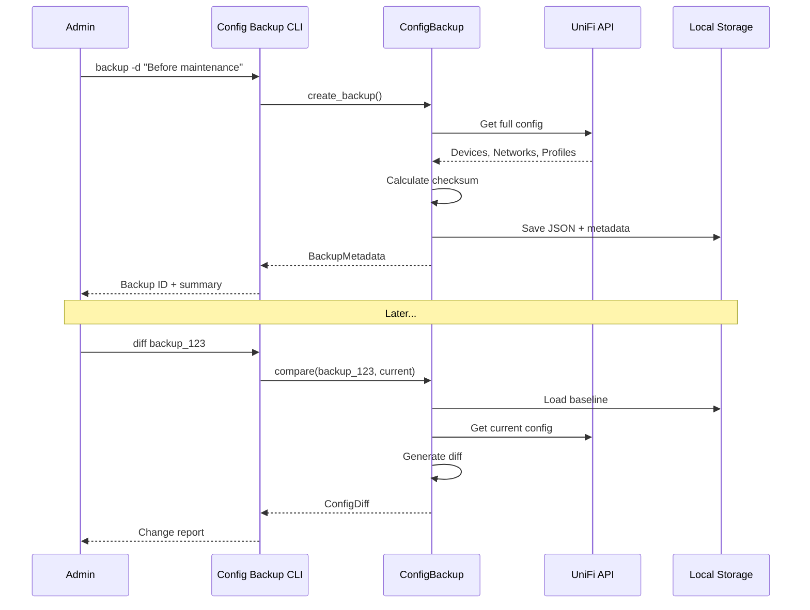

#### Change Severity Levels

| Severity | Example Changes |
|----------|-----------------|
| Critical | Device removed, security setting changed |
| Warning | STP priority changed, port disabled |
| Info | Firmware updated, description changed |

#### Usage

```bash
# Create backup
unifi-config-backup --env backup -d "Before maintenance window"

# List backups
unifi-config-backup --env list

# Compare backup to current
unifi-config-backup --env diff backup_20241228_120000

# Compare two backups
unifi-config-backup --env diff backup_20241228_120000 -c backup_20241228_140000

# Delete old backup
unifi-config-backup --env delete backup_20241228_120000
```

---

### Firmware Security Advisor

**CLI Command:** `unifi-firmware-advisor`

**Purpose:** Analyzes firmware versions and identifies security vulnerabilities.

#### Key Features

- **Version Tracking** - Current vs latest firmware
- **CVE Assessment** - Check against known vulnerabilities
- **Upgrade Priority** - Prioritized update recommendations
- **Family Consistency** - Ensures uniform versions

#### Security Assessment Flow

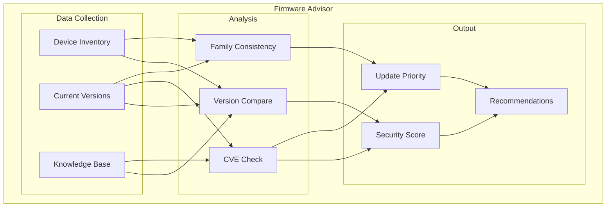

#### Security Score Calculation

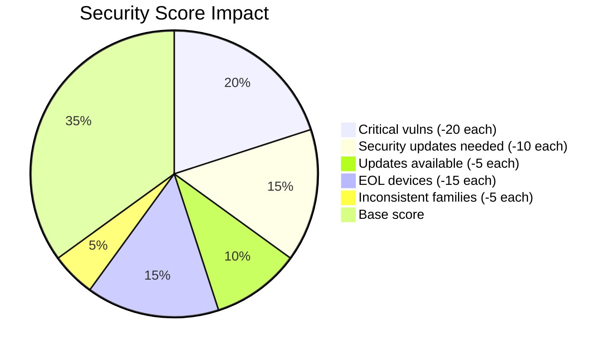

#### Firmware Status States

| Status | Description | Priority |
|--------|-------------|----------|
| Current | Running latest stable | None |
| Update Available | Newer version exists | Low |
| Security Update | Security patches needed | High |
| Critical | Known critical CVEs | Critical |
| EOL | End of life | High |

#### Usage

```bash
# Full security report
unifi-firmware-advisor --env

# With minimum score requirement
unifi-firmware-advisor --env --min-score 70

# JSON output for CI/CD
unifi-firmware-advisor --env --json --output firmware_status.json
```

---

## Integration Patterns

### CI/CD Pipeline Integration

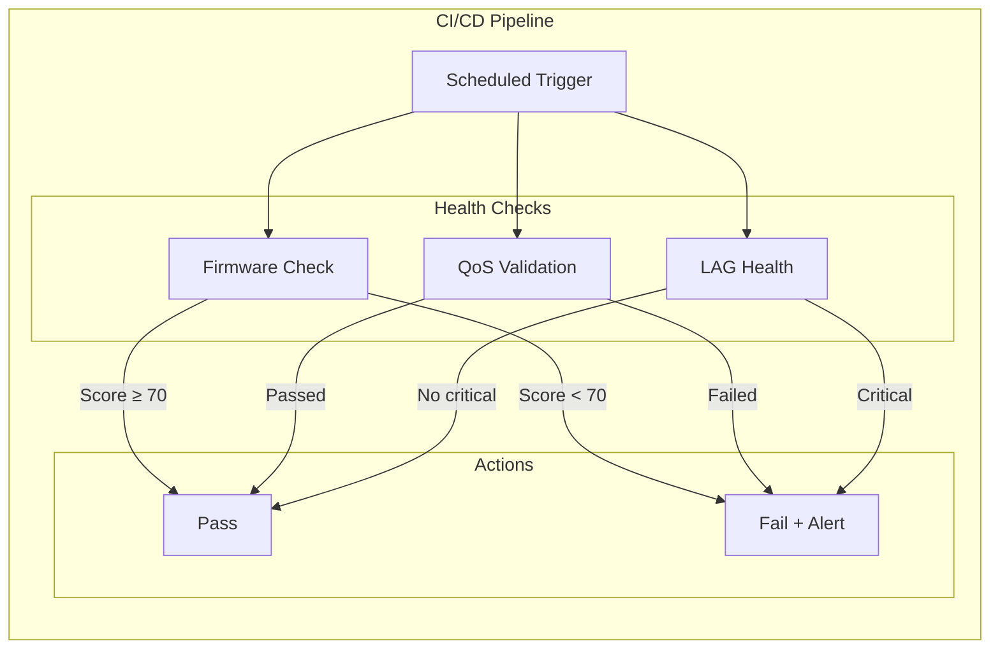

### Example CI Script

```bash
#!/bin/bash
set -e

# Run all validators
unifi-firmware-advisor --env --min-score 70 --json > firmware.json
unifi-qos-validator --env --strict --json > qos.json
unifi-lag-monitor --env --json > lag.json

# Check for issues
if grep -q '"critical_count": [1-9]' lag.json; then
    echo "CRITICAL: LAG issues detected"
    exit 1
fi

echo "All checks passed"
```

---

## Troubleshooting Workflows

### Network Performance Issue

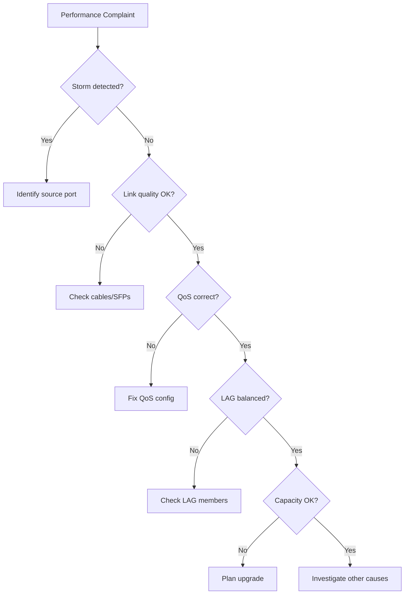

### Client Connectivity Issue

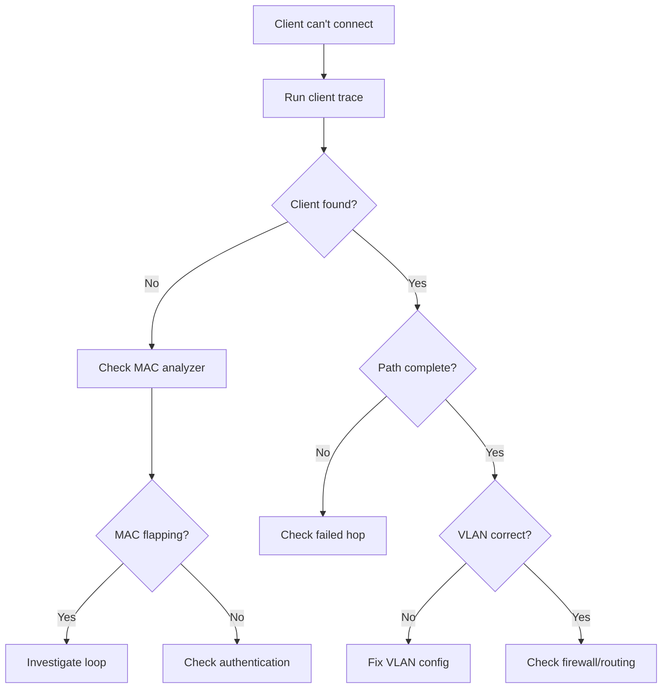

---

## Quick Reference

| Tool | CLI Command | Primary Use |
|------|-------------|-------------|
| MAC Analyzer | `unifi-mac-analyzer` | Loop/security detection |
| Link Quality | `unifi-link-quality` | Physical layer health |
| Storm Detector | `unifi-storm-detector` | Broadcast storm detection |
| Client Tracer | `unifi-client-trace` | Path troubleshooting |
| Capacity Planner | `unifi-capacity-planner` | Growth planning |
| QoS Validator | `unifi-qos-validator` | QoS configuration audit |
| LAG Monitor | `unifi-lag-monitor` | Link aggregation health |
| Config Backup | `unifi-config-backup` | Change management |
| Firmware Advisor | `unifi-firmware-advisor` | Security posture |

All tools support:
- `--env` - Load from .env file
- `--config <file>` - Custom config file
- `--json` - JSON output format
- `--output <file>` - Write to file
- `--debug` - Verbose logging
