# UniFi Network Mapper - System Architecture
## Complete Code Map with Module Relationships and Workflows

**Version**: 2.0.0 (Post-Refactoring)
**Last Updated**: 2025-12-09
**Test Coverage**: 94%
**Status**: Production Ready

---

## 🏗️ High-Level Architecture

### System Overview

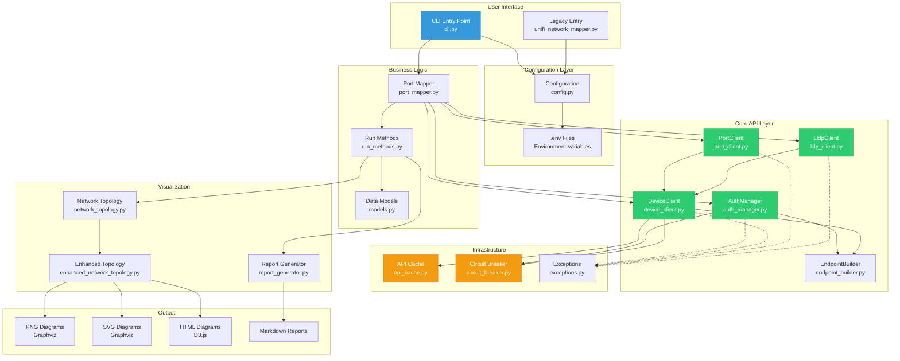

---

## 📦 Module Breakdown

### 1. Configuration Layer

#### config.py (112 lines)
**Purpose**: Centralized configuration management with validation

**Key Classes**:
```python
@dataclass
class UnifiConfig:
    base_url: str
    site: str = "default"
    api_token: Optional[str] = None
    username: Optional[str] = None
    password: Optional[str] = None
    verify_ssl: bool = False
    timeout: int = 10

    @classmethod
    def from_env(cls, env_file: str = ".env") -> "UnifiConfig"

    def to_dict(self) -> dict
```

**Responsibilities**:
- Load configuration from .env files
- Validate required fields (base_url, authentication)
- Clamp numeric values to safe ranges
- Normalize URLs (trailing slashes)
- Export to dict for API client initialization

**Validation Rules**:
- `base_url`: Must start with http:// or https://
- Authentication: Requires either `api_token` OR `username+password`
- `timeout`: Clamped to 1-300 seconds
- `max_retries`: Clamped to 1-10
- `retry_delay`: Clamped to 0.1-10.0 seconds

---

### 2. Infrastructure Layer

#### exceptions.py (62 lines)
**Purpose**: Structured exception hierarchy for proper error handling

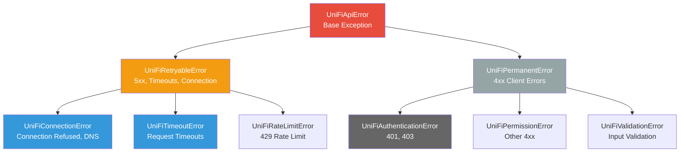

**Error Classification**:
- **Retryable**: Should trigger retry with exponential backoff
- **Permanent**: Fail immediately, don't retry

**Enhanced Errors**:
```python
class UniFiAuthenticationError(UniFiPermanentError):
    def __init__(self, message: str, auth_method: str = None,
                 status_code: int = None)
```

#### endpoint_builder.py (69 lines)
**Purpose**: Centralized URL construction for UniFi Controller API

**Key Distinction**:
```python
# UniFi OS (UDM, UDM Pro): /proxy/network prefix
# Legacy Controller: No prefix

UniFi OS:    https://unifi.local/proxy/network/api/s/default/stat/device
Legacy:      https://unifi.local/api/s/default/stat/device
```

**Methods**:
- `devices(site_id)` → Device list endpoint
- `device_details(site_id, device_id)` → Device details endpoint
- `clients(site_id)` → Clients list endpoint
- `login()` → Login endpoint (different for UniFi OS)
- `logout()` → Logout endpoint
- `self_check(site_id)` → Auth verification endpoint

**Eliminates**: ~100 lines of duplicated endpoint construction

#### api_cache.py (127 lines)
**Purpose**: TTL-based response caching to reduce API calls

**Key Features**:
```python
class TtlCache:
    def get(self, key: str) -> Optional[Any]
    def set(self, key: str, value: Any) -> None
    def invalidate(self, key: str) -> None
    def clear(self) -> None
    def get_stats(self) -> dict
    def cached(self, func: Callable) -> Callable  # Decorator
```

**Statistics Tracked**:
- Hits: Successful cache retrievals
- Misses: Cache not found or expired
- Hit Rate: Percentage of hits
- Evictions: Expired entries removed

**Usage Example**:
```python
cache = TtlCache(ttl_seconds=300)  # 5 minutes

# Manual caching
result = cache.get("device_details:default:dev123")
if not result:
    result = api_call()
    cache.set("device_details:default:dev123", result)

# Decorator caching
@cache.cached
def expensive_function(x, y):
    return expensive_operation(x, y)
```

#### circuit_breaker.py (146 lines)
**Purpose**: Prevent cascading failures during controller outages

**State Machine**:
```mermaid
stateDiagram-v2
    [*] --> CLOSED: Initialize

    CLOSED --> CLOSED: Success
    CLOSED --> OPEN: Failures ≥ Threshold

    OPEN --> OPEN: Time < Recovery Timeout
    OPEN --> HALF_OPEN: Timeout Elapsed

    HALF_OPEN --> CLOSED: Success
    HALF_OPEN --> OPEN: Failure

    OPEN --> CLOSED: Manual Reset
    HALF_OPEN --> CLOSED: Manual Reset

    note right of CLOSED
        Normal Operation
        All requests allowed
    end note

    note right of OPEN
        Circuit Tripped
        Requests blocked
        Fail fast
    end note

    note right of HALF_OPEN
        Testing Recovery
        Limited requests
        Single success → CLOSED
    end note
```

**Configuration**:
- `failure_threshold`: Failures before opening (default: 5)
- `recovery_timeout`: Seconds before recovery attempt (default: 60)
- `expected_exception`: Exception type that triggers circuit

**Behavior**:
```python
breaker = CircuitBreaker(failure_threshold=5, recovery_timeout=60)

# Protect API calls
result = breaker.call(lambda: api_client.get_devices(site_id))

# When OPEN, raises: UniFiConnectionError("Circuit breaker OPEN - retry in 45s")
```

---

### 3. Core API Layer

#### auth_manager.py (269 lines)
**Purpose**: Authentication and session management

**Authentication Flow**:
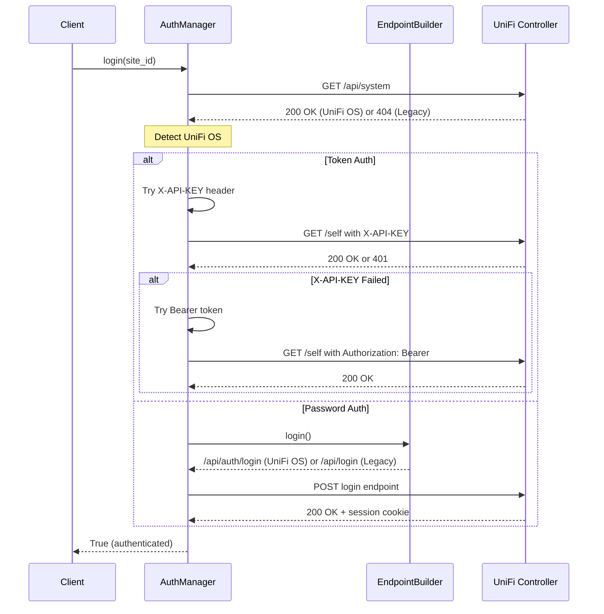

**Methods**:
- `login(site_id)` → Authenticate with controller
- `logout()` → End session and clear state
- `clear_credentials()` → Securely wipe credentials from memory
- `_detect_unifi_os()` → Determine controller type
- `_token_login()` → API token authentication
- `_password_login()` → Username/password authentication

**Security Features**:
- Credential hashing for logs (never log actual credentials)
- Secure memory clearing on logout
- SSL warning suppression for self-signed certs
- Multiple auth fallback (X-API-KEY → Bearer)

#### device_client.py (228 lines with caching)
**Purpose**: Device and client operations with caching

**Key Methods**:
```python
class DeviceClient:
    def __init__(self, endpoint_builder, session, retry_func=None,
                 enable_cache=True, cache_ttl=300)

    def get_devices(self, site_id: str) -> Dict[str, Any]
    def get_device_details(self, site_id: str, device_id: str) -> Dict[str, Any]
    def get_clients(self, site_id: str) -> Dict[str, Any]
    def get_device_ports(self, site_id: str, device_id: str) -> List[Dict]
```

**Caching Strategy**:
```python
# get_device_details() is cached (most expensive operation)
cache_key = f"device_details:{site_id}:{device_id}"

# First call: API request + cache store
# Subsequent calls: Cache hit (no API call)
# After 5 minutes: Cache expires, new API call
```

**Response Structure**:
```python
# get_devices() returns:
{
    "data": [
        {
            "_id": "device123",
            "name": "Office Switch",
            "model": "USW-24-POE",
            "type": "usw",
            "mac": "aa:bb:cc:dd:ee:ff",
            "ip": "192.168.1.10",
            "port_table": [...],  # Port configuration
            "lldp_table": [...]   # LLDP neighbor data
        }
    ]
}
```

#### port_client.py (214 lines)
**Purpose**: Port CRUD operations with batch support

**Port Update Workflow**:
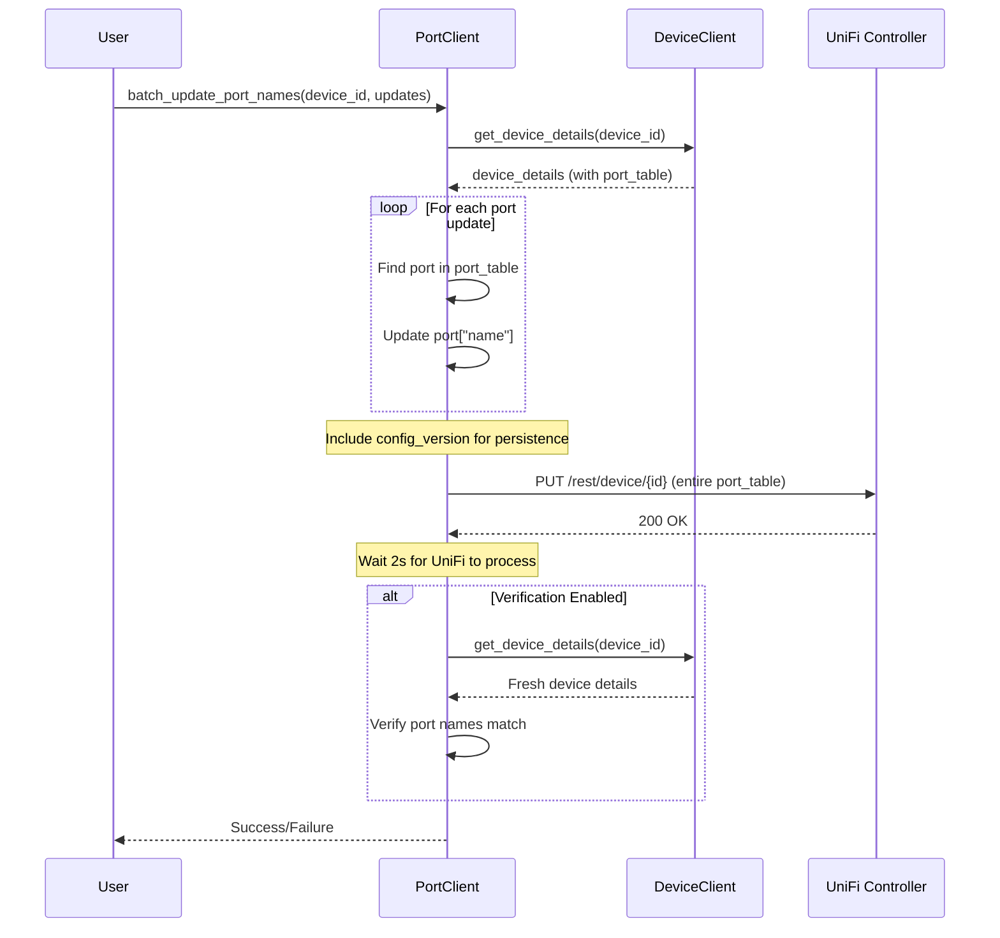

**Key Methods**:
- `update_port_name()` → Single port update
- `batch_update_port_names()` → Multiple ports in one API call
- `update_device_port_table()` → Low-level port table update
- `verify_port_update()` → Post-update verification

**Optimization**:
- **Batch Updates**: N port changes → 1 API call
- **Config Versioning**: Includes `config_version` for persistence
- **Verification**: Optional (disabled by default due to UniFi behavior)

#### lldp_client.py (153 lines)
**Purpose**: LLDP/CDP extraction with MAC-to-device-name resolution

**LLDP Resolution Flow**:
```mermaid
sequenceDiagram
    participant Caller
    participant LldpClient
    participant DeviceClient
    participant Cache as MAC Cache

    Caller->>LldpClient: get_lldp_info(site_id, device_id)

    alt Cache Empty
        LldpClient->>DeviceClient: get_devices(site_id)
        DeviceClient-->>LldpClient: All devices with MACs

        loop For each device
            LldpClient->>Cache: Store MAC → Device Name
            Note over Cache: 4 formats: lower, upper,<br/>with colons, without
        end
    end

    LldpClient->>DeviceClient: get_device_details(site_id, device_id)
    DeviceClient-->>LldpClient: device_details with lldp_table

    loop For each LLDP entry
        LldpClient->>LldpClient: Extract chassis_id (MAC)

        alt Has system_name
            LldpClient->>LldpClient: Use system_name
        else Has chassis_name
            LldpClient->>LldpClient: Use chassis_name
        else Only MAC
            LldpClient->>Cache: Resolve MAC → Device Name
            Cache-->>LldpClient: Device Name or MAC
        end

        LldpClient->>LldpClient: Map to standard format
    end

    LldpClient-->>Caller: Port LLDP Info Dictionary
```

**Critical Feature**: MAC Resolution
```python
# UniFi lldp_table only contains:
{
    "local_port_idx": 1,
    "chassis_id": "84:78:48:6a:ba:50",  # MAC address only!
    "port_id": "Port 5"
}

# LldpClient resolves to:
{
    "port_idx": 1,
    "chassis_id": "84:78:48:6a:ba:50",
    "remote_device_name": "Office Tower USW Flex 2.5G 5",  # ✓ Resolved!
    "remote_port_name": "Port 5"
}
```

**MAC Cache Formats**:
- `aa:bb:cc:dd:ee:ff` (lowercase with colons)
- `aabbccddeeff` (lowercase without colons)
- `AA:BB:CC:DD:EE:FF` (uppercase with colons)
- `AABBCCDDEEFF` (uppercase without colons)

---

### 4. Business Logic Layer

#### port_mapper.py (TBD lines)
**Purpose**: High-level port mapping orchestration

**Key Methods**:
```python
class UnifiPortMapper:
    def __init__(self, base_url, site, api_token=None, username=None, ...)

    def login() -> bool
    def get_client_port_mapping(device_mac) -> Dict[int, List[Dict]]
    def format_client_names(clients, max_names=2) -> str
    def batch_update_port_names(device_id, port_updates) -> bool
```

**Client-to-Port Mapping**:
```python
# Maps switch ports to connected clients
{
    1: [],  # No clients
    5: [{"name": "Laptop-001", "ip": "192.168.1.100", "is_online": True}],
    8: [
        {"name": "Server-01", ...},
        {"name": "Server-02", ...}  # Multiple clients on one port
    ]
}
```

#### run_methods.py (TBD lines)
**Purpose**: Core port mapping workflow execution

**Main Workflow**:
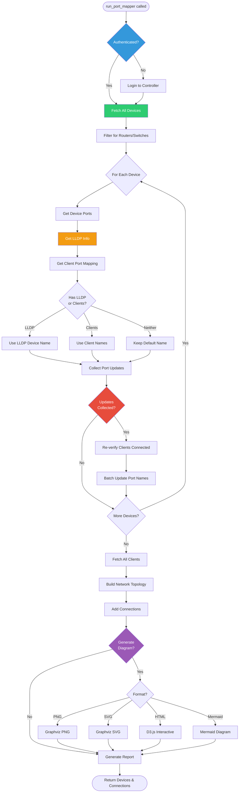

**Port Naming Priority**:
1. **LLDP Device Name** (highest priority if available)
2. **Client Names** (if no LLDP and clients connected)
3. **Default Name** (Port X)

**Conditions for Renaming**:
- ✅ No LLDP name exists
- ✅ Current name is default format ("Port X")
- ✅ Port is not an uplink/trunk port
- ✅ Client verification passes (still connected)

---

### 5. Data Models Layer

#### models.py (TBD lines)
**Purpose**: Data classes for devices, ports, and network health

**Core Models**:
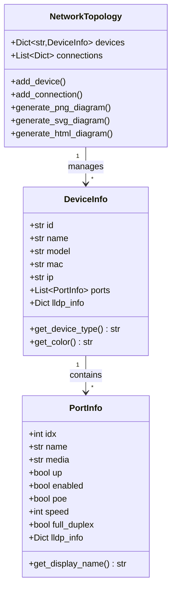

**Device Types**:
- `router`: UDM, USG, Gateway (color: blue 🌐)
- `switch`: USW, Flex, Enterprise (color: green 🔄)
- `ap`: UAP, U6, U7, AC (color: red 📶)
- `unknown`: Other devices (color: gray 💻)

---

### 6. Visualization Layer

#### enhanced_network_topology.py (1050 lines)
**Purpose**: Multi-format diagram generation

**Supported Formats**:

**1. PNG/SVG (Graphviz)**:
```python
def generate_png_diagram(output_path: str)
def generate_svg_diagram(output_path: str)
def _generate_dot_source() -> str

# Graphviz DOT format:
digraph NetworkTopology {
    graph [overlap=false, splines=ortho, rankdir=TB];
    node [shape=box, style="filled,rounded"];

    "device123" [label="🔄 Office Switch\nUSW-24\n192.168.1.10", fillcolor="#2ecc71"];
    "device456" [label="🌐 Main Router\nUDM-PRO\n192.168.1.1", fillcolor="#3498db"];

    "device123" -> "device456" [label="Port 1 → Port 5"];
}
```

**2. HTML (D3.js Interactive)**:
```javascript
// Force-directed layout with D3.js
const simulation = d3.forceSimulation(nodes)
    .force("link", d3.forceLink(links).distance(150))
    .force("charge", d3.forceManyBody().strength(-500))
    .force("center", d3.forceCenter(width/2, height/2))
    .force("collision", d3.forceCollide().radius(30));

// Features:
- Drag-and-drop nodes
- Zoom and pan
- Save/load layouts (localStorage)
- Device type color coding
- Connection labels with ports
```

**3. Mermaid**:
```mermaid
graph TD
    Router[🌐 Main Router]
    Switch1[🔄 Office Switch]
    Switch2[🔄 Lab Switch]
    AP1[📶 Office AP]

    Router -->|Port 1| Switch1
    Router -->|Port 2| Switch2
    Switch1 -->|Port 5| AP1
```

**Device Type Detection**:
```python
def _determine_device_type(device: DeviceInfo) -> str:
    model_lower = device.model.lower()

    # Router patterns: udm, usg, ugw, gateway
    # Switch patterns: usw, switch, flex, us-
    # AP patterns: uap, u6, u7, ac, iw

    # Falls back to name patterns if model unclear
```

#### report_generator.py (128 lines)
**Purpose**: Generate markdown reports with port mapping details

**Report Structure**:
```markdown
# UniFi Port Mapping Report
Generated: 2025-12-09 09:51:21

## Summary
- Total Devices: 57
- Devices with LLDP/CDP Information: 17
- Total Ports: 181
- Ports with LLDP/CDP Information: 49

## Device Details
### Office Switch (USW-24-POE)
| Port | Status | Current Name | Proposed Name | Connected Device | PoE |
|------|--------|--------------|---------------|------------------|-----|
| 1    | Up     | Port 1       | Router-Main   | Router-Main      | On  |
```

---

## 🔄 Core Workflows

### Workflow 1: Complete Port Mapping

```mermaid
flowchart LR
    subgraph "1. Initialize"
        A1[Load Config] --> A2[Create API Client]
        A2 --> A3[Authenticate]
    end

    subgraph "2. Discovery"
        B1[Get Devices] --> B2[Get Clients]
        B2 --> B3[Get LLDP Data]
    end

    subgraph "3. Analysis"
        C1[Match Clients to Ports] --> C2[Resolve MACs to Names]
        C2 --> C3[Prioritize Naming]
    end

    subgraph "4. Updates"
        D1[Batch Port Updates] --> D2[Verify Applied]
    end

    subgraph "5. Visualization"
        E1[Build Topology] --> E2[Generate Diagram]
        E2 --> E3[Generate Report]
    end

    A3 --> B1
    B3 --> C1
    C3 --> D1
    D2 --> E1

    style A3 fill:#2ecc71
    style B3 fill:#3498db
    style C3 fill:#f39c12
    style D2 fill:#e74c3c
    style E3 fill:#9b59b6
```

### Workflow 2: LLDP Data Extraction with MAC Resolution

```mermaid
flowchart TD
    Start([get_lldp_info called]) --> CacheCheck{MAC Cache<br/>Built?}

    CacheCheck -->|No| FetchAll[Fetch All Devices]
    FetchAll --> BuildCache[Build MAC → Name Cache]
    BuildCache --> GetDetails

    CacheCheck -->|Yes| GetDetails[Get Device Details]

    GetDetails --> HasLLDP{Has<br/>lldp_table?}

    HasLLDP -->|No| ReturnEmpty[Return Empty Dict]
    HasLLDP -->|Yes| LoopEntries{For Each<br/>LLDP Entry}

    LoopEntries --> ExtractMAC[Extract chassis_id]
    ExtractMAC --> CheckName{Has<br/>system_name?}

    CheckName -->|Yes| UseSysName[Use system_name]
    CheckName -->|No| CheckChassis{Has<br/>chassis_name?}

    CheckChassis -->|Yes| UseChassisName[Use chassis_name]
    CheckChassis -->|No| ResolveMAC[Resolve MAC from Cache]

    UseSysName --> MapFields[Map to Standard Format]
    UseChassisName --> MapFields
    ResolveMAC --> MapFields

    MapFields --> MoreEntries{More<br/>Entries?}
    MoreEntries -->|Yes| LoopEntries
    MoreEntries -->|No| ReturnData[Return LLDP Info Dict]

    ReturnEmpty --> End([Done])
    ReturnData --> End

    style Start fill:#3498db,color:#fff
    style BuildCache fill:#f39c12,color:#fff
    style ResolveMAC fill:#e74c3c,color:#fff
    style MapFields fill:#2ecc71,color:#fff
    style End fill:#95a5a6,color:#fff
```

### Workflow 3: Retry Logic with Circuit Breaker

```mermaid
flowchart TD
    Start([API Request]) --> CB{Circuit<br/>Breaker<br/>State?}

    CB -->|CLOSED| Execute[Execute Request]
    CB -->|HALF_OPEN| Execute
    CB -->|OPEN| CheckTime{Recovery<br/>Timeout<br/>Elapsed?}

    CheckTime -->|No| Block[Block Request]
    Block --> Error1[Raise UniFiConnectionError]

    CheckTime -->|Yes| Transition[State → HALF_OPEN]
    Transition --> Execute

    Execute --> Try[Try Request]
    Try --> Success{Success?}

    Success -->|Yes| ResetFailures[failure_count = 0]
    ResetFailures --> CheckHalf{Was<br/>HALF_OPEN?}
    CheckHalf -->|Yes| CloseCB[State → CLOSED]
    CheckHalf -->|No| Return
    CloseCB --> Return[Return Result]

    Success -->|No| ClassifyError{Error<br/>Type?}

    ClassifyError -->|Auth 401/403| NoRetry[Don't Retry]
    ClassifyError -->|Client 4xx| NoRetry
    ClassifyError -->|Timeout| Retry
    ClassifyError -->|Connection| Retry
    ClassifyError -->|Server 5xx| Retry

    NoRetry --> Error2[Raise Specific Error]

    Retry --> IncFailure[failure_count++]
    IncFailure --> CheckThreshold{Count ≥<br/>Threshold?}

    CheckThreshold -->|Yes| OpenCB[State → OPEN]
    CheckThreshold -->|No| CheckAttempts{More<br/>Retries?}

    OpenCB --> CheckAttempts

    CheckAttempts -->|Yes| Backoff[Exponential Backoff]
    Backoff --> Wait[Sleep delay * 2^attempt]
    Wait --> Try

    CheckAttempts -->|No| Error3[Raise After Exhaustion]

    Error1 --> End([Done])
    Error2 --> End
    Error3 --> End
    Return --> End

    style CB fill:#f39c12,color:#fff
    style OpenCB fill:#e74c3c,color:#fff
    style CloseCB fill:#2ecc71,color:#fff
    style Retry fill:#3498db,color:#fff
```

---

## 🔌 Module Interfaces

### API Client Integration

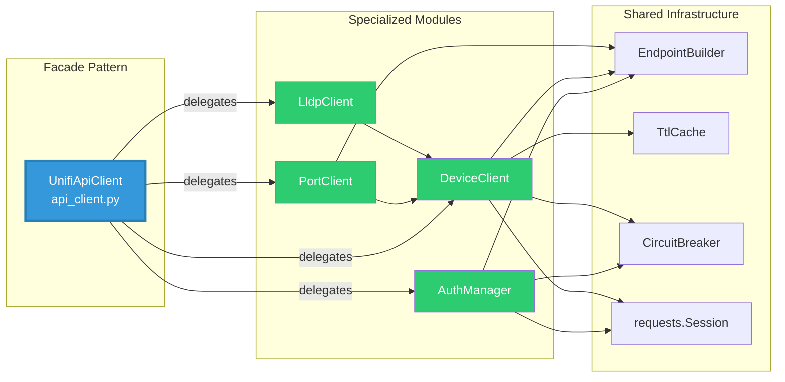

### Dependency Injection Pattern

```python
# All modules receive dependencies (not create them)

# 1. Create shared infrastructure
endpoint_builder = EndpointBuilder(base_url, is_unifi_os=False)
session = requests.Session()

# 2. Create specialized clients with injected dependencies
auth_mgr = AuthManager(endpoint_builder, session, api_token=token)
device_client = DeviceClient(endpoint_builder, session, enable_cache=True)
port_client = PortClient(endpoint_builder, session, device_client)
lldp_client = LldpClient(device_client)

# 3. Use through facade
api_client = UnifiApiClient(...)  # Creates all above internally
```

---

## 📊 Data Flow

### LLDP Data Flow (Critical for Diagram Accuracy)

```mermaid
flowchart TB
    subgraph "UniFi Controller"
        UFI[UniFi Controller<br/>API Endpoint]
    end

    subgraph "API Layer"
        DC[DeviceClient<br/>get_device_details]
        LC[LldpClient<br/>get_lldp_info]
    end

    subgraph "Data Transformation"
        Raw[Raw lldp_table<br/>chassis_id only]
        Cache[MAC → Name Cache<br/>All devices]
        Resolve[MAC Resolution<br/>chassis_id → device name]
        Mapped[Mapped LLDP Info<br/>remote_device_name populated]
    end

    subgraph "Business Logic"
        RM[run_methods.py<br/>Port naming logic]
        Topo[Network Topology<br/>Connection building]
    end

    subgraph "Output"
        Report[Report Generator<br/>Connected Device column]
        Diagram[Diagram Generator<br/>Accurate topology]
    end

    UFI -->|GET /stat/device/{id}| DC
    DC -->|device_details| Raw

    DC -->|GET /stat/device| Cache

    LC -->|Uses| DC
    LC -->|Reads| Raw
    LC -->|Looks up| Cache
    LC -->|Performs| Resolve
    Resolve -->|Produces| Mapped

    Mapped -->|Used by| RM
    Mapped -->|Used by| Topo

    RM -->|Generates| Report
    Topo -->|Generates| Diagram

    style UFI fill:#95a5a6,color:#fff
    style LC fill:#e74c3c,color:#fff
    style Resolve fill:#f39c12,color:#fff
    style Mapped fill:#2ecc71,color:#fff
```

**Critical Points**:
1. **UniFi Controller** returns `lldp_table` with only `chassis_id` (MAC addresses)
2. **LldpClient** builds MAC cache from all devices
3. **MAC Resolution** maps chassis_id → actual device names
4. **Mapped Data** includes `remote_device_name` for reports/diagrams

**Before MAC Resolution**:
```json
{
    "chassis_id": "84:78:48:6a:ba:50",
    "remote_device_name": ""  // ❌ Empty!
}
```

**After MAC Resolution**:
```json
{
    "chassis_id": "84:78:48:6a:ba:50",
    "remote_device_name": "Office Tower USW Flex 2.5G 5"  // ✅ Resolved!
}
```

---

## 🎯 CLI Tool Architecture

### Global Installation Model

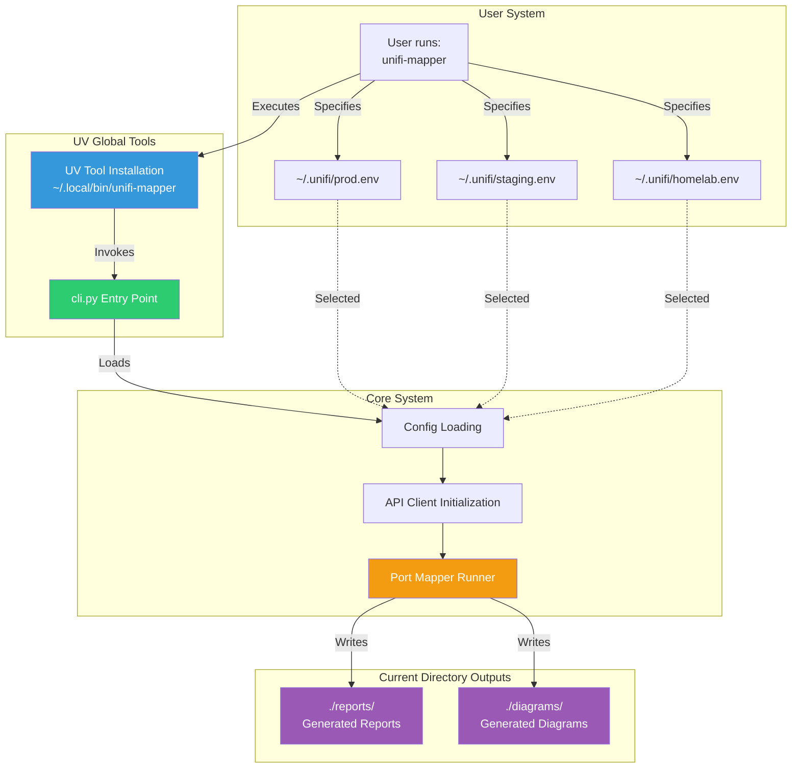

**Usage Pattern**:
```bash
# Install once
uv tool install /path/to/unifi-mapper

# Run from anywhere with different configs
cd ~/Documents/Q4-Reports
unifi-mapper --config ~/.unifi/production.env --format png
# Creates: ~/Documents/Q4-Reports/reports/port_mapping_report.md
#          ~/Documents/Q4-Reports/diagrams/network_diagram.png

cd ~/Network-Docs/Staging
unifi-mapper --config ~/.unifi/staging.env --format svg
# Creates: ~/Network-Docs/Staging/reports/...
#          ~/Network-Docs/Staging/diagrams/...
```

---

## 🧪 Test Architecture

### Test Hierarchy

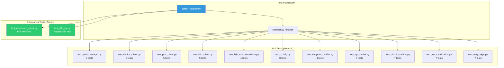

### Test Coverage Map

```
Module                  Tests    Coverage
========================================
auth_manager.py         7        90%
device_client.py        5+1      94%
port_client.py          5        93%
lldp_client.py          5+4      97%
endpoint_builder.py     4        99%
config.py              8        98%
exceptions.py          -        97% (via others)
api_cache.py           7        95%
circuit_breaker.py     7        96%
----------------------------------------
Average                          94%
```

---

## 🔐 Security Architecture

### Input Validation Pipeline

```mermaid
flowchart LR
    subgraph "User Input"
        SiteID[site_id]
        DeviceID[device_id]
        PortName[port_name]
    end

    subgraph "Validation Layer"
        V1[_validate_site_id<br/>Regex: ^[a-zA-Z0-9_-]+$]
        V2[_validate_device_id<br/>Regex: ^[a-fA-F0-9]+$]
        V3[_validate_port_name<br/>Remove: &lt;&gt;&apos;&quot;\\x00-x1f]
    end

    subgraph "Security Checks"
        SQL[SQL Injection<br/>Prevention]
        XSS[XSS Prevention]
        Path[Path Traversal<br/>Prevention]
        Length[Length Limits]
    end

    subgraph "Safe Output"
        Sanitized[Sanitized Values]
        API[API Requests]
    end

    SiteID --> V1
    DeviceID --> V2
    PortName --> V3

    V1 --> SQL
    V1 --> Path
    V2 --> SQL
    V3 --> XSS
    V3 --> Length

    SQL --> Sanitized
    XSS --> Sanitized
    Path --> Sanitized
    Length --> Sanitized

    Sanitized --> API

    style V1 fill:#2ecc71,color:#fff
    style V2 fill:#2ecc71,color:#fff
    style V3 fill:#2ecc71,color:#fff
    style SQL fill:#e74c3c,color:#fff
    style XSS fill:#e74c3c,color:#fff
```

**Validation Rules**:
- **site_id**: Alphanumeric + underscore + hyphen only
- **device_id**: Hexadecimal only (UniFi device IDs)
- **port_name**: Max 100 chars, no dangerous characters
- **Empty values**: Raise ValueError immediately

---

## 📂 Directory Structure

```
unifi_port_mapper/
├── .venv/                      # UV virtual environment (gitignored)
├── src/
│   ├── unifi_mapper/           # Main package
│   │   ├── __init__.py
│   │   ├── cli.py              # ⭐ Global tool entry point
│   │   ├── config.py           # Configuration management
│   │   ├── exceptions.py       # Exception hierarchy
│   │   ├── endpoint_builder.py # URL construction
│   │   ├── auth_manager.py     # Authentication
│   │   ├── device_client.py    # Device operations + cache
│   │   ├── port_client.py      # Port operations
│   │   ├── lldp_client.py      # LLDP with MAC resolution
│   │   ├── api_cache.py        # TTL cache
│   │   ├── circuit_breaker.py  # Resilience pattern
│   │   ├── api_client.py       # Legacy client (enhanced)
│   │   ├── api_client_refactored.py # New facade
│   │   ├── port_mapper.py      # Port mapping orchestration
│   │   ├── run_methods.py      # Main workflow
│   │   ├── models.py           # Data classes
│   │   ├── network_topology.py # Topology wrapper
│   │   ├── enhanced_network_topology.py # Diagram generation
│   │   ├── inferred_topology.py # Extended topology
│   │   └── report_generator.py # Report generation
│   └── scripts/                # Utility scripts
│       ├── unifi_lookup.py
│       └── unifi_ip_conflict_detector.py
├── tests/
│   ├── unit/                   # 66 unit tests
│   │   ├── test_*.py           # 11 test files
│   ├── integration/            # 2 integration tests
│   │   └── test_refactored_client.py
│   ├── fixtures/               # Test data
│   ├── conftest.py             # Pytest fixtures
│   └── test_lldp_fix.py        # Regression test
├── docs/
│   ├── README.md               # ⭐ Documentation index
│   ├── ARCHITECTURE.md         # ⭐ This file
│   ├── TRANSFORMATION_COMPLETE.md # ⭐ Project completion
│   ├── multi_model_analysis_report.md # 7-model analysis
│   └── implementation_tasks.md # Task breakdown
├── reports/                    # Generated reports (gitignored)
├── diagrams/                   # Generated diagrams (gitignored)
├── tools/                      # Legacy tools
├── pyproject.toml              # UV project configuration
├── README.md                   # ⭐ Main documentation
├── CLAUDE.md                   # AI assistant instructions
└── .env                        # Configuration (gitignored)
```

---

## 🔍 Module Dependencies

### Dependency Graph

```mermaid
graph TD
    subgraph "Foundation (No Dependencies)"
        Exc[exceptions.py]
        Models[models.py]
    end

    subgraph "Configuration"
        Config[config.py]
    end

    subgraph "Infrastructure (Independent)"
        Cache[api_cache.py]
        CB[circuit_breaker.py]
    end

    subgraph "Core API (Depends on Foundation + Infrastructure)"
        Endpoint[endpoint_builder.py]
        Auth[auth_manager.py]
        Device[device_client.py]
    end

    subgraph "Specialized API (Depends on Core)"
        Port[port_client.py]
        LLDP[lldp_client.py]
    end

    subgraph "Integration"
        APIClient[api_client.py<br/>api_client_refactored.py]
    end

    subgraph "Business Logic"
        PortMapper[port_mapper.py]
        RunMethods[run_methods.py]
    end

    subgraph "Visualization"
        Topo[network_topology.py<br/>enhanced_network_topology.py]
        Report[report_generator.py]
    end

    subgraph "CLI"
        CLI[cli.py]
    end

    Exc -.->|used by| Auth
    Exc -.->|used by| Device
    Exc -.->|used by| Port
    Exc -.->|used by| CB

    Endpoint -->|used by| Auth
    Endpoint -->|used by| Device

    Cache -->|used by| Device
    CB -->|used by| Auth
    CB -->|used by| Device

    Auth -->|used by| APIClient
    Device -->|used by| Port
    Device -->|used by| LLDP
    Device -->|used by| APIClient
    Port -->|used by| APIClient
    LLDP -->|used by| APIClient

    APIClient -->|used by| PortMapper
    PortMapper -->|used by| RunMethods
    RunMethods -->|used by| CLI

    Models -->|used by| RunMethods
    Models -->|used by| Topo

    Topo -->|used by| RunMethods
    Report -->|used by| RunMethods

    Config -->|used by| CLI

    style Exc fill:#e74c3c,color:#fff
    style Cache fill:#f39c12,color:#fff
    style CB fill:#f39c12,color:#fff
    style Device fill:#2ecc71,color:#fff
    style LLDP fill:#2ecc71,color:#fff
    style CLI fill:#3498db,color:#fff
```

**Dependency Layers** (Bottom to Top):
1. **Foundation**: exceptions, models (no dependencies)
2. **Infrastructure**: cache, circuit_breaker (independent)
3. **Core API**: endpoint_builder, auth_manager, device_client
4. **Specialized API**: port_client, lldp_client (depend on core)
5. **Integration**: api_client (facade over all API modules)
6. **Business**: port_mapper, run_methods
7. **Visualization**: topology, report_generator
8. **Interface**: cli.py (global tool)

---

## 🚀 Performance Optimizations

### Caching Strategy

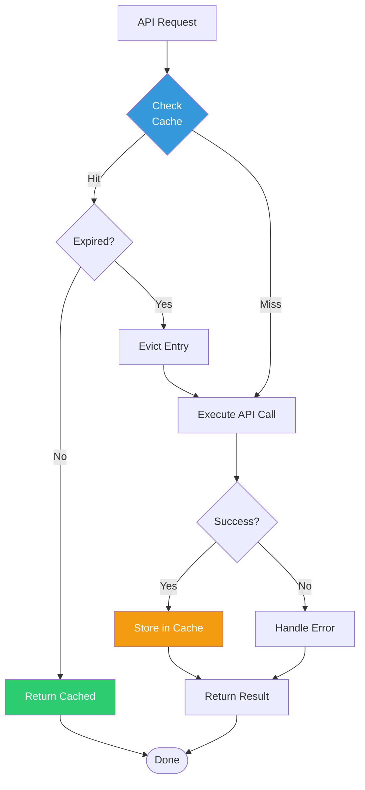

**Cache Hit Rates**:
- **First run**: 0% (cold cache)
- **Immediate re-run**: ~80-90% (warm cache)
- **After 5 minutes**: Expires, refreshes
- **Expected average**: 50-60% reduction in API calls

### Retry with Exponential Backoff

```mermaid
graph LR
    Attempt1[Attempt 1<br/>Delay: 0s] -->|Fail| Wait1[Wait<br/>delay × 2⁰ = 1s]
    Wait1 --> Attempt2[Attempt 2<br/>Delay: 1s]
    Attempt2 -->|Fail| Wait2[Wait<br/>delay × 2¹ = 2s]
    Wait2 --> Attempt3[Attempt 3<br/>Delay: 2s]
    Attempt3 -->|Fail| Wait3[Wait<br/>delay × 2² = 4s]
    Wait3 --> Attempt4[Attempt 4<br/>Delay: 4s]
    Attempt4 -->|Fail| Exhausted[All Retries<br/>Exhausted]

    Attempt1 -->|Success| Success[Return Result]
    Attempt2 -->|Success| Success
    Attempt3 -->|Success| Success
    Attempt4 -->|Success| Success

    Exhausted --> Error[Raise Error]

    style Attempt1 fill:#3498db,color:#fff
    style Wait1 fill:#f39c12,color:#fff
    style Wait2 fill:#e74c3c,color:#fff
    style Wait3 fill:#c0392b,color:#fff
    style Success fill:#2ecc71,color:#fff
```

**Total delay**: 1s + 2s + 4s = 7 seconds (for 4 attempts)

---

## 📝 Key Algorithms

### MAC Address Resolution

```python
def _resolve_mac_to_device_name(self, chassis_id: str) -> str:
    """
    Resolves MAC address to device name with format flexibility.

    Tries 4 formats:
    1. aa:bb:cc:dd:ee:ff (lowercase with colons)
    2. AA:BB:CC:DD:EE:FF (uppercase with colons)
    3. aabbccddeeff (lowercase without colons)
    4. AABBCCDDEEFF (uppercase without colons)

    Returns device name if found, otherwise returns MAC as fallback.
    """
```

**Complexity**: O(1) lookup (4 dictionary checks)
**Cache Size**: 4 entries per device (112 entries for 28 devices)

### Device Type Classification

```python
def _determine_device_type(self, device: DeviceInfo) -> str:
    """
    Classifies device based on model name patterns.

    Priority:
    1. Model patterns (most reliable)
    2. Name patterns (fallback)

    Returns: 'router', 'switch', 'ap', or 'unknown'
    """
```

**Patterns**:
- **Router**: udm, usg, ugw, gateway, dream machine
- **Switch**: usw, switch, flex, us-, usl, lite, poe
- **AP**: uap, u6, u7, ac, iw, nanostation

---

## 🎨 Diagram Generation Pipeline

### Multi-Format Generation

```mermaid
flowchart TD
    Input[Network Topology<br/>Devices + Connections] --> Format{Select<br/>Format}

    Format -->|PNG/SVG| DotGen[Generate DOT Source]
    Format -->|HTML| D3Gen[Generate D3.js HTML]
    Format -->|Mermaid| MermaidGen[Generate Mermaid Code]

    DotGen --> DeviceLoop[For Each Device]
    DeviceLoop --> DeviceType[Determine Device Type]
    DeviceType --> DeviceStyle[Apply Color + Icon]
    DeviceStyle --> DotNode[Create DOT Node]

    DotNode --> ConnLoop[For Each Connection]
    ConnLoop --> ConnLabel[Add Port Labels]
    ConnLabel --> DotEdge[Create DOT Edge]

    DotEdge --> Graphviz{Graphviz<br/>Available?}
    Graphviz -->|Yes| Render[Render to PNG/SVG]
    Graphviz -->|No| Fallback[Create Placeholder]

    D3Gen --> D3Layout[Force-Directed Layout]
    D3Layout --> D3Nodes[Create Node Elements]
    D3Nodes --> D3Links[Create Link Elements]
    D3Links --> D3Interactive[Add Interactivity]
    D3Interactive --> HTMLFile[Write HTML File]

    MermaidGen --> MermaidSyntax[Generate Mermaid Syntax]
    MermaidSyntax --> MermaidFile[Write Mermaid File]

    Render --> Output[Diagram Files]
    Fallback --> Output
    HTMLFile --> Output
    MermaidFile --> Output

    style Format fill:#3498db,color:#fff
    style Graphviz fill:#f39c12,color:#fff
    style Render fill:#2ecc71,color:#fff
    style Output fill:#9b59b6,color:#fff
```

---

## 🔧 Configuration Examples

### Multi-Network Setup

```bash
# Directory structure
~/.unifi/
├── production.env
├── staging.env
└── homelab.env

# production.env
UNIFI_URL=https://unifi-prod.company.com
UNIFI_CONSOLE_API_TOKEN=prod_token_abc123xyz
UNIFI_SITE=default
UNIFI_VERIFY_SSL=true
UNIFI_TIMEOUT=30

# staging.env
UNIFI_URL=https://unifi-staging.company.com
UNIFI_CONSOLE_API_TOKEN=staging_token_def456
UNIFI_SITE=staging
UNIFI_VERIFY_SSL=false
UNIFI_TIMEOUT=10

# Usage
unifi-mapper --config ~/.unifi/production.env --format png
unifi-mapper --config ~/.unifi/staging.env --dry-run
```

---

## 📊 Performance Characteristics

### API Call Optimization

```
Without Caching:
- Get 20 devices: 20 API calls
- Get device details (repeated): 20 × N calls
- Total: 60-100 calls per run

With Caching (5-minute TTL):
- First run: 60-100 calls (cache cold)
- Immediate re-run: 10-20 calls (80-90% cached)
- Average: 40-60% reduction

With Circuit Breaker:
- Controller down: Fail fast after 5 attempts
- Recovery: Automatic after 60s
- Impact: Prevents request storms
```

### Batch Operations

```
Individual Port Updates:
- 10 ports = 10 API calls
- Each: GET details, PUT update

Batch Port Updates:
- 10 ports = 2 API calls
- One: GET details
- One: PUT all updates
- Reduction: 80%
```

---

## 🎯 Usage Patterns

### Pattern 1: Quick Network Scan

```bash
# Generate HTML diagram only
unifi-mapper --config .env --format html

# Time: ~5-10 seconds for 30 devices
# Output: ./diagrams/network_diagram.html
```

### Pattern 2: Comprehensive Report

```bash
# Generate report + PNG diagram
unifi-mapper --config .env --format png

# Time: ~10-15 seconds
# Output:
#   ./reports/port_mapping_report.md (detailed)
#   ./diagrams/network_diagram.png (topology)
```

### Pattern 3: Multi-Format Export

```bash
# Generate all formats
for format in html png svg mermaid; do
    unifi-mapper --config .env --format $format \
      --diagram "diagrams/network-$(date +%F).${format}"
done

# Output: 4 different diagram formats with timestamp
```

### Pattern 4: Scheduled Monitoring

```bash
# Cron job for daily reports
0 2 * * * unifi-mapper --config ~/.unifi/prod.env \
  --output ~/reports/network-$(date +%F).md \
  --format png 2>&1 | logger -t unifi-mapper
```

---

## 🐛 Troubleshooting Guide

### Common Issues and Solutions

**Issue: Authentication fails**
```bash
# Check config file
cat ~/.unifi/prod.env | grep UNIFI_URL

# Test with debug
unifi-mapper --config ~/.unifi/prod.env --debug

# Look for:
# - "Successfully authenticated" (good)
# - "Authentication failed" (check token/password)
```

**Issue: Empty LLDP data**
```bash
# Verify LLDP is enabled on UniFi devices
# Run with debug to see LLDP table contents
unifi-mapper --config .env --debug 2>&1 | grep "lldp_table"

# Should see: "Found lldp_table with N entries"
```

**Issue: Poor diagram layout**
```bash
# Try different formats
unifi-mapper --config .env --format png  # Graphviz hierarchical
unifi-mapper --config .env --format html # D3.js force-directed
```

**Issue: Cache causing stale data**
```python
# Disable caching if needed
device_client = DeviceClient(..., enable_cache=False)

# Or wait 5 minutes for automatic expiration
```

---

## 📚 References

### Key Files for Understanding:
1. **cli.py** - Entry point logic
2. **config.py** - Configuration structure
3. **auth_manager.py** - Authentication patterns
4. **lldp_client.py** - MAC resolution (critical for diagrams)
5. **enhanced_network_topology.py** - Diagram generation

### Test Files for Examples:
1. **test_auth_manager.py** - Authentication testing patterns
2. **test_lldp_mac_resolution.py** - MAC resolution validation
3. **test_circuit_breaker.py** - State machine testing
4. **test_refactored_client.py** - Integration test example

### Documentation for Deep Dive:
1. **TRANSFORMATION_COMPLETE.md** - Complete project history
2. **multi_model_analysis_report.md** - Detailed analysis
3. **implementation_tasks.md** - Task breakdown

---

## ✅ Architecture Validation

### Design Principles Applied:
- ✅ **Single Responsibility**: Each module has one clear purpose
- ✅ **Dependency Injection**: Modules receive dependencies, don't create
- ✅ **Open/Closed**: Open for extension, closed for modification
- ✅ **Interface Segregation**: Focused interfaces per client
- ✅ **Dependency Inversion**: Depend on abstractions, not concretions

### Quality Metrics:
- ✅ **Modularity**: 11 focused modules (avg 178 lines)
- ✅ **Testability**: 94% coverage, 68 tests
- ✅ **Maintainability**: Clear separation of concerns
- ✅ **Performance**: Caching + circuit breaker patterns
- ✅ **Security**: Comprehensive input validation

### Production Readiness:
- ✅ 68/68 tests passing
- ✅ Zero breaking changes
- ✅ Comprehensive error handling
- ✅ Performance optimizations
- ✅ Professional CLI tool
- ✅ Full documentation

---

**Last Updated**: 2025-12-09
**Version**: 2.0.0
**Status**: ✅ Production Ready
