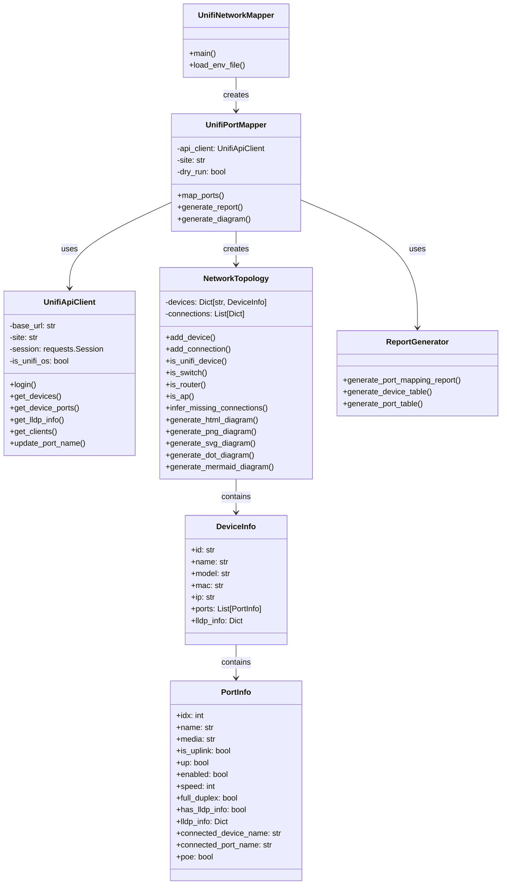
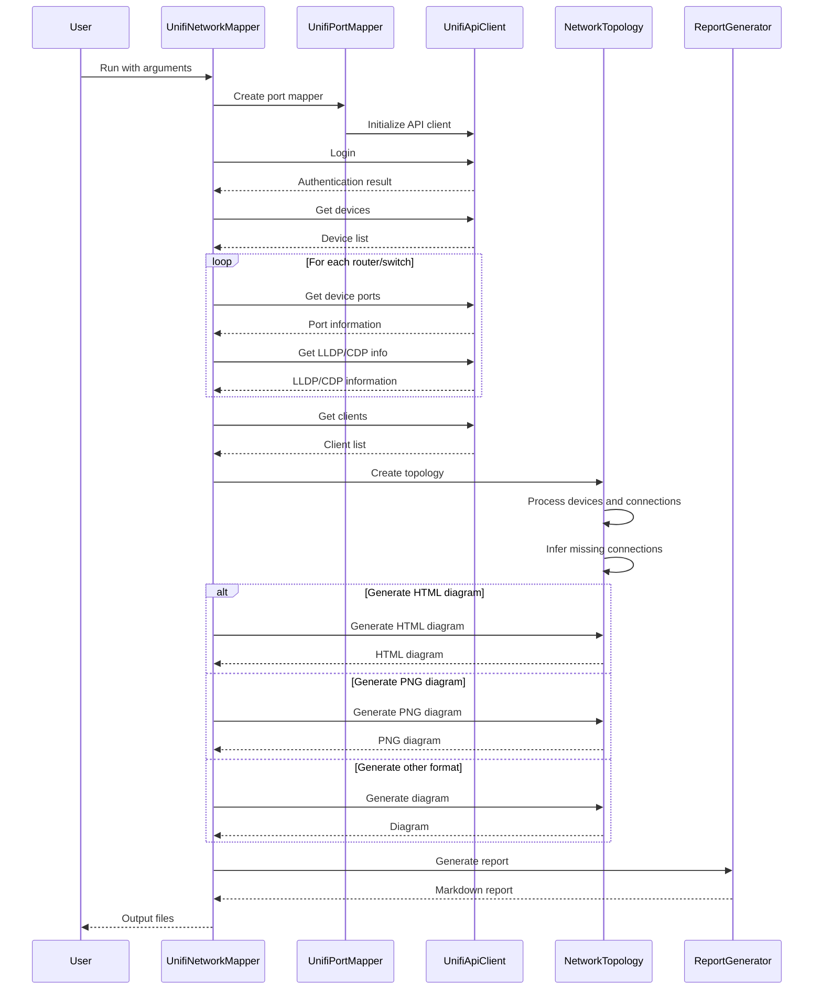
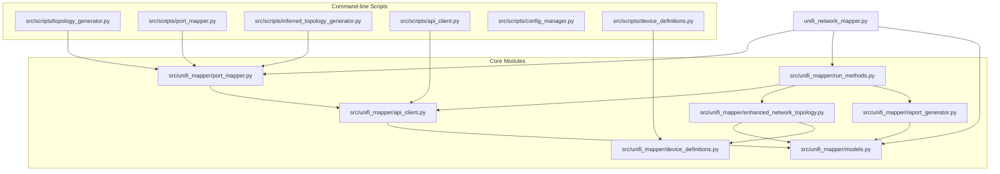

# UniFi Network Topology Visualization Toolkit

A comprehensive toolkit for visualizing and managing UniFi network topologies, including automatic port mapping, network diagram generation, and device management.

## Overview

This toolkit provides a unified interface for:

1. **Network Discovery**: Automatically discover all devices in a UniFi network
2. **Topology Mapping**: Generate network topology maps based on LLDP/CDP information
3. **Port Management**: Automatically name ports based on connected devices
4. **Visualization**: Create visual representations of network topology in multiple formats
5. **API Integration**: Seamless integration with the UniFi Controller API

## Features

### Core Features

- **Comprehensive Device Detection**: Automatically identifies all UniFi devices including routers, switches, and access points
- **LLDP/CDP Information Extraction**: Collects and processes Link Layer Discovery Protocol and Cisco Discovery Protocol information
- **Port Mapping**: Automatically maps and names ports based on connected devices
- **Multiple Visualization Formats**: Supports PNG, SVG, DOT, Mermaid, and interactive HTML diagrams
- **Flexible Authentication**: Supports both API token and username/password authentication
- **Dry Run Mode**: Test port naming changes without applying them
- **Cross-platform Compatibility**: Works on any platform that supports Python 3.6+

### Advanced Features

- **Inferred Topology**: Generates network topology even when LLDP/CDP information is limited
- **Interactive HTML Visualization**: Drag-and-drop interface with zoom, pan, and custom layout saving
- **Device Type Detection**: Automatically identifies device types (routers, switches, APs)
- **Location-based Grouping**: Groups devices by location based on naming conventions
- **Comprehensive Reporting**: Generates detailed reports of network topology and port mappings

## Code Structure

The project is organized into the following components:

### Main Entry Point

- **unifi_network_mapper.py**: The main entry point that provides a unified command-line interface

### Core Modules (`src/unifi_mapper/`)

- **api_client.py**: Handles communication with the UniFi Controller API
- **models.py**: Contains data models for devices and ports
- **enhanced_network_topology.py**: Manages network topology visualization with advanced features
- **run_methods.py**: Contains helper methods for running the port mapper
- **port_mapper.py**: Handles port mapping and naming
- **report_generator.py**: Generates detailed reports of network topology and port mappings
- **device_definitions.py**: Defines device models and their port configurations

### Command-line Scripts (`src/scripts/`)

- **topology_generator.py**: Generates network topology diagrams
- **port_mapper.py**: Maps and names ports based on connected devices
- **inferred_topology_generator.py**: Generates inferred network topology
- **api_client.py**: Command-line interface to the UniFi API
- **config_manager.py**: Manages configuration settings
- **device_definitions.py**: Manages device definitions

## Class Diagram



## Sequence Diagram



## Module Dependencies



## Installation

1. Clone the repository:
   ```bash
   git clone https://github.com/yourusername/unifi-network-mapper.git
   cd unifi-network-mapper
   ```

2. Create a virtual environment and install dependencies:
   ```bash
   python -m venv .venv
   source .venv/bin/activate  # On Windows: .venv\Scripts\activate
   pip install -r requirements.txt
   ```

3. Configure your UniFi Controller credentials (see Configuration section below).

## Configuration

Before using the toolkit, you need to configure your UniFi Controller credentials. You can do this in two ways:

1. **Environment Variables** (create a `.env` file):
   ```
   UNIFI_URL=https://192.168.1.1
   UNIFI_SITE=default
   UNIFI_CONSOLE_API_TOKEN=your_api_token
   # Or use username/password authentication
   UNIFI_USERNAME=your_username
   UNIFI_PASSWORD=your_password
   UNIFI_VERIFY_SSL=false
   UNIFI_TIMEOUT=10
   ```

2. **Command Line Arguments**:
   ```
   --url https://192.168.1.1
   --site default
   --token your_api_token
   # Or use username/password authentication
   --username your_username
   --password your_password
   --no-verify  # Skip SSL verification
   ```

## Usage

### Quick Start

The simplest way to use the toolkit is with the unified command:

```bash
# Using environment variables
python unifi_network_mapper.py --env

# Using command line arguments
python unifi_network_mapper.py --url https://192.168.1.1 --token your_api_token

# Dry run mode (doesn't apply changes)
python unifi_network_mapper.py --env --dry-run

# Specify output paths
python unifi_network_mapper.py --env --output reports/port_mapping_report.md --diagram diagrams/network.png

# Specify diagram format
python unifi_network_mapper.py --env --format svg

# Generate interactive HTML diagram
python unifi_network_mapper.py --env --format html --diagram diagrams/network.html

# Include all connected devices (not just UniFi devices)
python unifi_network_mapper.py --env --format html --diagram diagrams/all_devices.html --connected-devices
```

### Output Files

After running the toolkit, you'll find:

1. **Port Mapping Report** (default: `reports/port_mapping_report.md`):
   - Summary of all devices and ports
   - Detailed information about each device
   - Tables showing port status, names, and connected devices

2. **Network Diagram** (default: `diagrams/network_diagram.png`):
   - Visual representation of your network topology
   - Shows connections between devices
   - Color-coded by device type

## Troubleshooting

### API Connection Issues

1. **SSL Certificate Errors**: If you encounter SSL certificate errors, use the `--no-verify` option or set `UNIFI_VERIFY_SSL=false` in your `.env` file.
2. **Authentication Failures**: Ensure your API token or username/password is correct. For UniFi OS devices (UDM, UDM Pro), you may need to use a different authentication method.
3. **API Version Issues**: Different UniFi Controller versions may have different API endpoints. The toolkit attempts to detect the correct version automatically.

### Port Mapping Issues

1. **No LLDP/CDP Information**: If devices don't have LLDP/CDP information, check that LLDP/CDP is enabled on your devices.
2. **Incorrect Port Names**: Check the device definitions in `src/unifi_mapper/device_definitions.py` to ensure the port naming scheme is correct for your devices.
3. **Permission Errors**: Ensure your API token or user account has sufficient permissions to modify device settings.

### Visualization Issues

1. **Missing Dependencies**: For PNG and SVG output, ensure you have the required dependencies installed:
   ```bash
   pip install matplotlib networkx pydot
   ```
2. **Layout Issues**: If the network diagram layout is not optimal, try adjusting the layout algorithm in `src/unifi_mapper/enhanced_network_topology.py`.

## Contributing

Contributions are welcome! Please feel free to submit a Pull Request.

## License

This project is licensed under the MIT License - see the LICENSE file for details.
