# UniFi Network Port Mapper - Architecture & Code Map

## Table of Contents
1. [System Overview](#system-overview)
2. [Core Architecture](#core-architecture)
3. [Module Breakdown](#module-breakdown)
4. [Data Flow Diagrams](#data-flow-diagrams)
5. [API Integration Layer](#api-integration-layer)
6. [Device Intelligence System](#device-intelligence-system)
7. [Verification Architecture](#verification-architecture)
8. [CLI Interface Design](#cli-interface-design)
9. [Analysis & Diagnostics Toolkit](#analysis--diagnostics-toolkit)
10. [Workflows & Dependencies](#workflows--dependencies)
11. [Extension Points](#extension-points)

## System Overview

The UniFi Network Port Mapper is a comprehensive network automation platform that automatically discovers network topology using LLDP/CDP protocols and intelligently configures switch port names based on connected devices. The system evolved from a basic port mapper into an enterprise-grade network analysis and troubleshooting toolkit.


### Key Capabilities
- **Automated Network Discovery**: LLDP/CDP-based topology mapping
- **Intelligent Port Naming**: Device-aware configuration with compatibility detection
- **Ground Truth Verification**: Multi-read consistency checking prevents false positives
- **Network Analysis Suite**: 25+ specialized analysis and diagnostic tools
- **Port Mirroring (SPAN)**: Packet capture session management
- **Device Intelligence**: Model-specific capability detection and workarounds

## Core Architecture

### System Components Overview


### Design Principles

1. **Device-Aware Intelligence**: Respects hardware/firmware limitations
2. **Ground Truth Verification**: Never trusts potentially stale API responses
3. **Layered Architecture**: Clear separation of concerns across system layers
4. **Comprehensive Tooling**: 25+ specialized network analysis tools
5. **Extensible Design**: Plugin-like architecture for additional capabilities

## Module Breakdown

### Core API Integration (`api_client.py`)

**Purpose**: Primary interface to UniFi Controller API with comprehensive error handling.

**Key Features**:
- Multi-method authentication (token, username/password)
- UniFi OS vs legacy controller detection
- Retry logic with exponential backoff
- Enhanced debugging with request/response logging
- Cache-busting techniques for fresh data

```python
class UnifiApiClient:
    # Authentication methods
    def login() -> bool
    def _perform_login() -> bool

    # Device operations
    def get_devices(site_id: str) -> Dict[str, Any]
    def get_device_details(device_id: str) -> Dict[str, Any]

    # Port configuration
    def update_device_port_table(device_id: str, port_table: List) -> bool
    def _update_port_overrides() -> bool  # Core persistence method

    # Verification
    def verify_port_update() -> bool
    def _force_device_provision() -> bool
```

### Enhanced API Client (`enhanced_api_client.py`)

**Purpose**: Improved API client with better error handling and automatic provisioning.

**Enhancements**:
- Proper `meta.rc` response validation
- Automatic device provisioning after updates
- Speed validation for UniFi compatibility
- Cache-busting headers for verification

### Smart Port Mapper (`smart_port_mapper.py`)

**Purpose**: Device-aware port mapping that respects hardware/firmware limitations.


### Device Capability Detection (`device_capabilities.py`)

**Purpose**: Comprehensive database of device-specific limitations and capabilities.

**Capability Levels**:
- `FULL_SUPPORT`: Reliable port naming via API
- `UI_ONLY`: Only works via controller UI
- `LIMITED`: Partial support with restrictions
- `RESETS_AUTOMATICALLY`: Accepts changes but reverts them
- `NOT_SUPPORTED`: No custom port naming capability

**Known Device Issues**:
```python
KNOWN_DEVICE_ISSUES = {
    ("US8P60", "7.2.123"): DeviceCapability(
        port_naming_support=PortNamingSupport.RESETS_AUTOMATICALLY,
        known_issues=["Automatically resets port profiles to 'All'"],
        workarounds=["Use UI-based configuration", "Monitor for resets"]
    ),
    ("USWED35", "*"): DeviceCapability(
        port_naming_support=PortNamingSupport.LIMITED,
        known_issues=["Network override option hidden on device ports"],
        workarounds=["Use manual UI configuration when possible"]
    )
}
```

### Ground Truth Verification (`ground_truth_verification.py`)

**Purpose**: Multi-read consistency checking to detect API cache lies.

**Verification Strategy**:

```mermaid
sequenceDiagram
    participant V as Verifier
    participant API as UniFi API
    participant D as Device

    V->>API: Read 1 (Cache-busting headers)
    API->>V: Port name response
    Note over V: Wait 2 seconds
    V->>API: Read 2 (Different timestamp)
    API->>V: Port name response
    Note over V: Wait 2 seconds
    V->>API: Read 3 (Unique request ID)
    API->>V: Port name response

    V->>V: Analyze consistency
    alt All reads consistent AND match expected
        V->>V: ✅ VERIFIED
    else Inconsistent or wrong values
        V->>V: ❌ FAILED (API lying)
    end
```


### Port Mapper Core (`port_mapper.py`)

**Purpose**: Main port mapping logic with batch updates and verification.

**Key Methods**:
```python
class UnifiPortMapper:
    def batch_update_port_names() -> bool        # Core update method
    def _force_device_provision() -> bool        # Ensure persistence
    def get_client_port_mapping() -> Dict        # Client discovery
    def format_client_names() -> str             # Name generation
```

### Run Methods Orchestrator (`run_methods.py`)

**Purpose**: Workflow orchestration and LLDP-based discovery logic.

**Critical Fix Applied**:
```python
# BEFORE (Broken - trusted stale API):
if is_default_name and not is_uplink:

# AFTER (Fixed - bypass API cache):
if lldp_device_name and lldp_name_is_valid and not is_uplink:
    # Always attempt LLDP updates regardless of API reported names
```

## Data Flow Diagrams

### Primary Discovery and Configuration Workflow

```mermaid
flowchart TB
    subgraph "Discovery Phase"
        A[Authenticate to Controller] --> B[Get All Devices]
        B --> C[Filter Network Devices]
        C --> D[Build MAC Cache]
        D --> E[Extract LLDP Data]
    end

    subgraph "Intelligence Phase"
        E --> F[Device Capability Check]
        F --> G{Compatible Device?}
        G -->|Yes| H[Generate Port Names]
        G -->|No| I[Skip with Warning]
        H --> J[Build Update Payload]
    end

    subgraph "Configuration Phase"
        J --> K[Send port_overrides Update]
        K --> L[Force Device Provisioning]
        L --> M[Wait for Provisioning]
    end

    subgraph "Verification Phase"
        M --> N[Multi-Read Verification]
        N --> O[Cache-Busting Checks]
        O --> P{Consistent Results?}
        P -->|Yes| Q[✅ Success]
        P -->|No| R[❌ Failed - API Lying]
    end

    I --> S[Generate Compatibility Report]
    Q --> T[Update Network Documentation]
    R --> T

    style F fill:#fff3e0
    style N fill:#ffebee
    style P fill:#f3e5f5
```



### API Integration Architecture


### Device Intelligence System


## API Integration Layer

### Authentication Flow


### Port Configuration Update Flow

```mermaid
sequenceDiagram
    participant SM as Smart Mapper
    participant API as UniFi API
    participant D as Device
    participant V as Verifier

    SM->>API: Get Device Details
    API->>SM: Device + port_table + port_overrides

    SM->>SM: Check Device Capabilities
    SM->>SM: Build Minimal port_overrides

    SM->>API: PUT /rest/device/{id} (port_overrides)
    API->>SM: HTTP 200 + meta.rc="ok"

    SM->>API: POST /cmd/devmgr (force-provision)
    API->>SM: HTTP 200 + meta.rc="ok"

    API->>D: Push Configuration
    D->>D: Apply to Hardware

    SM->>V: Trigger Verification

    loop 5 times with delays
        V->>API: GET Device (Cache-busting)
        API->>V: Current Port State
    end

    V->>SM: Consistent Results?

    alt All reads consistent + match expected
        SM->>SM: ✅ Verification Success
    else Inconsistent or wrong values
        SM->>SM: ❌ API Lying - Changes Didn't Persist
    end
```



## Device Intelligence System

### Device Capability Detection

The system maintains a comprehensive database of device-specific limitations based on community research and field testing.

```mermaid
graph TB
    subgraph "Device Models"
        A[US-8-60W<br/>US8P60]
        B[USW-Lite-8-PoE<br/>USL8LP]
        C[USW-Flex-2.5G-5<br/>USWED35]
        D[USW-Flex-2.5G-8<br/>USWED37]
        E[USW-Ultra-210W<br/>USM8P210]
    end

    subgraph "Capability Levels"
        F[🚨 RESETS_AUTOMATICALLY<br/>Firmware 7.2.123]
        G[⚠️ LIMITED<br/>Hardware Restrictions]
        H[✅ FULL_SUPPORT<br/>Reliable API]
        I[🔒 UI_ONLY<br/>API Unreliable]
        J[❌ NOT_SUPPORTED<br/>No Custom Names]
    end

    A --> F
    B --> G
    C --> G
    D --> H
    E --> H

    style F fill:#ffcdd2
    style G fill:#fff8e1
    style H fill:#e8f5e8
    style I fill:#f3e5f5
    style J fill:#fafafa
```



### Update Strategy Selection

```mermaid
graph TD
    A[Device + Firmware] --> B[Capability Lookup]
    B --> C{Support Level?}

    C -->|FULL_SUPPORT| D["Strategy: STANDARD_API<br/>✅ Use normal port_overrides<br/>✅ Standard verification"]

    C -->|LIMITED| E["Strategy: CAUTIOUS_API<br/>⚠️ Use minimal payload<br/>⚠️ Enhanced verification<br/>⚠️ Test before production"]

    C -->|UI_ONLY| F["Strategy: MANUAL_ONLY<br/>🔧 Skip API updates<br/>🔧 Generate UI instructions<br/>🔧 External documentation"]

    C -->|RESETS_AUTOMATICALLY| G["Strategy: AVOID<br/>🚨 Skip updates<br/>🚨 Warn about auto-reset<br/>🚨 Monitor for reverts"]

    C -->|NOT_SUPPORTED| H["Strategy: DOCUMENT_ONLY<br/>❌ Skip configuration<br/>❌ Update network docs<br/>❌ Consider device upgrade"]

    style D fill:#e8f5e8
    style E fill:#fff8e1
    style F fill:#f3e5f5
    style G fill:#ffcdd2
    style H fill:#fafafa
```



## Verification Architecture

### Ground Truth Verification System

The verification system implements multiple techniques to detect API cache inconsistencies and ensure actual persistence.


### Verification Workflow


## CLI Interface Design

### Command Structure


### Smart Mapping Integration

When `--verify-updates` is used, the CLI automatically switches to the smart mapping system:

```python
if args.verify_updates:
    log.info("🧠 Using Smart Port Mapping with device-aware capabilities...")
    smart_mapper = SmartPortMapper(port_mapper.api_client)
    smart_results = smart_mapper.smart_update_ports(
        devices_data, lldp_data,
        verify_updates=True,
        dry_run=args.dry_run
    )
```

## Analysis & Diagnostics Toolkit

### Network Analysis Suite

The system includes 25+ specialized analysis tools organized by category:


### Port Mirroring (SPAN) Architecture


## Workflows & Dependencies

### Primary Port Mapping Workflow

```mermaid
flowchart TD
    Start([Start]) --> Auth[Authenticate to Controller]
    Auth --> GetDevices[Get Network Devices]
    GetDevices --> BuildCache[Build MAC-to-Device Cache]
    BuildCache --> GetLLDP[Extract LLDP Neighbor Data]

    GetLLDP --> CheckCompat{Device Compatible?}
    CheckCompat -->|No| Skip[Skip Device<br/>Generate Warning]
    CheckCompat -->|Yes| BuildUpdates[Build Port Name Updates]

    BuildUpdates --> SendAPI[Send port_overrides Update]
    SendAPI --> CheckResponse{API Success?}
    CheckResponse -->|No| LogError[Log API Failure]
    CheckResponse -->|Yes| Provision[Force Device Provisioning]

    Provision --> Verify[Ground Truth Verification]
    Verify --> MultiRead[5 Consistency Reads]
    MultiRead --> CheckConsistency{Consistent + Correct?}
    CheckConsistency -->|Yes| Success[✅ Verified Success]
    CheckConsistency -->|No| Failed[❌ API Lying/Device Rejected]

    Skip --> Report[Generate Compatibility Report]
    Success --> Report
    Failed --> Report
    LogError --> Report

    Report --> End([Complete])

    style CheckCompat fill:#fff3e0
    style Verify fill:#ffebee
    style CheckConsistency fill:#f3e5f5
```



### Error Handling and Recovery


## Core Module Interfaces

### UnifiApiClient Interface

```python
class UnifiApiClient:
    """Primary UniFi Controller API interface"""

    # Authentication
    def login() -> bool
    def logout() -> bool
    def clear_credentials() -> None

    # Device Management
    def get_devices(site_id: str) -> Dict[str, Any]
    def get_device_details(site_id: str, device_id: str) -> Dict[str, Any]
    def get_clients(site_id: str) -> Dict[str, Any]

    # LLDP Discovery
    def get_lldp_info(site_id: str, device_id: str) -> Dict[str, Dict[str, Any]]
    def _build_mac_to_device_cache(site_id: str) -> None
    def _resolve_mac_to_device_name(chassis_id: str) -> str

    # Port Configuration
    def update_device_port_table(device_id: str, port_table: List) -> bool
    def _update_port_overrides(...) -> bool  # Core persistence method
    def verify_port_update(...) -> bool

    # Device Operations
    def _force_device_provision(device_id: str, device_mac: str) -> bool
```

### SmartPortMapper Interface

```python
class SmartPortMapper:
    """Device-aware port mapping with intelligence"""

    def smart_update_ports(
        devices_data: List[Dict],
        lldp_data: Dict[str, Dict],
        verify_updates: bool = True,
        dry_run: bool = False
    ) -> Dict[str, any]

    def _apply_device_aware_updates(...) -> bool
    def _perform_ground_truth_verification(...) -> Dict
    def generate_smart_mapping_report(...) -> str
```

### GroundTruthVerifier Interface

```python
class GroundTruthVerifier:
    """Multi-read verification system"""

    def verify_port_updates_ground_truth(
        device_updates: Dict[str, Dict[int, str]]
    ) -> Dict[str, Dict[int, bool]]

    def _multi_read_consistency_check(
        device_id: str,
        port_idx: int,
        expected_name: str,
        num_reads: int = 5
    ) -> Dict[str, any]
```

## Key Workflows

### 1. LLDP-Based Discovery


### 2. Configuration Persistence

```mermaid
flowchart TD
    A[Port Updates] --> B[Build port_overrides Payload]
    B --> C[Include Device Identifiers]
    C --> D[Send PUT Request]
    D --> E{HTTP 200?}
    E -->|No| F[Log API Failure]
    E -->|Yes| G{meta.rc == "ok"?}
    G -->|No| H[UniFi Business Logic Failure]
    G -->|Yes| I[Force Device Provisioning]
    I --> J[Wait for Provisioning Completion]
    J --> K[Multi-Read Verification]

    style G fill:#fff3e0
    style K fill:#ffebee
```

### 3. Device Compatibility Assessment

```mermaid
flowchart TD
    A[Device Model] --> B[Extract Model Code]
    B --> C[Get Firmware Version]
    C --> D[Lookup in Capability Database]
    D --> E{Known Issues?}

    E -->|Firmware 7.2.123| F[Auto-Reset Behavior]
    E -->|USWED35 Model| G[Network Override Hidden]
    E -->|USL8LP Model| H[VLAN Selection Issues]
    E -->|No Issues| I[Full Support]

    F --> J[Generate Avoidance Strategy]
    G --> K[Generate Cautious Strategy]
    H --> K
    I --> L[Standard Strategy]

    style E fill:#fff3e0
    style J fill:#ffcdd2
    style K fill:#fff8e1
    style L fill:#e8f5e8
```

## Extension Points

### Adding New Analysis Tools

The analysis toolkit is designed for easy extension:

```python
# New analysis tool template
async def analyze_custom_feature(
    device: str | None = None,
    threshold: float = 80.0
) -> CustomAnalysisResult:
    """
    Custom network analysis tool.

    When to use this tool:
    - Describe when this analysis is needed

    Common workflow:
    1. Step-by-step usage instructions

    What to do next:
    - Action recommendations based on results
    """
    async with UniFiClient() as client:
        # Implementation here
        pass
```

### Adding Device Capability Rules

```python
# Add to device_capabilities.py
KNOWN_DEVICE_ISSUES = {
    ("NEW_MODEL", "firmware_version"): DeviceCapability(
        model="New Switch Model",
        firmware_version="1.0.0",
        port_naming_support=PortNamingSupport.FULL_SUPPORT,
        known_issues=[],
        workarounds=[],
        api_endpoint_restrictions=[]
    )
}
```

## Dependencies Graph

```mermaid
graph TB
    subgraph "External Dependencies"
        A[requests]
        B[urllib3]
        C[keyring]
        D[rich]
        E[loguru]
        F[pydantic]
        G[httpx]
    end

    subgraph "Core Modules"
        H[api_client.py] --> A
        H --> B
        I[config.py] --> C
        J[models.py] --> F
        K[enhanced_api_client.py] --> G
    end

    subgraph "Intelligence Modules"
        L[smart_port_mapper.py] --> H
        M[device_capabilities.py] --> J
        N[ground_truth_verification.py] --> H
    end

    subgraph "CLI Modules"
        O[cli.py] --> I
        P[network_cli.py] --> L
        Q[verify_cli.py] --> N
    end

    subgraph "Analysis Suite"
        R[analysis/] --> K
        S[diagnostics/] --> K
        T[discovery/] --> K
        U[mirroring/] --> K
    end

    style H fill:#e3f2fd
    style L fill:#fff3e0
    style N fill:#ffebee
```

## Configuration Management

### Environment Variables

```mermaid
graph LR
    subgraph "Required Configuration"
        A[UNIFI_URL]
        B[UNIFI_SITE]
        C[UNIFI_CONSOLE_API_TOKEN]
    end

    subgraph "Optional Configuration"
        D[UNIFI_USERNAME]
        E[UNIFI_PASSWORD]
        F[UNIFI_VERIFY_SSL]
        G[UNIFI_TIMEOUT]
        H[UNIFI_MAX_RETRIES]
    end

    subgraph "Output Configuration"
        I[UNIFI_OUTPUT_DIR]
        J[UNIFI_DIAGRAM_DIR]
        K[UNIFI_DEFAULT_FORMAT]
    end

    A --> Config[UnifiConfig]
    B --> Config
    C --> Config
    D --> Config
    E --> Config

    style A fill:#ffcdd2
    style B fill:#ffcdd2
    style C fill:#ffcdd2
```

## Data Models

### Core Data Structures

```mermaid
erDiagram
    DeviceInfo {
        string id
        string name
        string model
        string mac
        string ip
        List-PortInfo ports
        Dict lldp_info
    }

    PortInfo {
        int idx
        string name
        bool up
        bool enabled
        bool poe
        string media
        int speed
        Dict lldp_info
    }

    DeviceCapability {
        string model
        string firmware_version
        PortNamingSupport support_level
        List-string known_issues
        List-string workarounds
    }

    MirrorSession {
        string session_id
        string device_id
        int source_port_idx
        int destination_port_idx
        bool enabled
    }

    DeviceInfo ||--o{ PortInfo : contains
    DeviceInfo ||--o{ DeviceCapability : has
    DeviceInfo ||--o{ MirrorSession : supports
```

## Performance Considerations

### API Rate Limiting

```mermaid
graph TB
    A[API Request] --> B{Rate Limit?}
    B -->|Under Limit| C[Execute Request]
    B -->|Over Limit| D[Exponential Backoff]

    C --> E{Success?}
    E -->|Yes| F[Return Response]
    E -->|No| G[Retry Logic]

    D --> H[Wait Period]
    H --> A

    G --> I{Max Retries?}
    I -->|No| A
    I -->|Yes| J[Fail with Error]

    style B fill:#fff8e1
    style D fill:#ffcdd2
    style G fill:#f3e5f5
```

### Verification Performance

The ground truth verification system balances accuracy with performance:

- **Multi-read checks**: 5 reads per port with progressive delays
- **Cache-busting**: Unique headers prevent stale responses
- **Parallel processing**: Multiple devices verified concurrently
- **Early termination**: Stop verification on consistent success

## Security Considerations

### Credential Management

```mermaid
graph TB
    subgraph "Credential Sources"
        A[Environment Variables]
        B[Config Files]
        C[Keyring Storage]
    end

    subgraph "Security Measures"
        D[Credential Hashing]
        E[Memory Clearing]
        F[SSL Certificate Handling]
    end

    A --> D
    B --> E
    C --> F

    D --> G[UniFi API Authentication]
    E --> G
    F --> G

    style D fill:#fff3e0
    style E fill:#ffebee
    style F fill:#f3e5f5
```

## Future Extensions

### Planned Enhancements

1. **Browser-Based Verification**: Direct UI checking for ultimate ground truth
2. **Configuration Drift Detection**: Continuous monitoring for changes
3. **Multi-Site Management**: Support for multiple UniFi controllers
4. **Network Health Dashboards**: Real-time monitoring interfaces
5. **Automated Remediation**: Self-healing network configurations

### Architecture for Extensions

```mermaid
graph TB
    subgraph "Current Architecture"
        A[Smart Port Mapper]
        B[Device Capabilities]
        C[Ground Truth Verification]
    end

    subgraph "Future Extensions"
        D[Configuration Drift Monitor]
        E[Multi-Site Orchestrator]
        F[Browser Verification]
        G[Health Dashboards]
        H[Auto-Remediation Engine]
    end

    A --> D
    B --> E
    C --> F

    D --> G
    E --> G
    F --> H

    style D fill:#e8f5e8
    style F fill:#fff3e0
    style H fill:#f3e5f5
```

---

## Summary

This UniFi Network Port Mapper represents a comprehensive solution for enterprise-grade network automation, combining intelligent device detection, reliable configuration persistence, and ground truth verification. The system successfully addresses the complex challenges of managing heterogeneous UniFi network infrastructure while providing clear guidance for device limitations and appropriate workarounds.

The modular architecture enables easy extension while maintaining robust error handling and comprehensive verification. The integration of systematic debugging methodologies, multi-expert model analysis, and empirical research delivers a production-ready network automation platform with enterprise reliability standards.