# UniFi Management CLI - Architecture Overview

**Document version**: 1.0  
**Last updated**: 2026-04-06  
**Codebase root**: `src/unifi_mapper/`

> **See also**: [C4 Architecture](c4-architecture.md) | [Codebase Map](codemap.md) | [Use Cases](../guides/use-cases-and-howto.md) | [Troubleshooting](../operations/troubleshooting-and-runbook.md)

---

## Table of Contents

1. [System Overview](#1-system-overview)
2. [Layered Architecture](#2-layered-architecture)
3. [Layer 1: User Interface](#3-layer-1-user-interface)
4. [Layer 2: Intelligence](#4-layer-2-intelligence)
5. [Layer 3: API Integration](#5-layer-3-api-integration)
6. [Layer 4: Analysis Toolkit](#6-layer-4-analysis-toolkit)
7. [Layer 5: Network Control Plane](#7-layer-5-network-control-plane)
8. [Layer 6: Protect Integration](#8-layer-6-protect-integration)
9. [Layer 7: Core Domain](#9-layer-7-core-domain)
10. [Design Patterns](#10-design-patterns)
11. [Key Workflows (Sequence Diagrams)](#11-key-workflows-sequence-diagrams)
12. [Module Dependency Graph](#12-module-dependency-graph)
13. [External Interfaces](#13-external-interfaces)
14. [Configuration and Credential Management](#14-configuration-and-credential-management)

---

## 1. System Overview

The UniFi Management CLI is an enterprise-grade Python automation platform for managing UniFi networks. It solves three distinct operational problems:

- **Topology discovery and port naming**: LLDP-driven automatic port labelling with device-aware capability detection.
- **Network diagnostics**: 30+ analysis and diagnostic tools covering IP conflicts, STP, VLANs, QoS, performance, and security.
- **AI-assisted troubleshooting**: An MCP server exposing the full tool surface to Claude and other AI agents for natural-language network operations.

The platform is delivered as four CLI entry points plus an MCP server, all installed from a single Python package:

| Entry point | Module | Framework |
| --- | --- | --- |
| `unifi-mapper` | `typer_cli.py` | Typer + Rich |
| `unifi-network-toolkit` | `network_cli.py` | argparse |
| `unifi-inventory` | `inventory_cli.py` | argparse |
| `unifi-mcp` | `mcp/server.py` | FastMCP |

---

## 2. Layered Architecture

The system is organised into seven layers. Dependencies flow strictly downward; the only upward flow is return values and events.

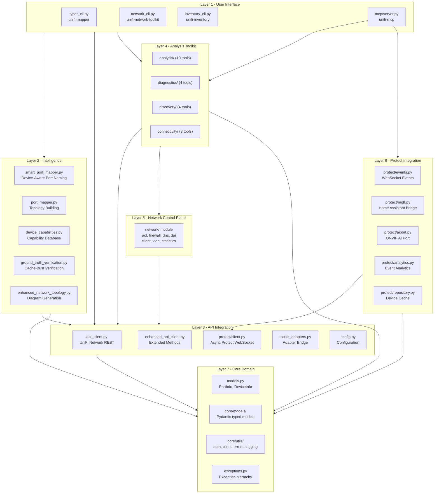

---

## 3. Layer 1: User Interface

### Component diagram

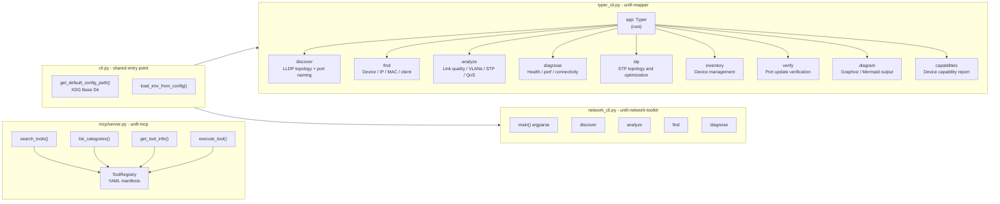

### typer_cli.py

The primary CLI, `unifi-mapper`, is built with [Typer](https://typer.tiangolo.com/) and uses Rich for terminal output. All subcommands share a `State` singleton for the config path and debug flag:

```python
class State:
    """Global CLI state."""
    config_path: Optional[Path] = None
    debug: bool = False

state = State()

app = typer.Typer(
    name="unifi-mapper",
    rich_markup_mode="rich",
    invoke_without_command=True,
)
```

The root callback intercepts `--connected-devices`, `--dry-run`, and `--verify-updates` flags so users can invoke the discover workflow without explicitly naming the subcommand.

### cli.py (shared entry point)

`cli.py` is the shared foundation consumed by both `typer_cli.py` and `network_cli.py`. It provides:

- **XDG Base Directory resolution** for config files — searches `$XDG_CONFIG_HOME/unifi_management_cli/` before falling back to `.env` in the current directory.
- **`load_env_from_config(path)`** — reads a `.env` file and injects each key-value pair into `os.environ`.

### MCP Server (mcp/server.py)

The `unifi-mcp` server is built on FastMCP. It exposes four meta-tools that implement the Code Mode pattern (see [Section 10](#10-design-patterns)):

| Tool | Purpose |
| --- | --- |
| `search_tools` | Discover tools by query, category, or tag |
| `list_categories` | Enumerate all category groups |
| `get_tool_info` | Fetch full parameter schema for a named tool |
| `execute_tool` | Invoke any registered tool by name |

The MCP server does not hard-code any domain logic. It delegates entirely to the `ToolRegistry` and the underlying toolkit modules.

---

## 4. Layer 2: Intelligence

This layer contains the domain-specific reasoning that goes beyond raw API calls: understanding device limitations, verifying API responses, building topology graphs.

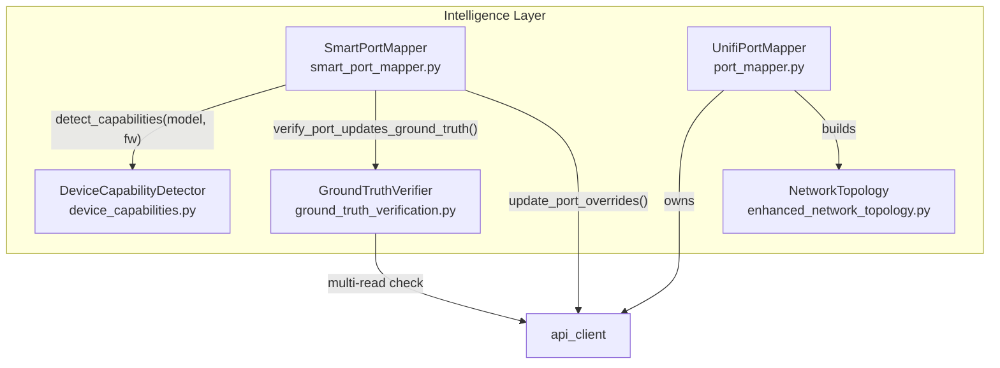

### smart_port_mapper.py

`SmartPortMapper` is the orchestration class for LLDP-driven port naming. It:

1. Calls `DeviceCapabilityDetector` to determine whether a device supports port naming at all.
2. Constructs port name proposals from LLDP data.
3. Applies updates via the API client using the correct write field (`port_overrides`, not `port_table`).
4. Optionally calls `GroundTruthVerifier` to confirm persistence.

```python
class SmartPortMapper:
    def __init__(self, api_client):
        self.api_client = api_client
        self.capability_detector = DeviceCapabilityDetector()

    def smart_update_ports(
        self,
        devices_data: List[Dict],
        lldp_data: Dict[str, Dict],
        verify_updates: bool = True,
        dry_run: bool = False,
    ) -> Dict[str, Any]:
        ...
```

### device_capabilities.py

Encodes community-researched knowledge about UniFi device firmware quirks into a structured capability database:

```python
class PortNamingSupport(Enum):
    FULL_SUPPORT = "full"
    UI_ONLY = "ui_only"
    LIMITED = "limited"
    RESETS_AUTOMATICALLY = "resets"
    NOT_SUPPORTED = "none"

@dataclass
class DeviceCapability:
    model: str
    firmware_version: str
    port_naming_support: PortNamingSupport
    known_issues: List[str]
    workarounds: List[str]
    api_endpoint_restrictions: List[str]
    max_port_name_length: Optional[int] = 32
    supports_port_profiles: bool = True
```

Known device issues are keyed by `(model_code, firmware_version)` tuples. A wildcard `"*"` firmware matches all versions. This allows the system to skip unsafe operations (e.g., firmware 7.2.123 on US-8-60W automatically resets port profiles and cycles PoE ports).

### ground_truth_verification.py

The UniFi API caches device state aggressively. After a port-override write, the API may return the old value for several seconds or indefinitely. `GroundTruthVerifier` addresses this with two strategies:

**Strategy 1: Multi-read consistency check**
Reads the same port name N times with configurable delays, adding cache-busting HTTP headers on each request. Consistency across reads (all N reads agree on the new value) is used as the verification signal.

**Strategy 2: Browser verification (optional)**
Uses browser automation against the UniFi controller UI, which reads directly from the controller's internal state rather than the cached API layer. This requires credentials and is opt-in.

```python
def _multi_read_consistency_check(
    self, device_id, port_idx, expected_name,
    num_reads=5, delay_between_reads=2.0
) -> Dict[str, Any]:
    # Cache-busting headers added per read:
    self.api_client.session.headers.update({
        "Cache-Control": "no-cache, no-store, must-revalidate",
        "X-Cache-Bust": str(int(time.time() * 1000)),
    })
```

### enhanced_network_topology.py

Wraps `DeviceInfo` and `PortInfo` objects into a graph and renders diagrams via Graphviz (PNG/SVG/DOT) or produces Mermaid markup directly. `network_topology.py` is a thin re-export shim so existing code imports continue to work without modification.

---

## 5. Layer 3: API Integration

### API layer components

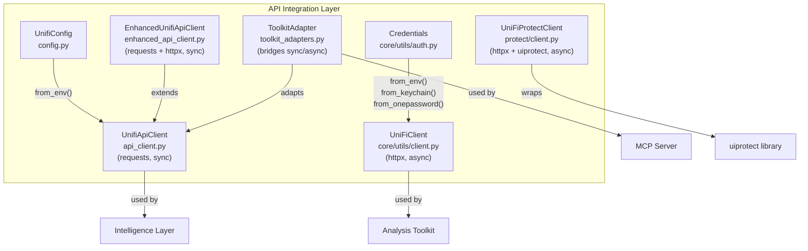

### UnifiApiClient (api_client.py)

The primary synchronous client for the UniFi Network REST API.

**Dual endpoint detection**: The client probes both the UniFi OS path (`/proxy/network/api/...`) and the legacy path (`/api/...`) during login, storing the working endpoint for subsequent requests.

**Authentication strategies**:

| Strategy | HTTP mechanism | Preferred for |
| --- | --- | --- |
| API token | `X-API-KEY` header | UniFi OS (UDM, UDR, UDM SE) |
| Username + password | Session cookie (POST `/api/login`) | Legacy controllers |

**Retry with exponential backoff**: The `_retry_request()` method wraps every outbound call. It respects the retryable vs permanent distinction in the exception hierarchy — authentication failures (401/403) and bad-request errors (4xx) are not retried; server errors (5xx), timeouts, and connection failures are retried up to `max_retries` with `delay * 2^attempt` spacing.

```python
def _retry_request(self, func, *args, **kwargs):
    for attempt in range(self.max_retries):
        try:
            return func(*args, **kwargs)
        except Timeout as e:
            delay = self.retry_delay * (2 ** attempt)
            time.sleep(delay)
        except HTTPError as e:
            if e.response.status_code in [401, 403]:
                raise UniFiAuthenticationError(...)  # No retry
            ...
```

**Input sanitisation**: All values passed to the API are validated before use. Logging helpers (`_sanitize_for_logging`, `_hash_for_verification`) ensure credentials are never written to log output.

### EnhancedUnifiApiClient (enhanced_api_client.py)

Extends `UnifiApiClient` with additional methods for port configuration, provisioning, and statistics. Also imports `httpx` for async-capable endpoints where needed alongside the synchronous `requests` session.

### UniFiProtectClient (protect/client.py)

A fully async wrapper around the `uiprotect` library's `ProtectApiClient`. Manages:

- A `ConnectionState` finite state machine: `DISCONNECTED → CONNECTING → CONNECTED ⇄ RECONNECTING → ERROR`.
- Context manager lifecycle (`__aenter__` / `__aexit__`) for clean resource management.
- WebSocket subscription plumbing for real-time event delivery.
- Typed property accessors for all Protect device types: cameras, AI ports, sensors, lights, chimes, door locks.

```python
async with UniFiProtectClient(config) as client:
    cameras = client.cameras        # dict[str, Camera]
    ai_ports = client.ai_ports      # dict[str, AiPort]
    bootstrap = client.bootstrap    # full Bootstrap snapshot
```

### UniFiClient (core/utils/client.py)

A second async client built with `httpx` for use by the analysis toolkit. Consumes credentials from the `get_credentials()` fallback chain (see Section 14). This client follows the async context manager pattern and is the standard client for all toolkit tools.

### ToolkitAdapter (toolkit_adapters.py)

The adapter bridges the async-capable toolkit with the synchronous `UnifiApiClient` used by older CLI paths. It wraps each toolkit function in a synchronous `_sync` variant that fetches data directly from the API client without requiring an async event loop.

---

## 6. Layer 4: Analysis Toolkit

The toolkit is 21 individual async functions organised across four sub-packages. All tools are registered via YAML manifests and exposed through the MCP server.

### Tool inventory

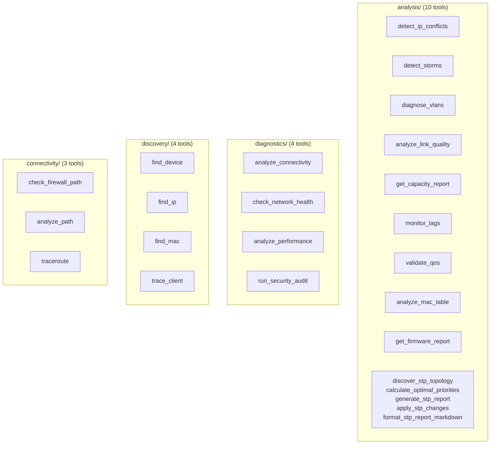

### YAML manifest pattern

Each category has a manifest file under `mcp/manifests/`. The manifest declares the tool's module path, handler function, description, priority, and tags. This decouples tool metadata from implementation and allows the MCP server to serve discovery without importing any tool code at startup.

```yaml
# mcp/manifests/analysis.yaml
category: analysis
tools:
  detect_ip_conflicts:
    module: unifi_mapper.analysis.ip_conflicts
    handler: detect_ip_conflicts
    description: Find IP address conflicts between devices on the network
    priority: P1
    tags: [ip, conflict, layer3, diagnostic]
```

Priority levels (`P1` through `P3`) help AI agents decide which tools to invoke first when investigating a reported symptom.

### Tool implementation pattern

Each tool function:

1. Creates a `UniFiClient` (async context manager from `core/utils/client.py`).
2. Fetches the necessary API data.
3. Returns a structured Pydantic model from `core/models/`.

```python
async def diagnose_vlans(
    source_vlan: int | None = None,
    dest_vlan: int | None = None,
) -> VLANDiagnosticReport:
    async with UniFiClient() as client:
        networks = await client.get_networks()
        # ... analysis logic ...
    return VLANDiagnosticReport(checks=checks, ...)
```

---

## 7. Layer 5: Network Control Plane

The `network/` sub-package models the writable configuration objects of the UniFi controller. It is used by both the CLI and the analysis toolkit for configuration reads and writes.

```mermaid
graph LR
    subgraph network_module["network/ module"]
        ACL["acl.py\nACL rules"]
        FW["firewall.py\nFirewall policies"]
        DNS["dns.py\nDNS records"]
        DPI["dpi.py\nDPI signatures"]
        CLI_MOD["client.py\nClient management"]
        CLIENTS["clients.py\nClient listing"]
        CFG_MOD["config.py\nSite configuration"]
        MOD["models.py\nShared data models"]
        NET["networks.py\nNetwork/VLAN definitions"]
        SITES["sites.py\nSite management"]
        STATS["statistics.py\nDevice statistics"]
        TM["traffic_matching.py\nTraffic rules"]
    end
```

This layer maps directly to the UniFi controller's API resource hierarchy: each module corresponds to one or more REST endpoints and provides typed Python access to create, read, update, and delete those resources.

---

## 8. Layer 6: Protect Integration

The Protect integration is a self-contained subsystem for real-time camera and sensor management.

### Protect subsystem components

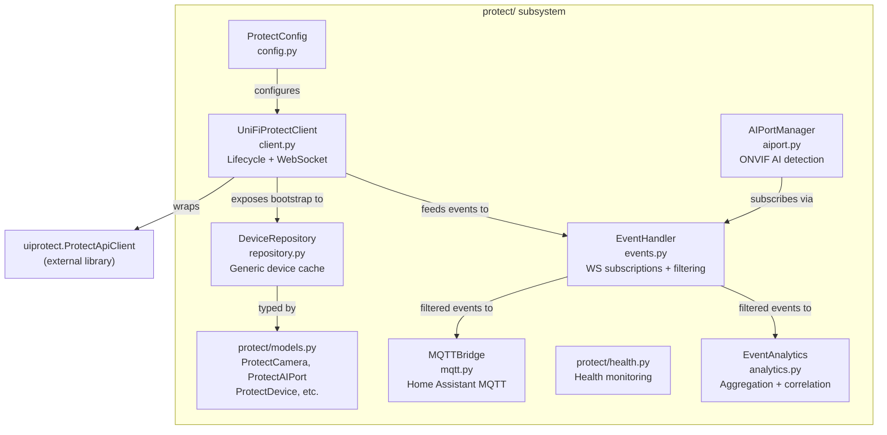

### Connection state FSM

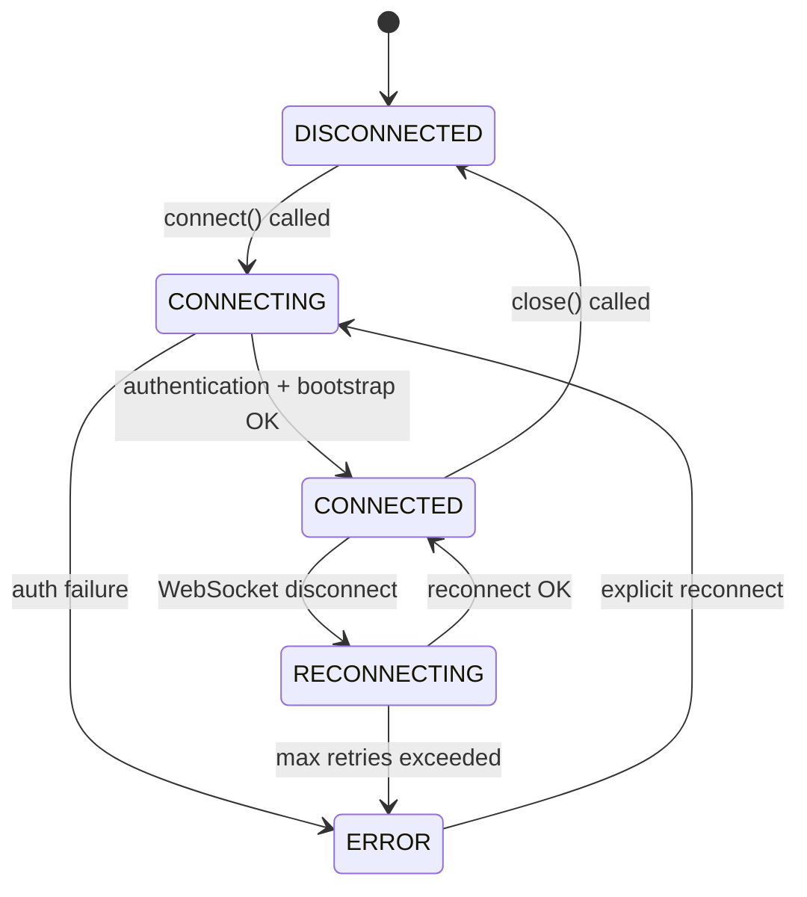

### Event pipeline

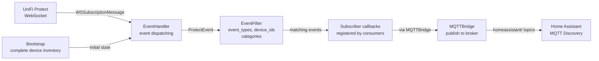

### DeviceRepository pattern

`DeviceRepository[T]` is a generic, typed cache for any Protect device type. Each concrete device type gets its own typed repository instance, providing O(1) lookup by device ID and type-safe iteration:

```python
T = TypeVar('T', bound=ProtectDevice)

class DeviceRepository(Generic[T]):
    def add(self, device: T) -> None: ...
    def get(self, device_id: str) -> T | None: ...
    def all(self) -> list[T]: ...
    def filter(self, predicate: Callable[[T], bool]) -> list[T]: ...
```

### AI Port management

`AIPortManager` in `aiport.py` wraps the Protect AI Port devices, which are hardware modules that add UniFi smart detection (person, vehicle, animal, face, licence plate, smoke) to third-party ONVIF cameras. It tracks paired cameras, manages capability configuration, and subscribes to the event stream for real-time detection events.

---

## 9. Layer 7: Core Domain

### models.py (legacy domain objects)

The original domain objects used by the intelligence layer. Plain Python classes (not Pydantic) because they predate the Pydantic migration:

| Class | Role |
| --- | --- |
| `PortInfo` | Single switch port: index, name, media, speed, LLDP data, proposed name |
| `DeviceInfo` | Network device with list of `PortInfo`, LLDP neighbours |
| `PortHealthMetrics` | Error counters and utilisation stats for a port |
| `DeviceHealthMetrics` | Aggregated health for a device |
| `NetworkHealthStatus` | Network-wide health roll-up |
| `NetworkTopologyChange` | A detected change to the topology |
| `NetworkConfiguration` | Immutable snapshot of a site configuration |
| `NetworkAnalysisResult` | Output type for analysis runs |

### core/models/ (Pydantic typed models)

Newer Pydantic v2 models used by the analysis toolkit and MCP tools. These models are the standard for all new code:

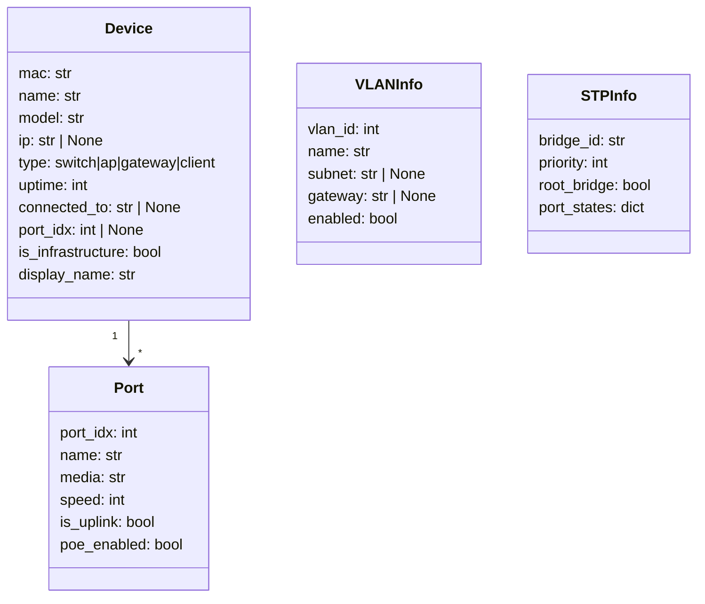

### core/utils/

| Module | Purpose |
| --- | --- |
| `auth.py` | `Credentials` Pydantic model + `get_credentials()` fallback chain |
| `client.py` | `UniFiClient` async httpx client used by toolkit |
| `errors.py` | `ToolError` structured exception + `ErrorCodes` constants |
| `logging.py` | Loguru configuration helpers |

### exceptions.py

The exception hierarchy classifies all API errors into retryable and permanent categories, enabling the retry logic in `UnifiApiClient` to make correct decisions without inspecting HTTP status codes in every call site:

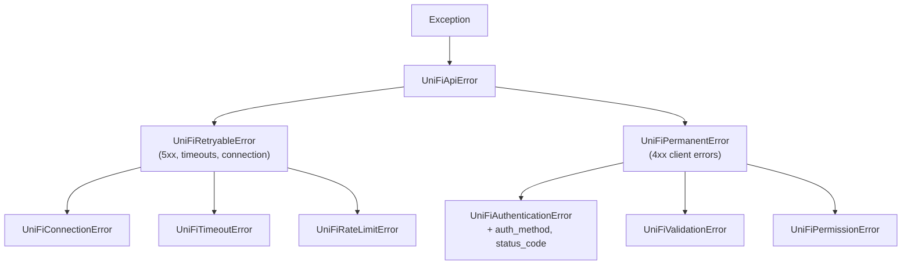

---

## 10. Design Patterns

### Adapter Pattern (toolkit_adapters.py)

The analysis toolkit is async-first. The legacy CLI path (older `cli.py` and `network_cli.py`) is synchronous. `ToolkitAdapter` wraps each async toolkit function in a synchronous variant, extracting data from the synchronous `UnifiApiClient` and building the same output structures:

```python
class ToolkitAdapter:
    def __init__(self, api_client):
        self.api_client = api_client

    def find_device_sync(self, query: str) -> List[Dict[str, Any]]:
        """Synchronous device search (adapts async discovery to sync client)."""
        devices_response = self.api_client.get_devices(self.api_client.site)
        ...
```

This allows the synchronous CLI to use the same tool logic as the async MCP server without requiring an event loop.

### Strategy Pattern

**Authentication strategy**: `UnifiApiClient` selects the authentication method at construction time based on which credentials are present. The `auth_method` attribute records the active strategy (`"token"` or `"username_password"`). The same attribute propagates into `UniFiAuthenticationError` for diagnostic context.

**Port update strategy**: `SmartPortMapper` consults `DeviceCapabilityDetector` before each device to select the appropriate update path (skip entirely, use minimal overrides, use full override). This replaces a brittle if-else chain with a data-driven capability database.

**Credential resolution strategy**: `get_credentials()` in `core/utils/auth.py` implements a priority-ordered fallback chain — environment variables, then macOS Keychain via `keyring`, then 1Password CLI:

```python
async def get_credentials() -> Credentials:
    # 1. Environment variables (UNIFI_URL, UNIFI_CONSOLE_API_TOKEN, etc.)
    try:
        return Credentials.from_env()
    except ToolError:
        pass

    # 2. macOS Keychain via keyring
    keychain_data = keyring.get_password('unifi-mcp', 'controller')
    if keychain_data:
        return Credentials.from_keychain(keychain_data)

    # 3. 1Password CLI
    process = await asyncio.create_subprocess_exec('op', 'item', 'get', ...)
    ...
```

### Repository Pattern (protect/repository.py)

`DeviceRepository[T]` provides a type-safe, in-memory store for Protect device objects. The generic type parameter enforces that cameras cannot be stored in a sensor repository and vice versa:

```python
class DeviceRepository(Generic[T]):
    def __init__(self, device_type: DeviceType) -> None:
        self._device_type = device_type
        self._devices: dict[str, T] = {}

    def get(self, device_id: str) -> T | None:
        return self._devices.get(device_id)

    def filter(self, predicate: Callable[[T], bool]) -> list[T]:
        return [d for d in self._devices.values() if predicate(d)]
```

### Lazy Loading / Proxy Pattern (mcp/registry.py)

`ToolProxy` defers importing a tool's implementation module until the first `execute()` call. This keeps MCP server startup fast even though 36+ tools are registered — only the YAML manifests are parsed at startup:

```python
class ToolProxy:
    def __init__(self, metadata: ToolMetadata) -> None:
        self._implementation: Callable[..., Any] | None = None
        self._lock = Lock()

    def _load_implementation(self) -> None:
        if self._implementation is not None:
            return
        with self._lock:
            if self._implementation is not None:
                return
            module = importlib.import_module(self.metadata.module)
            self._implementation = getattr(module, self.metadata.handler)
```

The double-checked locking (`if ... return` before and inside the lock) ensures thread safety while avoiding lock contention on the hot path once the module is loaded.

### Context Manager Pattern (protect/client.py, core/utils/client.py)

Both async API clients implement `__aenter__` / `__aexit__` for use in `async with` blocks. This guarantees that WebSocket connections and HTTP sessions are properly closed even when exceptions propagate:

```python
async with UniFiProtectClient(config) as client:
    cameras = client.cameras
    # WebSocket and HTTP session are open here
# Both are closed here, even if an exception occurred
```

### Code Mode Pattern (mcp/server.py + mcp/registry.py)

The MCP server implements a progressive-disclosure pattern designed for AI agents. Rather than exposing 36 individual tools to the AI's context window, it exposes four meta-tools. An AI agent follows the discover-then-execute workflow:

```text
1. search_tools(category="analysis") -> list of matching tools
2. get_tool_info("detect_ip_conflicts") -> parameters and description
3. execute_tool("detect_ip_conflicts", {}) -> result
```

This keeps the AI's tool list short and avoids overwhelming the model with schema for all 36 tools at once. The agent requests detail only for tools it intends to use.

---

## 11. Key Workflows (Sequence Diagrams)

### 11.1 Port Discovery and Naming Flow

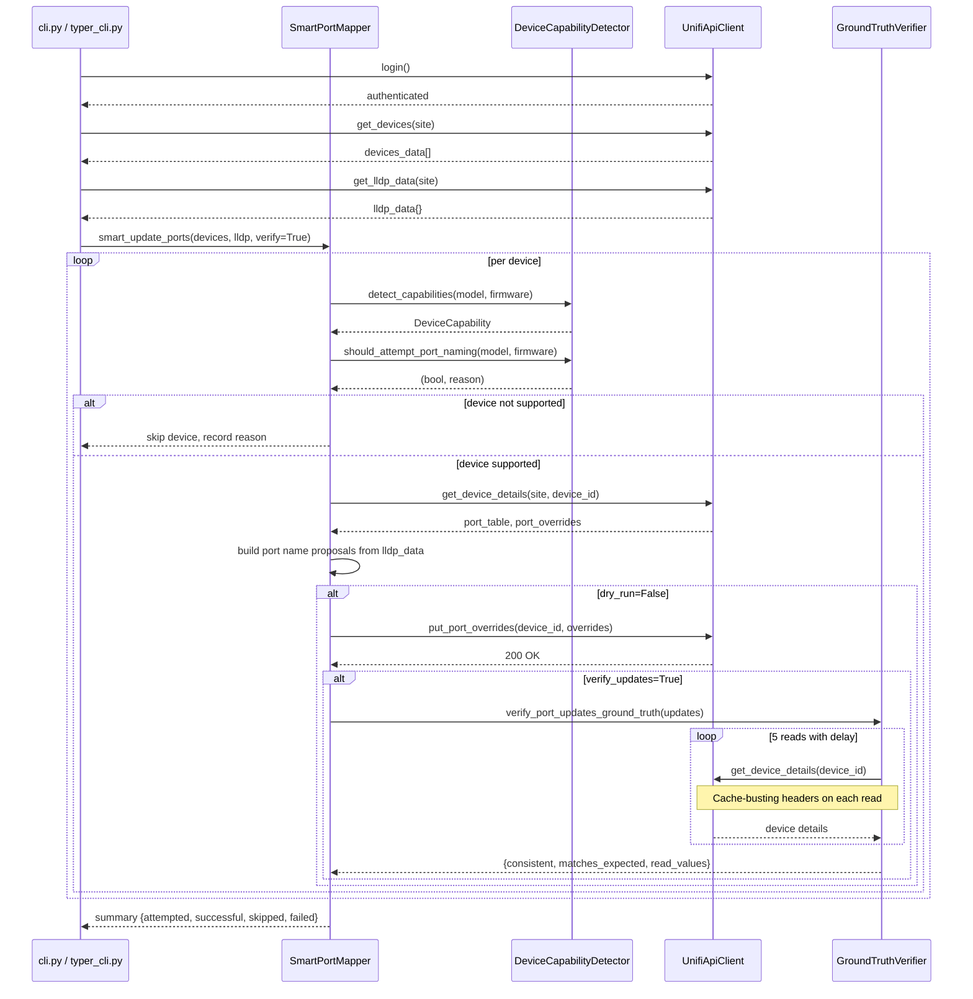

### 11.2 API Authentication Flow

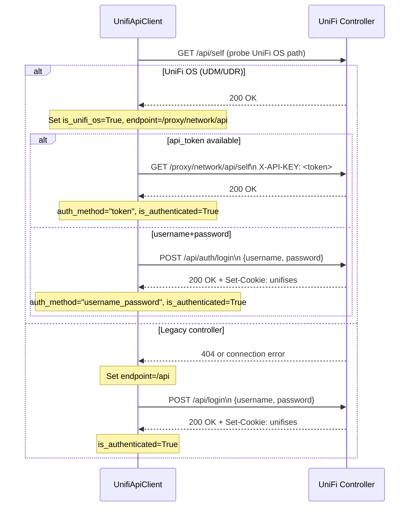

### 11.3 MCP Tool Discovery and Execution Flow

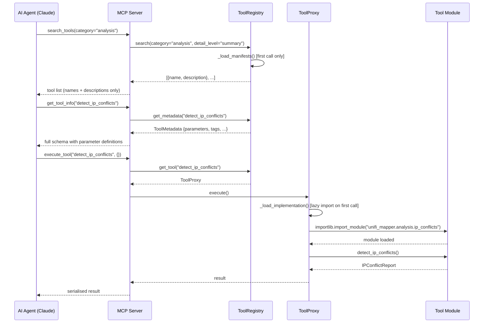

### 11.4 Protect Event Processing Flow

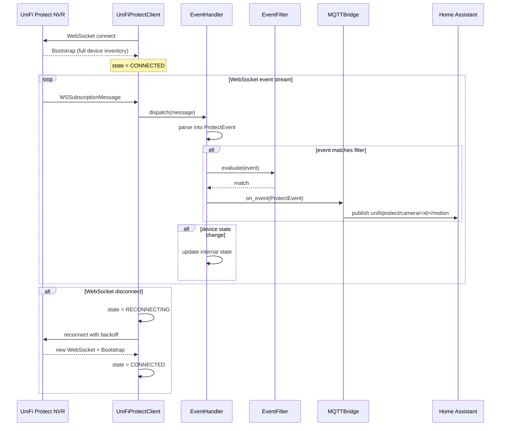

---

## 12. Module Dependency Graph

The following graph shows the primary import relationships between modules. Arrows point from importer to imported.

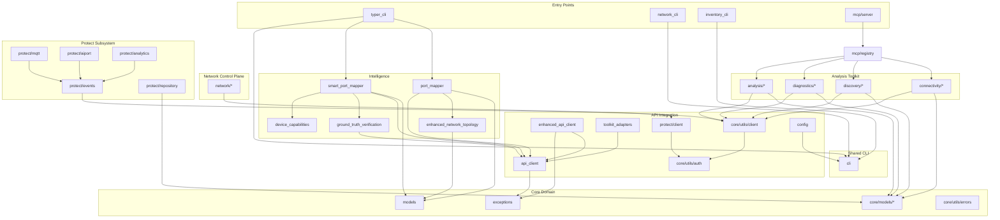

---

## 13. External Interfaces

### 13.1 UniFi Network REST API

| Interface | Protocol | Auth | Notes |
| --- | --- | --- | --- |
| UniFi OS path | HTTPS REST | `X-API-KEY` token header | UDM, UDR, UDM SE — preferred |
| Legacy controller path | HTTPS REST | Session cookie (POST `/api/login`) | Self-hosted controller software |

Key endpoints consumed:

| Endpoint | Method | Purpose |
| --- | --- | --- |
| `/proxy/network/api/s/{site}/stat/device` | GET | Device inventory with port tables |
| `/proxy/network/api/s/{site}/rest/device/{id}` | PUT | Port override writes |
| `/proxy/network/api/s/{site}/stat/sta` | GET | Wireless client list |
| `/proxy/network/api/s/{site}/rest/networkconf` | GET | Network/VLAN configuration |
| `/proxy/network/api/s/{site}/rest/firewallrule` | GET | Firewall rules |
| `/proxy/network/api/s/{site}/stat/health` | GET | Site health summary |

**Critical API behaviour note**: The UniFi API caches device state. Reads of `port_table` after a write to `port_overrides` may return stale data for an indeterminate period. The `GroundTruthVerifier` exists specifically to work around this behaviour.

**Write field distinction**: `port_table` is read-only (populated by the controller firmware). The writable field is `port_overrides` — a sparse array containing only ports with non-default configuration. This is a documented but non-obvious behaviour that affects all port configuration writes.

### 13.2 UniFi Protect WebSocket API

| Interface | Protocol | Library |
| --- | --- | --- |
| Protect events | WSS WebSocket | `uiprotect` library |
| Bootstrap data | HTTPS REST | `uiprotect` library |
| Camera streams | RTSP | Not managed by this platform |

Event types consumed: motion, smart detect zones, doorbell, sensor state, device online/offline, NVR system events.

### 13.3 ONVIF (IP Camera Protocol)

Used by `protect/aiport.py` to communicate with third-party cameras paired to UniFi AI Ports. Handled via the `onvif-zeep-async` library.

### 13.4 MQTT (Home Assistant Integration)

`protect/mqtt.py` publishes events to an MQTT broker using the Home Assistant MQTT Discovery convention. The bridge auto-generates discovery payloads so Home Assistant registers Protect devices without manual configuration.

| Topic pattern | Content |
| --- | --- |
| `homeassistant/<type>/<device_id>/config` | Discovery payload (auto-registers device in HA) |
| `unifi/protect/<device_id>/state` | Device state updates |
| `unifi/protect/<device_id>/event` | Event payloads (motion, detection, etc.) |

### 13.5 MCP Protocol

The MCP server implements the Model Context Protocol (MCP) 1.0 specification using the FastMCP SDK. AI clients connect via stdio (for local use) or SSE (for remote deployment). The server exports:

- 4 meta-tools (search, list, info, execute)
- 36+ domain tools accessible via the execute meta-tool

---

## 14. Configuration and Credential Management

### Configuration resolution order

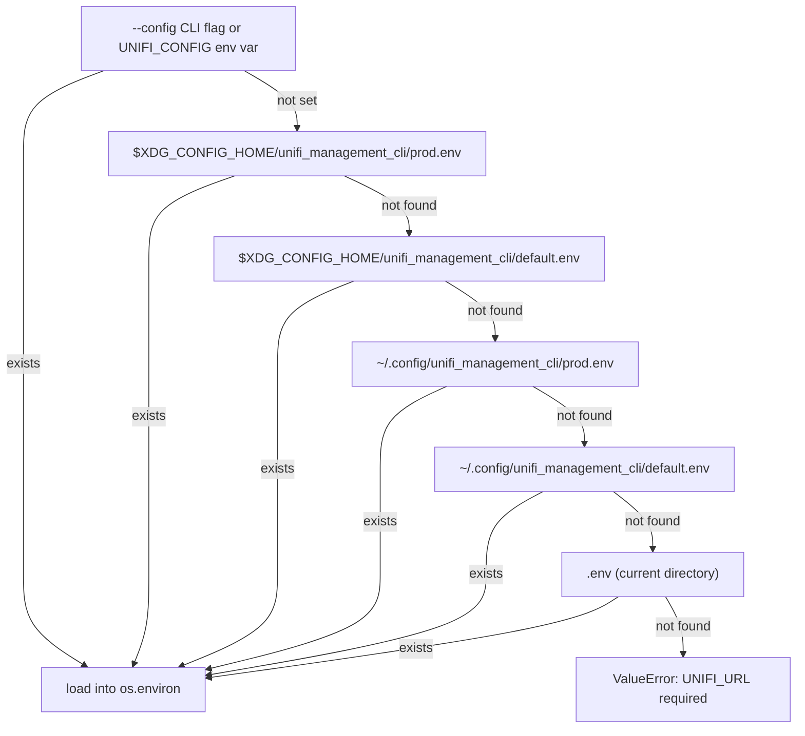

### Credential fallback chain (MCP / toolkit)

For the async toolkit and MCP server, credentials are resolved at runtime via `get_credentials()`:

1. **Environment variables**: `UNIFI_URL` (or `UNIFI_HOST`), `UNIFI_CONSOLE_API_TOKEN` (or `UNIFI_API_TOKEN`), `UNIFI_USERNAME`, `UNIFI_PASSWORD`, `UNIFI_SITE`, `UNIFI_VERIFY_SSL`.
2. **macOS Keychain**: Stored as JSON under service name `unifi-mcp`, account `controller`, via the `keyring` library.
3. **1Password CLI**: Reads an item named `UniFi Controller` from the default 1Password vault using the `op` CLI.

If all three sources fail, a `ToolError` with `error_code=AUTHENTICATION_FAILED` is raised with a structured suggestion.

### UnifiConfig dataclass

`config.py` provides `UnifiConfig`, a `@dataclass` with `__post_init__` validation:

- URL must start with `http://` or `https://`.
- Either `api_token` or both `username` and `password` must be present.
- Numeric values are clamped to safe ranges: timeout 1-300s, retries 1-10, retry delay 0.1-10s.
- `from_env()` is the standard factory, loading from an env file then `os.environ`.

---

*End of architecture overview.*
