# C4 Architecture: UniFi Management CLI

## Table of Contents

1. [Overview](#overview)
2. [Level 1: System Context](#level-1-system-context)
3. [Level 2: Container Diagram](#level-2-container-diagram)
4. [Level 3: Component Diagrams](#level-3-component-diagrams)
   - [CLI Layer Components](#31-cli-layer-components)
   - [API Integration Components](#32-api-integration-components)
   - [Analysis and Diagnostic Components](#33-analysis-and-diagnostic-components)
   - [UniFi Protect Components](#34-unifi-protect-components)
   - [MCP Server Components](#35-mcp-server-components)
5. [Level 4: Code Diagrams](#level-4-code-diagrams)
   - [API Client Class Structure](#41-api-client-class-structure)
   - [Protect Client Class Structure](#42-protect-client-class-structure)
   - [Data Model Hierarchy](#43-data-model-hierarchy)
   - [Exception Hierarchy](#44-exception-hierarchy)
6. [Key Design Decisions](#key-design-decisions)

---

## Overview

The UniFi Management CLI is an enterprise-grade Python automation platform for Ubiquiti UniFi networks. It provides four distinct entry points—three CLI tools and one MCP server—all built on a shared library of API clients, domain models, and analysis engines. The platform spans two separate UniFi product lines (Network and Protect) and integrates with Home Assistant via MQTT and with AI assistants via the Model Context Protocol.

This document follows the C4 model (Simon Brown) with all four levels of abstraction: System Context, Container, Component, and Code.

---

## Level 1: System Context

The system context shows the UniFi Management CLI in relation to the humans and external systems it interacts with. At this level, internal structure is irrelevant — the focus is on boundaries and relationships.

### Mermaid Diagram

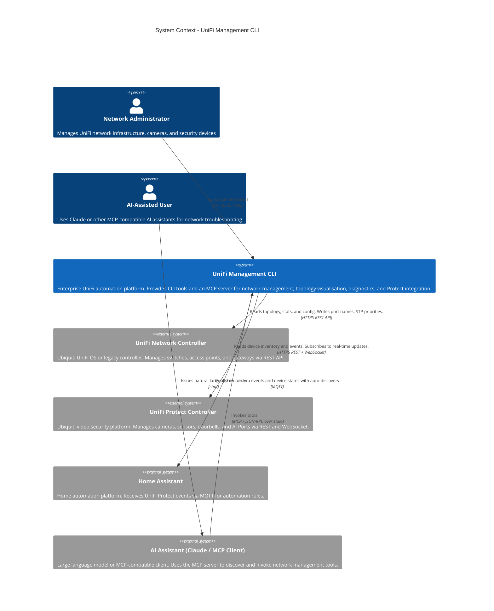

### PlantUML Equivalent

```plantuml
@startuml C4_Context
!include https://raw.githubusercontent.com/plantuml-stdlib/C4-PlantUML/master/C4_Context.puml

Person(admin, "Network Administrator", "Manages UniFi network infrastructure, cameras, and security devices")
Person(ai_user, "AI-Assisted User", "Uses Claude or MCP-compatible AI assistants for network troubleshooting")

System(unifi_mgmt, "UniFi Management CLI", "Enterprise UniFi automation platform providing CLI tools and MCP server for network management, topology visualisation, diagnostics, and Protect integration.")

System_Ext(unifi_network, "UniFi Network Controller", "Ubiquiti UniFi OS or legacy controller. Manages switches, APs, and gateways via REST API.")
System_Ext(unifi_protect, "UniFi Protect Controller", "Ubiquiti video security platform. Manages cameras, sensors, doorbells, and AI Ports.")
System_Ext(home_assistant, "Home Assistant", "Home automation platform receiving Protect events via MQTT.")
System_Ext(ai_assistant, "AI Assistant (Claude / MCP Client)", "LLM or MCP-compatible client invoking network management tools.")

Rel(admin, unifi_mgmt, "Runs CLI commands", "terminal / shell")
Rel(ai_user, ai_assistant, "Issues natural language requests", "chat")
Rel(ai_assistant, unifi_mgmt, "Invokes tools", "MCP / JSON-RPC over stdio")
Rel(unifi_mgmt, unifi_network, "Reads and writes network configuration", "HTTPS REST")
Rel(unifi_mgmt, unifi_protect, "Reads devices and events, subscribes to updates", "HTTPS REST + WebSocket")
Rel(unifi_mgmt, home_assistant, "Publishes events with MQTT auto-discovery", "MQTT")
@enduml
```

### Context Notes

The platform serves two distinct user personas with different interaction models:

- The **Network Administrator** invokes CLI tools directly. They choose the appropriate tool (`unifi-mapper`, `unifi-network-toolkit`, or `unifi-inventory`) depending on whether they need interactive output, scripting compatibility, or inventory reports.

- The **AI-Assisted User** interacts indirectly through an MCP-compatible client such as Claude Desktop. The AI assistant uses `unifi-mcp` as a tool provider, enabling natural-language network troubleshooting without the user needing to know specific command syntax.

The dual-controller architecture (Network + Protect) reflects Ubiquiti's product split: network infrastructure and video security run on separate controllers with different APIs, authentication models, and communication protocols.

---

## Level 2: Container Diagram

At the container level, the UniFi Management CLI resolves into five runnable units — four Python entry-point commands and one shared library that they all import. Each container has a distinct technology profile and responsibility boundary.

### Mermaid Diagram

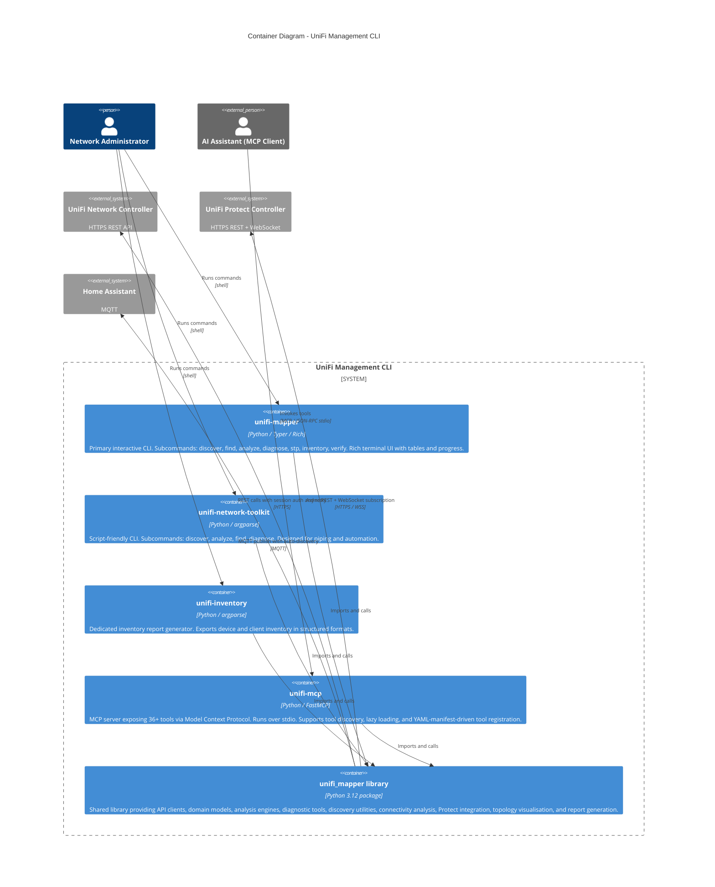

### PlantUML Equivalent

```plantuml
@startuml C4_Container
!include https://raw.githubusercontent.com/plantuml-stdlib/C4-PlantUML/master/C4_Container.puml

Person(admin, "Network Administrator")
Person_Ext(ai_assistant, "AI Assistant (MCP Client)")

System_Ext(unifi_network, "UniFi Network Controller", "HTTPS REST API")
System_Ext(unifi_protect, "UniFi Protect Controller", "HTTPS REST + WebSocket")
System_Ext(home_assistant, "Home Assistant", "MQTT")

System_Boundary(platform, "UniFi Management CLI") {
    Container(unifi_mapper_cli, "unifi-mapper", "Python / Typer / Rich", "Primary interactive CLI with Rich terminal UI")
    Container(network_toolkit_cli, "unifi-network-toolkit", "Python / argparse", "Script-friendly CLI for automation")
    Container(inventory_cli, "unifi-inventory", "Python / argparse", "Inventory report generator")
    Container(mcp_server, "unifi-mcp", "Python / FastMCP", "MCP server exposing 36+ tools over stdio")
    Container(shared_lib, "unifi_mapper library", "Python 3.12 package", "Shared library: API clients, models, analysis, diagnostics, Protect, topology")
}

Rel(admin, unifi_mapper_cli, "Runs commands", "shell")
Rel(admin, network_toolkit_cli, "Runs commands", "shell")
Rel(admin, inventory_cli, "Runs commands", "shell")
Rel(ai_assistant, mcp_server, "Invokes tools", "MCP / JSON-RPC stdio")
Rel(unifi_mapper_cli, shared_lib, "Imports and calls")
Rel(network_toolkit_cli, shared_lib, "Imports and calls")
Rel(inventory_cli, shared_lib, "Imports and calls")
Rel(mcp_server, shared_lib, "Imports and calls")
Rel(shared_lib, unifi_network, "REST calls with retry logic", "HTTPS")
Rel(shared_lib, unifi_protect, "Async REST + WebSocket", "HTTPS / WSS")
Rel(shared_lib, home_assistant, "MQTT publish with auto-discovery", "MQTT")
@enduml
```

### Container Notes

The **four CLI entry points are thin shells** over the shared library. They handle argument parsing, output formatting, and process lifecycle. No business logic lives in the entry points — this is enforced by the `pyproject.toml` entry-point declarations, which map directly to CLI module `main` or `app` functions.

The **shared library** is the architectural centre of gravity. All domain logic, API interactions, and integration code live here. This makes the platform easy to extend: a new CLI tool or a different front-end (e.g., a web API) can be added without touching existing containers.

The `unifi-mapper` and `unifi-network-toolkit` CLIs offer overlapping functionality with different UX targets. `unifi-mapper` uses Typer + Rich for an interactive terminal experience; `unifi-network-toolkit` uses argparse for scripting compatibility. This is a deliberate duplication to serve both audiences without compromise.

---

## Level 3: Component Diagrams

### 3.1 CLI Layer Components

The CLI containers delegate to specific modules within the shared library. This diagram shows the internal components of the CLI layer and their dependencies on the library core.

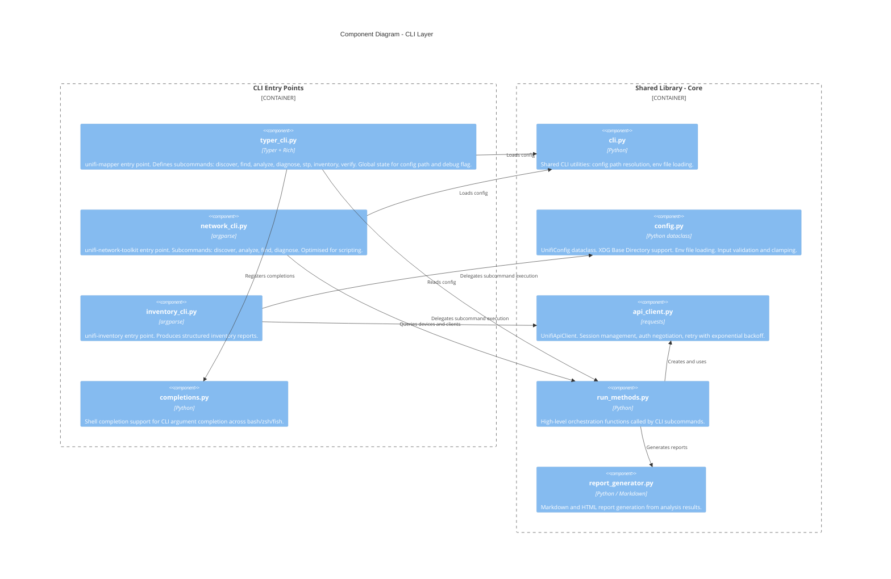

### PlantUML Equivalent

```plantuml
@startuml C4_Component_CLI
!include https://raw.githubusercontent.com/plantuml-stdlib/C4-PlantUML/master/C4_Component.puml

Container_Boundary(cli_layer, "CLI Entry Points") {
    Component(typer_cli, "typer_cli.py", "Typer + Rich", "unifi-mapper: discover, find, analyze, diagnose, stp, inventory, verify")
    Component(network_cli, "network_cli.py", "argparse", "unifi-network-toolkit: discover, analyze, find, diagnose")
    Component(inventory_cli_comp, "inventory_cli.py", "argparse", "unifi-inventory: structured inventory reports")
    Component(completions, "completions.py", "Python", "Shell completion support")
}

Container_Boundary(core_lib, "Shared Library - Core") {
    Component(cli_helpers, "cli.py", "Python", "Shared CLI utilities and config path resolution")
    Component(config_comp, "config.py", "Python dataclass", "UnifiConfig: validation, XDG, env loading")
    Component(api_client_comp, "api_client.py", "requests", "UnifiApiClient: session, auth, retry")
    Component(run_methods, "run_methods.py", "Python", "High-level orchestration for CLI subcommands")
    Component(report_gen, "report_generator.py", "Python / Markdown", "Markdown and HTML report generation")
}

Rel(typer_cli, cli_helpers, "Loads config")
Rel(typer_cli, run_methods, "Delegates")
Rel(network_cli, cli_helpers, "Loads config")
Rel(network_cli, run_methods, "Delegates")
Rel(run_methods, api_client_comp, "Creates and uses")
Rel(run_methods, report_gen, "Generates reports")
@enduml
```

---

### 3.2 API Integration Components

The API integration layer abstracts the two separate UniFi controller APIs behind clean client interfaces.

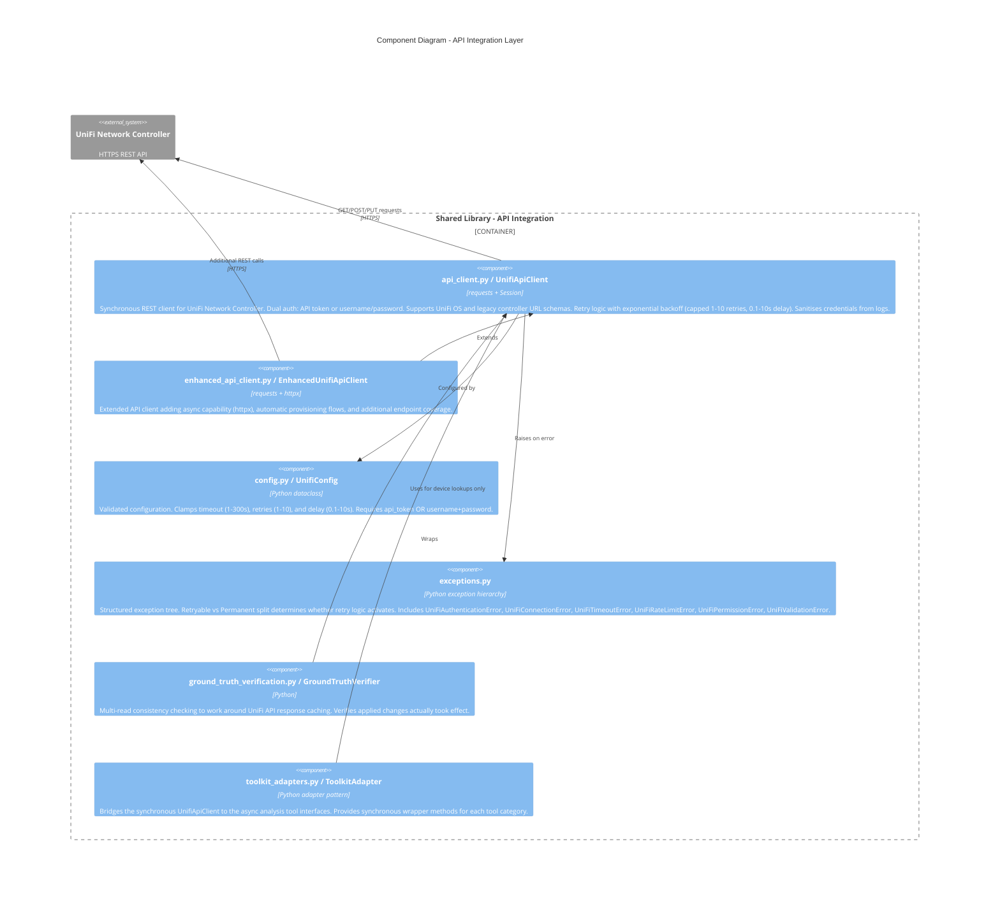

### PlantUML Equivalent

```plantuml
@startuml C4_Component_API
!include https://raw.githubusercontent.com/plantuml-stdlib/C4-PlantUML/master/C4_Component.puml

Container_Boundary(api_layer, "Shared Library - API Integration") {
    Component(api_client_c, "UnifiApiClient", "requests", "Synchronous REST client with dual auth, retry, and credential sanitisation")
    Component(enhanced_api, "EnhancedUnifiApiClient", "requests + httpx", "Extended client with async capability and provisioning flows")
    Component(config_c, "UnifiConfig", "dataclass", "Validated configuration with input clamping")
    Component(exceptions_c, "Exception hierarchy", "Python", "Retryable vs Permanent error split")
    Component(ground_truth, "GroundTruthVerifier", "Python", "Multi-read consistency checking for API cache workaround")
    Component(toolkit_adapters_c, "ToolkitAdapter", "Python adapter", "Sync wrappers bridging API client to analysis tools")
}

System_Ext(unifi_network_c, "UniFi Network Controller", "HTTPS REST")

Rel(api_client_c, unifi_network_c, "REST calls", "HTTPS")
Rel(enhanced_api, api_client_c, "Extends")
Rel(api_client_c, exceptions_c, "Raises on error")
Rel(ground_truth, api_client_c, "Uses for lookups")
Rel(toolkit_adapters_c, api_client_c, "Wraps")
@enduml
```

---

### 3.3 Analysis and Diagnostic Components

The intelligence layer contains the 36+ tools organised into four functional packages. All tools receive an API client instance and return structured results.

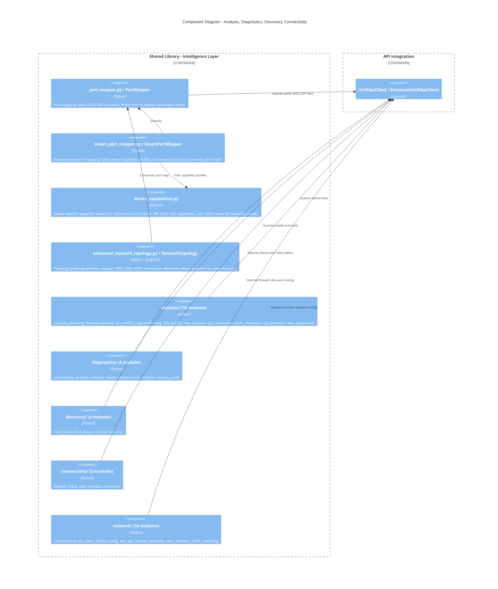

### PlantUML Equivalent

```plantuml
@startuml C4_Component_Intelligence
!include https://raw.githubusercontent.com/plantuml-stdlib/C4-PlantUML/master/C4_Component.puml

Container_Boundary(intelligence, "Shared Library - Intelligence Layer") {
    Component(port_mapper_c, "PortMapper", "Python", "LLDP/CDP port mapping")
    Component(smart_port_mapper_c, "SmartPortMapper", "Python", "Device-aware port mapping")
    Component(device_caps, "DeviceCapabilities", "Python", "Model-specific capability profiles")
    Component(topology_c, "NetworkTopology", "Python / graphviz", "Topology graph: PNG, SVG, HTML, Mermaid")
    Component(analysis_pkg, "analysis/ (10 modules)", "Python", "IP conflicts, STP, VLAN, QoS, capacity, firmware, LAG, link quality, MAC, storm detection")
    Component(diagnostics_pkg, "diagnostics/ (4 modules)", "Python", "Health, performance, security, connectivity")
    Component(discovery_pkg, "discovery/ (4 modules)", "Python", "Find device, find IP, find MAC, client trace")
    Component(connectivity_pkg, "connectivity/ (3 modules)", "Python", "Firewall check, path analysis, traceroute")
    Component(network_pkg, "network/ (10 modules)", "Python", "ACL, DNS, DPI, firewall, networks, sites, statistics")
}

Container_Boundary(api_int, "API Integration") {
    Component(api_ref, "UnifiApiClient", "requests", "")
}

Rel(analysis_pkg, api_ref, "Queries")
Rel(diagnostics_pkg, api_ref, "Queries")
Rel(discovery_pkg, api_ref, "Queries")
Rel(connectivity_pkg, api_ref, "Queries")
Rel(network_pkg, api_ref, "Reads and writes")
Rel(smart_port_mapper_c, device_caps, "Uses")
Rel(topology_c, port_mapper_c, "Consumes")
@enduml
```

---

### 3.4 UniFi Protect Components

The Protect subsystem is architecturally isolated from the Network subsystem. It uses an async client, a separate configuration model, and a WebSocket event pipeline.

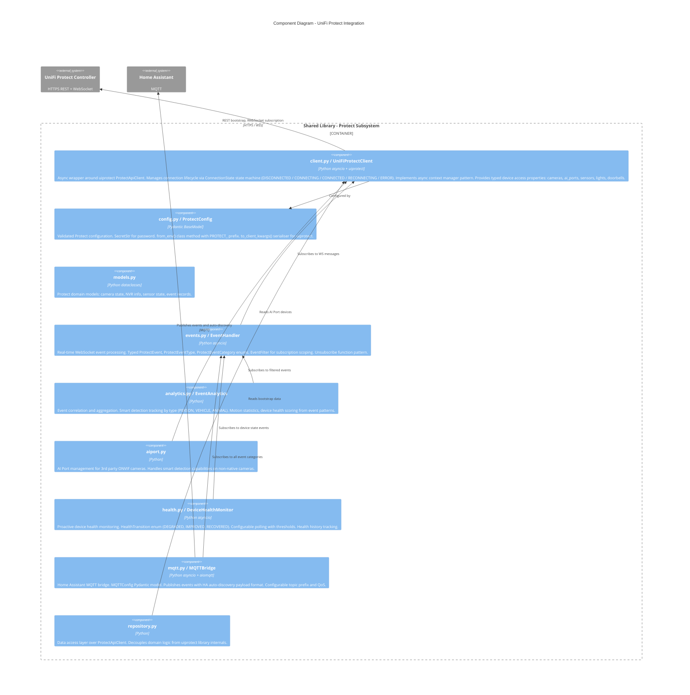

### PlantUML Equivalent

```plantuml
@startuml C4_Component_Protect
!include https://raw.githubusercontent.com/plantuml-stdlib/C4-PlantUML/master/C4_Component.puml

Container_Boundary(protect_sub, "Shared Library - Protect Subsystem") {
    Component(protect_client_c, "UniFiProtectClient", "asyncio + uiprotect", "Async wrapper with ConnectionState machine and typed device properties")
    Component(protect_config_c, "ProtectConfig", "Pydantic", "Validated config with SecretStr and from_env()")
    Component(protect_models_c, "Protect Models", "Python dataclasses", "Camera, NVR, sensor, event domain models")
    Component(events_c, "EventHandler", "asyncio", "WebSocket event processing with typed enums and subscription filtering")
    Component(analytics_c, "EventAnalytics", "Python", "Event correlation, smart detection stats, motion aggregation")
    Component(aiport_c, "AiPort Manager", "Python", "AI Port management for 3rd party ONVIF cameras")
    Component(health_c, "DeviceHealthMonitor", "asyncio", "Proactive health monitoring with transition detection")
    Component(mqtt_c, "MQTTBridge", "asyncio + aiomqtt", "HA MQTT bridge with auto-discovery")
    Component(repository_c, "Repository", "Python", "Data access layer over uiprotect client")
}

System_Ext(protect_ctrl, "UniFi Protect Controller")
System_Ext(ha, "Home Assistant")

Rel(protect_client_c, protect_ctrl, "REST + WebSocket")
Rel(events_c, protect_client_c, "Subscribes")
Rel(analytics_c, events_c, "Subscribes")
Rel(health_c, events_c, "Subscribes")
Rel(mqtt_c, events_c, "Subscribes")
Rel(mqtt_c, ha, "Publishes", "MQTT")
@enduml
```

---

### 3.5 MCP Server Components

The MCP server uses a Code Mode architecture pattern: tool discovery is separated from tool execution, enabling AI assistants to efficiently explore the tool catalogue before committing to specific calls.

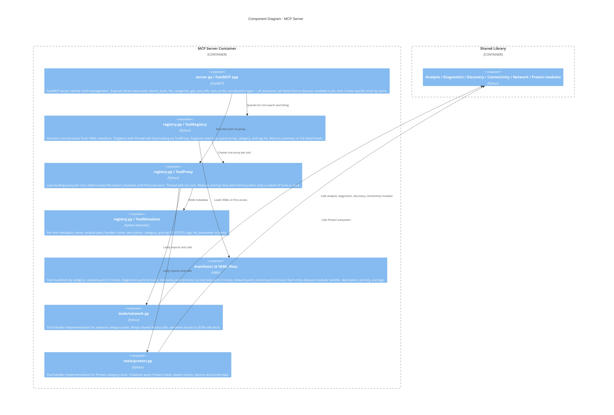

### PlantUML Equivalent

```plantuml
@startuml C4_Component_MCP
!include https://raw.githubusercontent.com/plantuml-stdlib/C4-PlantUML/master/C4_Component.puml

Container_Boundary(mcp_sub, "MCP Server") {
    Component(mcp_server_c, "FastMCP app", "FastMCP", "Exposes search_tools, list_categories, get_tool_info meta-tools")
    Component(registry_c, "ToolRegistry", "Python", "Singleton: YAML manifest loading, search by query/category/tag")
    Component(tool_proxy_c, "ToolProxy", "Python", "Lazy-loading proxy with thread-safe importlib deferred load")
    Component(tool_metadata_c, "ToolMetadata", "Python dataclass", "name, module, handler, description, category, priority, tags")
    Component(manifests_c, "manifests/ (6 YAML files)", "YAML", "Tool definitions for analysis, diagnostics, discovery, connectivity, network, protect")
    Component(network_tools_c, "tools/network.py", "Python", "Network tool handler implementations")
    Component(protect_tools_c, "tools/protect.py", "Python", "Protect tool handler implementations")
}

Container_Boundary(shared_c, "Shared Library") {
    Component(shared_ref, "All domain modules", "Python", "")
}

Rel(mcp_server_c, registry_c, "Queries")
Rel(registry_c, manifests_c, "Loads YAML")
Rel(registry_c, tool_proxy_c, "Creates")
Rel(tool_proxy_c, network_tools_c, "Lazily calls")
Rel(tool_proxy_c, protect_tools_c, "Lazily calls")
Rel(network_tools_c, shared_ref, "Delegates")
Rel(protect_tools_c, shared_ref, "Delegates")
@enduml
```

---

## Level 4: Code Diagrams

### 4.1 API Client Class Structure

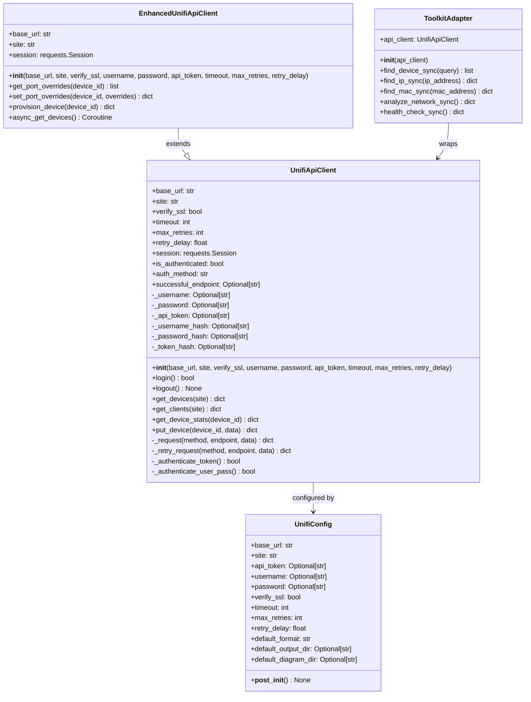

### PlantUML Equivalent

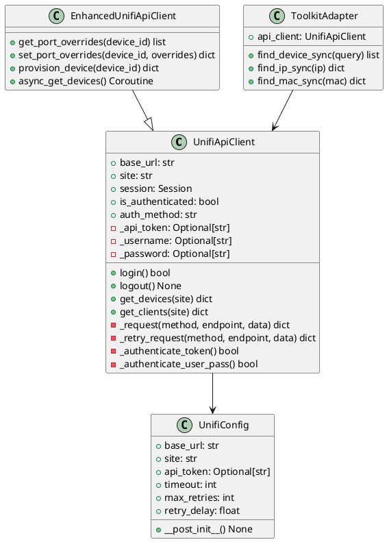

---

### 4.2 Protect Client Class Structure

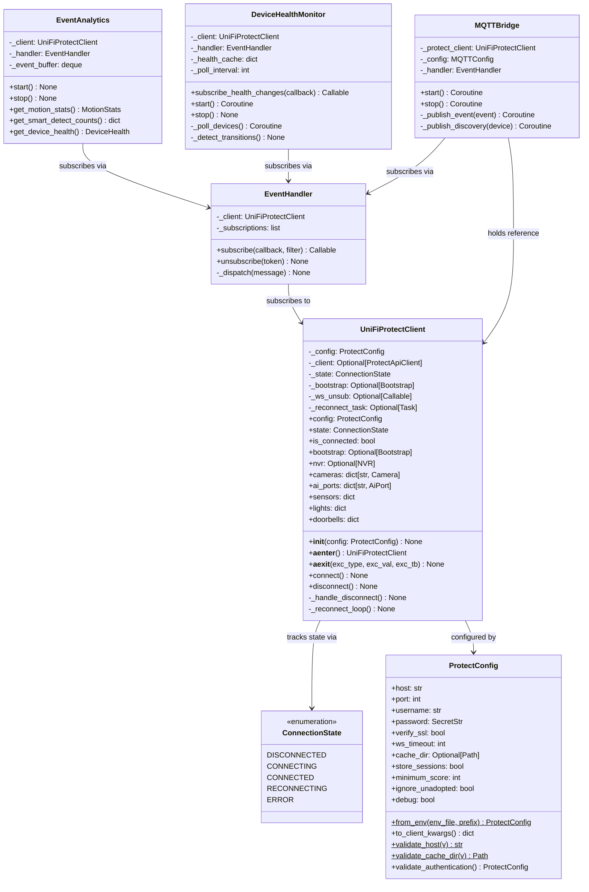

### PlantUML Equivalent

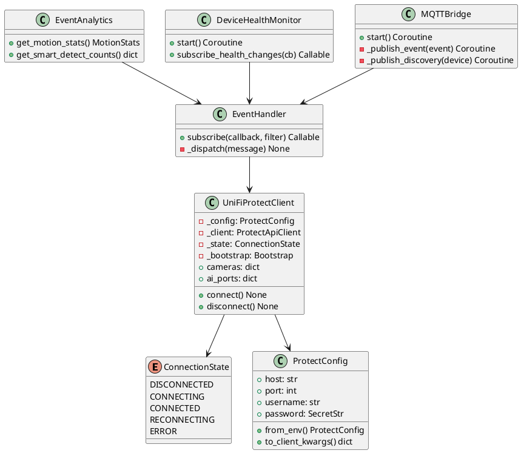

---

### 4.3 Data Model Hierarchy

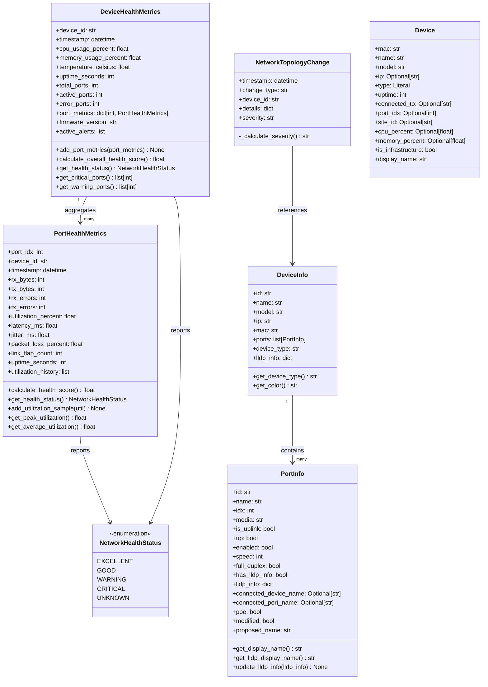

### PlantUML Equivalent

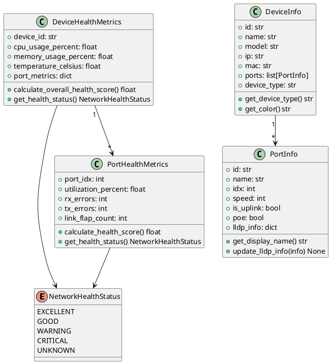

---

### 4.4 Exception Hierarchy

```mermaid
classDiagram
    class Exception {
        <<Python built-in>>
    }

    class UniFiApiError {
        <<base>>
        Base exception for all UniFi API errors.
        Catch this to handle any UniFi error.
    }

    class UniFiRetryableError {
        <<abstract>>
        Errors where retry logic should activate.
        5xx responses, timeouts, connection failures.
    }

    class UniFiPermanentError {
        <<abstract>>
        Errors that must not be retried.
        4xx client errors — retrying won't help.
    }

    class UniFiConnectionError {
        Network connectivity failures.
        Connection refused, DNS resolution failure.
    }

    class UniFiTimeoutError {
        Request timed out.
        Controller unreachable within configured timeout.
    }

    class UniFiRateLimitError {
        HTTP 429 Too Many Requests.
        Back off and retry after delay.
    }

    class UniFiAuthenticationError {
        +auth_method: str
        +status_code: int
        HTTP 401 or 403.
        Token invalid or credentials rejected.
    }

    class UniFiPermissionError {
        Insufficient API privileges for operation.
        User account lacks required role.
    }

    class UniFiValidationError {
        Invalid input parameters.
        Bad site_id, device_id format, etc.
    }

    Exception <|-- UniFiApiError
    UniFiApiError <|-- UniFiRetryableError
    UniFiApiError <|-- UniFiPermanentError
    UniFiRetryableError <|-- UniFiConnectionError
    UniFiRetryableError <|-- UniFiTimeoutError
    UniFiRetryableError <|-- UniFiRateLimitError
    UniFiPermanentError <|-- UniFiAuthenticationError
    UniFiPermanentError <|-- UniFiPermissionError
    UniFiPermanentError <|-- UniFiValidationError
```

### PlantUML Equivalent

```plantuml
@startuml Code_Exceptions
class Exception <<Python built-in>>

class UniFiApiError <<base>>
class UniFiRetryableError <<abstract>>
class UniFiPermanentError <<abstract>>

class UniFiConnectionError
class UniFiTimeoutError
class UniFiRateLimitError

class UniFiAuthenticationError {
    +auth_method: str
    +status_code: int
}
class UniFiPermissionError
class UniFiValidationError

Exception <|-- UniFiApiError
UniFiApiError <|-- UniFiRetryableError
UniFiApiError <|-- UniFiPermanentError
UniFiRetryableError <|-- UniFiConnectionError
UniFiRetryableError <|-- UniFiTimeoutError
UniFiRetryableError <|-- UniFiRateLimitError
UniFiPermanentError <|-- UniFiAuthenticationError
UniFiPermanentError <|-- UniFiPermissionError
UniFiPermanentError <|-- UniFiValidationError
@enduml
```

---

## Key Design Decisions

### Synchronous Network API, Asynchronous Protect API

The Network API client (`UnifiApiClient`, `EnhancedUnifiApiClient`) uses `requests` (synchronous). The Protect client (`UniFiProtectClient`) uses `asyncio` and the `uiprotect` library. This split reflects the fundamental difference between the two product lines: the Network API is a request-response REST API that maps naturally to synchronous code; the Protect API requires a persistent WebSocket subscription for real-time event delivery, which demands an async runtime. The `ToolkitAdapter` class exists specifically to bridge these two models when the MCP server needs to call both from a single async context.

### Retryable vs Permanent Exception Split

The exception hierarchy divides all errors into `UniFiRetryableError` and `UniFiPermanentError` before further specialisation. This binary distinction is load-bearing: the retry loop in `UnifiApiClient._retry_request()` catches `UniFiRetryableError` and applies exponential backoff, while `UniFiPermanentError` propagates immediately. This prevents pointless retries on authentication failures (wrong password will always fail) while correctly retrying transient network issues.

### Credential Sanitisation in the API Client

`UnifiApiClient` stores SHA-256 hashes of credentials alongside the raw values, and all logging methods call `_sanitize_for_logging()` before writing. This is an active defence against credential leakage into log files, which is a real operational risk in always-on network automation scripts.

### Code Mode Pattern in the MCP Server

The MCP server exposes `search_tools`, `list_categories`, and `get_tool_info` as first-class tools rather than relying on the MCP tool listing protocol alone. This is the Code Mode pattern: AI assistants are expected to call `search_tools(query="stp")` to discover relevant tools before invoking `discover_stp_topology()`. This reduces hallucination of tool names and allows the assistant to select the most appropriate tool from the full catalogue of 36+ options without receiving all tool definitions upfront.

### YAML Manifests as the Tool Contract

Tool definitions live in YAML manifests rather than Python decorators. This separates the tool contract (what a tool is called, what it does, what parameters it accepts) from the implementation (how it does it). The `ToolRegistry` loads manifests lazily; `ToolProxy` defers the actual `importlib.import_module()` call until the tool is first executed. The practical result is fast MCP server startup even with a large tool catalogue.

### Ground Truth Verification

`GroundTruthVerifier` exists because the UniFi API has known response caching behaviour where a `PUT` to update port names may return success, but a subsequent `GET` returns the old values for several seconds. Rather than relying on the API to confirm its own writes, the verifier performs multi-read consistency checks to detect when the controller has actually applied a change. This is documented as a workaround for API behaviour that is outside the project's control.

### Topology Wrapper Module

`network_topology.py` is a one-line re-export of `enhanced_network_topology.py`. This pattern preserves backward compatibility for any callers using the original import path (`from unifi_mapper.network_topology import NetworkTopology`) while consolidating the actual implementation in the enhanced module. New code imports from `enhanced_network_topology` directly.
