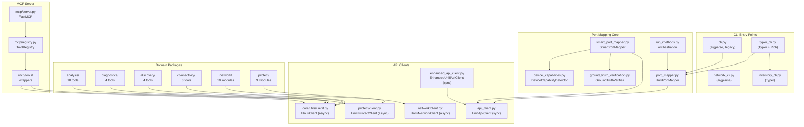
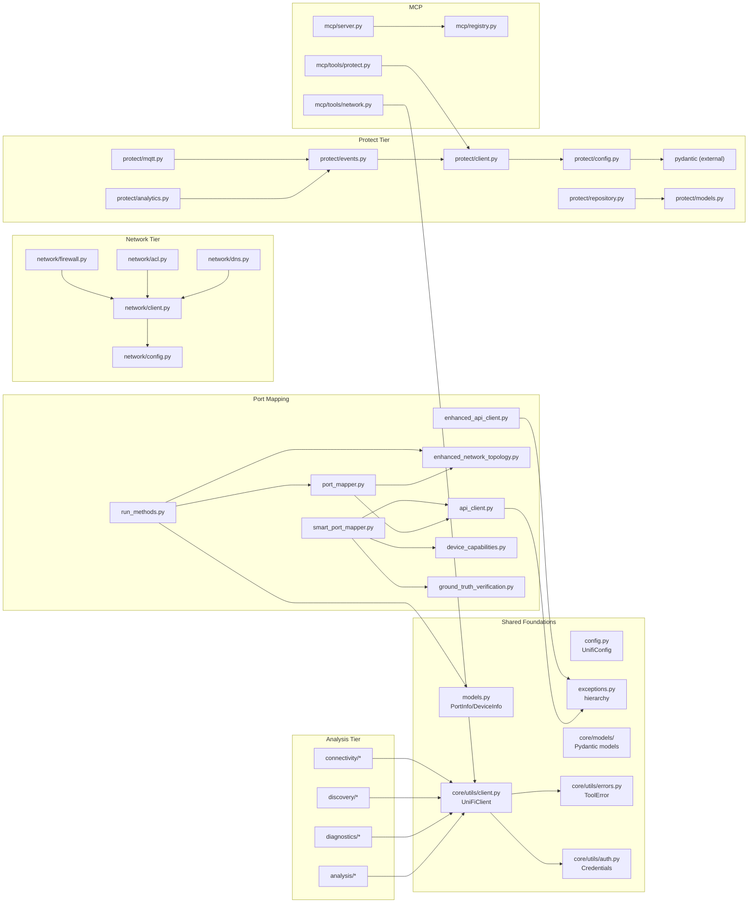
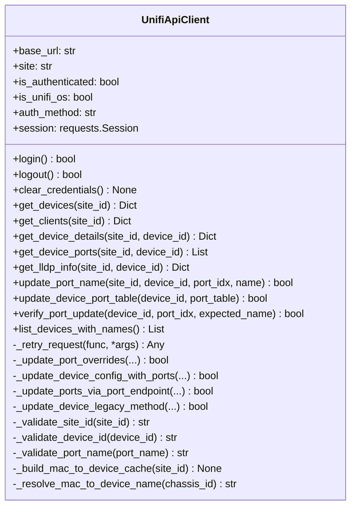
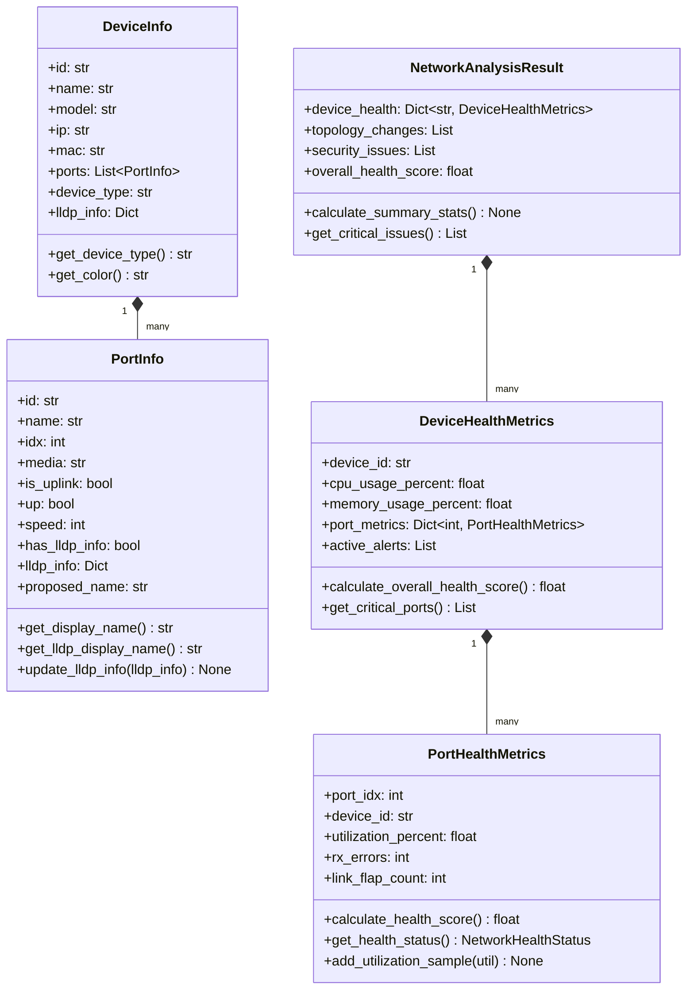
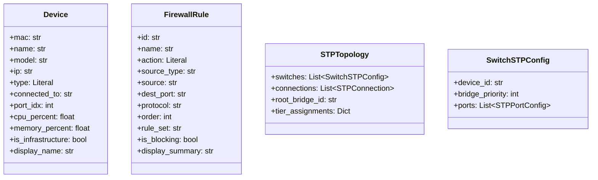
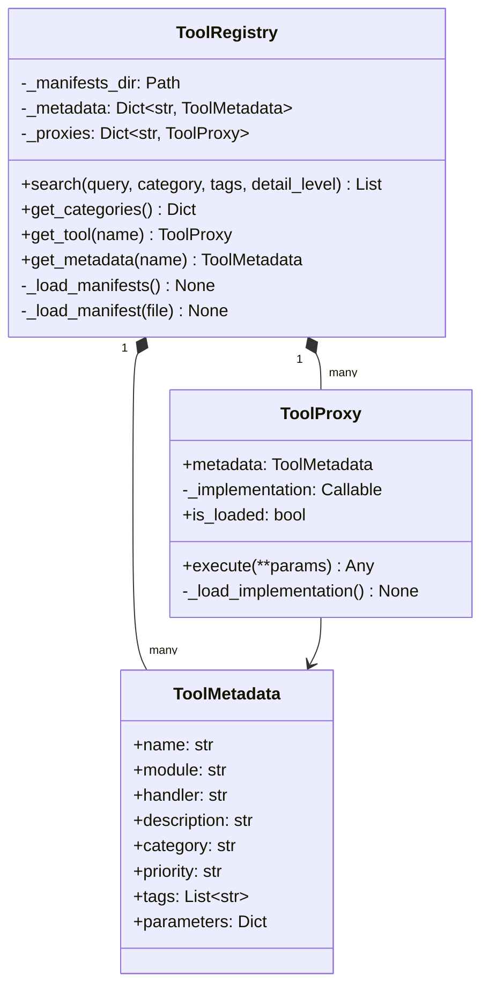
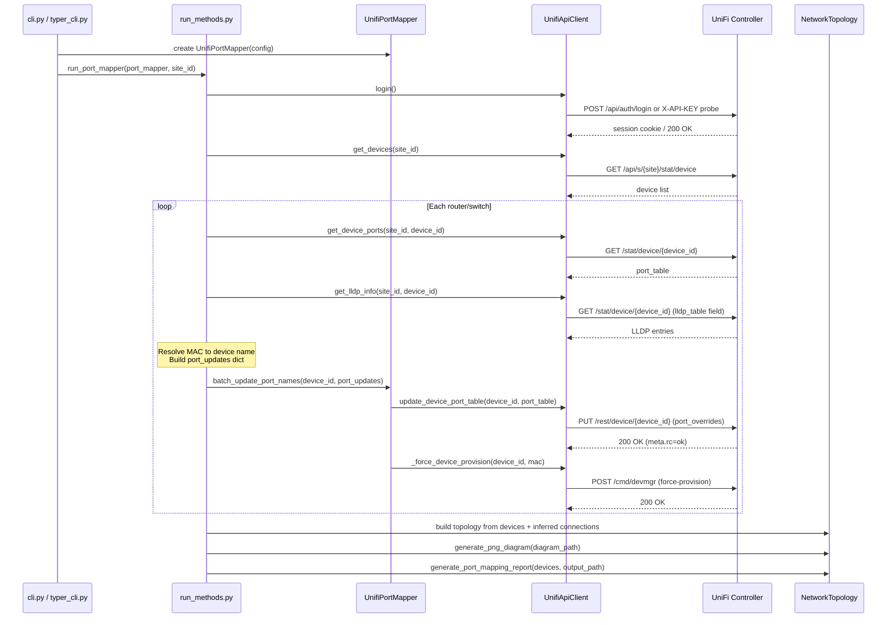
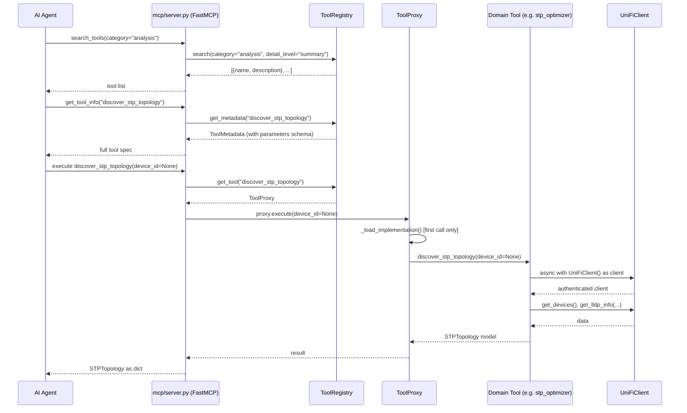
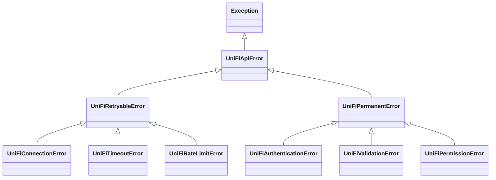

# UniFi Management CLI - Codebase Map

Generated: 2026-04-06

---

## Table of Contents

1. [Project Overview](#1-project-overview)
2. [Top-Level Package Architecture](#2-top-level-package-architecture)
3. [Module Dependency Graph](#3-module-dependency-graph)
4. [Core Entry Points and Configuration](#4-core-entry-points-and-configuration)
   - 4.1 [cli.py - Legacy argparse entry point](#41-clipy)
   - 4.2 [typer_cli.py - Modern Typer/Rich CLI](#42-typer_clipy)
   - 4.3 [network_cli.py and inventory_cli.py](#43-network_clipy-and-inventory_clipy)
   - 4.4 [config.py - UnifiConfig dataclass](#44-configpy)
5. [API Clients](#5-api-clients)
   - 5.1 [api_client.py - UnifiApiClient](#51-api_clientpy)
   - 5.2 [enhanced_api_client.py - EnhancedUnifiApiClient](#52-enhanced_api_clientpy)
6. [Port Mapping Subsystem](#6-port-mapping-subsystem)
   - 6.1 [port_mapper.py - UnifiPortMapper](#61-port_mapperpy)
   - 6.2 [smart_port_mapper.py - SmartPortMapper](#62-smart_port_mapperpy)
   - 6.3 [device_capabilities.py - DeviceCapabilityDetector](#63-device_capabilitiespy)
   - 6.4 [ground_truth_verification.py - GroundTruthVerifier](#64-ground_truth_verificationpy)
   - 6.5 [run_methods.py - Orchestration functions](#65-run_methodspy)
7. [Core Data Models](#7-core-data-models)
   - 7.1 [models.py - Legacy in-memory models](#71-modelspy)
   - 7.2 [core/models/ - Pydantic typed models](#72-coremodels)
8. [Network Topology and Reporting](#8-network-topology-and-reporting)
   - 8.1 [network_topology.py / enhanced_network_topology.py](#81-network_topologypy--enhanced_network_topologypy)
   - 8.2 [report_generator.py](#82-report_generatorpy)
9. [core/ Package](#9-core-package)
   - 9.1 [core/utils/auth.py - Credentials](#91-coreutilsauthpy)
   - 9.2 [core/utils/client.py - UniFiClient (async)](#92-coreutilsclientpy)
   - 9.3 [core/utils/errors.py - ToolError](#93-coreutilserrorspy)
10. [analysis/ Package](#10-analysis-package)
11. [diagnostics/ Package](#11-diagnostics-package)
12. [discovery/ Package](#12-discovery-package)
13. [connectivity/ Package](#13-connectivity-package)
14. [network/ Package](#14-network-package)
    - 14.1 [network/config.py - NetworkConfig](#141-networkconfigpy)
    - 14.2 [network/client.py - UniFiNetworkClient (async)](#142-networkclientpy)
    - 14.3 [network/firewall.py - FirewallManager](#143-networkfirewallpy)
    - 14.4 [Other network/ modules](#144-other-network-modules)
15. [protect/ Package](#15-protect-package)
    - 15.1 [protect/config.py - ProtectConfig](#151-protectconfigpy)
    - 15.2 [protect/client.py - UniFiProtectClient](#152-protectclientpy)
    - 15.3 protect/events.py - Event handling
    - 15.4 [protect/analytics.py - EventAnalytics](#154-protectanalyticspy)
    - 15.5 [protect/mqtt.py - MQTTBridge](#155-protectmqttpy)
    - 15.6 [protect/repository.py - DeviceRepository](#156-protectrepositorypy)
16. [mcp/ Package - MCP Server](#16-mcp-package)
    - 16.1 [mcp/server.py - FastMCP entry point](#161-mcpserverpy)
    - 16.2 [mcp/registry.py - ToolRegistry](#162-mcpregistrypy)
    - 16.3 [mcp/tools/ - Tool wrappers](#163-mcptools)
17. [monitors/ Package](#17-monitors-package)
18. [utility/ Package](#18-utility-package)
19. [Key Workflows](#19-key-workflows)
    - 19.1 [Port Discovery and Naming Workflow](#191-port-discovery-and-naming-workflow)
    - 19.2 [Protect Event Pipeline](#192-protect-event-pipeline)
    - 19.3 [MCP Tool Execution Workflow](#193-mcp-tool-execution-workflow)
20. [Exception Hierarchy](#20-exception-hierarchy)

---

## 1. Project Overview

The UniFi Management CLI is a Python package (`unifi_mapper`) that provides three distinct interface layers over UniFi Controller APIs:

1. **CLI tools** - argparse and Typer-based command-line interfaces for network operators
2. **Analysis and diagnostics tools** - 20+ domain-specific modules for network analysis
3. **MCP server** - A FastMCP server that exposes all tools to AI agents via the Model Context Protocol

The codebase contains two generations of API client code. The legacy synchronous path (`api_client.py`, `port_mapper.py`, `run_methods.py`) handles the original port-mapping workflow. The modern async path (`core/utils/client.py`, `network/client.py`, `protect/client.py`) serves the analysis, network control, and Protect integration packages.

---

## 2. Top-Level Package Architecture



---

## 3. Module Dependency Graph



---

## 4. Core Entry Points and Configuration

### 4.1 `cli.py`

**Purpose.** The original CLI entry point registered as the `unifi-mapper` console script. It handles XDG Base Directory config discovery, loads a `.env` file into `os.environ`, then delegates to `run_port_mapper` or `SmartPortMapper`.

**Key functions.**

| Function | Description |
|---|---|
| `main()` | argparse-based entry, dispatches to port mapping or smart mapping |
| `load_env_from_config(config_path)` | Parses a key=value `.env` file into `os.environ` |
| `get_default_config_path()` | XDG-compliant config file discovery with 5-level fallback |

**Dependencies.** `config.py`, `api_client.py`, `port_mapper.py`, `smart_port_mapper.py`, `run_methods.py`, `completions.py`

**Interface.** Consumed by the `unifi-mapper` entry point in `pyproject.toml`. Deferred imports after env loading avoid import-time side effects.

---

### 4.2 `typer_cli.py`

**Purpose.** A modern Typer + Rich CLI that wraps the same underlying port-mapping logic with richer UX. Registers subcommands including `discover`, `inventory`, and `devices`.

**Key objects.**

| Object | Description |
|---|---|
| `app` | Typer application instance with `--config`, `--debug`, `--dry-run` global options |
| `state` (State) | Global singleton holding config path and debug flag |
| `main()` | Callback invoked on bare `unifi-mapper` invocation |

**Dependencies.** `cli.py` (for `get_default_config_path`, `load_env_from_config`), `inventory_cli.py`

---

### 4.3 `network_cli.py` and `inventory_cli.py`

**Purpose.** `network_cli.py` is an argparse-based entry point for the `unifi-network-toolkit` console script; it focuses on network-level operations rather than port mapping. `inventory_cli.py` provides a Typer subapp (`inventory_app`) for listing devices and querying firmware versions, integrated into `typer_cli.py`.

**Dependencies.** Both depend on `api_client.py` and `cli.py`.

---

### 4.4 `config.py`

**Purpose.** Centralises all configuration for the synchronous API path as a `dataclass` with validation and clamping of numeric parameters.

**Key class.** `UnifiConfig`

| Field | Type | Notes |
|---|---|---|
| `base_url` | `str` | Required, must start with `http://` or `https://` |
| `site` | `str` | Defaults to `"default"` |
| `api_token` | `Optional[str]` | Preferred auth method |
| `username` / `password` | `Optional[str]` | Fallback auth |
| `verify_ssl` | `bool` | Defaults to `False` for self-signed certs |
| `timeout` | `int` | Clamped to 1-300 seconds |
| `default_format` | `str` | Diagram output format (`png`, `svg`, etc.) |

**Key methods.**

- `from_env(env_file)` - Loads `UNIFI_URL`, `UNIFI_SITE`, `UNIFI_CONSOLE_API_TOKEN`, etc. from environment
- `to_dict()` - Returns plain dict suitable for `UnifiApiClient` constructor kwargs

**Dependencies.** Standard library only (`os`, `dataclasses`, `pathlib`).

---

## 5. API Clients

### 5.1 `api_client.py`

**Purpose.** Synchronous REST client for the UniFi Controller API (both UniFi OS / UDM and legacy controllers). Handles authentication, endpoint detection, retry logic with exponential backoff, input validation, and credential scrubbing.

**Key class.** `UnifiApiClient`



**Retry logic.** `_retry_request` applies exponential backoff (`retry_delay * 2^attempt`) for transient errors. It maps HTTP status codes to exception types: 401/403 raise `UniFiAuthenticationError` (no retry); 5xx and 408/429 retry up to `max_retries`.

**Port update strategy.** `update_device_port_table` tries four methods in order:

1. `_update_port_overrides` - writes to the writable `port_overrides` field (preferred)
2. `_update_device_config_with_ports` - sends full device config with updated `port_table`
3. `_update_ports_via_port_endpoint` - uses device manager `cmd/devmgr` command
4. `_update_device_legacy_method` - minimal payload fallback

**UniFi OS detection.** On first use, probes `/api/system`. Success means UniFi OS routes; failure falls back to legacy `/api/s/{site}/...` paths.

**Dependencies.** `exceptions.py`, `requests`

---

### 5.2 `enhanced_api_client.py`

**Purpose.** A second-generation synchronous client that adds automatic device provisioning (`force-provision`) after port updates and enhanced per-port verification. Intended to supersede `api_client.py` for the port-naming workflow.

**Key class.** `EnhancedUnifiApiClient`

| Method | Description |
|---|---|
| `update_device_port_overrides(device_id, port_updates, auto_provision)` | Updates named ports via `port_overrides`, then triggers `force-provision` |
| `force_provision(device_mac)` | Posts `cmd/devmgr` force-provision command |
| `verify_port_update_enhanced(device_id, port_updates, max_attempts)` | Per-port verification returning `Dict[int, bool]` |
| `batch_update_with_verification(device_id, port_updates, verify, auto_provision)` | Combined update + verify, returns `tuple[bool, Dict[int, bool]]` |

**Key difference from `api_client.py`.** This client checks `meta.rc` in the JSON response body (not just HTTP status) to detect silent API failures that return `200 OK` with an error payload.

**Dependencies.** `exceptions.py`, `requests`, `httpx`

---

## 6. Port Mapping Subsystem

### 6.1 `port_mapper.py`

**Purpose.** High-level facade over `UnifiApiClient`. Provides the primary object operators interact with: connects to the controller, fetches device and LLDP data, maps clients to ports, and dispatches batch port name updates.

**Key class.** `UnifiPortMapper`

| Method | Description |
|---|---|
| `get_devices()` | Fetch all devices for the configured site |
| `get_device_ports(device_id)` | Fetch port table for one device |
| `get_lldp_info(device_id)` | Fetch LLDP table for one device |
| `get_clients()` | Fetch all wired and wireless clients |
| `get_client_port_mapping(device_mac)` | Map switch ports to connected clients |
| `format_client_names(clients, max_names)` | Sanitise and format names for port labels |
| `batch_update_port_names(device_id, port_updates, verify_updates)` | Update multiple ports in one API call + optional verification |
| `_force_device_provision(device_id, device_mac)` | Post `force-provision` to device manager |
| `run(...)` | Delegates to `run_methods.run_port_mapper` |

**Internal state.** Holds a `NetworkTopology` instance that is populated during `run_methods.run_port_mapper`.

**Dependencies.** `api_client.py`, `network_topology.py`

---

### 6.2 `smart_port_mapper.py`

**Purpose.** Wraps the standard port mapper with device-capability awareness. Before updating any port it queries `DeviceCapabilityDetector` to determine whether the device is known to auto-reset port names, support only UI configuration, or have other firmware bugs. Integrates `GroundTruthVerifier` for post-update cross-checking.

**Key class.** `SmartPortMapper`

| Method | Description |
|---|---|
| `smart_update_ports(devices_data, lldp_data, verify_updates, dry_run)` | Main entry; iterates devices, checks capabilities, applies updates |
| `_apply_device_aware_updates(device_id, device_name, port_updates, capability)` | Applies updates using appropriate strategy per capability level |
| `_perform_ground_truth_verification(results)` | Calls `verify_with_ground_truth` and updates result dict |
| `generate_smart_mapping_report(results)` | Renders text summary with incompatible devices and recommendations |

**Dependencies.** `device_capabilities.py`, `ground_truth_verification.py`, `api_client.py`

---

### 6.3 `device_capabilities.py`

**Purpose.** Static knowledge base of device-specific port naming limitations keyed by `(model_code, firmware_version)`. Provides `should_attempt_port_naming` and `get_recommended_strategy` to prevent futile API calls against known-broken devices.

**Key objects.**

| Object | Description |
|---|---|
| `PortNamingSupport` (Enum) | `FULL_SUPPORT`, `UI_ONLY`, `LIMITED`, `RESETS_AUTOMATICALLY`, `NOT_SUPPORTED` |
| `DeviceCapability` (dataclass) | Per-device record: known issues, workarounds, max name length |
| `DeviceCapabilityDetector` | Lookup class with `detect_capabilities`, `should_attempt_port_naming`, `get_recommended_strategy` |

**Dependencies.** Standard library only.

---

### 6.4 `ground_truth_verification.py`

**Purpose.** Multi-read consistency verifier that works around the UniFi API's tendency to return stale cached data. Uses enhanced API polling with forced cache invalidation rather than trusting a single read.

**Key class.** `GroundTruthVerifier`

| Method | Description |
|---|---|
| `verify_port_updates_ground_truth(device_updates, use_browser)` | Routes to browser or enhanced API verification |
| `_verify_with_enhanced_api_checks(device_updates)` | Multiple reads with jitter, cross-checks `port_table` and `port_overrides` |

**Module-level helper.** `verify_with_ground_truth(api_client, device_updates, browser_credentials)` - convenience wrapper used by `SmartPortMapper`.

**Dependencies.** `api_client.py`

---

### 6.5 `run_methods.py`

**Purpose.** Orchestration functions that drive a full port-mapper run: authenticate, fetch devices and clients, build LLDP port names, apply updates, infer topology connections, generate diagram and report. This is the main workflow coordinator.

**Key functions.**

| Function | Description |
|---|---|
| `run_port_mapper(port_mapper, site_id, ...)` | Full end-to-end run returning `(devices, connections)` |
| `get_devices_and_lldp_data(port_mapper, site_id)` | Helper for smart mapper: returns `(network_devices, lldp_data)` |
| `infer_device_connections(api_client, site_id, devices)` | Top-level connection inference dispatcher |
| `infer_connections_from_clients(api_client, site_id, devices)` | Connection inference from switch-port client data |
| `infer_connections_from_subnets(devices)` | Topology heuristic based on IP subnet membership |
| `infer_connections_from_device_types(devices)` | Topology heuristic based on device type hierarchy |

**Dependencies.** `models.py`, `network_topology.py`, `report_generator.py`

---

## 7. Core Data Models

### 7.1 `models.py`

**Purpose.** Classic Python classes (no Pydantic) used by the port-mapping and topology subsystem. These predate the Pydantic migration and remain in use by all synchronous code paths.



`NetworkHealthStatus` is an enum with values `EXCELLENT`, `GOOD`, `WARNING`, `CRITICAL`, `UNKNOWN`.

`NetworkConfiguration` is a snapshot model with a `compare_with(other)` method that returns a diff dict covering devices added/removed/modified and connections added/removed.

---

### 7.2 `core/models/`

**Purpose.** Pydantic `BaseModel` typed models used by the async analysis and network control tools. Each file is a focused domain model.

| Module | Key Classes | Notes |
|---|---|---|
| `device.py` | `Device` | `mac`, `name`, `model`, `type`, `connected_to`, `port_idx`, system metrics |
| `port.py` | `Port` (inferred) | Port state and configuration |
| `firewall.py` | `FirewallRule` | Action, source/dest with type annotations, protocol, `is_blocking` property |
| `vlan.py` | (VLAN models) | VLAN membership and configuration |
| `stp.py` | `STPTopology`, `SwitchSTPConfig`, `STPPortConfig`, `STPChange`, `STPOptimizationReport` | Rich STP analysis models with priority constants |
| `mirror.py` | (port mirror models) | SPAN/mirror session definitions |
| `analysis.py` | (analysis result models) | Structured results for analysis tools |
| `network_path.py` | `NetworkPath` | Used by `render_mermaid` for path visualisation |



---

## 8. Network Topology and Reporting

### 8.1 `network_topology.py` / `enhanced_network_topology.py`

**Purpose.** `network_topology.py` is a thin re-export shim (`from .enhanced_network_topology import NetworkTopology`). The real implementation is in `enhanced_network_topology.py`.

**Key class.** `NetworkTopology`

| Method | Description |
|---|---|
| `add_device(device_id, name, model, mac, ip)` | Adds a `DeviceInfo` to the topology dict |
| `add_connection(source_id, target_id, source_port_idx, target_port_idx)` | Appends a connection record |
| `generate_png_diagram(path)` | Renders PNG via Graphviz |
| `generate_svg_diagram(path)` | Renders SVG via Graphviz |
| `generate_dot_diagram(path)` | Outputs Graphviz DOT notation |
| `generate_mermaid_diagram(path)` | Outputs Mermaid flowchart markup |
| `generate_html_diagram(path, show_connected_devices)` | Renders interactive HTML diagram |

**Dependencies.** `models.py`

---

### 8.2 `report_generator.py`

**Purpose.** Generates a Markdown port mapping report from a `devices` dict. Calculates summary statistics (total devices, ports with LLDP, ports to rename) and formats per-device port tables.

**Key function.** `generate_port_mapping_report(devices, output_path)`

**Dependencies.** `models.py`

---

## 9. `core/` Package

The `core/` package provides shared infrastructure consumed by the async analysis, network, and Protect tools. It is separate from the legacy synchronous infrastructure in the top-level package.

### 9.1 `core/utils/auth.py`

**Purpose.** Credential loading and validation via a Pydantic model. Implements a credential chain: first `UNIFI_URL`/`UNIFI_HOST` for controller address, then `UNIFI_CONSOLE_API_TOKEN`/`UNIFI_API_TOKEN` for token auth, falling back to `UNIFI_USERNAME`/`UNIFI_PASSWORD`.

**Key class.** `Credentials` (Pydantic `BaseModel`)

| Field | Description |
|---|---|
| `host` | Controller hostname or IP |
| `port` | Defaults to 443 |
| `api_token` | Preferred for UniFi OS |
| `username` / `password` | Fallback credentials |
| `site` | Defaults to `"default"` |
| `verify_ssl` | Defaults to `False` |

**Key function.** `get_credentials()` - async loader that calls `Credentials.from_env()`.

---

### 9.2 `core/utils/client.py`

**Purpose.** Async HTTP client (`httpx.AsyncClient`) for UniFi Controller API, used by all analysis/diagnostics/discovery/connectivity tools. Supports context manager lifecycle (`async with UniFiClient() as client`).

**Key class.** `UniFiClient`

| Method | Description |
|---|---|
| `connect()` | Opens httpx session, detects UniFi OS, authenticates |
| `disconnect()` | Closes session and logs out |
| `get_devices()` | Returns device list |
| `get_lldp_info(device_id)` | Returns LLDP table for device |
| Various domain methods | Port stats, STP config, client lists, etc. |

**Authentication.** Prefers token (`X-API-KEY` header). Falls back to username/password POST against `/api/auth/login` (UniFi OS) or `/api/login` (legacy).

**Dependencies.** `core/utils/auth.py`, `core/utils/errors.py`, `httpx`

---

### 9.3 `core/utils/errors.py`

**Purpose.** Structured exception class for MCP tool errors following the AWS Labs MCP pattern. Carries a machine-readable error code alongside human-readable message, recovery suggestion, and related tool hints.

**Key class.** `ToolError(Exception)`

**Key class.** `ErrorCodes` - namespace of string constants: `DEVICE_NOT_FOUND`, `CONTROLLER_UNREACHABLE`, `AUTHENTICATION_FAILED`, etc.

---

## 10. `analysis/` Package

Ten analysis tools, each a module with one or more `async` functions. All use `UniFiClient` from `core/utils/client.py` and return Pydantic models or plain dicts. Tool functions are registered in `mcp/manifests/analysis.yaml`.

| Module | Primary Function(s) | Purpose |
|---|---|---|
| `capacity_planning.py` | `analyze_capacity` | Identifies switches approaching bandwidth or port limits |
| `firmware_advisor.py` | `get_firmware_recommendations` | Cross-references running firmware against known issues |
| `ip_conflicts.py` | `detect_ip_conflicts` | Finds duplicate IP assignments across subnets |
| `lag_monitoring.py` | `monitor_lag_status` | Monitors Link Aggregation Group health and statistics |
| `link_quality.py` | `analyze_link_quality` | Analyses port error rates and link stability |
| `mac_analyzer.py` | `analyze_mac_table` | MAC address table analysis including aging and conflicts |
| `qos_validation.py` | `validate_qos` | Validates QoS policy consistency across devices |
| `storm_detection.py` | `detect_broadcast_storm` | Identifies broadcast/multicast storm conditions |
| `stp_optimizer.py` | `discover_stp_topology`, `optimize_stp_priorities`, `generate_stp_report` | STP topology discovery, priority optimisation, and report generation |
| `vlan_diagnostics.py` | `diagnose_vlan` | Traces VLAN propagation and identifies misconfiguration |

`stp_optimizer.py` is the most complex: it uses `core/models/stp.py` models extensively and generates both a textual report and Mermaid diagrams showing current vs optimal STP priority assignments.

---

## 11. `diagnostics/` Package

Four diagnostic tools that assess operational health. All use `UniFiClient`.

| Module | Purpose |
|---|---|
| `connectivity_analysis.py` | End-to-end connectivity path analysis between two endpoints |
| `network_health.py` | Aggregate network health scoring across all devices |
| `performance_analysis.py` | Bandwidth utilisation, latency, and packet loss trending |
| `security_audit.py` | Security posture assessment: open ports, weak auth, unencrypted traffic |

---

## 12. `discovery/` Package

Four discovery tools for locating specific assets. All use `UniFiClient`.

| Module | Purpose |
|---|---|
| `client_trace.py` | Traces a client's path through the network from MAC/IP to upstream device |
| `find_device.py` | Locates a device by name, hostname, IP, or partial MAC |
| `find_ip.py` | Finds all devices and clients with a specific IP address |
| `find_mac.py` | Finds all devices and clients with a specific MAC address |

---

## 13. `connectivity/` Package

Three connectivity tools. All use `UniFiClient`.

| Module | Purpose |
|---|---|
| `firewall_check.py` | Determines whether traffic between two endpoints would be permitted by firewall rules |
| `path_analysis.py` | Calculates layer-2 and layer-3 path between two endpoints |
| `traceroute.py` | Logical traceroute through UniFi topology (does not send ICMP) |

The package `__init__.py` exports `firewall_check`, `path_analysis`, and `traceroute` directly.

---

## 14. `network/` Package

The `network/` package provides the modern async interface to the UniFi Network API (v10.1.68+). It is the backend for the MCP network tools.

### 14.1 `network/config.py`

**Purpose.** Pydantic `NetworkConfig` for the Network API connection: `host`, `port`, `api_key` (SecretStr), `site_id`, `verify_ssl`, `timeout`.

Loaded via `NetworkConfig.from_env()` reading `UNIFI_HOST`, `UNIFI_API_KEY`, `UNIFI_SITE_ID`.

---

### 14.2 `network/client.py`

**Purpose.** Async `httpx.AsyncClient` wrapper specific to the Network API (separate from `core/utils/client.py` which uses the classic controller API). Supports context manager lifecycle.

**Key class.** `UniFiNetworkClient`

Exposes typed response methods for each resource type: `get_devices()`, `get_networks()`, `get_firewall_zones()`, `get_firewall_policies()`, `get_acl_rules()`, `get_dns_policies()`, `get_clients()`, etc.

**Exceptions.** `NetworkClientError`, `NetworkAuthenticationError` (both defined in this module).

---

### 14.3 `network/firewall.py`

**Purpose.** High-level firewall management with integrated syslog logging support.

**Key class.** `FirewallManager`

| Method | Description |
|---|---|
| `get_zones(refresh)` | Returns cached or fresh list of `FirewallZone` |
| `get_policies(refresh)` | Returns cached or fresh list of `FirewallPolicy` |
| `get_zone_traffic_stats()` | Aggregates policy counts per zone pair |

**Supporting dataclasses.** `PolicyHitStats`, `ZoneTrafficStats`

---

### 14.4 Other `network/` modules

| Module | Class/Function | Purpose |
|---|---|---|
| `acl.py` | `ACLManager` | ACL rule retrieval and management |
| `clients.py` | `ClientManager` | Connected client listing and search |
| `dns.py` | `DNSPolicyManager` | DNS policy retrieval |
| `dpi.py` | `DPIManager` | Deep Packet Inspection application/category data |
| `models.py` | `FirewallZone`, `FirewallPolicy`, `ACLRule`, `DNSPolicy`, etc. | Network API typed response models (distinct from `core/models/firewall.py`) |
| `networks.py` | `NetworkManager` | Network/VLAN definition management |
| `sites.py` | `SiteManager` | Site enumeration |
| `statistics.py` | `StatisticsCollector` | Port and device statistics collection |
| `traffic_matching.py` | `TrafficMatchingManager` | Traffic matching rule management |

---

## 15. `protect/` Package

UniFi Protect camera and security system integration. Uses the third-party `uiprotect` library as the underlying client, wrapped with a higher-level async interface.

### 15.1 `protect/config.py`

**Purpose.** Pydantic `ProtectConfig` for Protect API connection. Stricter than `NetworkConfig`: validates that the host has no protocol prefix, validates cache directory existence, and enforces that both username and password are present.

| Field | Default | Description |
|---|---|---|
| `host` | required | IP or hostname, protocol prefix stripped on validation |
| `port` | 443 | HTTPS port |
| `ws_timeout` | 30 | WebSocket timeout seconds |
| `minimum_score` | 0 | Smart detection confidence threshold |
| `store_sessions` | True | Persist auth sessions to disk |

Loaded via `ProtectConfig.from_env(prefix='PROTECT_')` reading `PROTECT_HOST`, `PROTECT_USERNAME`, `PROTECT_PASSWORD`, etc.

---

### 15.2 `protect/client.py`

**Purpose.** Async wrapper around `uiprotect.ProtectApiClient`. Manages connection state machine (`ConnectionState` enum) and exposes typed access to Protect device types.

**Key class.** `UniFiProtectClient`

| Method | Description |
|---|---|
| `connect()` / `disconnect()` | Lifecycle management |
| `get_bootstrap()` | Returns `uiprotect.data.Bootstrap` with all device data |
| `get_cameras()` | Returns typed list of camera objects |
| `get_nvr()` | Returns NVR device |
| `get_ai_ports()` | Returns AI Port devices |
| `get_lights()`, `get_sensors()`, `get_doorbells()`, `get_doorcams()` | Typed device accessors |
| Context manager `__aenter__` / `__aexit__` | Use as `async with UniFiProtectClient(config) as client` |

**Exceptions.** `ProtectClientError`, `ConnectionError`, `AuthenticationError` (all defined in this module).

---

### 15.3 `protect/events.py`

**Purpose.** WebSocket event type definitions, filtering, and subscription management for real-time Protect updates.

**Key classes.**

| Class | Description |
|---|---|
| `ProtectEventCategory` (str Enum) | `MOTION`, `SMART_DETECT`, `DOORBELL`, `SENSOR`, `DOORLOCK`, `DEVICE_STATE`, etc. |
| `ProtectEventType` (str Enum) | Fine-grained event types: `MOTION`, `SMART_DETECT`, `FACE_GROUP_DETECTED`, etc. |
| `ProtectEvent` (dataclass) | Normalised event with `event_type`, `device_id`, `timestamp`, `data` |
| `EventFilter` (dataclass) | Filter by event types, device IDs, categories, score threshold |
| `EventHandler` | Subscription manager: `subscribe(callback, filter)` returns `UnsubscribeFunc` |

---

### 15.4 `protect/analytics.py`

**Purpose.** Event correlation and statistics built on top of the event subscription system. Aggregates smart detection events and monitors device health over rolling time windows.

**Key classes.**

| Class | Description |
|---|---|
| `SmartDetectType` (str Enum) | `PERSON`, `VEHICLE`, `ANIMAL`, `PACKAGE`, `FACE`, `LICENSE_PLATE`, `SMOKE`, `CMONX` |
| `DeviceHealthStatus` (str Enum) | Health states for monitored devices |
| `EventAnalytics` | Start/stop lifecycle; provides `get_motion_stats()`, event pattern correlation |

---

### 15.5 `protect/mqtt.py`

**Purpose.** MQTT bridge that publishes Protect events to an MQTT broker with Home Assistant Discovery autodiscovery messages. Enables integrating Protect events into Home Assistant automations.

**Key classes.**

| Class | Description |
|---|---|
| `MQTTConfig` (Pydantic) | Broker connection: `host`, `port`, `topic_prefix`, `discovery_prefix`, `qos` |
| `MQTTBridge` | Subscribes to `EventHandler`, serialises events, publishes to MQTT topics |

**Topics published.** `{topic_prefix}/camera/{device_id}/{event_type}` for events; `homeassistant/binary_sensor/...` for HA discovery.

---

### 15.6 `protect/repository.py`

**Purpose.** Repository pattern providing type-safe access to Protect device collections. Generic over device type via `DeviceRepository[T]`.

**Key classes.**

| Class | Description |
|---|---|
| `DeviceRepository[T]` | Generic typed cache: `add(device)`, `get(id)`, `all()`, `filter(predicate)` |
| `ProtectRepository` | Composite repository holding typed sub-repos for each device type |

Populated by `UniFiProtectClient` from the `Bootstrap` response.

---

## 16. `mcp/` Package

The MCP server exposes all analysis, diagnostic, discovery, connectivity, network, and Protect tools to AI agents via the Model Context Protocol.

### 16.1 `mcp/server.py`

**Purpose.** FastMCP server entry point. Registers three meta-tools and delegates all domain tool execution through the `ToolRegistry`.

**Key tools registered directly.**

| Tool | Description |
|---|---|
| `search_tools(query, category, tags, detail_level)` | Progressive tool discovery; primary entry point for agents |
| `list_categories()` | Returns dict mapping category names to tool name lists |
| `get_tool_info(tool_name)` | Returns full metadata for a specific tool |

**Entry point.** `main()` calls `mcp.run()` for `uvx run unifi-mcp`.

---

### 16.2 `mcp/registry.py`

**Purpose.** Lazy-loading tool registry. Reads YAML manifests on first access, builds `ToolMetadata` records, and wraps tool implementations in `ToolProxy` for deferred import.



**Concurrency.** Double-checked locking (`threading.Lock`) ensures manifests are loaded only once even under concurrent access.

**Lazy loading.** `ToolProxy._load_implementation()` calls `importlib.import_module` and `getattr` on first `execute()` call, not at startup. This keeps server startup fast regardless of the number of registered tools.

**Manifest files.** Six YAML files under `mcp/manifests/`: `analysis.yaml`, `connectivity.yaml`, `diagnostics.yaml`, `discovery.yaml`, `network.yaml`, `protect.yaml`. Each declares a `category` and a `tools` mapping of name to `{module, handler, description, priority, tags, parameters}`.

---

### 16.3 `mcp/tools/`

**Purpose.** Async wrapper functions that handle the lifecycle of manager classes and provide a consistent interface for MCP tool execution.

| Module | Wraps | Example functions |
|---|---|---|
| `network.py` | `core/utils/client.py` `UniFiClient`, various `network/` managers | `get_firewall_zones`, `get_firewall_policies`, `get_acl_rules`, `get_dns_policies`, `get_networks`, `get_clients` |
| `protect.py` | `protect/client.py` `UniFiProtectClient` | Camera queries, event retrieval, AI Port status |

Each function uses `async with UniFiClient() as client` (or `UniFiProtectClient`) for clean connection lifecycle, catches exceptions, and returns either model dicts or `[{"error": str(e)}]` on failure.

---

## 17. `monitors/` Package

### `protect_monitor.py`

**Purpose.** Long-running synchronous monitoring daemon for UniFi Protect devices. Polls the Protect API at configurable intervals and detects state changes in AI Ports, cameras, smart detection events, and stream health. Intended for standalone execution (`python -m unifi_mapper.monitors.protect_monitor`).

**Key class.** `ProtectMonitor`

Uses `requests` (synchronous) rather than `uiprotect`, making it independent of the async Protect client stack.

---

## 18. `utility/` Package

Three helper modules for output generation.

| Module | Function | Purpose |
|---|---|---|
| `export_markdown.py` | `export_markdown(content, path)` | Writes analysis results to Markdown files |
| `format_table.py` | `format_table(data, headers)` | Formats tabular data for terminal or Markdown output |
| `render_mermaid.py` | `render_mermaid(diagram_type, data)` | Converts topology/path/firewall/STP data into Mermaid diagram strings |

`render_mermaid` supports four diagram types: `path`, `topology`, `firewall_matrix`, and `stp`. It uses `core/models/network_path.py` (`NetworkPath`) for path diagrams.

---

## 19. Key Workflows

### 19.1 Port Discovery and Naming Workflow



**LLDP name resolution.** The `get_lldp_info` method reads the `lldp_table` field from each device's detail response. It resolves `chassis_id` (a MAC address) to a device name by first checking LLDP `system_name` and `chassis_name` fields, then falling back to an in-memory MAC-to-name cache populated from the device list. MAC-like strings are filtered out to prevent port labels being set to raw MACs.

**Port override vs port table.** The controller's `port_table` is read-only (reflects current state). Writes go to `port_overrides` (persistent configuration). The client merges existing overrides with new name changes to avoid overwriting unrelated settings like `poe_mode`.

---

### 19.2 Protect Event Pipeline

```mermaid
sequenceDiagram
    participant App as Application
    participant PC as UniFiProtectClient
    participant EH as EventHandler
    participant EA as EventAnalytics
    participant MQTT as MQTTBridge
    participant UI as uiprotect library
    participant PRO as Protect Controller

    App->>PC: async with UniFiProtectClient(config) as client
    PC->>UI: ProtectApiClient.connect()
    UI->>PRO: HTTPS auth + Bootstrap fetch
    PRO-->>UI: Bootstrap (all device data)
    UI-->>PC: connected
    App->>EH: EventHandler(client)
    App->>EA: EventAnalytics(client); analytics.start()
    EA->>EH: subscribe(on_event, EventFilter(all))
    App->>MQTT: MQTTBridge(client, mqtt_config); bridge.start()
    MQTT->>EH: subscribe(on_event, EventFilter(camera events))
    loop WebSocket stream
        PRO-->>UI: WSSubscriptionMessage
        UI-->>EH: callback(model, changed_fields, msg)
        EH->>EH: normalise to ProtectEvent
        EH->>EA: deliver to analytics subscriber
        EH->>MQTT: deliver to MQTT subscriber
        EA->>EA: aggregate stats, detect patterns
        MQTT->>MQTT: serialise and publish to broker
    end
```

---

### 19.3 MCP Tool Execution Workflow



---

## 20. Exception Hierarchy



**Design intent.** `UniFiRetryableError` subclasses indicate transient failures suitable for exponential backoff retry. `UniFiPermanentError` subclasses indicate conditions where retrying would not help and the error should be surfaced immediately.

`UniFiAuthenticationError` carries `auth_method` and `status_code` attributes for diagnostic context.

The async `core/` and `protect/` stacks use separate exception classes (`ToolError`, `ProtectClientError`, `NetworkClientError`) rather than extending this hierarchy, reflecting the generational split in the codebase.

---

*This codemap was generated by reading all source files under `/Users/ataylor/code/personal/network/unifi_management_cli/src/unifi_mapper/`.*
