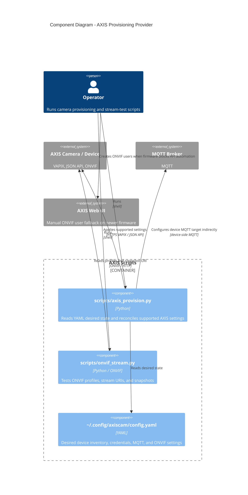
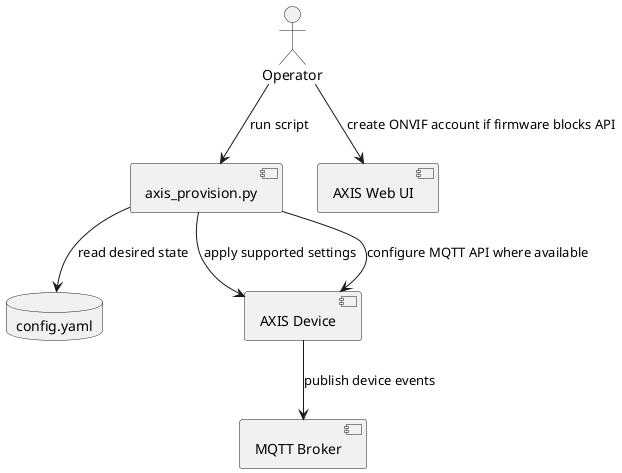
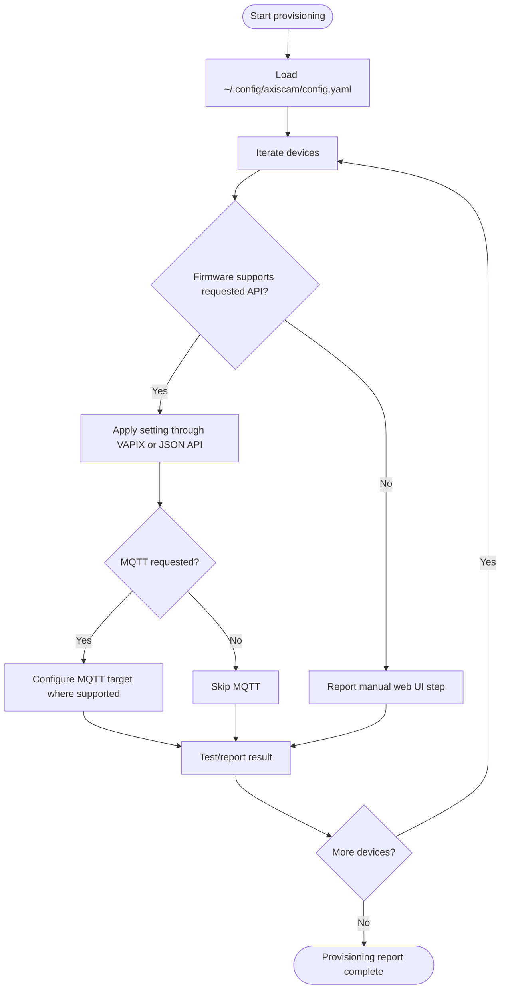

# AXIS Provisioning Provider Architecture

> **See also**: [AXIS Provisioning Guide](../../guides/axis-provisioning.md) | [C4 Architecture](../c4-architecture.md) | [Codebase Map](../codemap.md)

## Scope

The AXIS provider covers helper scripts that provision AXIS cameras and related devices alongside the UniFi tooling. It is script-oriented rather than packaged as a first-class `unifi_mapper` provider module.

Primary responsibilities:

- Read desired camera/device configuration from YAML.
- Reconcile supported AXIS settings through VAPIX and modern JSON APIs.
- Configure MQTT where firmware exposes a supported API.
- Test ONVIF streams and snapshots where credentials are already available.
- Respect firmware limitations where AXIS has removed legacy VAPIX user-management endpoints.

## Component Diagram

## PlantUML Flow

## Runtime Workflow

## Boundary Notes

- AXIS provisioning is intentionally outside the UniFi Network/Protect API clients.
- Newer AXIS OS firmware may require manual ONVIF user creation in the web UI. The script reports this limitation rather than attempting unsupported workarounds.
- MQTT configuration is device-side configuration; this repo does not act as the AXIS event bridge in the same way `protect/mqtt.py` bridges UniFi Protect events.
