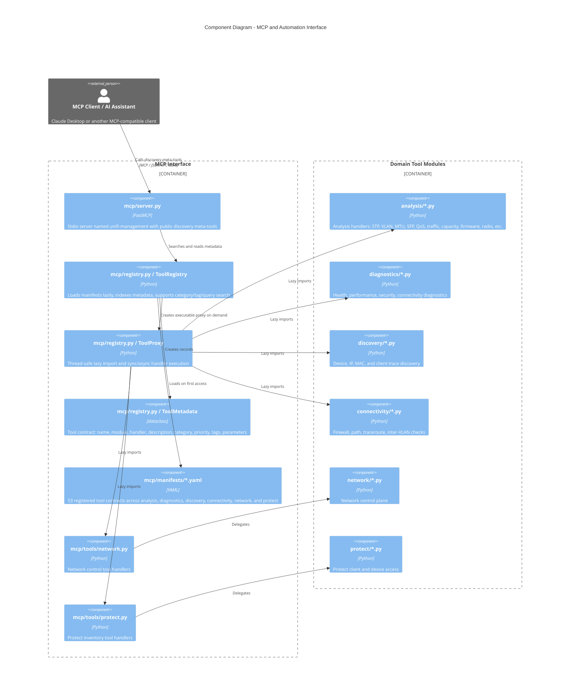
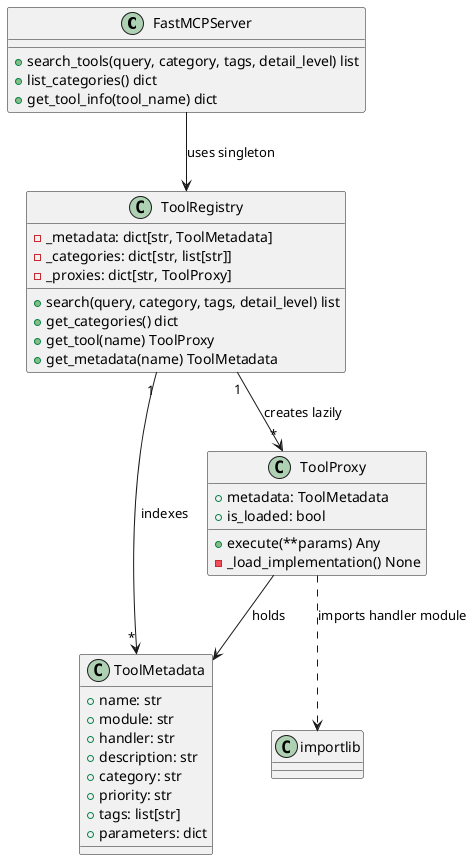
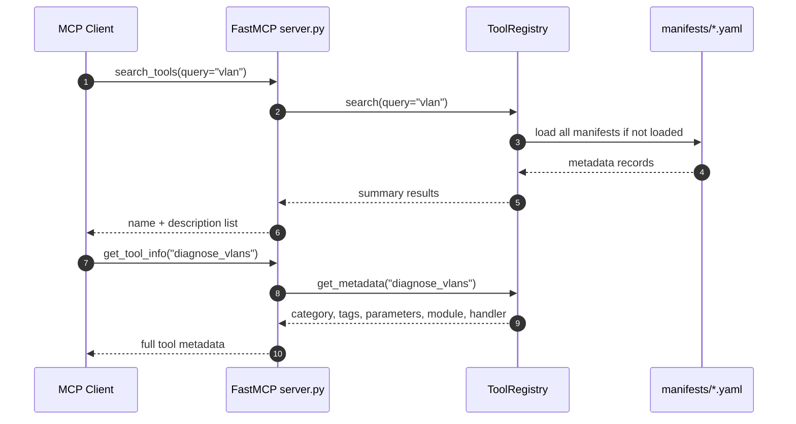
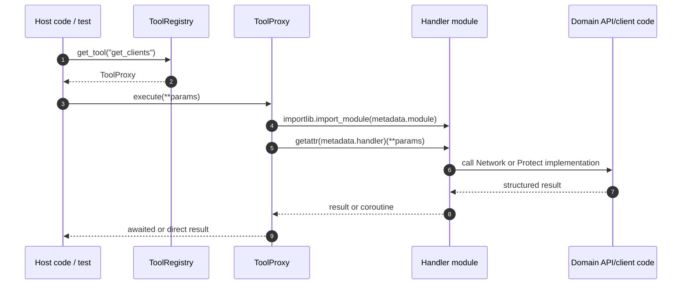

# MCP and Automation Interface Architecture

> **See also**: [C4 Architecture](../c4-architecture.md) | [MCP Server Guide](../../mcp-server/MCP_SERVER_GUIDE.md) | [Implementation Prompt](../../mcp-server/IMPLEMENTATION_PROMPT.md)

## Scope

The MCP interface lives under `src/unifi_mapper/mcp/` and exposes UniFi tooling to MCP-compatible assistants. The current public FastMCP server exposes three discovery meta-tools:

- `search_tools`
- `list_categories`
- `get_tool_info`

The registry also supports executable `ToolProxy` objects through `ToolRegistry.get_tool(name).execute(...)`. That execution path is available to host code/tests, but it is not currently exposed as a public `@mcp.tool()` in `server.py`.

## Component Diagram

## PlantUML Class View

## Tool Catalogue

| Manifest | Category | Registered tools | Examples |
| --- | --- | ---: | --- |
| `analysis.yaml` | analysis | 30 | `discover_stp_topology`, `calculate_optimal_priorities`, `audit_mtu_consistency`, `validate_qos`, `analyze_traffic_matrix` |
| `diagnostics.yaml` | diagnostics | 4 | `network_health_check`, `performance_analysis`, `security_audit`, `connectivity_analysis` |
| `discovery.yaml` | discovery | 4 | `find_device`, `find_ip`, `find_mac`, `client_trace` |
| `connectivity.yaml` | connectivity | 4 | `firewall_check`, `path_analysis`, `check_inter_vlan_routing`, `traceroute` |
| `network.yaml` | network | 6 | `get_firewall_zones`, `get_firewall_policies`, `get_acl_rules`, `get_dns_policies`, `get_clients`, `get_networks` |
| `protect.yaml` | protect | 5 | `get_cameras`, `get_nvr_info`, `get_sensors`, `get_lights`, `get_doorbells` |

Total registered automation tools: **53**.

## Discovery Flow

## Lazy Execution Flow

## Current Implementation Notes

- Public MCP meta-tools are intentionally small and stable: discovery is cheap, and full parameter schema is fetched only when needed.
- YAML manifests are the tool contract. Keep descriptions, tags, and parameters accurate whenever handler signatures change.
- `ToolProxy.execute()` handles both synchronous and asynchronous handlers, which lets Network and Protect wrappers coexist behind the same registry.
- The server entry point is `unifi_mapper.mcp.server:main`, installed as `unifi-mcp` in `pyproject.toml`.
- If public MCP execution is added later, document it as a new server capability rather than implying it already exists.
