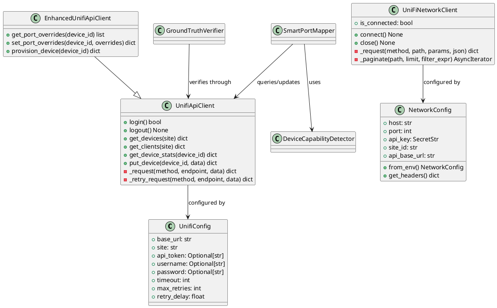
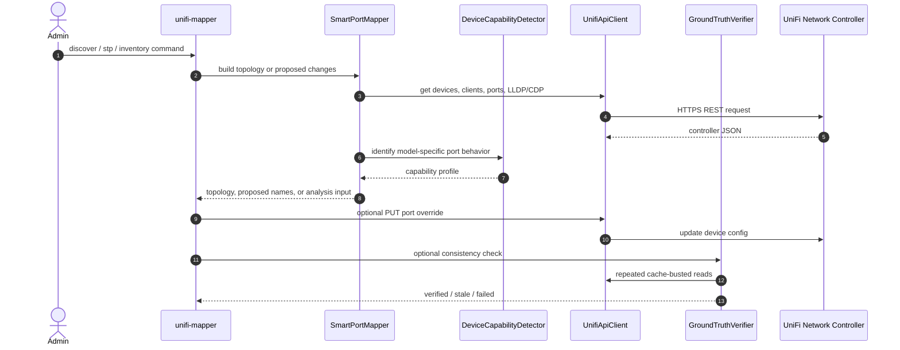

# UniFi Network Provider Architecture

> **See also**: [C4 Architecture](../c4-architecture.md) | [Architecture Overview](../architecture-overview.md) | [Codebase Map](../codemap.md)

## Scope

The UniFi Network provider covers all modules that talk to the UniFi Network controller or reason about Network controller data. It has two client paths:

- `api_client.py` and `enhanced_api_client.py`: synchronous `requests` path used by the original topology and port-mapping workflows.
- `network/client.py`: async `httpx` path for the integrations API under `/proxy/network/integrations/v1`.

Both paths are intentionally present. The synchronous path preserves the mature port-naming workflow and ground-truth verification behavior; the async path gives newer network control modules a typed API-key based client.

## Component Diagram

```mermaid
C4Component
    title Component Diagram - UniFi Network Provider

    Container_Boundary(cli, "Entry Points") {
        Component(typer_cli, "typer_cli.py", "Typer + Rich", "Interactive unifi-mapper commands")
        Component(network_cli, "network_cli.py", "argparse", "Script-friendly network toolkit")
        Component(inventory_cli, "inventory_cli.py", "argparse", "Inventory reports")
        Component(verify_cli, "verify_cli.py", "Python CLI", "Verification workflows")
    }

    Container_Boundary(legacy, "Synchronous Network API Path") {
        Component(config, "config.py / UnifiConfig", "dataclass", "UNIFI_URL, site, token or username/password, retry and timeout settings")
        Component(api_client, "api_client.py / UnifiApiClient", "requests.Session", "UniFi OS and legacy controller REST client with auth negotiation and retry handling")
        Component(enhanced_client, "enhanced_api_client.py", "requests + httpx", "Additional endpoint coverage and provisioning helpers")
        Component(port_mapper, "port_mapper.py", "Python", "LLDP/CDP topology and port connection mapping")
        Component(smart_mapper, "smart_port_mapper.py", "Python", "Device-aware port naming using model capabilities")
        Component(capabilities, "device_capabilities.py", "Python", "Model-specific port/SFP/PoE/uplink capability profiles")
        Component(ground_truth, "ground_truth_verification.py", "Python", "Multi-read verification to work around controller cache behavior")
        Component(topology, "enhanced_network_topology.py", "Graphviz / Mermaid", "PNG, SVG, HTML, and Mermaid topology output")
    }

    Container_Boundary(modern, "Async Network Control Path") {
        Component(network_config, "network/config.py / NetworkConfig", "Pydantic", "UNIFI_NETWORK_* environment config and API-key headers")
        Component(network_client, "network/client.py / UniFiNetworkClient", "httpx.AsyncClient", "Async client for sites, devices, clients, stats, firewall, ACL, DNS, DPI, and networks")
        Component(network_modules, "network/*.py", "Python", "Firewall, ACL, DNS, DPI, client, sites, statistics, traffic matching, and network services")
        Component(analysis, "analysis/*.py", "Python", "STP, VLAN, MTU, SFP, LAG, QoS, capacity, firmware, radio, MAC, and traffic matrix analysis")
        Component(diagnostics, "diagnostics/*.py", "Python", "Network health, performance, security, and connectivity analysis")
        Component(discovery, "discovery/*.py", "Python", "Find device, IP, MAC, and client trace")
        Component(connectivity, "connectivity/*.py", "Python", "Firewall checks, path analysis, traceroute, and inter-VLAN routing checks")
    }

    System_Ext(controller, "UniFi Network Controller", "UniFi OS / Network Application")

    Rel(typer_cli, config, "Loads")
    Rel(typer_cli, smart_mapper, "Runs discovery and update workflows")
    Rel(network_cli, analysis, "Runs analysis")
    Rel(inventory_cli, api_client, "Reads inventory")
    Rel(verify_cli, ground_truth, "Runs verification")
    Rel(smart_mapper, port_mapper, "Extends")
    Rel(smart_mapper, capabilities, "Uses")
    Rel(port_mapper, api_client, "Reads topology and ports")
    Rel(ground_truth, api_client, "Performs repeated reads")
    Rel(topology, port_mapper, "Renders discovered topology")
    Rel(api_client, controller, "REST calls", "HTTPS")
    Rel(enhanced_client, api_client, "Extends")
    Rel(network_modules, network_client, "Calls")
    Rel(analysis, network_client, "Calls where async Network API is used")
    Rel(diagnostics, network_client, "Calls")
    Rel(discovery, network_client, "Calls")
    Rel(connectivity, network_client, "Calls")
    Rel(network_client, network_config, "Configured by")
    Rel(network_client, controller, "Integrations API", "HTTPS + X-API-KEY")
```

## PlantUML Class View

## Runtime Flow

## Configuration Boundary

| Path | Environment variables | Authentication model | Primary use |
| --- | --- | --- | --- |
| `UnifiConfig` | `UNIFI_URL`, `UNIFI_SITE`, `UNIFI_CONSOLE_API_TOKEN`, or username/password | API token preferred; username/password fallback | Port mapping, legacy topology, inventory, verification |
| `NetworkConfig` | `UNIFI_NETWORK_HOST`, `UNIFI_NETWORK_API_KEY`, `UNIFI_NETWORK_SITE_ID` | UniFi Integrations API key | Async Network control modules and MCP network wrappers |

## Current Implementation Notes

- `GroundTruthVerifier` is load-bearing. It exists because Network controller writes can appear successful while subsequent reads still return cached old values.
- `network_topology.py` is a compatibility re-export of `enhanced_network_topology.py`.
- STP-related automation is broad in the current manifest: discovery, optimal priorities, change plans, snapshots, drift, preflight, guard recommendations, and 10G readiness are registered under `analysis.yaml`.
- Keep new controller-specific behavior behind the relevant client/config path rather than mixing auth styles in one module.
