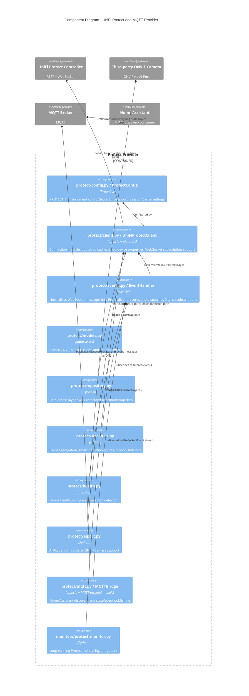
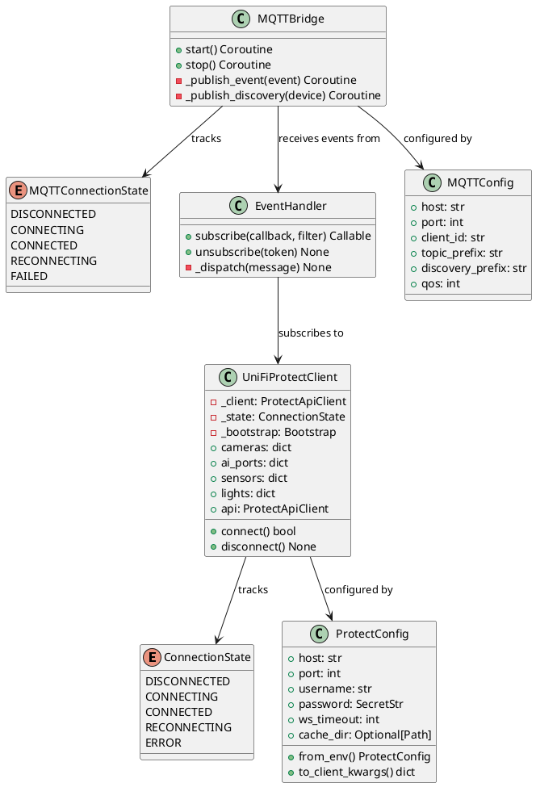
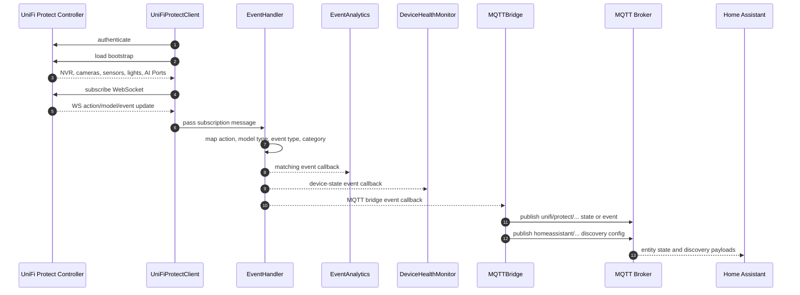

# UniFi Protect and MQTT Provider Architecture

> **See also**: [C4 Architecture](../c4-architecture.md) | [Architecture Overview](../architecture-overview.md) | [Codebase Map](../codemap.md)

## Scope

The Protect provider is separate from the Network provider because UniFi Protect has different authentication, a different API model, and a real-time WebSocket event stream. The implementation lives under `src/unifi_mapper/protect/` with support code in `src/unifi_mapper/monitors/`.

The MQTT bridge turns Protect device state and events into Home Assistant-compatible MQTT discovery and state topics.

## Component Diagram

## PlantUML Class View

## Event Pipeline

## MQTT Topic Responsibilities

| Concept | Implementation | Responsibility |
| --- | --- | --- |
| Connection config | `MQTTConfig` | Broker host/port, credentials, QoS, retain behavior, topic prefixes, reconnect interval, SSL toggle. |
| Publish unit | `MQTTMessage` | Topic, payload, retain flag, QoS, JSON encoding. |
| HA device identity | `DeviceDiscoveryInfo` | Ubiquiti manufacturer metadata, identifiers, model, firmware, parent device. |
| HA entity config | `EntityDiscoveryConfig` | Component type, object ID, state topic, device class, templates, payloads, category, icon, extra config. |
| Bridge lifecycle | `MQTTBridge` | Subscribe to Protect events, publish Home Assistant discovery, publish state/event updates. |

## Current Implementation Notes

- Protect is async-first because real-time updates arrive through WebSocket subscriptions.
- `ProtectConfig` strips protocol prefixes from the host and keeps the password in `SecretStr`.
- `UniFiProtectClient` exposes the underlying `uiprotect` client through `.api` for advanced operations not wrapped by the local abstraction.
- AI Port support is part of the Protect provider, not the Network provider, because the device and smart-detection model belongs to Protect even when the camera is third-party ONVIF.
- The MQTT bridge is a downstream event consumer. It should not own Protect connection logic directly; it receives an already configured `UniFiProtectClient`.
