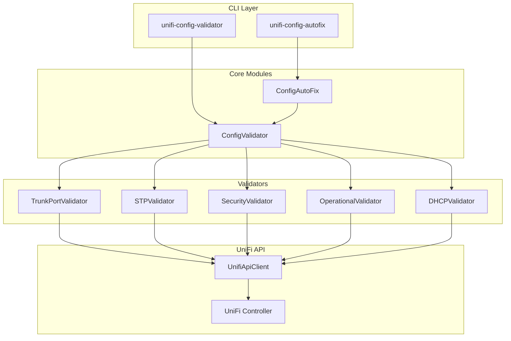
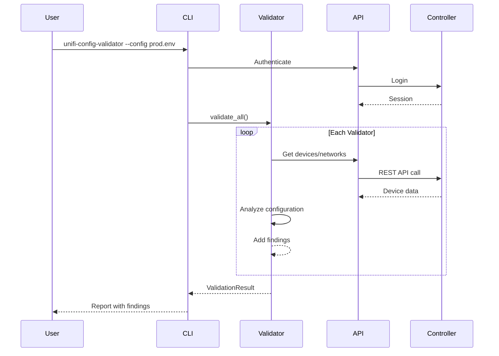
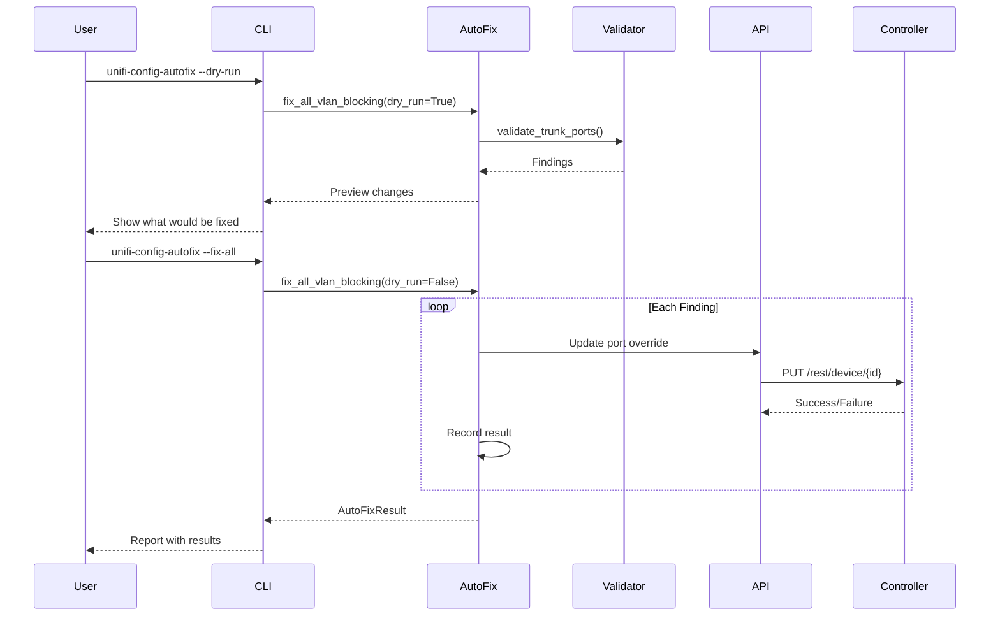
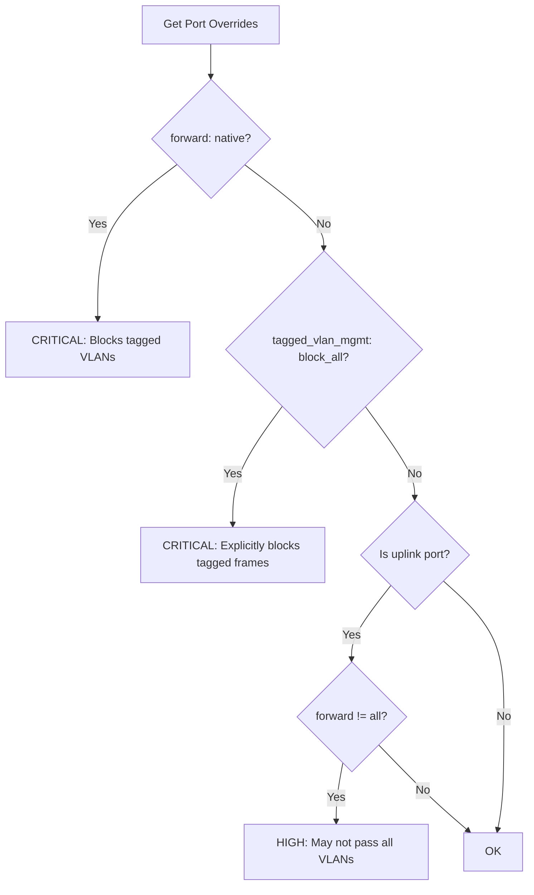
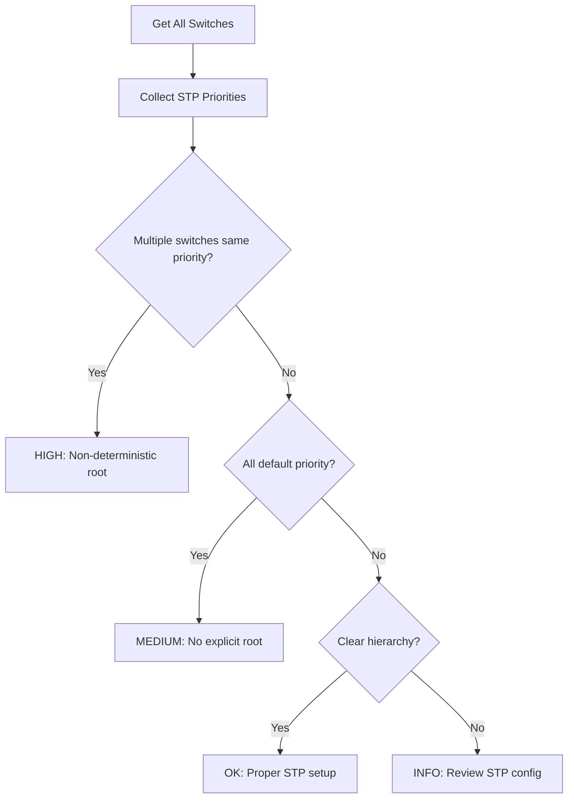

# UniFi Configuration Validation & Auto-Fix

This module provides comprehensive validation of UniFi network configurations against best practices, with automated remediation capabilities for common issues.

## Overview

The configuration validation system was created after discovering that certain UniFi port settings (`forward: native` combined with `tagged_vlan_mgmt: block_all`) silently drop ALL tagged VLAN traffic - a common but hard-to-diagnose misconfiguration that can cause entire VLANs to become unreachable.

## Architecture



## Validation Flow



## Auto-Fix Flow



## Validators

### TrunkPortValidator

Detects VLAN-blocking configurations on trunk/uplink ports:



**Key Issues Detected:**

| Issue | Severity | Description |
|-------|----------|-------------|
| `forward: native` on trunk | CRITICAL | Only passes native VLAN traffic |
| `tagged_vlan_mgmt: block_all` | CRITICAL | Drops ALL 802.1Q tagged frames |
| Uplink not set to `forward: all` | HIGH | May cause VLAN traffic loss |
| Trunk profile missing VLANs | MEDIUM | Some VLANs may not traverse link |

### STPValidator

Ensures deterministic Spanning Tree Protocol failover:



**Recommended STP Priority Hierarchy:**

| Role | Priority | Purpose |
|------|----------|---------|
| Primary Root | 4096 | Core/distribution switch |
| Secondary Root | 8192 | Backup root bridge |
| Access Switches | 32768 | Default, never become root |

### SecurityValidator

Validates security best practices:

- Guest network isolation
- DHCP guard enabled
- IoT network segregation
- Port security configuration

### OperationalValidator

Checks operational best practices:

- Device naming conventions
- Firmware version consistency
- PoE budget utilization
- Port labeling completeness

### DHCPValidator

Validates DHCP configuration:

- Gateway enabled (Option 3)
- DNS servers configured
- Lease time appropriate
- Range doesn't include gateway IP

## Installation

### As a UV Tool (Recommended)

```bash
# Install globally from PyPI (when published)
uv tool install unifi-network-mapper

# Or install from local development
cd /path/to/unifi_port_mapper
uv tool install --editable .

# Commands are now available system-wide
unifi-config-validator --help
unifi-config-autofix --help
```

### Within Project

```bash
# Using uv run
uv run unifi-config-validator --config ~/.config/unifi/prod.env

# Or with pip
pip install -e .
unifi-config-validator --config ~/.config/unifi/prod.env
```

## Usage

### Configuration File

Create a configuration file (e.g., `~/.config/unifi/prod.env`):

```env
UNIFI_URL=https://192.168.1.1
UNIFI_SITE=default
UNIFI_CONSOLE_API_TOKEN=your-api-token
# Or use username/password:
# UNIFI_USERNAME=admin
# UNIFI_PASSWORD=secret
UNIFI_VERIFY_SSL=false
UNIFI_TIMEOUT=30
```

### Validation Commands

```bash
# Full validation
unifi-config-validator -c ~/.config/unifi/prod.env

# Check only trunk/VLAN routing
unifi-config-validator -c ~/.config/unifi/prod.env --check trunk

# Show only critical and high issues
unifi-config-validator -c ~/.config/unifi/prod.env -s critical,high

# Generate markdown report
unifi-config-validator -c ~/.config/unifi/prod.env -o report.md

# JSON output for scripting
unifi-config-validator -c ~/.config/unifi/prod.env -f json

# Verbose output with remediation steps
unifi-config-validator -c ~/.config/unifi/prod.env --verbose
```

### Auto-Fix Commands

```bash
# ALWAYS dry-run first!
unifi-config-autofix -c ~/.config/unifi/prod.env --dry-run

# Fix all VLAN blocking issues
unifi-config-autofix -c ~/.config/unifi/prod.env --fix-all

# Fix only tagged_vlan_mgmt: block_all
unifi-config-autofix -c ~/.config/unifi/prod.env --fix-block-all

# Fix only forward: native issues
unifi-config-autofix -c ~/.config/unifi/prod.env --fix-forward-native

# Fix specific device only
unifi-config-autofix -c ~/.config/unifi/prod.env --fix-all -d "Dream Machine Pro"

# Fix specific ports only
unifi-config-autofix -c ~/.config/unifi/prod.env --fix-all -p 10 -p 11

# Generate rollback script
unifi-config-autofix -c ~/.config/unifi/prod.env --fix-all --rollback-script rollback.sh

# Save detailed report
unifi-config-autofix -c ~/.config/unifi/prod.env --fix-all -o fix-report.md
```

## Example Output

### Validation Report

```
============================================================
UNIFI CONFIGURATION VALIDATION RESULTS
============================================================

Status: ❌ FAILED
Timestamp: 2025-12-27 18:24:06

Checked:
  Devices: 8
  Ports: 64
  Networks: 5

Findings:
  🔴 Critical: 17
  🟠 High: 2
  🟡 Medium: 5
  🔵 Low: 3
  ⚪ Info: 1

🔴 CRITICAL ISSUES (17)
--------------------------------------------------

1. Trunk port blocks tagged VLANs
   Device: Dream Machine Pro Max (Port 10)
   Current: forward: native
   Recommended: forward: all
   Fix: Change port 10 to 'forward: all'
```

### Auto-Fix Report

```
============================================================
UNIFI CONFIG AUTO-FIX RESULTS
============================================================

Mode: LIVE
Status: ✅ ALL SUCCEEDED
Timestamp: 2025-12-27 18:30:00

Fixes:
  ✅ Success: 17
  ❌ Failed: 0
  ⏭️ Skipped: 0

✅ SUCCESS (17)
--------------------------------------------------

1. Dream Machine Pro Max - Port 10
   Issue: Port explicitly blocks all tagged VLANs
   Removed tagged_vlan_mgmt: block_all
   Changed: block_all → (removed)
```

## Programmatic Usage

```python
from unifi_mapper.api_client import UnifiApiClient
from unifi_mapper.config_validation import ConfigValidator, Severity
from unifi_mapper.config_autofix import ConfigAutoFix

# Create client
client = UnifiApiClient(
    base_url="https://192.168.1.1",
    site="default",
    api_token="your-token",
    verify_ssl=False
)
client.login()

# Run validation
validator = ConfigValidator(client)
result = validator.validate_all()

if not result.passed:
    print(f"Found {result.critical_count} critical issues!")

    for finding in result.get_by_severity(Severity.CRITICAL):
        print(f"  - {finding.title}: {finding.device_name}")

# Auto-fix issues
fixer = ConfigAutoFix(client)

# Preview fixes
preview = fixer.fix_all_vlan_blocking(dry_run=True)
print(f"Would fix {len(preview.fixes)} issues")

# Apply fixes
result = fixer.fix_all_vlan_blocking(dry_run=False)
if result.all_succeeded:
    print("All fixes applied successfully!")
```

## Safety Features

1. **Dry-run mode**: Always preview changes before applying
2. **Rollback scripts**: Generate shell scripts to undo changes
3. **Device/port filtering**: Limit fixes to specific targets
4. **Confirmation prompts**: Require explicit confirmation for live changes
5. **Detailed logging**: Full audit trail of all operations

## Common Issues Detected

### The "Silent VLAN Killer" Pattern

This is the exact configuration that causes VLANs to silently fail:

```
port_overrides:
  - port_idx: 10
    forward: native           # ← Only passes native VLAN
    tagged_vlan_mgmt: block_all  # ← Drops ALL tagged frames
```

**Symptoms:**
- Devices on specific VLANs are unreachable
- DHCP works (if on native VLAN) but no routing
- Ping fails from gateway to VLAN devices
- Works fine for native VLAN traffic

**Fix:**
```
port_overrides:
  - port_idx: 10
    forward: all              # ← Pass all VLANs
    # tagged_vlan_mgmt removed (defaults to auto)
```

## See Also

- [VLAN Diagnostics](vlan-diagnostics.md) - Deep VLAN troubleshooting
- [Network Automation](network-automation.md) - Automated network management
- [API Reference](api-reference.md) - Full API documentation
