# UniFi Management CLI: Use Cases and How-To Guide

A practical reference for every major workflow in the UniFi Management CLI platform.

> **See also**: [Architecture Overview](../architecture/architecture-overview.md) | [Codebase Map](../architecture/codemap.md) | [Troubleshooting](../operations/troubleshooting-and-runbook.md) | [AXIS Provisioning](axis-provisioning.md)

---

## Table of Contents

1. [Initial Setup and Configuration](#1-initial-setup-and-configuration)
2. [Network Discovery and Port Mapping](#2-network-discovery-and-port-mapping)
3. [Device Discovery and Search](#3-device-discovery-and-search)
4. [Network Analysis](#4-network-analysis)
5. [STP Optimization](#5-stp-optimization)
6. [Network Health Monitoring](#6-network-health-monitoring)
7. [Device Inventory Management](#7-device-inventory-management)
8. [UniFi Protect Integration](#8-unifi-protect-integration)
9. [MCP Server for AI-Assisted Troubleshooting](#9-mcp-server-for-ai-assisted-troubleshooting)
10. [Ground Truth Verification](#10-ground-truth-verification)
11. [CLI Entry Point Reference](#11-cli-entry-point-reference)
12. [Network Safety Workflows](#12-network-safety-workflows)
13. [Architecture Overview](#13-architecture-overview)

---

## Use Case Diagrams

The following PlantUML diagram shows the actors and primary use cases for the platform:

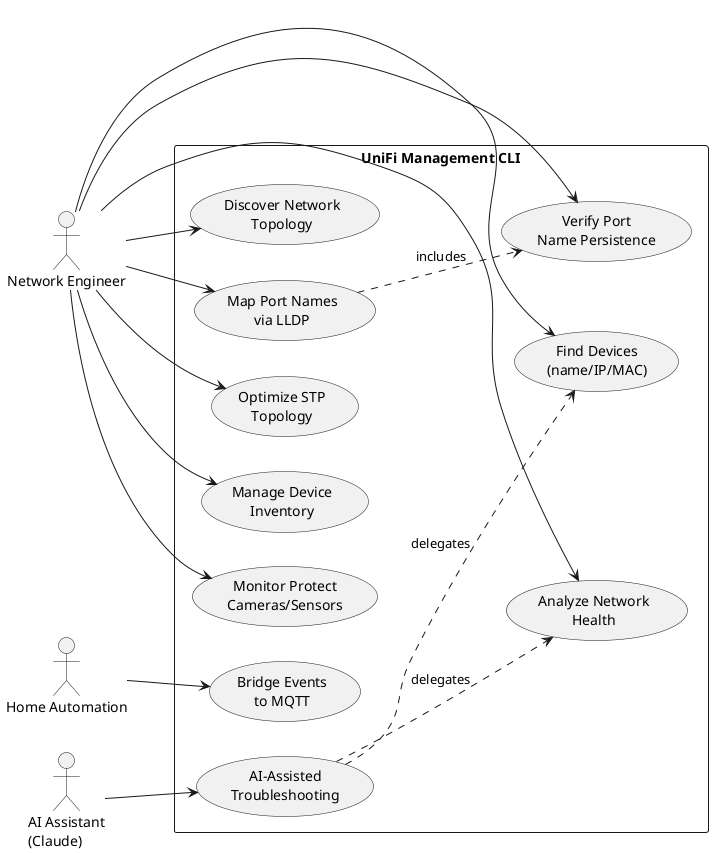
```plantuml
@startuml UniFi Management CLI Use Cases

left to right direction

actor "Network Engineer" as NE
actor "Home Automation" as HA
actor "AI Assistant\n(Claude)" as AI

rectangle "UniFi Management CLI" {
  usecase "Discover Network\nTopology" as UC1
  usecase "Map Port Names\nvia LLDP" as UC2
  usecase "Find Devices\n(name/IP/MAC)" as UC3
  usecase "Analyze Network\nHealth" as UC4
  usecase "Optimize STP\nTopology" as UC5
  usecase "Manage Device\nInventory" as UC6
  usecase "Monitor Protect\nCameras/Sensors" as UC7
  usecase "Bridge Events\nto MQTT" as UC8
  usecase "AI-Assisted\nTroubleshooting" as UC9
  usecase "Verify Port\nName Persistence" as UC10
}

NE --> UC1
NE --> UC2
NE --> UC3
NE --> UC4
NE --> UC5
NE --> UC6
NE --> UC7
NE --> UC10
HA --> UC8
AI --> UC9

UC2 ..> UC10 : includes
UC9 ..> UC3 : delegates
UC9 ..> UC4 : delegates

@enduml
```

---

## 1. Initial Setup and Configuration

### Description

Install the tool, create the XDG-compliant configuration directory, write your controller credentials, and confirm connectivity before running any discovery.

### Prerequisites

- Python 3.12+ with `uv` installed
- Access to a UniFi controller (Network Application or Dream Machine)
- An API token (preferred) or admin username/password
- The controller URL, including port (443 for UniFi OS, 8443 for legacy Network Application)

### Step-by-Step Instructions

**Step 1: Install the package**

```bash
# Clone the repository
git clone <repository-url>
cd unifi_management_cli

# Install with uv
uv sync

# Verify installation
uv run unifi-mapper version
```

**Step 2: Create the configuration directory (XDG standard)**

```bash
mkdir -p ~/.config/unifi_management_cli
```

The tool uses the XDG Base Directory specification. Config file resolution order:

1. `$XDG_CONFIG_HOME/unifi_management_cli/prod.env`
2. `~/.config/unifi_management_cli/prod.env`
3. `~/.config/unifi_management_cli/default.env`
4. `.env` in the current directory (legacy fallback)

**Step 3: Create the configuration file**

```bash
cp .env.example ~/.config/unifi_management_cli/prod.env
```

Edit the file with your controller details:

```bash
# UniFi Controller Connection
UNIFI_URL=https://192.168.1.1          # Controller URL (no trailing slash)
UNIFI_SITE=default                      # Site name (default for most installations)

# Authentication - use API token when possible
UNIFI_CONSOLE_API_TOKEN=your_api_token_here

# Alternative: username/password
# UNIFI_USERNAME=admin
# UNIFI_PASSWORD=your_password

# Connection settings
UNIFI_VERIFY_SSL=false                  # false for self-signed certificates
UNIFI_TIMEOUT=10                        # API timeout in seconds
UNIFI_MAX_RETRIES=3
UNIFI_RETRY_DELAY=1.0

# Output defaults (optional)
UNIFI_DEFAULT_FORMAT=png                # png, svg, html, mermaid, dot
# UNIFI_OUTPUT_DIR=~/Documents/network-reports
# UNIFI_DIAGRAM_DIR=~/Documents/network-diagrams
```

**Step 4: Secure the configuration file**

```bash
chmod 600 ~/.config/unifi_management_cli/prod.env
```

**Step 5: Test connectivity with a dry run**

```bash
uv run unifi-mapper discover --dry-run
```

**Step 6: Install shell completions (optional)**

```bash
# For zsh
uv run unifi-mapper --install-completion

# Or for bash
uv run unifi-mapper install-completions bash
```

### User Flow Diagram

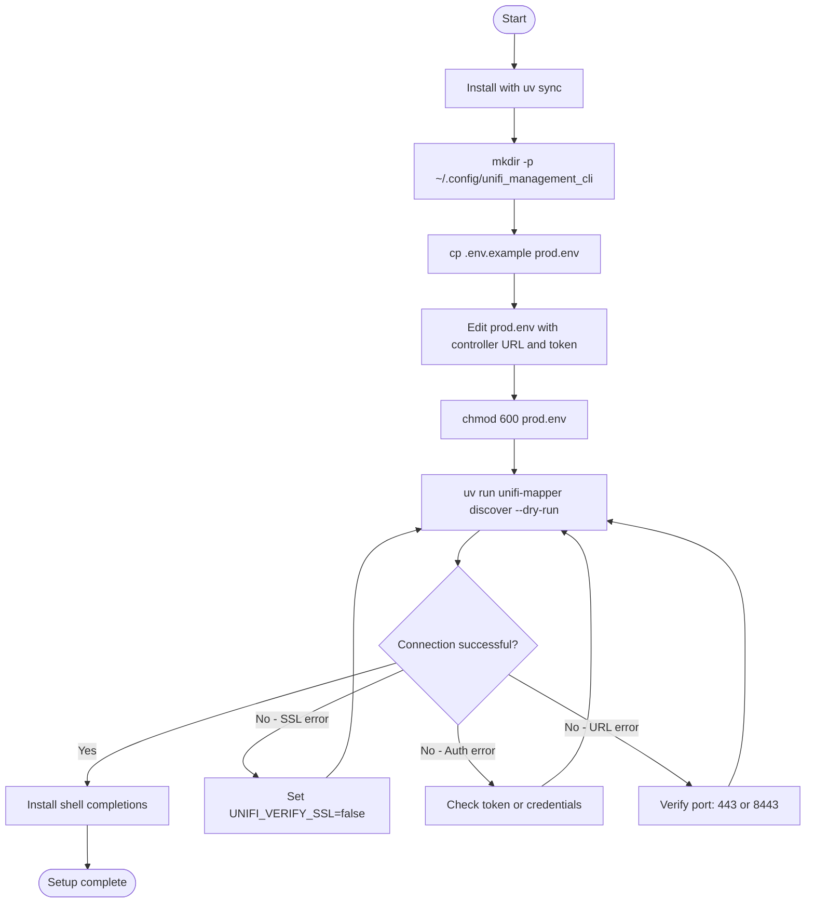
```mermaid
flowchart TD
    A([Start]) --> B[Install with uv sync]
    B --> C[mkdir -p ~/.config/unifi_management_cli]
    C --> D[cp .env.example prod.env]
    D --> E[Edit prod.env with controller URL and token]
    E --> F[chmod 600 prod.env]
    F --> G[uv run unifi-mapper discover --dry-run]
    G --> H{Connection successful?}
    H -->|Yes| I[Install shell completions]
    I --> J([Setup complete])
    H -->|No - SSL error| K[Set UNIFI_VERIFY_SSL=false]
    H -->|No - Auth error| L[Check token or credentials]
    H -->|No - URL error| M[Verify port: 443 or 8443]
    K --> G
    L --> G
    M --> G
```

### Expected Output

```
Config: /home/user/.config/unifi_management_cli/prod.env
Output: /home/user/reports/port_mapping_report.md
Diagram: /home/user/diagrams/network_diagram.png
Dry run mode - no changes will be applied
Discovery completed successfully!
Devices: 12, Connections: 18
```

### Common Issues

| Symptom | Cause | Fix |
|---------|-------|-----|
| `SSL: CERTIFICATE_VERIFY_FAILED` | Self-signed certificate | Set `UNIFI_VERIFY_SSL=false` |
| `Configuration file not found` | Missing prod.env | Run `cp .env.example ~/.config/unifi_management_cli/prod.env` |
| `UNIFI_URL environment variable required` | No config loaded | Check config path with `unifi-mapper --config /path/to/file` |
| `Failed to authenticate` | Wrong credentials or cloud account | Use a local controller account, not a UniFi Cloud SSO account |
| `Connection refused` | Wrong port | Use 443 for UniFi OS / Dream Machine, 8443 for legacy Network Application |

---

## 2. Network Discovery and Port Mapping

### Description

Discover the full network topology using LLDP data, automatically name switch ports after the devices connected to them, generate visual diagrams, and verify that names persist correctly in the controller.

### Prerequisites

- Configuration file with valid credentials (see Section 1)
- LLDP enabled on switches (enabled by default in UniFi)
- Write access to the controller (not needed for dry-run or diagram-only modes)

### Step-by-Step Instructions

**Scenario A: Preview what would change (dry run)**

```bash
uv run unifi-mapper discover --dry-run
```

**Scenario B: Discover topology and apply port names**

```bash
uv run unifi-mapper discover --verify-updates
```

The `--verify-updates` flag uses the SmartPortMapper, which applies LLDP-based naming decisions independently of the API's cached state, then confirms that the names actually persisted. This is the recommended approach.

**Scenario C: Include non-UniFi connected devices**

```bash
uv run unifi-mapper discover --verify-updates --connected-devices
```

**Scenario D: Generate diagram only (no port renaming)**

```bash
# PNG (default)
uv run unifi-mapper diagram --format png --output ~/diagrams/network.png

# SVG (scalable, good for documentation)
uv run unifi-mapper diagram --format svg --output ~/diagrams/network.svg

# Interactive HTML
uv run unifi-mapper diagram --format html --output ~/diagrams/network.html

# Mermaid source (embed in Markdown)
uv run unifi-mapper discover --format mermaid --diagram ~/diagrams/network.md
```

**Scenario E: Override output paths**

```bash
uv run unifi-mapper discover \
  --output ~/reports/site-a-ports.md \
  --diagram ~/diagrams/site-a.png \
  --format png
```

**Scenario F: Using the network toolkit (argparse-based)**

```bash
uv run unifi-network-toolkit discover --verify-updates --connected-devices
uv run unifi-network-toolkit discover --dry-run --format svg --diagram /tmp/network.svg
```

### Sequence Diagram: LLDP Discovery and Port Naming

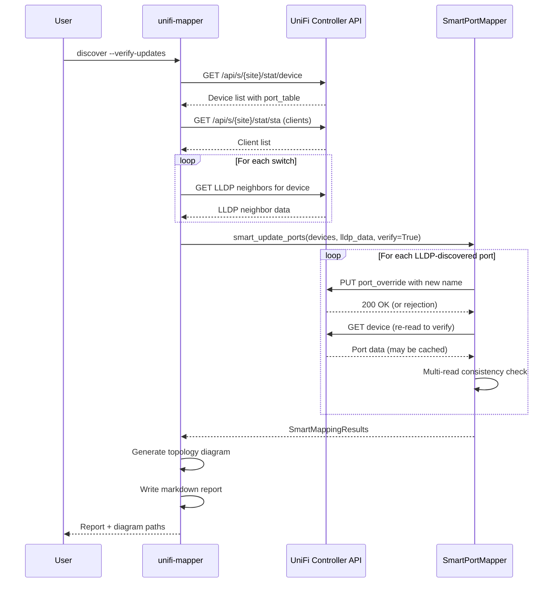
```mermaid
sequenceDiagram
    participant User
    participant CLI as unifi-mapper
    participant API as UniFi Controller API
    participant SPM as SmartPortMapper

    User->>CLI: discover --verify-updates
    CLI->>API: GET /api/s/{site}/stat/device
    API-->>CLI: Device list with port_table
    CLI->>API: GET /api/s/{site}/stat/sta (clients)
    API-->>CLI: Client list
    loop For each switch
        CLI->>API: GET LLDP neighbors for device
        API-->>CLI: LLDP neighbor data
    end
    CLI->>SPM: smart_update_ports(devices, lldp_data, verify=True)
    loop For each LLDP-discovered port
        SPM->>API: PUT port_override with new name
        API-->>SPM: 200 OK (or rejection)
        SPM->>API: GET device (re-read to verify)
        API-->>SPM: Port data (may be cached)
        SPM->>SPM: Multi-read consistency check
    end
    SPM-->>CLI: SmartMappingResults
    CLI->>CLI: Generate topology diagram
    CLI->>CLI: Write markdown report
    CLI-->>User: Report + diagram paths
```

### Expected Output

```
Config: /home/user/.config/unifi_management_cli/prod.env
Output: /home/user/reports/port_mapping_report.md
Diagram: /home/user/diagrams/network_diagram.png
Discovery completed successfully!
Devices: 8, Connections: 14

Smart Port Mapping Report
========================
Ports updated: 12
Ports skipped (already correct): 3
Ports failed (device limitation): 1
Verified: 11/12
```

### Common Issues

| Symptom | Cause | Fix |
|---------|-------|-----|
| Port names revert after update | API cache returns stale data | Use `--verify-updates` flag |
| Device shown with no LLDP | Device type does not support LLDP (e.g., UAP) | Expected - APs do not generate LLDP |
| Port naming rejected by API | Firmware limitation on certain models | Check `unifi-mapper capabilities` for device-specific limits |
| `graphviz` not found | Missing system dependency for PNG/SVG | Install with `brew install graphviz` (macOS) or `apt install graphviz` |

---

## 3. Device Discovery and Search

### Description

Search for any device on the network by name, IP address, or MAC address. Trace the physical path a client takes through the network to its switch port.

### Prerequisites

- Valid configuration
- Devices must be adopted and visible in the controller

### Step-by-Step Instructions

**Find a device by name (partial match)**

```bash
# Using the main CLI
uv run unifi-mapper find device "Office Switch"

# Using the network toolkit (full implementation)
uv run unifi-network-toolkit find device "Office"
uv run unifi-network-toolkit find device "USW-Pro-24"
```

**Find a device by IP address**

```bash
uv run unifi-network-toolkit find ip 192.168.1.100
uv run unifi-network-toolkit find ip 10.0.0.1
```

**Find a device by MAC address**

```bash
uv run unifi-network-toolkit find mac aa:bb:cc:dd:ee:ff
uv run unifi-network-toolkit find mac aabbccddeeff
```

**Use the MCP server for AI-assisted search**

When using Claude with the MCP server configured, you can ask natural-language questions. The underlying tools are:

- `find_device` - search by name, IP, or MAC
- `find_ip` - locate device and switch port by IP
- `find_mac` - trace MAC to physical port
- `client_trace` - end-to-end path from client to uplink

### User Flow Diagram

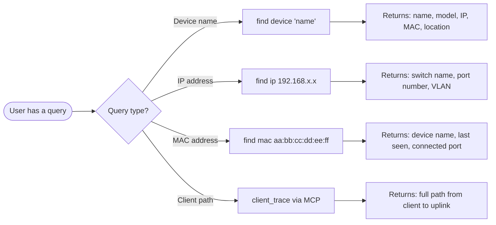
```mermaid
flowchart LR
    A([User has a query]) --> B{Query type?}
    B -->|Device name| C[find device 'name']
    B -->|IP address| D[find ip 192.168.x.x]
    B -->|MAC address| E[find mac aa:bb:cc:dd:ee:ff]
    B -->|Client path| F[client_trace via MCP]
    C --> G[Returns: name, model, IP, MAC, location]
    D --> H[Returns: switch name, port number, VLAN]
    E --> I[Returns: device name, last seen, connected port]
    F --> J[Returns: full path from client to uplink]
```

### Sequence Diagram: IP Address Lookup

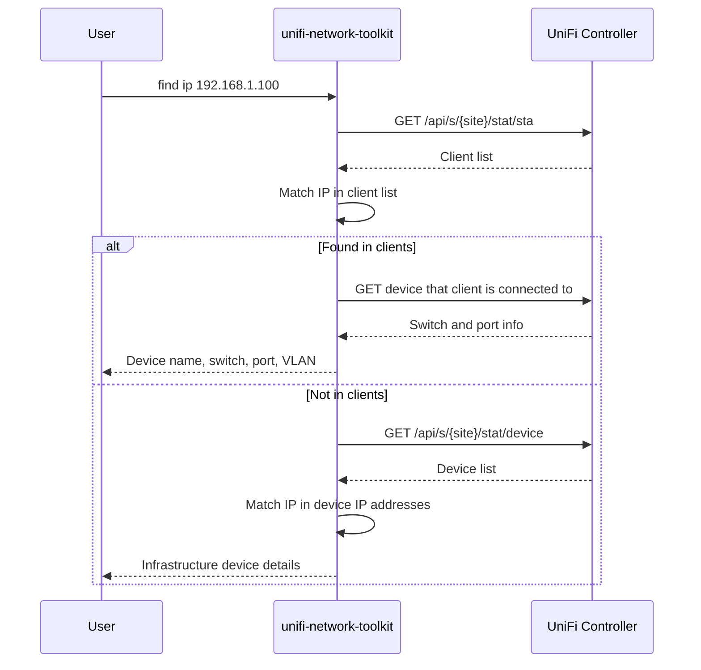
```mermaid
sequenceDiagram
    participant User
    participant CLI as unifi-network-toolkit
    participant API as UniFi Controller

    User->>CLI: find ip 192.168.1.100
    CLI->>API: GET /api/s/{site}/stat/sta
    API-->>CLI: Client list
    CLI->>CLI: Match IP in client list
    alt Found in clients
        CLI->>API: GET device that client is connected to
        API-->>CLI: Switch and port info
        CLI-->>User: Device name, switch, port, VLAN
    else Not in clients
        CLI->>API: GET /api/s/{site}/stat/device
        API-->>CLI: Device list
        CLI->>CLI: Match IP in device IP addresses
        CLI-->>User: Infrastructure device details
    end
```

### Expected Output (find device)

```
Searching for device: Office Switch

Found 1 device(s):

Name:    Office-SW-01
Model:   USW-Pro-24
IP:      192.168.1.10
MAC:     aa:bb:cc:dd:ee:ff
Type:    switch
State:   connected
Uptime:  14 days
```

### Common Issues

| Symptom | Cause | Fix |
|---------|-------|-----|
| No results for known device | Device offline or unadopted | Check controller for device state |
| MAC search returns nothing | MAC not in ARP/client table | Device may not be actively connected |
| Partial name not matching | Case sensitivity | Searches are case-insensitive; try shorter substring |

---

## 4. Network Analysis

### Description

Analyse link quality (errors, drops), assess capacity utilisation, diagnose VLAN configurations, and inspect MAC address tables. All analysis commands use the `unifi-network-toolkit` entry point for full feature access.

### Prerequisites

- Valid configuration
- For link quality analysis: switches must be online and sending port statistics

### Step-by-Step Instructions

**Link quality analysis**

```bash
# All devices
uv run unifi-network-toolkit analyze link-quality

# Specific device
uv run unifi-network-toolkit analyze link-quality --device USW-Pro-24

# Specific port on a device
uv run unifi-network-toolkit analyze link-quality --device USW-Pro-24 --port 1
```

**Capacity planning (utilisation above threshold)**

```bash
# Default 80% threshold
uv run unifi-network-toolkit analyze capacity-planning

# Custom threshold
uv run unifi-network-toolkit analyze capacity-planning --threshold 70.0
```

**VLAN diagnostics**

```bash
# All VLANs
uv run unifi-network-toolkit analyze vlan

# Specific VLAN
uv run unifi-network-toolkit analyze vlan --vlan-id 100
```

**MAC address table analysis**

```bash
# All devices
uv run unifi-network-toolkit analyze mac

# Specific device
uv run unifi-network-toolkit analyze mac --device USW-Pro-24
```

**Using MCP tools for analysis (via AI assistant)**

The following MCP tools are available in the `analysis` category:

| Tool | Purpose |
|------|---------|
| `detect_ip_conflicts` | Find duplicate IP addresses |
| `detect_storms` | Identify broadcast/multicast storms |
| `diagnose_vlans` | VLAN configuration validation |
| `analyze_link_quality` | Port error and drop analysis |
| `get_capacity_report` | Port utilisation forecasting |
| `monitor_lags` | LAG (Link Aggregation Group) health |
| `validate_qos` | QoS rule verification |
| `analyze_mac_table` | MAC flapping detection |
| `get_firmware_report` | Firmware security advisory |

### User Flow Diagram

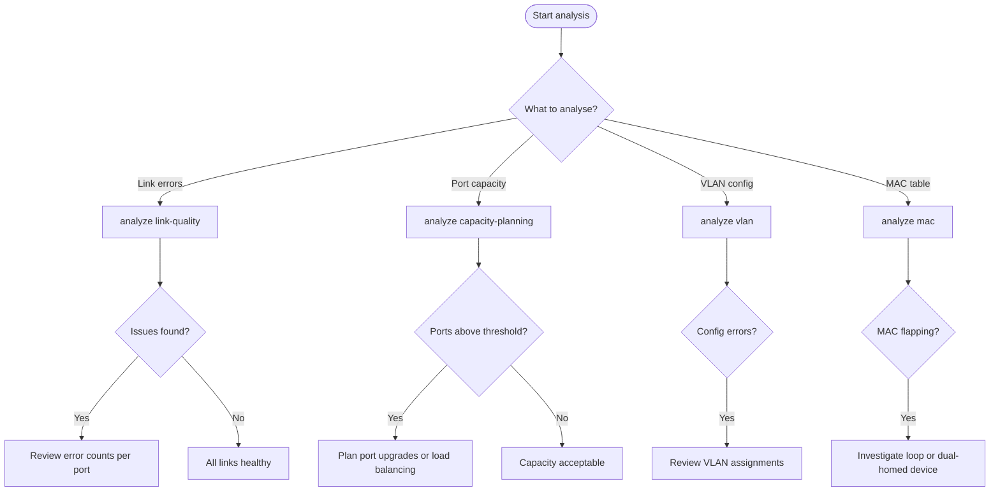
```mermaid
flowchart TD
    A([Start analysis]) --> B{What to analyse?}
    B -->|Link errors| C[analyze link-quality]
    B -->|Port capacity| D[analyze capacity-planning]
    B -->|VLAN config| E[analyze vlan]
    B -->|MAC table| F[analyze mac]
    C --> G{Issues found?}
    D --> H{Ports above threshold?}
    E --> I{Config errors?}
    F --> J{MAC flapping?}
    G -->|Yes| K[Review error counts per port]
    G -->|No| L[All links healthy]
    H -->|Yes| M[Plan port upgrades or load balancing]
    H -->|No| N[Capacity acceptable]
    I -->|Yes| O[Review VLAN assignments]
    J -->|Yes| P[Investigate loop or dual-homed device]
```

### Sequence Diagram: Link Quality Analysis

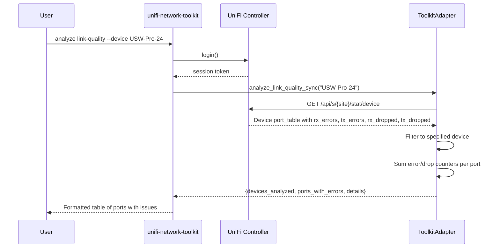
```mermaid
sequenceDiagram
    participant User
    participant CLI as unifi-network-toolkit
    participant API as UniFi Controller
    participant Adapter as ToolkitAdapter

    User->>CLI: analyze link-quality --device USW-Pro-24
    CLI->>API: login()
    API-->>CLI: session token
    CLI->>Adapter: analyze_link_quality_sync("USW-Pro-24")
    Adapter->>API: GET /api/s/{site}/stat/device
    API-->>Adapter: Device port_table with rx_errors, tx_errors, rx_dropped, tx_dropped
    Adapter->>Adapter: Filter to specified device
    Adapter->>Adapter: Sum error/drop counters per port
    Adapter-->>CLI: {devices_analyzed, ports_with_errors, details}
    CLI-->>User: Formatted table of ports with issues
```

### Expected Output (link quality)

```
Link Quality Analysis
=====================
Devices analyzed: 6
Ports with errors: 2

Devices with port issues:
  Office-SW-01:
    Port 3 (NAS-Storage): 147 errors/drops
    Port 12 (Old-Printer): 892 errors/drops

All other devices: no significant port issues
```

### Common Issues

| Symptom | Cause | Fix |
|---------|-------|-----|
| `analysis_type` not recognised | Subcommand syntax error | Check `unifi-network-toolkit analyze --help` |
| No port issues despite known bad link | Error counters not cleared | Counters accumulate since last device reboot; compare over time |
| Device not found for VLAN analysis | Device offline | Confirm device is adopted and online |

---

## 5. STP Optimization

### Description

Analyse the current Spanning Tree Protocol topology, calculate optimal bridge priorities based on network hierarchy (core/distribution/access tiers), preview proposed changes, apply them with confirmation, and generate a markdown report with Mermaid diagrams.

### Prerequisites

- Switches must support STP and be sending LLDP data
- API write access required for `--apply` mode
- Schedule a brief maintenance window: applying STP priority changes may cause sub-second reconvergence events

### Step-by-Step Instructions

**Step 1: Analyse current STP topology**

```bash
uv run unifi-mapper stp analyze
```

To focus on a single switch:

```bash
uv run unifi-mapper stp analyze --device "Core-SW-01"
```

**Step 2: Preview optimal changes (dry run, default)**

```bash
uv run unifi-mapper stp optimize
# Equivalent to:
uv run unifi-mapper stp optimize --dry-run
```

**Step 3: Apply changes (with confirmation prompt)**

```bash
uv run unifi-mapper stp optimize --apply
```

**Step 4: Apply changes without confirmation prompt (automation)**

```bash
uv run unifi-mapper stp optimize --apply --force
```

**Step 5: Generate a markdown report**

```bash
uv run unifi-mapper stp report --output ~/reports/stp-analysis.md
```

The report includes:
- Current topology table with priorities and tiers
- Recommended changes with reasons
- Mermaid diagram of current topology
- Mermaid diagram of optimal topology
- Configuration diff

### Priority Tier Model

The optimizer assigns bridge priorities based on position in the network hierarchy:

| Tier | Name | Priority | Selection Criteria |
|------|------|----------|--------------------|
| 0 | Core | 4096 | Switches directly connected to gateway |
| 1 | Distribution | 8192 | One hop from core switches |
| 2+ | Access | 16384+ | Two or more hops from core |

Lower priority values win the root bridge election. The gateway-connected switch becomes root, with each downstream tier having progressively higher priorities.

### User Flow Diagram

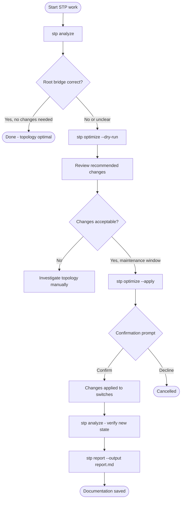
```mermaid
flowchart TD
    A([Start STP work]) --> B[stp analyze]
    B --> C{Root bridge correct?}
    C -->|Yes, no changes needed| D([Done - topology optimal])
    C -->|No or unclear| E[stp optimize --dry-run]
    E --> F[Review recommended changes]
    F --> G{Changes acceptable?}
    G -->|No| H[Investigate topology manually]
    G -->|Yes, maintenance window| I[stp optimize --apply]
    I --> J{Confirmation prompt}
    J -->|Confirm| K[Changes applied to switches]
    J -->|Decline| L([Cancelled])
    K --> M[stp analyze - verify new state]
    M --> N[stp report --output report.md]
    N --> O([Documentation saved])
```

### Sequence Diagram: STP Optimize --apply

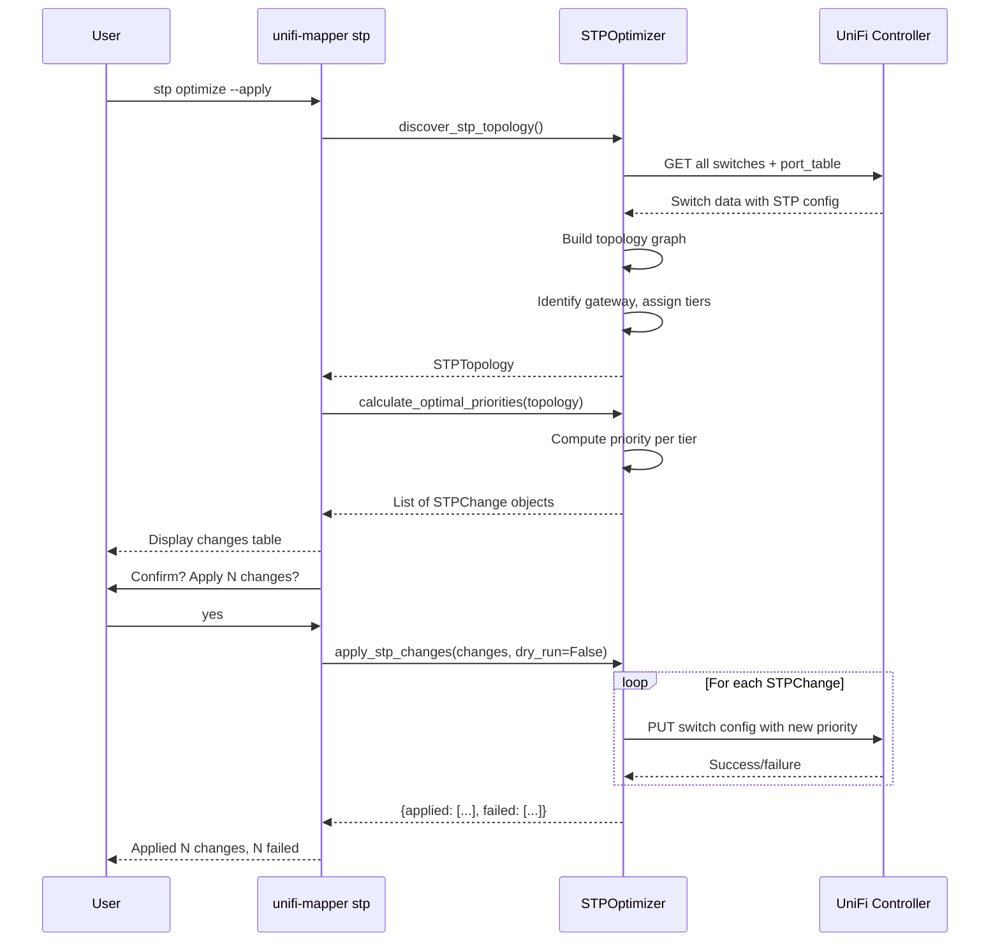
```mermaid
sequenceDiagram
    participant User
    participant CLI as unifi-mapper stp
    participant Optimizer as STPOptimizer
    participant API as UniFi Controller

    User->>CLI: stp optimize --apply
    CLI->>Optimizer: discover_stp_topology()
    Optimizer->>API: GET all switches + port_table
    API-->>Optimizer: Switch data with STP config
    Optimizer->>Optimizer: Build topology graph
    Optimizer->>Optimizer: Identify gateway, assign tiers
    Optimizer-->>CLI: STPTopology

    CLI->>Optimizer: calculate_optimal_priorities(topology)
    Optimizer->>Optimizer: Compute priority per tier
    Optimizer-->>CLI: List of STPChange objects

    CLI-->>User: Display changes table
    CLI->>User: Confirm? Apply N changes?
    User->>CLI: yes

    CLI->>Optimizer: apply_stp_changes(changes, dry_run=False)
    loop For each STPChange
        Optimizer->>API: PUT switch config with new priority
        API-->>Optimizer: Success/failure
    end
    Optimizer-->>CLI: {applied: [...], failed: [...]}
    CLI-->>User: Applied N changes, N failed
```

### Expected Output (stp analyze)

```
STP Topology Analysis

Summary
  Switches: 5
  Root Bridge: Core-SW-01
  Root Priority: 4096
  Blocked Ports: 2

STP Topology
+------------------+----------+--------------+------+---------+
| Switch           | Priority | Tier         | Root | Gateway |
+------------------+----------+--------------+------+---------+
| Core-SW-01       | 4096     | Core         | Yes  | Yes     |
| Dist-SW-01       | 8192     | Distribution |      |         |
| Access-SW-01     | 32768    | Access       |      |         |
| Access-SW-02     | 32768    | Access       |      |         |
| Access-SW-03     | 32768    | Access       |      |         |
+------------------+----------+--------------+------+---------+

Warning: Found 2 blocked port(s) - indicates redundant paths
```

### Common Issues

| Symptom | Cause | Fix |
|---------|-------|-----|
| No switches found | Only APs/gateways on site | Confirm `UNIFI_SITE` matches the correct site |
| Root bridge shows as "Unknown" | Switch not reporting STP info | Check switch firmware; upgrade to Network Application 10.0.162+ |
| Blocked ports count is 0 | No redundant links | Normal for non-redundant topologies |
| Apply fails on specific switch | Model limitation or firmware bug | Apply manually via UniFi controller UI for that switch |

---

## 6. Network Health Monitoring

### Description

Run a comprehensive health check across all infrastructure devices, identify performance bottlenecks, audit security configuration, and diagnose connectivity problems.

### Prerequisites

- Valid configuration
- All target devices must be adopted and online

### Step-by-Step Instructions

**Overall network health check**

```bash
# Summary health report
uv run unifi-network-toolkit diagnose network-health

# With detailed per-device analysis
uv run unifi-network-toolkit diagnose network-health --detailed
```

**Performance analysis**

```bash
# All devices
uv run unifi-network-toolkit diagnose performance

# Focus on specific device
uv run unifi-network-toolkit diagnose performance --device Core-SW-01
```

**Using MCP tools for diagnostics (via AI)**

| Tool | Purpose |
|------|---------|
| `network_health_check` | Infrastructure health overview |
| `performance_analysis` | Bottleneck identification |
| `security_audit` | Security configuration review |
| `connectivity_analysis` | Connection troubleshooting |

**Connectivity tools (firewall and path analysis)**

Via the MCP server:

| Tool | Parameters | Purpose |
|------|-----------|---------|
| `firewall_check` | source, destination, port | Verify rules affecting traffic |
| `path_analysis` | source, destination | Layer-3 path between two endpoints |
| `traceroute` | destination, max_hops | Hop-by-hop path trace |

### User Flow Diagram

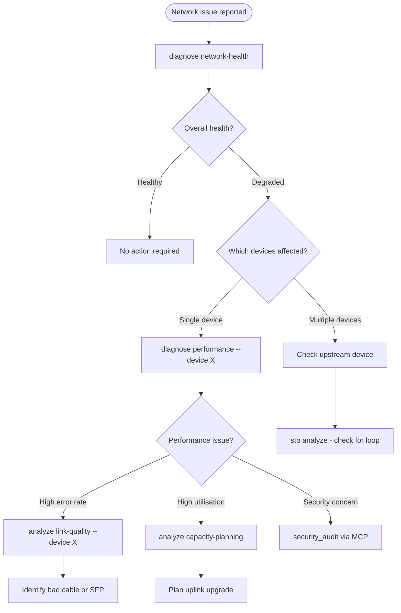
```mermaid
flowchart TD
    A([Network issue reported]) --> B[diagnose network-health]
    B --> C{Overall health?}
    C -->|Healthy| D[No action required]
    C -->|Degraded| E{Which devices affected?}
    E -->|Single device| F[diagnose performance --device X]
    E -->|Multiple devices| G[Check upstream device]
    F --> H{Performance issue?}
    H -->|High error rate| I[analyze link-quality --device X]
    H -->|High utilisation| J[analyze capacity-planning]
    H -->|Security concern| K[security_audit via MCP]
    G --> L[stp analyze - check for loop]
    I --> M[Identify bad cable or SFP]
    J --> N[Plan uplink upgrade]
```

### Sequence Diagram: Network Health Check

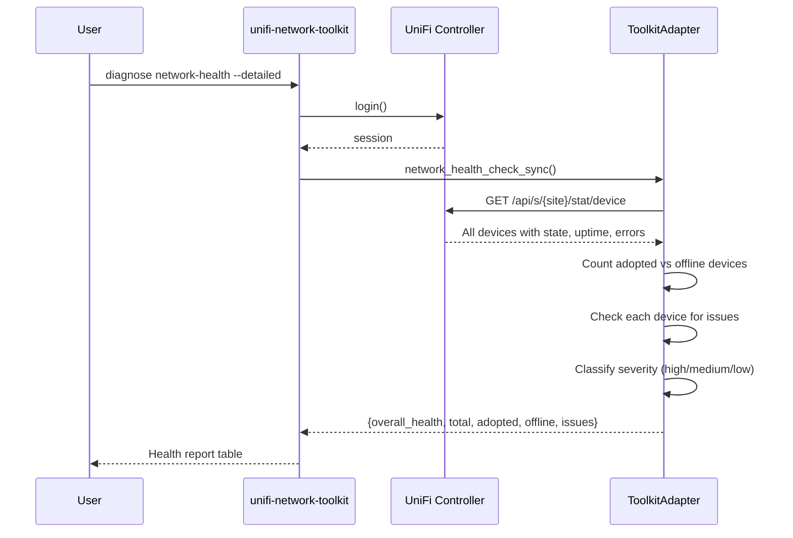
```mermaid
sequenceDiagram
    participant User
    participant CLI as unifi-network-toolkit
    participant API as UniFi Controller
    participant Adapter as ToolkitAdapter

    User->>CLI: diagnose network-health --detailed
    CLI->>API: login()
    API-->>CLI: session
    CLI->>Adapter: network_health_check_sync()
    Adapter->>API: GET /api/s/{site}/stat/device
    API-->>Adapter: All devices with state, uptime, errors
    Adapter->>Adapter: Count adopted vs offline devices
    Adapter->>Adapter: Check each device for issues
    Adapter->>Adapter: Classify severity (high/medium/low)
    Adapter-->>CLI: {overall_health, total, adopted, offline, issues}
    CLI-->>User: Health report table
```

### Expected Output (network health)

```
Network Health Report
=====================
Overall Status: DEGRADED
Total devices:    14
Adopted devices:  13
Offline devices:  1

Issues found:
  [HIGH]   Access-SW-03: device offline (last seen 2h ago)
  [MEDIUM] Access-SW-01: 892 port errors on Port 12
  [LOW]    UAP-LR-01: firmware update available
```

### Common Issues

| Symptom | Cause | Fix |
|---------|-------|-----|
| Health check shows all offline | Authentication failure | Re-check API token or credentials |
| Performance shows no bottlenecks | Data not current | Device statistics update on a 30-60s interval |
| Security audit returns empty | Permissions issue | Ensure API token has read access to firewall rules |

---

## 7. Device Inventory Management

### Description

List all UniFi devices categorised by type, check firmware versions across the fleet, identify devices that have updates available, and trigger firmware upgrades.

### Prerequisites

- Valid configuration
- For firmware updates: devices must be adopted and online; plan a maintenance window

### Step-by-Step Instructions

**List all devices**

```bash
uv run unifi-mapper inventory list
```

**Filter to specific device types**

```bash
# Switches only
uv run unifi-mapper inventory list --filter switch

# Access points only
uv run unifi-mapper inventory list --filter ap

# Multiple types
uv run unifi-mapper inventory list --filter switch,ap

# Firewalls/gateways only
uv run unifi-mapper inventory list --filter firewall
```

**Show firmware upgrade availability**

```bash
uv run unifi-mapper inventory list --filter all --show-upgrade
```

**Check which devices have updates available**

```bash
uv run unifi-mapper inventory check-updates

# Filter to switches only
uv run unifi-mapper inventory check-updates --filter switch
```

**Preview firmware updates (dry run)**

```bash
uv run unifi-mapper inventory update-firmware --filter switch --dry-run
```

**Apply firmware updates**

```bash
# Update all switches (interactive confirmation)
uv run unifi-mapper inventory update-firmware --filter switch

# Update all devices - use with caution
uv run unifi-mapper inventory update-firmware --filter all

# Skip confirmation, custom delay between devices
uv run unifi-mapper inventory update-firmware --filter switch --force --delay 60

# Do not wait between updates (not recommended for large fleets)
uv run unifi-mapper inventory update-firmware --filter switch --no-wait
```

**Save inventory to a markdown report**

```bash
uv run unifi-mapper inventory list --output ~/reports/inventory-$(date +%Y%m%d).md
```

### User Flow Diagram

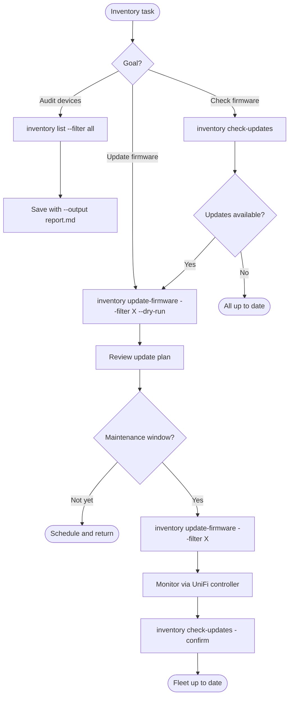
```mermaid
flowchart TD
    A([Inventory task]) --> B{Goal?}
    B -->|Audit devices| C[inventory list --filter all]
    B -->|Check firmware| D[inventory check-updates]
    B -->|Update firmware| E[inventory update-firmware --filter X --dry-run]
    C --> F[Save with --output report.md]
    D --> G{Updates available?}
    G -->|No| H([All up to date])
    G -->|Yes| E
    E --> I[Review update plan]
    I --> J{Maintenance window?}
    J -->|Not yet| K([Schedule and return])
    J -->|Yes| L[inventory update-firmware --filter X]
    L --> M[Monitor via UniFi controller]
    M --> N[inventory check-updates - confirm]
    N --> O([Fleet up to date])
```

### Expected Output (inventory list with upgrade)

```
 UniFi Network Inventory
 Controller: https://192.168.1.1
 Site: default
 Generated: 2026-04-06 10:30:00

Device Summary:
  Firewalls/Routers: 1
  Switches:          5
  Access Points:     8
  Other:             0
  Total:             14

Switches
+------------------+--------------+------------+---------------+------------------+
| Name             | Model        | Firmware   | IP            | Upgrade Available|
+------------------+--------------+------------+---------------+------------------+
| Core-SW-01       | USW-Pro-24   | 6.6.57     | 192.168.1.2   | 6.6.72          |
| Access-SW-01     | USW-Lite-8   | 6.5.32     | 192.168.1.3   | --               |
+------------------+--------------+------------+---------------+------------------+

Warning: 1 device(s) have firmware updates available
Run 'unifi-mapper inventory update-firmware' to upgrade devices
```

### Common Issues

| Symptom | Cause | Fix |
|---------|-------|-----|
| `update-firmware` fails for all devices | API endpoint changed | Upgrade UniFi Network Application to 10.0.162+ |
| Device shows `Upgrade Available` but upgrade fails | Device offline or busy | Wait for device to finish any ongoing operation |
| `--filter` not recognised | Wrong type alias | Use: `all`, `switch`, `ap`, `firewall`, `other` |

---

## 8. UniFi Protect Integration

### Description

Connect to a UniFi Protect controller, enumerate cameras and devices, subscribe to real-time events, bridge events to MQTT for Home Assistant, and manage AI Port subscriptions for third-party cameras.

### Prerequisites

- UniFi Protect controller (Dream Machine Pro, NVR, etc.)
- Local controller account credentials (Protect does not support API tokens)
- For MQTT bridge: a running MQTT broker (e.g., Mosquitto)
- Python `aiomqtt` package for MQTT bridge: `uv add aiomqtt`

### Step-by-Step Instructions

**Scenario A: List cameras programmatically**

```python
import asyncio
from unifi_mapper.protect import ProtectConfig, UniFiProtectClient

config = ProtectConfig(
    host="192.168.1.1",
    username="admin",
    password="your_password",
    verify_ssl=False,
)

async def list_cameras():
    async with UniFiProtectClient(config) as client:
        print(f"NVR: {client.nvr.name}")
        print(f"Cameras: {len(client.cameras)}")
        for camera_id, camera in client.cameras.items():
            print(f"  {camera.name}: {camera.state}")

asyncio.run(list_cameras())
```

**Scenario B: List all Protect devices**

```python
async def list_all_devices():
    async with UniFiProtectClient(config) as client:
        print(f"Cameras:   {len(client.cameras)}")
        print(f"AI Ports:  {len(client.ai_ports)}")
        print(f"Sensors:   {len(client.sensors)}")
        print(f"Lights:    {len(client.lights)}")
        print(f"Chimes:    {len(client.chimes)}")
        print(f"Doorlocks: {len(client.doorlocks)}")
```

**Scenario C: Find third-party cameras and their AI Ports**

```python
async def check_third_party():
    async with UniFiProtectClient(config) as client:
        third_party = client.get_third_party_cameras()
        for camera in third_party:
            print(f"Third-party camera: {camera.name}")
            ai_port_id = getattr(camera, 'aiport_id', None)
            if ai_port_id:
                ai_port = client.get_ai_port(ai_port_id)
                print(f"  Paired AI Port: {ai_port.name if ai_port else 'not found'}")
```

**Scenario D: Start the MQTT bridge for Home Assistant**

```python
import asyncio
from unifi_mapper.protect import ProtectConfig, UniFiProtectClient, MQTTBridge, MQTTConfig

protect_config = ProtectConfig(
    host="192.168.1.1",
    username="admin",
    password="your_password",
    verify_ssl=False,
)

mqtt_config = MQTTConfig(
    host="192.168.1.100",       # MQTT broker IP
    port=1883,
    topic_prefix="unifi/protect",
    discovery_prefix="homeassistant",  # HA MQTT discovery prefix
    retain_state=True,
    qos=1,
)

async def run_bridge():
    async with UniFiProtectClient(protect_config) as client:
        bridge = MQTTBridge(client, mqtt_config)
        await bridge.start()
        print("MQTT bridge running. Press Ctrl+C to stop.")
        try:
            await asyncio.sleep(float('inf'))  # Run until interrupted
        except asyncio.CancelledError:
            pass
        finally:
            await bridge.stop()

asyncio.run(run_bridge())
```

**MQTT topic structure published by the bridge:**

| Topic Pattern | Content | Retained |
|---------------|---------|----------|
| `unifi/protect/event/{device_id}/{event_type}` | Full event JSON | No |
| `unifi/protect/state/{device_id}/motion` | ON / OFF | Yes |
| `unifi/protect/state/{device_id}/connectivity` | ON / OFF | Yes |
| `unifi/protect/state/{device_id}/smart_detect/{type}` | ON (momentary) | No |
| `unifi/protect/state/{device_id}/sensor` | ON / OFF | Yes |
| `unifi/protect/status` | online / offline | Yes |
| `homeassistant/binary_sensor/{object_id}/config` | HA discovery JSON | Yes |

Smart detection types: `person`, `vehicle`, `package`, `animal`, `face`, `licensePlate`

**Scenario E: Using the MCP server for Protect queries**

When the MCP server is running and connected to Claude Desktop, the protect tools are available:

| Tool | Description |
|------|-------------|
| `get_cameras` | List all cameras with status |
| `get_nvr_info` | NVR storage and health status |
| `get_sensors` | Door/window sensor states |
| `get_lights` | Smart light status |
| `get_doorbells` | Doorbell status and ring events |

### Sequence Diagram: MQTT Bridge Startup

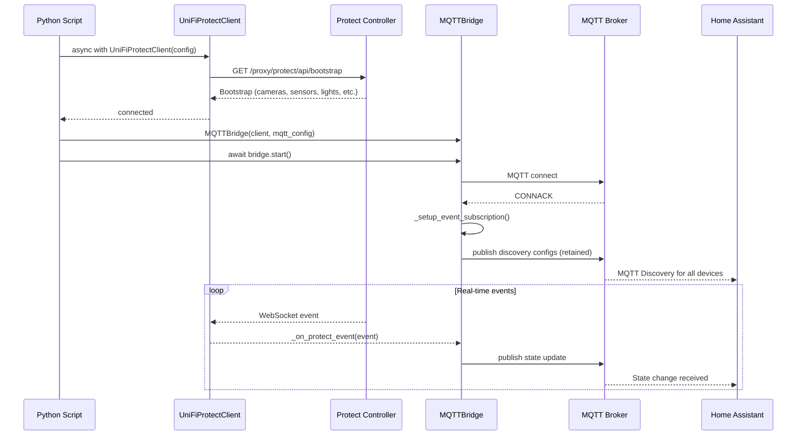
```mermaid
sequenceDiagram
    participant Script as Python Script
    participant Client as UniFiProtectClient
    participant Protect as Protect Controller
    participant Bridge as MQTTBridge
    participant Broker as MQTT Broker
    participant HA as Home Assistant

    Script->>Client: async with UniFiProtectClient(config)
    Client->>Protect: GET /proxy/protect/api/bootstrap
    Protect-->>Client: Bootstrap (cameras, sensors, lights, etc.)
    Client-->>Script: connected

    Script->>Bridge: MQTTBridge(client, mqtt_config)
    Script->>Bridge: await bridge.start()
    Bridge->>Broker: MQTT connect
    Broker-->>Bridge: CONNACK
    Bridge->>Bridge: _setup_event_subscription()
    Bridge->>Broker: publish discovery configs (retained)
    Broker-->>HA: MQTT Discovery for all devices

    loop Real-time events
        Protect-->>Client: WebSocket event
        Client-->>Bridge: _on_protect_event(event)
        Bridge->>Broker: publish state update
        Broker-->>HA: State change received
    end
```

### Expected MQTT Output (Home Assistant integration)

After the bridge starts, Home Assistant automatically creates entities based on MQTT Discovery:

```
# Motion sensor (camera)
binary_sensor.front_door_camera_motion

# Connectivity (diagnostic entity)
binary_sensor.front_door_camera_connectivity

# Smart detection
binary_sensor.front_door_camera_person_detected
binary_sensor.front_door_camera_vehicle_detected

# Door sensor
binary_sensor.back_door_sensor
binary_sensor.back_door_sensor_motion

# Battery (diagnostic)
sensor.back_door_sensor_battery
```

### Common Issues

| Symptom | Cause | Fix |
|---------|-------|-----|
| `AuthenticationError` | Cloud SSO account used | Create a local controller account (System > Administrators) |
| `ConnectionError` on connect | Protect not reachable | Verify host IP and that Protect is active on the NVR |
| MQTT bridge `ImportError` | `aiomqtt` not installed | Run `uv add aiomqtt` |
| HA entities not appearing | Wrong discovery prefix | Ensure `discovery_prefix` matches HA's MQTT integration prefix (default: `homeassistant`) |
| Smart detection events missing | Third-party camera not paired to AI Port | Configure AI Port pairing in Protect UI |

---

## 9. MCP Server for AI-Assisted Troubleshooting

### Description

The MCP (Model Context Protocol) server exposes 36 network tools to AI assistants. When connected to Claude Desktop, you can ask natural-language questions about your network and Claude will call the appropriate tools automatically. The server uses a tool discovery pattern: the AI calls `search_tools` first, then calls specific tools as needed.

### Prerequisites

- UniFi Management CLI installed
- Claude Desktop (or another MCP-compatible AI client)
- Controller credentials configured as environment variables or in a config file

### Step-by-Step Instructions

**Step 1: Start the MCP server manually (for testing)**

```bash
# Using uvx (recommended, no installation required)
uvx --from . unifi-mcp

# Or if installed as a uv tool
uv tool install .
unifi-mcp
```

**Step 2: Configure Claude Desktop**

Add the following to `~/Library/Application Support/Claude/claude_desktop_config.json` (macOS):

```json
{
  "mcpServers": {
    "unifi-management": {
      "command": "uvx",
      "args": ["--from", "/path/to/unifi_management_cli", "unifi-mcp"],
      "env": {
        "UNIFI_URL": "https://192.168.1.1",
        "UNIFI_SITE": "default",
        "UNIFI_CONSOLE_API_TOKEN": "your_api_token",
        "UNIFI_VERIFY_SSL": "false",
        "PROTECT_HOST": "192.168.1.1",
        "PROTECT_USERNAME": "admin",
        "PROTECT_PASSWORD": "your_password"
      }
    }
  }
}
```

**Step 3: Restart Claude Desktop and verify the server is connected**

Look for the hammer icon in Claude Desktop, which indicates MCP tools are available.

**Step 4: Example AI queries and the tools they invoke**

| Natural language query | Tool(s) invoked |
|------------------------|-----------------|
| "Check the health of my network" | `network_health_check` |
| "Find the device at 192.168.1.50" | `find_ip` |
| "What cameras do I have?" | `get_cameras` |
| "Are there any IP address conflicts?" | `detect_ip_conflicts` |
| "Show me the STP topology" | `discover_stp_topology` |
| "Which switches need firmware updates?" | `get_firmware_report` |
| "Is there a broadcast storm?" | `detect_storms` |
| "Trace where client aa:bb:cc is connected" | `client_trace` |
| "Check firewall rules between 10.0.0.1 and 192.168.1.1" | `firewall_check` |
| "What VLANs exist and are they configured correctly?" | `get_networks`, `diagnose_vlans` |

**Step 5: Tool discovery pattern (how the AI navigates tools)**

```
search_tools(query="ip conflict")
→ returns: [detect_ip_conflicts, find_ip, firewall_check, ...]

get_tool_info("detect_ip_conflicts")
→ returns: {description, parameters, category, tags}

detect_ip_conflicts()
→ returns: conflict report
```

**The three meta-tools always available:**

| Tool | Purpose |
|------|---------|
| `search_tools` | Find tools by query, category, or tags |
| `list_categories` | Get all categories and their tool names |
| `get_tool_info` | Get full parameter details for a specific tool |

### Tool Categories Reference (53 registered automation tools)

| Category | Count | Tools |
|----------|-------|-------|
| analysis | 30 | STP, VLAN, MTU, SFP, radio, traffic matrix, LAG, QoS, capacity, firmware, IP conflicts, storm detection, MAC table, change-plan, snapshot, drift, guard, preflight, and 10G validation tools |
| diagnostics | 4 | `network_health_check`, `performance_analysis`, `security_audit`, `connectivity_analysis` |
| discovery | 4 | `find_device`, `find_ip`, `find_mac`, `client_trace` |
| connectivity | 4 | `firewall_check`, `path_analysis`, `check_inter_vlan_routing`, `traceroute` |
| network | 6 | `get_firewall_zones`, `get_firewall_policies`, `get_acl_rules`, `get_dns_policies`, `get_clients`, `get_networks` |
| protect | 5 | `get_cameras`, `get_nvr_info`, `get_sensors`, `get_lights`, `get_doorbells` |

Plus 3 meta-tools: `search_tools`, `list_categories`, `get_tool_info`.

### Sequence Diagram: AI-Assisted Troubleshooting

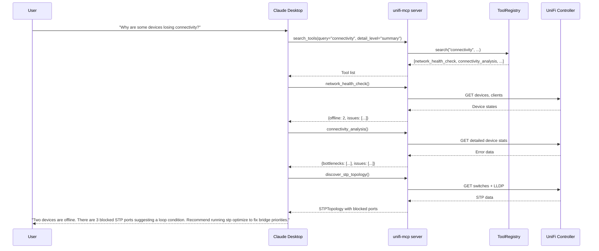
```mermaid
sequenceDiagram
    participant User
    participant Claude as Claude Desktop
    participant MCP as unifi-mcp server
    participant Registry as ToolRegistry
    participant API as UniFi Controller

    User->>Claude: "Why are some devices losing connectivity?"
    Claude->>MCP: search_tools(query="connectivity", detail_level="summary")
    MCP->>Registry: search("connectivity", ...)
    Registry-->>MCP: [network_health_check, connectivity_analysis, ...]
    MCP-->>Claude: Tool list

    Claude->>MCP: network_health_check()
    MCP->>API: GET devices, clients
    API-->>MCP: Device states
    MCP-->>Claude: {offline: 2, issues: [...]}

    Claude->>MCP: connectivity_analysis()
    MCP->>API: GET detailed device stats
    API-->>MCP: Error data
    MCP-->>Claude: {bottlenecks: [...], issues: [...]}

    Claude->>MCP: discover_stp_topology()
    MCP->>API: GET switches + LLDP
    API-->>MCP: STP data
    MCP-->>Claude: STPTopology with blocked ports

    Claude-->>User: "Two devices are offline. There are 3 blocked STP ports suggesting a loop condition. Recommend running stp optimize to fix bridge priorities."
```

### User Flow Diagram: MCP Tool Discovery

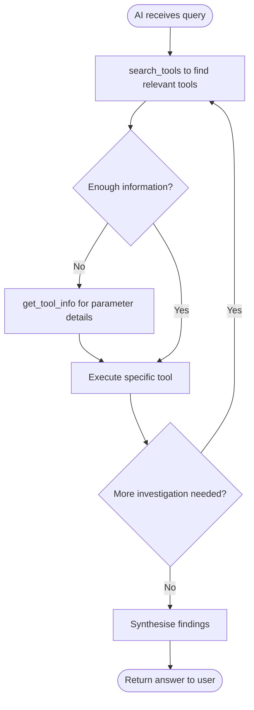
```mermaid
flowchart TD
    A([AI receives query]) --> B[search_tools to find relevant tools]
    B --> C{Enough information?}
    C -->|No| D[get_tool_info for parameter details]
    D --> E[Execute specific tool]
    C -->|Yes| E
    E --> F{More investigation needed?}
    F -->|Yes| B
    F -->|No| G[Synthesise findings]
    G --> H([Return answer to user])
```

### Common Issues

| Symptom | Cause | Fix |
|---------|-------|-----|
| MCP server not visible in Claude | Config file path wrong | Verify `claude_desktop_config.json` path and syntax |
| Tools return empty results | Controller not reachable from server process | Check `UNIFI_URL` and network access from the shell where uvx runs |
| `uvx` not found | uv not installed | Install uv: `curl -LsSf https://astral.sh/uv/install.sh | sh` |
| Protect tools return errors | `PROTECT_HOST` not set | Add protect environment variables to the MCP server config |

---

## 10. Ground Truth Verification

### Description

The UniFi API occasionally returns stale cached responses, meaning a port rename appears to succeed but the old name is re-read moments later. Ground truth verification uses multi-read consistency checking and cache-busting techniques to detect this reliably.

### Prerequisites

- Valid configuration
- Devices must be reachable

### Step-by-Step Instructions

**Check a specific port for correct naming**

```bash
uv run unifi-mapper verify \
  --device "Core-SW-01" \
  --port 3 \
  --expected "Dist-SW-01"
```

**Verify all LLDP-discovered ports**

```bash
uv run unifi-mapper verify --all
```

**Run a multi-read consistency check (detects cache staleness)**

```bash
uv run unifi-mapper verify --consistency-check

# With custom read count (3-10, default 5)
uv run unifi-mapper verify --consistency-check --reads 7
```

**Analyse device capabilities (which models support reliable port naming)**

```bash
uv run unifi-mapper capabilities
```

**Run the verify CLI directly for advanced options**

```bash
uv run python -m unifi_mapper.verify_cli --verify-all --consistency-check
uv run python -m unifi_mapper.verify_cli --consistency-check --reads 8
```

**Run discovery with built-in verification**

```bash
uv run unifi-mapper discover --verify-updates
# --verify-updates activates SmartPortMapper which includes consistency checking
```

### Understanding the API Cache Problem

The UniFi controller API has a known behaviour where it returns cached device data for a period after a write operation. A naive implementation reads back the name it just wrote, sees the correct value in the cache, and reports success - but the actual device firmware may have rejected the change.

The SmartPortMapper addresses this by:

1. Making update decisions based on LLDP data, not API-reported current names
2. Re-reading the port configuration multiple times after an update
3. Comparing all reads; a consistent result means the write persisted
4. Flagging inconsistent reads as potentially cached

### Verification Flow Diagram

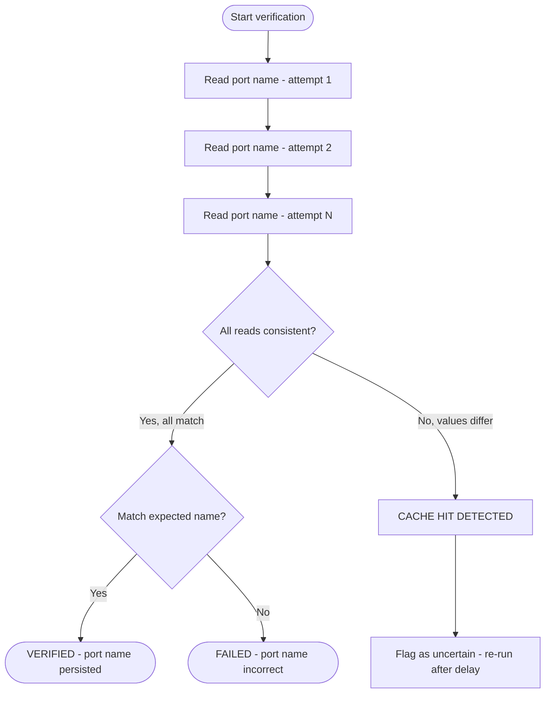
```mermaid
flowchart TD
    A([Start verification]) --> B[Read port name - attempt 1]
    B --> C[Read port name - attempt 2]
    C --> D[Read port name - attempt N]
    D --> E{All reads consistent?}
    E -->|Yes, all match| F{Match expected name?}
    E -->|No, values differ| G[CACHE HIT DETECTED]
    F -->|Yes| H([VERIFIED - port name persisted])
    F -->|No| I([FAILED - port name incorrect])
    G --> J[Flag as uncertain - re-run after delay]
```

### Sequence Diagram: Consistency Check

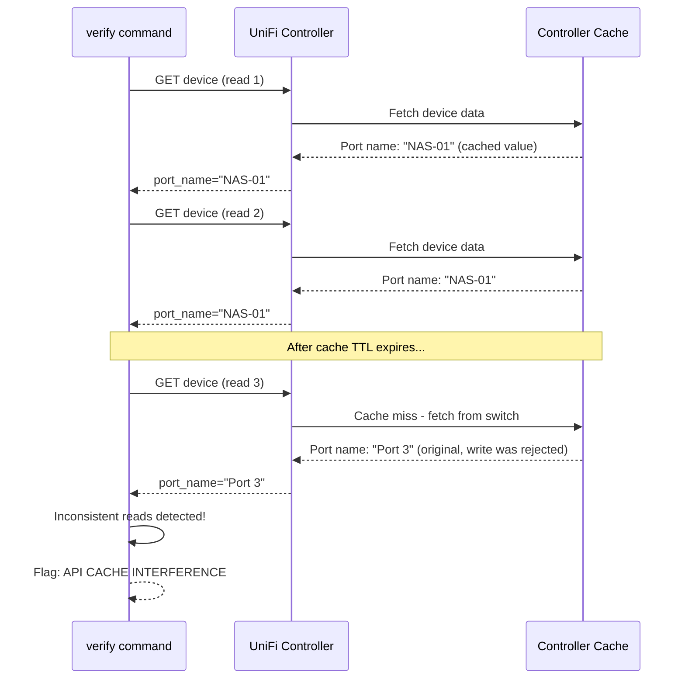
```mermaid
sequenceDiagram
    participant CLI as verify command
    participant API as UniFi Controller
    participant Cache as Controller Cache

    CLI->>API: GET device (read 1)
    API->>Cache: Fetch device data
    Cache-->>API: Port name: "NAS-01" (cached value)
    API-->>CLI: port_name="NAS-01"

    CLI->>API: GET device (read 2)
    API->>Cache: Fetch device data
    Cache-->>API: Port name: "NAS-01"
    API-->>CLI: port_name="NAS-01"

    Note over CLI,Cache: After cache TTL expires...

    CLI->>API: GET device (read 3)
    API->>Cache: Cache miss - fetch from switch
    Cache-->>API: Port name: "Port 3" (original, write was rejected)
    API-->>CLI: port_name="Port 3"

    CLI->>CLI: Inconsistent reads detected!
    CLI-->>CLI: Flag: API CACHE INTERFERENCE
```

### Expected Output (consistency check)

```
Ground Truth Verification
=========================
Checking 12 ports with 5 reads each...

VERIFIED:   Core-SW-01 Port 1 - "Dist-SW-01"     (5/5 consistent)
VERIFIED:   Core-SW-01 Port 2 - "Access-SW-01"    (5/5 consistent)
UNCERTAIN:  Core-SW-01 Port 5 - reads inconsistent (3x "NAS-01", 2x "Port 5")
FAILED:     Access-SW-02 Port 3 - name did not persist

Summary: 10 verified, 1 uncertain, 1 failed
```

### Common Issues

| Symptom | Cause | Fix |
|---------|-------|-----|
| Many "UNCERTAIN" results | API cache is very active | Wait 60 seconds, re-run; or reduce polling frequency |
| All ports show FAILED | Device model does not support port naming | Run `unifi-mapper capabilities` to check device support |
| Verify completes instantly with no output | No LLDP-discovered ports | Run `discover` first to build LLDP data |

---

## 11. CLI Entry Point Reference

### Four Entry Points

| Command | Purpose | Framework |
|---------|---------|-----------|
| `unifi-mapper` | Main CLI: discovery, diagram, STP, inventory, verify, capabilities | Typer (rich output, auto-completion) |
| `unifi-network-toolkit` | Analysis, diagnostics, find commands | argparse |
| `unifi-inventory` | Standalone inventory access | Typer (same as inventory subcommands) |
| `unifi-mcp` | MCP server for AI integration | FastMCP |

### unifi-mapper Command Reference

```
unifi-mapper [OPTIONS] COMMAND [ARGS]...

Global options:
  --config, -c PATH    Path to .env config file [default: XDG path]
  --debug              Enable debug logging

Commands:
  discover             Discover topology and update port names with LLDP
  diagram              Generate topology diagram (no port renaming)
  verify               Port name verification with ground truth checking
  capabilities         Device capability analysis for port naming
  version              Show version information
  install-completions  Install shell completions
  find device QUERY    Find device by name, IP, or MAC
  analyze link-quality Analyse port statistics
  diagnose health      Network health check
  stp analyze          Analyse STP topology
  stp optimize         Calculate and apply optimal STP priorities
  stp report           Generate STP report to markdown
  inventory list       List devices with firmware info
  inventory check-updates  Check for available firmware updates
  inventory update-firmware  Trigger firmware updates

discover options:
  --output, -o PATH    Output path for markdown report
  --diagram, -d PATH   Output path for diagram
  --format TEXT        png, svg, html, mermaid, dot [default: png]
  --dry-run            Preview without applying changes
  --verify-updates     Use SmartPortMapper with consistency verification
  --connected-devices  Include non-UniFi connected devices

Top-level shortcuts (invoke discover without subcommand):
  unifi-mapper --dry-run
  unifi-mapper --verify-updates
  unifi-mapper --connected-devices
```

### unifi-network-toolkit Command Reference

```
unifi-network-toolkit [OPTIONS] COMMAND [ARGS]...

Global options:
  --debug              Enable debug logging
  --config, -c PATH    Path to .env config file

Commands:
  discover             Network topology discovery (same as unifi-mapper discover)
  analyze link-quality   Port error analysis [--device NAME] [--port N]
  analyze capacity-planning  Utilisation report [--threshold FLOAT]
  analyze vlan         VLAN diagnostics [--vlan-id N]
  analyze mac          MAC table analysis [--device NAME]
  find device QUERY    Find by name, IP, or MAC
  find ip IP           Locate device by IP
  find mac MAC         Locate device by MAC
  diagnose network-health  Health check [--detailed]
  diagnose performance Performance analysis [--device NAME]
  install-completions  Install bash/zsh completions
```

### Config Resolution Logic

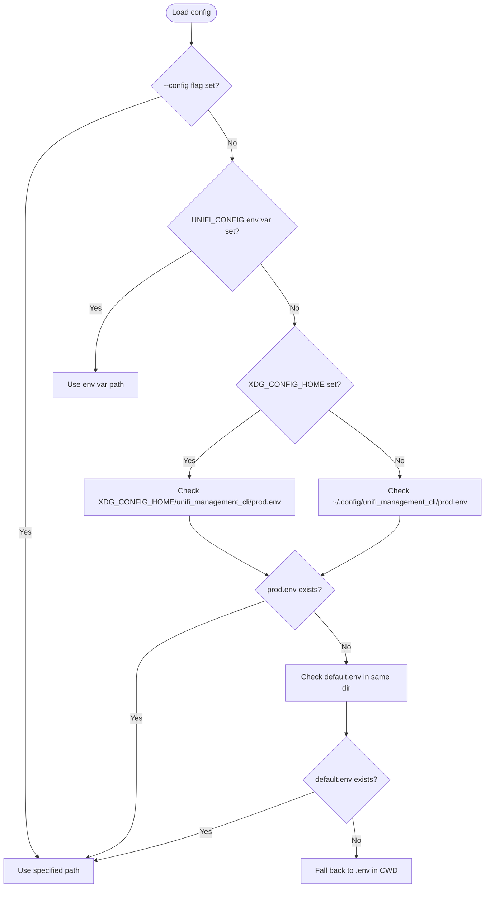
```mermaid
flowchart TD
    A([Load config]) --> B{--config flag set?}
    B -->|Yes| C[Use specified path]
    B -->|No| D{UNIFI_CONFIG env var set?}
    D -->|Yes| E[Use env var path]
    D -->|No| F{XDG_CONFIG_HOME set?}
    F -->|Yes| G[Check XDG_CONFIG_HOME/unifi_management_cli/prod.env]
    F -->|No| H[Check ~/.config/unifi_management_cli/prod.env]
    G --> I{prod.env exists?}
    H --> I
    I -->|Yes| C
    I -->|No| J[Check default.env in same dir]
    J --> K{default.env exists?}
    K -->|Yes| C
    K -->|No| L[Fall back to .env in CWD]
```

---

## 12. Network Safety Workflows

### Safe STP Change Workflow

Use this workflow for root-bridge changes, 10G expansion, or planned switch installs. The key rule is simple: collect a baseline, generate a reversible plan, apply only in a maintenance window, and verify with independent checks afterwards.

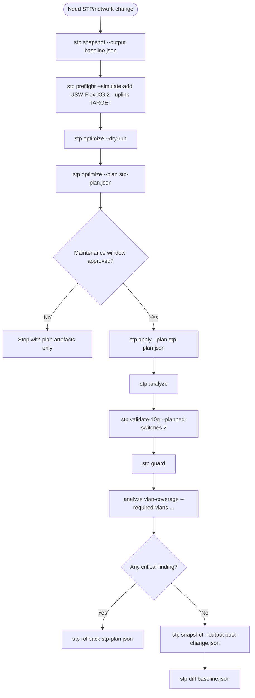
```mermaid
flowchart TD
    A([Need STP/network change]) --> B[stp snapshot --output baseline.json]
    B --> C[stp preflight --simulate-add USW-Flex-XG:2 --uplink TARGET]
    C --> D[stp optimize --dry-run]
    D --> E[stp optimize --plan stp-plan.json]
    E --> F{Maintenance window approved?}
    F -->|No| G[Stop with plan artefacts only]
    F -->|Yes| H[stp apply --plan stp-plan.json]
    H --> I[stp analyze]
    I --> J[stp validate-10g --planned-switches 2]
    J --> K[stp guard]
    K --> L[analyze vlan-coverage --required-vlans ...]
    L --> M{Any critical finding?}
    M -->|Yes| N[stp rollback stp-plan.json]
    M -->|No| O[stp snapshot --output post-change.json]
    O --> P[stp diff baseline.json]
```

```bash
# 1. Capture the current root, priorities, port states, path costs, and counters
uv run unifi-mapper stp snapshot --output reports/stp-baseline.json

# 2. Simulate planned Flex XG additions and expected root election
uv run unifi-mapper stp preflight \
  --simulate-add USW-Flex-XG:2 \
  --uplink "Shed USW Flex XG 10G" \
  --uplink "Lounge 10G Aggregation USW Flex XG" \
  --output reports/stp-preflight.json

# 3. Generate a reversible change plan
uv run unifi-mapper stp optimize --dry-run
uv run unifi-mapper stp optimize --plan reports/stp-plan.json

# 4. Apply during the maintenance window
uv run unifi-mapper stp apply --plan reports/stp-plan.json

# 5. Verify independently
uv run unifi-mapper stp analyze
uv run unifi-mapper stp validate-10g --planned-switches 2 --output reports/stp-10g-validation.md
uv run unifi-mapper stp guard
uv run unifi-mapper stp diff reports/stp-baseline.json

# 6. Roll back if post-checks show the wrong root, blocked uplinks, or critical path/counter findings
uv run unifi-mapper stp rollback reports/stp-plan.json
```

### 10G Expansion Readiness

Run the 10G validator before cabling additional aggregation switches. It combines STP root checks, blocked ports, path-cost sanity, 10G link speeds, port counters, and Root Guard recommendations.

```bash
uv run unifi-mapper stp validate-10g \
  --planned-switches 2 \
  --drops-threshold 100000 \
  --output reports/stp-10g-validation.md
```

Interpretation:

| Readiness | Meaning | Operator action |
|-----------|---------|-----------------|
| `READY` | No blocking findings | Proceed with the planned physical work |
| `READY_WITH_WARNINGS` | No critical blockers, but counters or advisory findings exist | Inspect warnings and proceed only if understood |
| `NOT_READY` | STP root, blocked-port, path-cost, or critical link findings exist | Fix before installing more switches |

### VLAN Coverage Before Cabling

Use VLAN coverage when a planned Flex XG or trunk uplink must carry known VLANs.

```bash
uv run unifi-mapper analyze vlan-coverage \
  --required-vlans 1,10,20,30,40,50 \
  --planned-uplink "Shed USW Flex XG 10G" \
  --planned-uplink "Lounge 10G Aggregation USW Flex XG"
```

The audit flags trunk/planned-uplink ports missing required VLANs. Access/client ports are ignored so the report stays focused on inter-switch paths.

### Inter-VLAN Endpoint Validation

Use this when two endpoints are on different VLANs and you need to know whether routing and firewall policy should allow the path.

```bash
uv run unifi-mapper diagnose inter-vlan 192.168.125.10 192.168.10.11
uv run unifi-mapper diagnose inter-vlan 192.168.125.10 192.168.10.11 --protocol tcp --port 443
```

The check resolves endpoints, identifies source and destination VLANs, confirms gateway availability, and evaluates matching LAN/firewall policy where available.

### Port Naming Verification

For port naming, use verification by default. UniFi API responses can be stale, so the tool does not trust a single read after mutation.

```bash
uv run unifi-mapper discover \
  --connected-devices \
  --verify-updates \
  --output reports/port-naming-verify.md \
  --diagram reports/topology-port-naming-verify.mermaid \
  --format mermaid
```

Expected success criteria:

- Verification count equals attempted update count.
- Failed verification count is zero.
- Generated Mermaid topology matches the expected physical design.

### Port Counters And Baselines

UniFi exposes cumulative counters. In most cases the API does not provide a safe per-port counter reset operation, so the practical pattern is to keep local baselines and compare deltas between runs.

```bash
# Snapshot/delta support lives in the Python baseline module and is used by 10G validation.
uv run unifi-mapper stp validate-10g --planned-switches 2 --drops-threshold 100000
```

The local baseline path is:

```text
${XDG_STATE_HOME:-~/.local/state}/unifi_mapper/port-counters.json
```

Use a new baseline after a known-good physical state, then treat new CRC/errors as actionable. Drops-only findings are lower confidence because multicast/broadcast filtering can increment drops without a bad cable.

### LAG Candidate Review

The LAG candidate finder detects parallel LLDP links and proposes LACP candidates, but it does not apply LAGs. Review NAS and server NIC LAG requirements first, because changing UniFi LAGs before endpoint bonding is a common way to create avoidable outages.

```bash
uv run unifi-mapper analyze lag-candidates --min-links 2
```

### Radio Channel And Power Optimisation

There is a read-only radio optimisation tool. It analyzes AP radio tables, flags channel reuse, and highlights high/manual transmit-power patterns that can cause sticky clients or co-channel contention.

```bash
uv run unifi-mapper analyze radio
```

Use the report as evidence for a manual RF plan. The tool does not currently mutate AP channel or power settings.

### SFP Diagnostics

SFP diagnostics are available when UniFi exposes module fields in `port_table`.

```bash
uv run unifi-mapper analyze sfp
```

The audit reports vendor, part, serial, temperature, Tx/Rx dBm, loss-of-signal, and fault flags. Weak RX power below `-10 dBm` and unexpectedly high RX power above `-3 dBm` are flagged for inspection.

---

## 13. Architecture Overview

### Application Flow Diagram

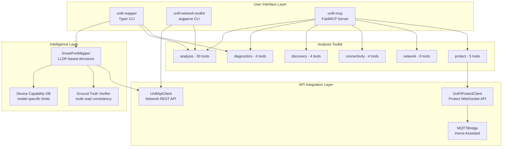
```mermaid
flowchart TB
    subgraph UI["User Interface Layer"]
        A[unifi-mapper<br/>Typer CLI]
        B[unifi-network-toolkit<br/>argparse CLI]
        C[unifi-mcp<br/>FastMCP Server]
    end

    subgraph Intel["Intelligence Layer"]
        D[SmartPortMapper<br/>LLDP-based decisions]
        E[Device Capability DB<br/>model-specific limits]
        F[Ground Truth Verifier<br/>multi-read consistency]
    end

    subgraph Analysis["Analysis Toolkit"]
        G[analysis - 30 tools]
        H[diagnostics - 4 tools]
        I[discovery - 4 tools]
        J[connectivity - 4 tools]
        K[network - 6 tools]
        L[protect - 5 tools]
    end

    subgraph API["API Integration Layer"]
        M[UnifiApiClient<br/>Network REST API]
        N[UniFiProtectClient<br/>Protect WebSocket API]
        O[MQTTBridge<br/>Home Assistant]
    end

    A --> D
    A --> G
    A --> H
    B --> M
    B --> G
    C --> G
    C --> H
    C --> I
    C --> J
    C --> K
    C --> L

    D --> E
    D --> F
    D --> M

    L --> N
    N --> O
```

### Component Responsibilities

| Component | Responsibility |
|-----------|---------------|
| `typer_cli.py` | Typer CLI with rich output, STP subcommands, inventory subcommands |
| `network_cli.py` | argparse CLI with analysis, find, diagnose subcommands |
| `inventory_cli.py` | Device inventory, firmware check/update |
| `cli.py` | Config loading, XDG path resolution |
| `config.py` | Configuration dataclass, validation, env loading |
| `port_mapper.py` | Traditional port mapping (LLDP to port name) |
| `smart_port_mapper.py` | SmartPortMapper with verification and cache-busting |
| `mcp/server.py` | FastMCP server, tool registry, meta-tools |
| `mcp/manifests/` | YAML tool definitions for all 53 registered automation tools |
| `analysis/stp_optimizer.py` | STP topology discovery, priority calculation, report generation |
| `protect/client.py` | Async wrapper around uiprotect ProtectApiClient |
| `protect/mqtt.py` | MQTT bridge with Home Assistant discovery |

---

*Generated from source: `src/unifi_mapper/typer_cli.py`, `src/unifi_mapper/network_cli.py`, `src/unifi_mapper/inventory_cli.py`, `src/unifi_mapper/mcp/server.py`, `src/unifi_mapper/mcp/manifests/`, `src/unifi_mapper/protect/client.py`, `src/unifi_mapper/protect/mqtt.py`, `src/unifi_mapper/analysis/stp_optimizer.py`*
