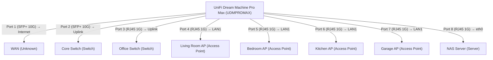

# Unifi Port Mapping Report
Generated: 2025-04-21 15:15:53

## Network Topology

### Mermaid Diagram

### Network Diagram

## Device Port Details

### UniFi Dream Machine Pro Max (UDMPROMAX)
IP:  | MAC:

| Port | Status | Name | Proposed Name | LLDP/CDP Info | Modified |
|------|--------|------|--------------|--------------|----------|
| 1 (SFP+) | ✅ Up  | Port 1 | Port 1 | WAN (Internet) | ❌ |
| 2 (SFP+) | ✅ Up  | Port 2 | Core Switch (Uplink) | Core Switch (Uplink) | ✅ |
| 3 (RJ45) | ✅ Up  | Port 3 | Office Switch (Uplink) | Office Switch (Uplink) | ✅ |
| 4 (RJ45) | ✅ Up  | Port 4 | Living Room AP (LAN1) | Living Room AP (LAN1) | ✅ |
| 5 (RJ45) | ✅ Up  | Port 5 | Bedroom AP (LAN1) | Bedroom AP (LAN1) | ✅ |
| 6 (RJ45) | ✅ Up  | Port 6 | Kitchen AP (LAN1) | Kitchen AP (LAN1) | ✅ |
| 7 (RJ45) | ✅ Up  | Port 7 | Garage AP (LAN1) | Garage AP (LAN1) | ✅ |
| 8 (RJ45) | ✅ Up  | Port 8 | NAS Server (eth0) | NAS Server (eth0) | ✅ |
| 9 (RJ45) | ✅ Up  | Port 9 | LAN 7 | None | ✅ |
| 10 (RJ45) | ✅ Up  | Port 10 | LAN 8 | None | ✅ |

### WAN (Unknown)
IP:  | MAC:

| Port | Status | Name | Proposed Name | LLDP/CDP Info | Modified |
|------|--------|------|--------------|--------------|----------|
| 1 (Unknown) | ✅ Up | Port 1 | Port 1 | None | ❌ |
| 2 (Unknown) | ✅ Up | Port 2 | Port 2 | None | ❌ |
| 3 (Unknown) | ✅ Up | Port 3 | Port 3 | None | ❌ |
| 4 (Unknown) | ✅ Up | Port 4 | Port 4 | None | ❌ |

### Core Switch (Switch)
IP:  | MAC:

| Port | Status | Name | Proposed Name | LLDP/CDP Info | Modified |
|------|--------|------|--------------|--------------|----------|
| 1 (Unknown) | ✅ Up  | Port 1 | LAN 1 | None | ✅ |
| 2 (Unknown) | ✅ Up  | Port 2 | LAN 2 | None | ✅ |
| 3 (Unknown) | ✅ Up  | Port 3 | LAN 3 | None | ✅ |
| 4 (Unknown) | ✅ Up  | Port 4 | LAN 4 | None | ✅ |

### Office Switch (Switch)
IP:  | MAC:

| Port | Status | Name | Proposed Name | LLDP/CDP Info | Modified |
|------|--------|------|--------------|--------------|----------|
| 1 (Unknown) | ✅ Up  | Port 1 | LAN 1 | None | ✅ |
| 2 (Unknown) | ✅ Up  | Port 2 | LAN 2 | None | ✅ |
| 3 (Unknown) | ✅ Up  | Port 3 | LAN 3 | None | ✅ |
| 4 (Unknown) | ✅ Up  | Port 4 | LAN 4 | None | ✅ |

### Living Room AP (Access Point)
IP:  | MAC:

| Port | Status | Name | Proposed Name | LLDP/CDP Info | Modified |
|------|--------|------|--------------|--------------|----------|
| 1 (Unknown) | ✅ Up | Port 1 | Port 1 | None | ❌ |
| 2 (Unknown) | ✅ Up | Port 2 | Port 2 | None | ❌ |
| 3 (Unknown) | ✅ Up | Port 3 | Port 3 | None | ❌ |
| 4 (Unknown) | ✅ Up | Port 4 | Port 4 | None | ❌ |

### Bedroom AP (Access Point)
IP:  | MAC:

| Port | Status | Name | Proposed Name | LLDP/CDP Info | Modified |
|------|--------|------|--------------|--------------|----------|
| 1 (Unknown) | ✅ Up | Port 1 | Port 1 | None | ❌ |
| 2 (Unknown) | ✅ Up | Port 2 | Port 2 | None | ❌ |
| 3 (Unknown) | ✅ Up | Port 3 | Port 3 | None | ❌ |
| 4 (Unknown) | ✅ Up | Port 4 | Port 4 | None | ❌ |

### Kitchen AP (Access Point)
IP:  | MAC:

| Port | Status | Name | Proposed Name | LLDP/CDP Info | Modified |
|------|--------|------|--------------|--------------|----------|
| 1 (Unknown) | ✅ Up | Port 1 | Port 1 | None | ❌ |
| 2 (Unknown) | ✅ Up | Port 2 | Port 2 | None | ❌ |
| 3 (Unknown) | ✅ Up | Port 3 | Port 3 | None | ❌ |
| 4 (Unknown) | ✅ Up | Port 4 | Port 4 | None | ❌ |

### Garage AP (Access Point)
IP:  | MAC:

| Port | Status | Name | Proposed Name | LLDP/CDP Info | Modified |
|------|--------|------|--------------|--------------|----------|
| 1 (Unknown) | ✅ Up | Port 1 | Port 1 | None | ❌ |
| 2 (Unknown) | ✅ Up | Port 2 | Port 2 | None | ❌ |
| 3 (Unknown) | ✅ Up | Port 3 | Port 3 | None | ❌ |
| 4 (Unknown) | ✅ Up | Port 4 | Port 4 | None | ❌ |

### NAS Server (Server)
IP:  | MAC:

| Port | Status | Name | Proposed Name | LLDP/CDP Info | Modified |
|------|--------|------|--------------|--------------|----------|
| 1 (Unknown) | ✅ Up | Port 1 | Port 1 | None | ❌ |
| 2 (Unknown) | ✅ Up | Port 2 | Port 2 | None | ❌ |
| 3 (Unknown) | ✅ Up | Port 3 | Port 3 | None | ❌ |
| 4 (Unknown) | ✅ Up | Port 4 | Port 4 | None | ❌ |

## Summary of Changes

Total port name changes identified: 7

### UniFi Dream Machine Pro Max

| Port | Current Name | Proposed Name |
|------|--------------|---------------|
| 2 | Port 2 | Core Switch (Uplink) |
| 3 | Port 3 | Office Switch (Uplink) |
| 4 | Port 4 | Living Room AP (LAN1) |
| 5 | Port 5 | Bedroom AP (LAN1) |
| 6 | Port 6 | Kitchen AP (LAN1) |
| 7 | Port 7 | Garage AP (LAN1) |
| 8 | Port 8 | NAS Server (eth0) |

### WAN

| Port | Current Name | Proposed Name |
|------|--------------|---------------|

### Core Switch

| Port | Current Name | Proposed Name |
|------|--------------|---------------|

### Office Switch

| Port | Current Name | Proposed Name |
|------|--------------|---------------|

### Living Room AP

| Port | Current Name | Proposed Name |
|------|--------------|---------------|

### Bedroom AP

| Port | Current Name | Proposed Name |
|------|--------------|---------------|

### Kitchen AP

| Port | Current Name | Proposed Name |
|------|--------------|---------------|

### Garage AP

| Port | Current Name | Proposed Name |
|------|--------------|---------------|

### NAS Server

| Port | Current Name | Proposed Name |
|------|--------------|---------------|
