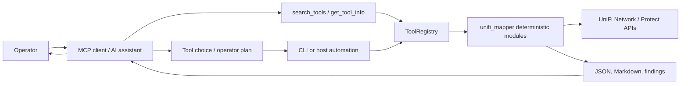

# UniFi Management MCP Server

## Overview

MCP Server implementing Code Mode architecture for UniFi network management. Exposes 50+ deterministic Python tools from `unifi_management_cli` with dynamic discovery and lazy loading.

## Technology Stack

- Python 3.12+
- FastMCP >= 0.5
- PyYAML >= 6.0
- uv/uvx for packaging
- Pydantic >= 2.10

## Project Structure

```text
src/unifi_mapper/mcp/
├── server.py              # FastMCP entry point and meta-tools
├── registry.py            # ToolRegistry, manifest loading, tool execution
├── manifests/             # YAML tool metadata grouped by category
└── tools/                 # Thin wrappers around deterministic Python modules
```

## Key Commands

```bash
# Development
uv sync --group dev
uv run pytest tests/ -v
uv run ruff check .
uv run ruff format .

# Run server
uv run unifi-mcp

# Install globally
uvx install .
```

## Architecture

Implements Code Mode pattern:
1. **search_tools** - Dynamic tool discovery entry point
2. **Lazy Loading** - Tools loaded on-demand via Proxy pattern
3. **Manifest-based** - Tool metadata in YAML files
4. **Progressive Disclosure** - Summary vs full detail levels
5. **Deterministic execution boundary** - MCP exposes Python validation and mutation tools; the AI assistant explains and orchestrates, but Python remains the authority for live reads, writes, validation, and rollback.

## Tool Categories

- **analysis** (30 tools): IP conflicts, storms, VLAN diagnostics, VLAN coverage, STP optimization, STP guard, STP drift, STP preflight, STP snapshots, 10G validation, SFP diagnostics, radio optimization, traffic matrix, LAG, QoS
- **diagnostics** (4 tools): Health, performance, security, connectivity
- **discovery** (4 tools): Find device/IP/MAC, client trace
- **connectivity** (4 tools): Firewall, path analysis, traceroute, inter-VLAN endpoint validation
- **network** (6 tools): Firewall zones/policies, ACL, DNS, clients, VLANs
- **protect** (5 tools): Cameras, NVR, sensors, lights, doorbells

## MCP Control Boundary

MCP tools should be treated as an operator interface over the same implementation used by the CLI:



For configuration changes, the preferred flow is: generate a plan, review the plan, apply through a specific tool or CLI command, then verify with independent read-only tools. Avoid asking the assistant to invent live STP priorities, VLAN mutations, or rollback steps without using the Python change-plan modules.

## Source Dependency

This MCP server imports from `unifi_management_cli`:
```python
from unifi_mapper.analysis import detect_ip_conflicts
from unifi_mapper.diagnostics import network_health_check
```

## Implementation Reference

See `IMPLEMENTATION_PROMPT.md` for detailed architecture and implementation guide.
