# UniFi Management CLI: Troubleshooting Guide and Operational Runbook

**Version**: 1.0  
**Last Updated**: 2026-04-06  
**Audience**: Network engineers and operations staff managing UniFi infrastructure via this CLI

> **See also**: [Use Cases and How-To](../guides/use-cases-and-howto.md) | [Architecture Overview](../architecture/architecture-overview.md) | [Codebase Map](../architecture/codemap.md) | [AXIS Provisioning](../guides/axis-provisioning.md)

---

## Table of Contents

### Part 1: Troubleshooting Guide
1. [Installation and Setup Issues](#1-installation-and-setup-issues)
2. [Authentication and Connection Failures](#2-authentication-and-connection-failures)
3. [SSL/TLS Certificate Issues](#3-ssltls-certificate-issues)
4. [Port Name Persistence Failures](#4-port-name-persistence-failures)
5. [API Cache Staleness](#5-api-cache-staleness)
6. [Device Compatibility Issues](#6-device-compatibility-issues)
7. [Protect Integration Issues](#7-protect-integration-issues)
8. [MCP Server Issues](#8-mcp-server-issues)
9. [Performance and Timeout Issues](#9-performance-and-timeout-issues)

### Part 2: Operational Runbook
10. [Daily Operations and Health Checks](#10-daily-operations-and-health-checks)
11. [Common Maintenance Tasks](#11-common-maintenance-tasks)
12. [Incident Response Procedures](#12-incident-response-procedures)
13. [Recovery Procedures](#13-recovery-procedures)
14. [Monitoring and Alerting Thresholds](#14-monitoring-and-alerting-thresholds)

### Part 3: Quick Reference
15. [Common Error Messages](#15-common-error-messages)
16. [Environment Variable Reference](#16-environment-variable-reference)
17. [CLI Flag Reference](#17-cli-flag-reference)
18. [API Endpoint Reference](#18-api-endpoint-reference)

---

## Part 1: Troubleshooting Guide

---

### 1. Installation and Setup Issues

#### Symptom

The CLI commands (`unifi-mapper`, `unifi-network-toolkit`, `unifi-inventory`, `unifi-mcp`) are not found after installation, or Python import errors appear on first run.

#### Diagnostic Flowchart

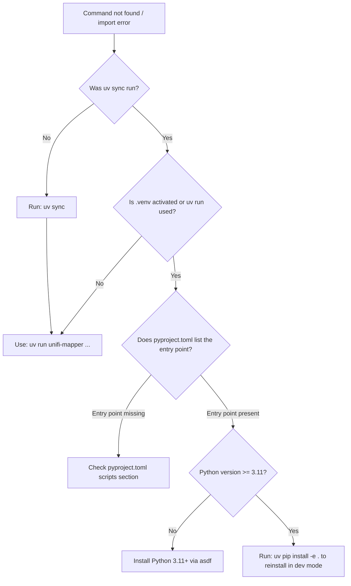

#### Root Cause

The project uses `uv` exclusively. Running `pip install` directly or forgetting the `uv run` prefix means the project's entry points and dependencies are not on the active `PATH` or `PYTHONPATH`.

#### Resolution

```bash
# Step 1: Install all dependencies
uv sync

# Step 2: Run any command through uv run
uv run unifi-mapper --help
uv run unifi-network-toolkit --help

# Step 3: Or install as a uv tool for global access
uv tool install .
# Then commands are available directly:
unifi-mapper --help
```

#### Config File Not Found

**Symptom**: `Configuration file not found: /home/user/.config/unifi_management_cli/prod.env` or `UNIFI_URL environment variable required.`

The CLI searches for config in the following priority order (from `cli.py`):

1. `$XDG_CONFIG_HOME/unifi_management_cli/prod.env`
2. `~/.config/unifi_management_cli/prod.env`
3. `$XDG_CONFIG_HOME/unifi_management_cli/default.env`
4. `~/.config/unifi_management_cli/default.env`
5. `.env` in the current directory (legacy fallback)

**Resolution**:

```bash
mkdir -p ~/.config/unifi_management_cli
cp .env.example ~/.config/unifi_management_cli/prod.env
# Edit prod.env with actual values
chmod 600 ~/.config/unifi_management_cli/prod.env

# Or specify config explicitly:
uv run unifi-mapper --config /path/to/my.env
```

#### Prevention

Keep a `prod.env` at the XDG standard path. Never use `.env` in the working directory for production; it is a legacy fallback only.

---

### 2. Authentication and Connection Failures

#### Symptom

One or more of the following:
- `Authentication failed - all methods exhausted`
- `Authentication failed: 401 Client Error`
- `Authentication failed: 403 Client Error`
- Commands return empty results with no error, only log noise

#### Diagnostic Flowchart

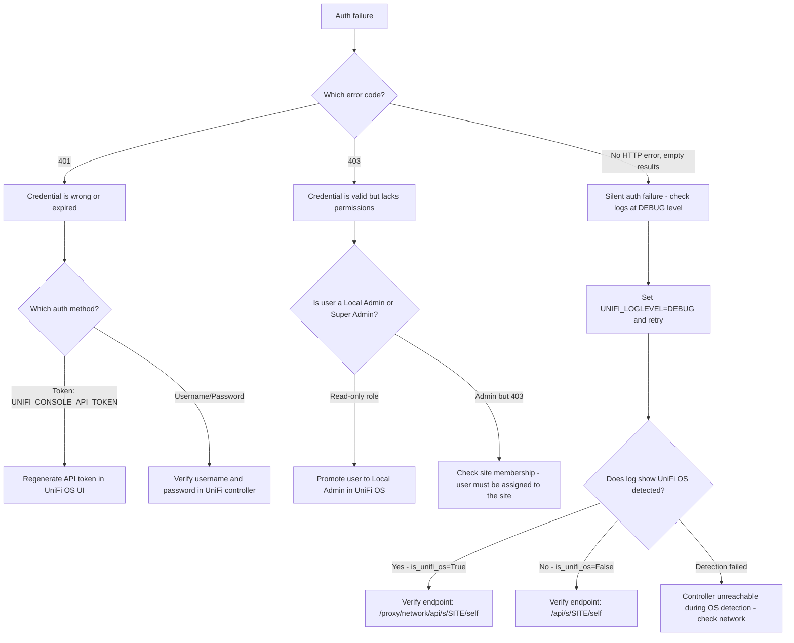

#### Authentication Method Selection

The client selects authentication method based on which environment variable is set:

```
UNIFI_CONSOLE_API_TOKEN set  -> auth_method = "token"
UNIFI_USERNAME + UNIFI_PASSWORD set -> auth_method = "username_password"
Both set -> token takes precedence
Neither set -> UniFiValidationError on login()
```

**Token authentication** tries two header formats in sequence:
1. `X-API-KEY: <token>` (preferred for UniFi OS 3.x+)
2. `Authorization: Bearer <token>` (fallback)

**Username/password authentication** uses different endpoints depending on controller type:
- UniFi OS (UDM/UDM Pro/CloudKey Gen2+): `POST /api/auth/login`
- Legacy controller (CloudKey Gen1, self-hosted): `POST /api/login`

#### UniFi OS vs Legacy Controller Detection

The client probes `GET /api/system`. A `200` response indicates UniFi OS. Any failure causes the client to assume legacy mode. If the controller is slow or behind a proxy, this probe may time out and force legacy mode incorrectly.

**Resolution for incorrect detection**:

```bash
# Test manually:
curl -k https://YOUR_CONTROLLER/api/system

# If 200: UniFi OS, endpoints are /proxy/network/api/s/SITE/...
# If 404/connection refused: Legacy, endpoints are /api/s/SITE/...
```

#### Re-authentication on 401/403

The client automatically re-authenticates on 401 or 403 responses within `get_devices()`, `get_clients()`, and `get_device_details()`. If re-authentication also fails, the method returns an empty dict/list without raising. Check logs at WARNING level for:

```
Authentication issue with devices endpoint. Attempting to re-authenticate...
```

#### Prevention

- Use API token authentication rather than username/password. Tokens survive password rotations.
- Generate API tokens under Settings > Control Plane > API Tokens in UniFi OS.
- Store tokens at `chmod 600` permissions.

---

### 3. SSL/TLS Certificate Issues

#### Symptom

```
SSL error during token authentication: [SSL: CERTIFICATE_VERIFY_FAILED]
requests.exceptions.SSLError: HTTPSConnectionPool(host='unifi.local', port=8443):
  Max retries exceeded with url: /api/s/default/self
  Caused by: SSLError(SSLCertVerificationError(...))
```

This surfaces as `UniFiConnectionError: SSL error: ...` in the exception hierarchy.

#### Diagnostic Flowchart

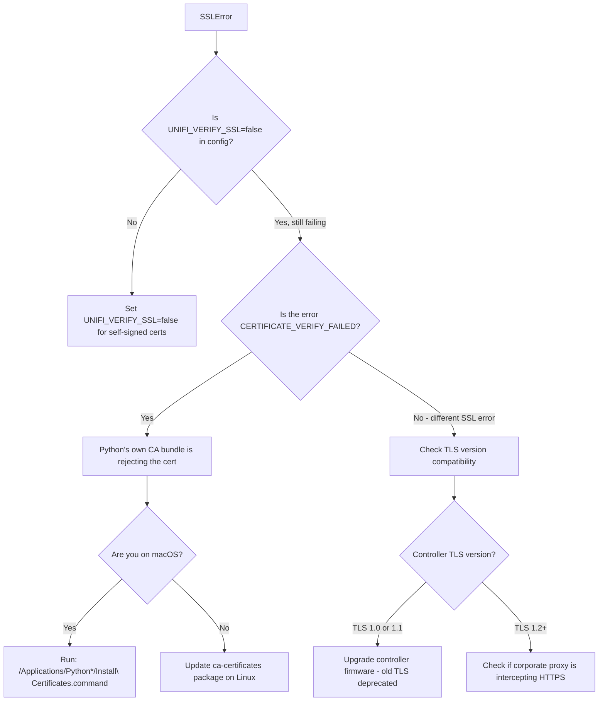

#### Root Cause

UniFi controllers ship with self-signed certificates by default. The default `UNIFI_VERIFY_SSL=false` disables certificate verification and suppresses `urllib3.exceptions.InsecureRequestWarning`. When `UNIFI_VERIFY_SSL=true`, the certificate must be signed by a CA in Python's bundle.

#### Resolution

**For self-signed/internal CA certificates (standard setup)**:

```bash
# In ~/.config/unifi_management_cli/prod.env:
UNIFI_VERIFY_SSL=false
```

**For production environments requiring verified SSL**:

```bash
# Option 1: Add your CA to the system bundle, then:
UNIFI_VERIFY_SSL=true

# Option 2: Point requests at your CA bundle:
# Not directly configurable via env; requires patching the session
# in src/unifi_mapper/api_client.py:
# self.session.verify = "/path/to/ca-bundle.pem"
```

#### Prevention

Do not set `UNIFI_VERIFY_SSL=true` unless the controller has a certificate from a trusted CA (e.g., Let's Encrypt via DDNS). The warning suppression when `verify_ssl=False` is intentional.

---

### 4. Port Name Persistence Failures

#### Symptom

Port names appear to update successfully (API returns `200`, log shows `port_overrides update successful`) but names revert to previous values or generic names (`Port 1`, `Port 2`) after a few minutes or on device reboot.

#### Diagnostic Flowchart

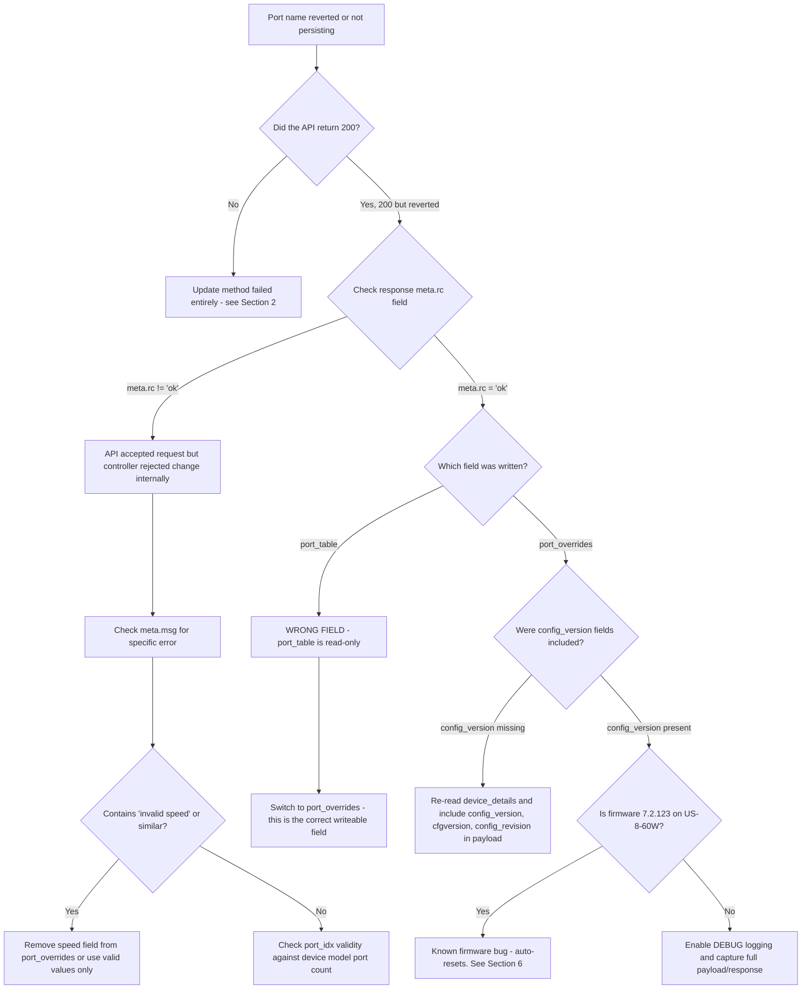

#### Root Cause: `port_table` is Read-Only

This is the most important API behaviour to understand. The UniFi API exposes two distinct fields:

| Field | Behaviour |
|-------|-----------|
| `port_table` | Read-only. Reflects current runtime state. Writing to it returns 200 but changes do not persist. |
| `port_overrides` | Writeable. Persists port configuration across reboots and device re-adoption. |

The client's `_update_port_overrides()` method is the primary update path. It reads existing `port_overrides`, merges changes, and writes back. The update payload must include device identifiers and config version fields for persistence:

```python
update_data = {
    "_id": device_details.get("_id"),
    "mac": device_details.get("mac"),
    "port_overrides": validated_overrides,
    # Critical for persistence:
    "config_version": device_details.get("config_version"),
    "cfgversion": device_details.get("cfgversion"),
    "config_revision": device_details.get("config_revision"),
}
```

Missing any of `config_version`, `cfgversion`, or `config_revision` causes the controller to silently discard the change.

#### Fallback Strategy Chain

When `_update_port_overrides()` fails, the client automatically tries:

1. `_update_device_config_with_ports()` - sends complete device config including `port_table`
2. `_update_ports_via_port_endpoint()` - tries `/rest/device/{id}/port` and `cmd/devmgr`
3. `_update_device_legacy_method()` - minimal payload with just `port_table`

**All fallbacks are less reliable than `port_overrides`.** If you are consistently reaching fallback methods, investigate why `port_overrides` is failing.

#### Valid Port Speed Values

The API rejects non-standard speed values. Valid values (from `EnhancedUnifiApiClient`):

```
10, 100, 1000, 2500, 5000, 10000, 20000, 25000, 40000, 50000, 100000
```

Zero (`0`) and any other value will be stripped from `port_overrides` before submission. If `autoneg=True` is set, the speed field is removed to allow auto-negotiation.

#### Resolution

```bash
# Step 1: Enable debug logging to see full payload
export UNIFI_LOGLEVEL=DEBUG
uv run unifi-mapper --verify-updates 2>&1 | grep -E "PORT OVERRIDE|API RESPONSE|config_version"

# Step 2: Check the response meta.rc - should be 'ok'
# Look for: Response meta.rc: ok

# Step 3: Dry run to inspect what would be sent
uv run unifi-mapper --dry-run --verify-updates
```

#### Prevention

Always use `--verify-updates` flag when running port name updates. This triggers multi-read consistency checking (see Section 5) to confirm persistence.

---

### 5. API Cache Staleness

#### Symptom

- Port names shown as already correct before any update was applied
- Verification reports `VERIFIED` for changes that were actually not applied
- Running the tool twice gives different results for the same device state
- The ground truth report shows `inconsistent results` for a port

#### How the Cache Problem Manifests

The UniFi API serves responses from an internal cache. After writing `port_overrides`, subsequent reads may return the old value for several seconds, then the new value, then potentially the old value again if the cache layer is inconsistent. This creates false positive verification.

#### Multi-Read Consistency Checking

The `GroundTruthVerifier._multi_read_consistency_check()` method performs 5 reads with 2-second delays and cache-busting headers:

```python
self.api_client.session.headers.update({
    "Cache-Control": "no-cache, no-store, must-revalidate",
    "Pragma": "no-cache",
    "X-Requested-With": f"GroundTruthVerifier-{time.time()}",
    "X-Cache-Bust": str(int(time.time() * 1000))
})
```

A port is only marked verified when all 5 reads return the same value AND that value matches the expected name.

#### Diagnostic Flowchart

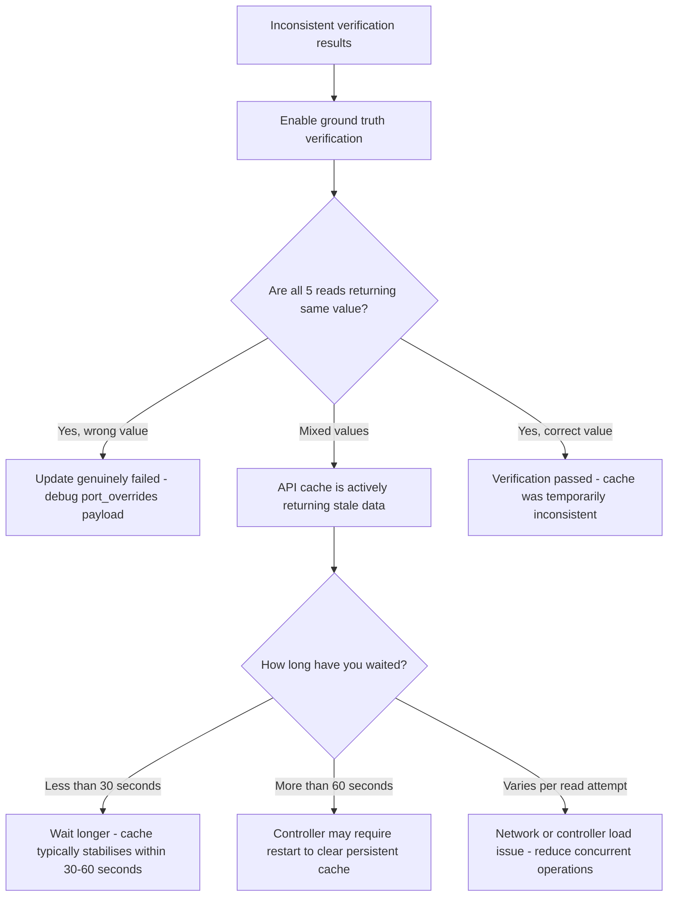

#### Resolution

```bash
# Run with full verification (triggers multi-read consistency checking)
uv run unifi-mapper --verify-updates --connected-devices

# If verification is consistently failing on a specific device,
# run the advanced verification CLI:
uv run python -m unifi_mapper.verify_cli --verify-all --consistency-check
```

If the controller consistently returns stale data, a controlled restart of the UniFi Network Application (not the hardware) clears the application-level cache.

#### Prevention

Never trust a single read for verification. Always use `--verify-updates`. The LLDP-based update decision path is cache-independent: it decides what to update based on LLDP discovery data, not API-reported current state.

---

### 6. Device Compatibility Issues

#### Symptom

- Port names accepted by API but reverting within minutes
- `Skipping device: Firmware 7.2.123 automatically resets port configurations`
- `Model USW-Flex-2.5G-5 has limited port naming support`
- 2.5G speed validation failures on USW-Flex models

#### Device Compatibility Matrix

| Model Code | Display Name | Support Level | Key Issue |
|------------|-------------|---------------|-----------|
| US8P60 + fw 7.2.123 | US-8-60W | RESETS_AUTOMATICALLY | Auto-resets port profiles, device instability |
| USL8LP | USW-Lite-8-PoE | LIMITED | VLAN selection restricted, names may not persist |
| USWED35 | USW-Flex-2.5G-5 | LIMITED | Network override hidden, API may reject overrides |
| USMINI2P5G | USW-Flex-Mini-2.5G | FULL_SUPPORT | No known issues |
| Any device + fw 6.5.59 | Various | RESETS_AUTOMATICALLY | Adoption failures, SSH issues |

#### Diagnostic Flowchart

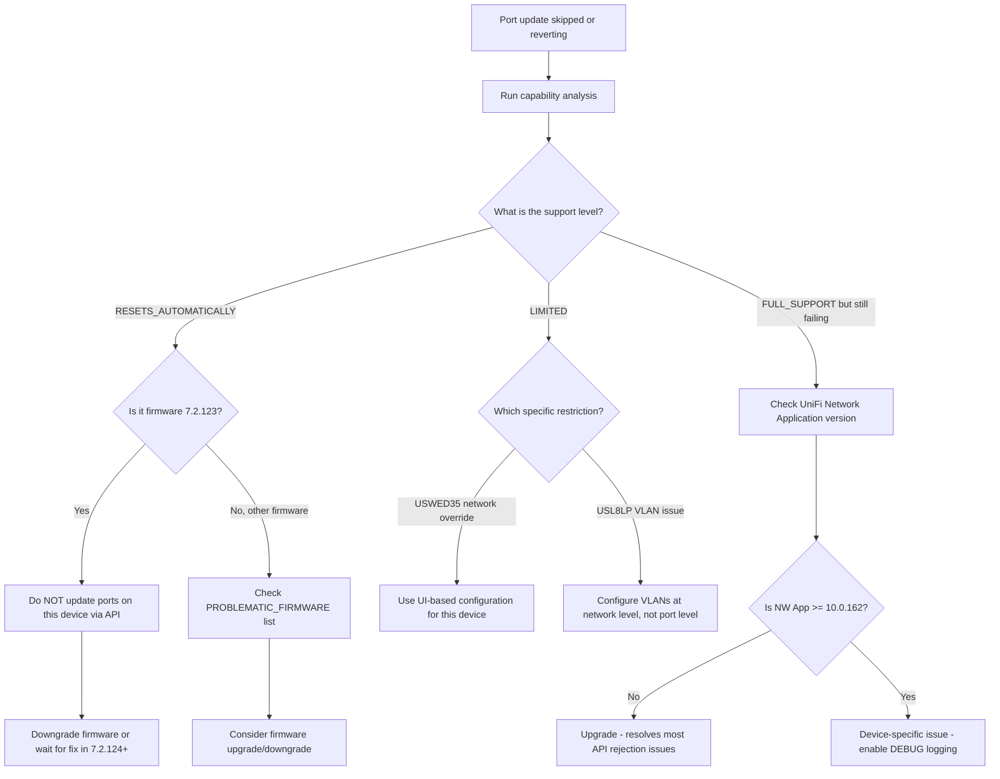

#### US-8-60W Firmware 7.2.123 Behaviour

This is the most disruptive known issue. On firmware 7.2.123:

- Port profiles automatically reset to `All` within minutes to hours of any change
- The device may enter continuous disconnection/re-adoption cycles
- Connected access points may power cycle repeatedly
- Port state transitions can cause the device to hang

The `DeviceCapabilityDetector` will set strategy to `AVOID` for this combination, and `SmartPortMapper` will log a warning and skip the device entirely.

**Resolution**:

1. Do not attempt automated port naming on US-8-60W running 7.2.123.
2. Defer the firmware upgrade; do not downgrade if the device was previously stable on an earlier version.
3. If the device is in a boot loop, factory reset and re-adopt.
4. Use the UniFi controller UI for any necessary port documentation on this device.

#### Resolution for Limited Support Devices

```bash
# Run device capability analysis to identify problem devices
uv run python -m unifi_mapper.analyze_network_capabilities

# Then target only compatible devices:
uv run unifi-mapper --dry-run 2>&1 | grep -E "Skipping|Processing|capability"
```

#### Prevention

Run the compatibility report before deploying to a new site. Upgrade the UniFi Network Application to 10.0.162 or later, which resolves most API-level rejection issues for the limited-support models.

---

### 7. Protect Integration Issues

#### Symptom

- `Failed to connect to Protect controller: ...`
- `Failed to authenticate with Protect controller: ...`
- WebSocket events not being processed
- MQTT messages not reaching Home Assistant
- AI Port cameras showing as disconnected

#### Connection State Machine

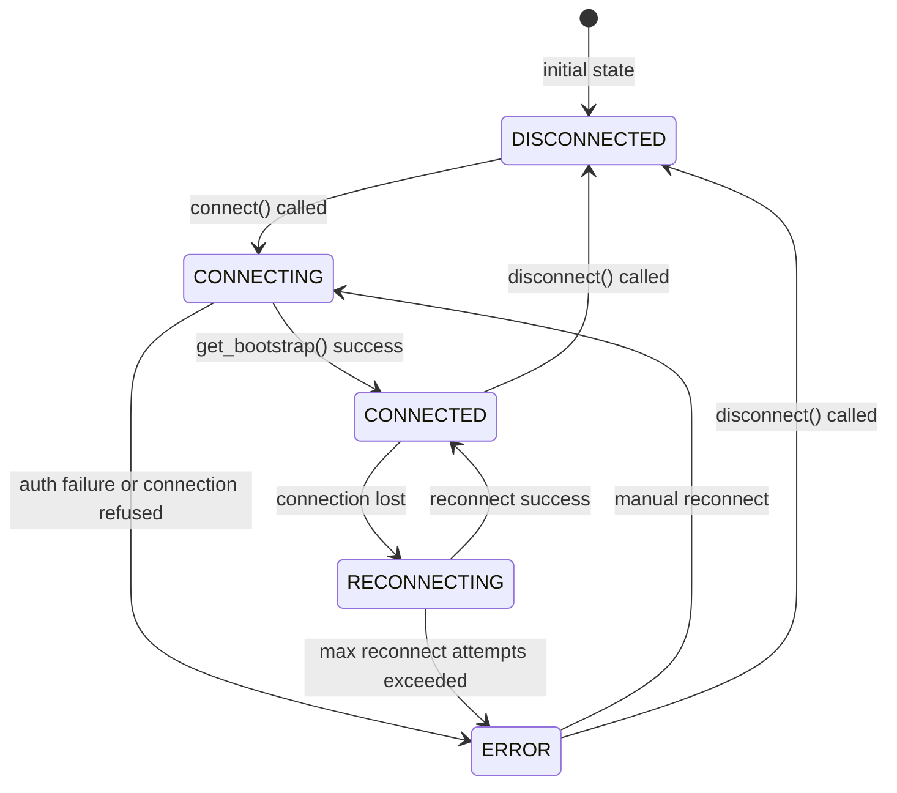

The `UniFiProtectClient.state` property exposes the current `ConnectionState` enum value. Check `client.is_connected` (only `True` when `state == CONNECTED` AND `_client is not None`) before any operation.

#### Authentication Errors

The Protect client raises `AuthenticationError` (a subclass of `ProtectClientError`) when `get_bootstrap()` fails with "unauthorized" or "authentication" in the error message. This is distinct from `UniFiAuthenticationError` in the main API client.

**Common causes**:
- `PROTECT_USERNAME` / `PROTECT_PASSWORD` credentials are for a local admin, not a Ubiquiti account
- Multi-factor authentication is enabled on the account
- The account does not have Protect access in UniFi OS permissions

**Resolution**:

```bash
# Test Protect connectivity independently:
python3 -c "
import asyncio
from unifi_mapper.protect import ProtectConfig, UniFiProtectClient

config = ProtectConfig(
    host='YOUR_HOST',
    username='YOUR_USER',
    password='YOUR_PASS',
    verify_ssl=False,
)
async def test():
    async with UniFiProtectClient(config) as c:
        print(f'Cameras: {len(c.cameras)}')
        print(f'AI Ports: {len(c.ai_ports)}')
asyncio.run(test())
"
```

#### WebSocket Bootstrap Refresh

If device counts are stale (cameras added to Protect but not appearing in the client), the bootstrap needs refreshing:

```python
# The client exposes a refresh() method:
await client.refresh()
```

This is a blocking async operation. In long-running processes, call `refresh()` periodically (e.g., every 5 minutes) to keep device inventory current.

#### MQTT Bridge Connectivity

**Symptom**: Home Assistant not receiving events, or device discovery messages absent.

**Diagnostic Flowchart**:

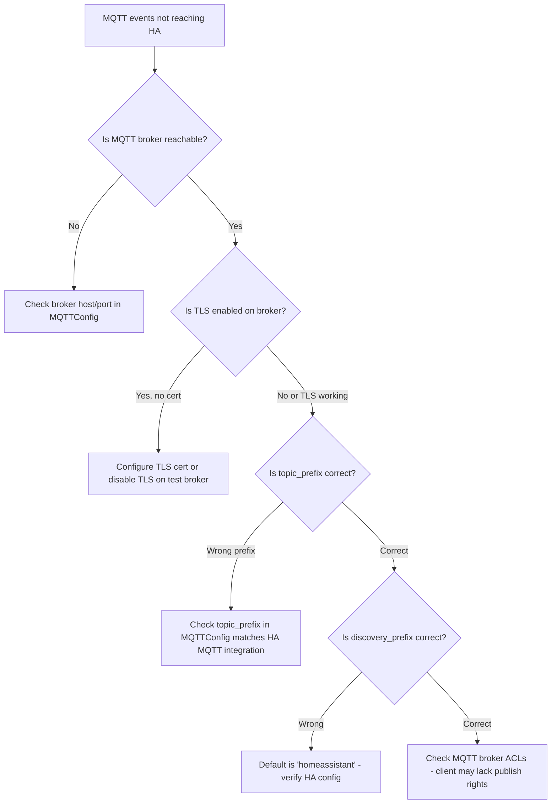

#### AI Port Pairing for Third-Party Cameras

AI Ports appear in `client.ai_ports` (from `bootstrap.aiports`). Third-party ONVIF cameras connected via AI Port appear in `client.cameras` with `is_third_party_camera=True`.

To get cameras paired with a specific AI Port:

```python
cameras = client.get_cameras_by_ai_port(ai_port_id)
```

If cameras are not pairing, verify the ONVIF camera is configured with a compatible stream URL and that the AI Port firmware is current.

#### Prevention

Run the Protect client as a persistent async service rather than a one-shot command. Short-lived connections miss WebSocket events that arrive after the bootstrap but before event subscriptions are established.

---

### 8. MCP Server Issues

#### Symptom

- Claude Desktop shows `unifi-management` as disconnected or not loading tools
- Tool calls fail silently with no response
- `uvx run unifi-mcp` exits immediately with no output

#### Diagnostic Flowchart

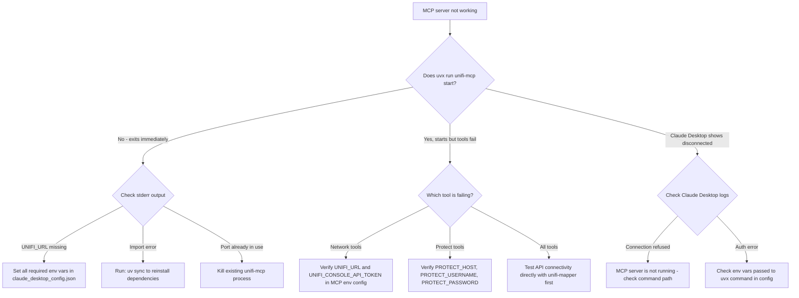

#### Claude Desktop Configuration

The MCP server configuration must be in `claude_desktop_config.json` (typically `~/.config/Claude/claude_desktop_config.json` on Linux, `~/Library/Application Support/Claude/claude_desktop_config.json` on macOS):

```json
{
  "mcpServers": {
    "unifi-management": {
      "command": "uvx",
      "args": ["--from", "unifi-management-cli", "unifi-mcp"],
      "env": {
        "UNIFI_URL": "https://192.168.1.1",
        "UNIFI_SITE": "default",
        "UNIFI_CONSOLE_API_TOKEN": "your_token",
        "UNIFI_VERIFY_SSL": "false",
        "PROTECT_HOST": "192.168.1.1",
        "PROTECT_USERNAME": "admin",
        "PROTECT_PASSWORD": "your_password"
      }
    }
  }
}
```

If the `unifi-management-cli` package is not published to PyPI (local development), replace with a direct path:

```json
"command": "uv",
"args": ["run", "--project", "/absolute/path/to/unifi_management_cli", "unifi-mcp"]
```

#### Resolution

```bash
# Test the MCP entry point directly:
uvx --from . unifi-mcp --help
# or for local dev:
uv run unifi-mcp --help

# Verify all 36 tools are registered by checking startup logs
UNIFI_URL=https://192.168.1.1 UNIFI_CONSOLE_API_TOKEN=token uv run unifi-mcp 2>&1 | head -20
```

#### Prevention

Test the MCP server with direct environment variables before configuring Claude Desktop. Confirm tools are loading with a simple Claude prompt: "List the available UniFi tools."

---

### 9. Performance and Timeout Issues

#### Symptom

- `Request timed out after 3 attempts: ...` (raises `UniFiTimeoutError`)
- `Connection failed after 3 attempts: ...` (raises `UniFiConnectionError`)
- Operations taking more than 30 seconds on small networks
- Verify operations hanging during multi-read consistency checks

#### Retry and Backoff Behaviour

The client implements exponential backoff for retryable errors (`UniFiRetryableError` subclasses: `UniFiConnectionError`, `UniFiTimeoutError`, `UniFiRateLimitError`). Delays are:

- Attempt 1: `retry_delay * 2^0` (e.g., 1.0s with default settings)
- Attempt 2: `retry_delay * 2^1` (2.0s)
- Attempt 3: `retry_delay * 2^2` (4.0s)

Total worst-case wait with defaults (`max_retries=3`, `retry_delay=1.0`): ~7 seconds per failing request.

`UniFiAuthenticationError` and `UniFiPermissionError` (4xx errors) are NOT retried and raise immediately.

#### Diagnostic Flowchart

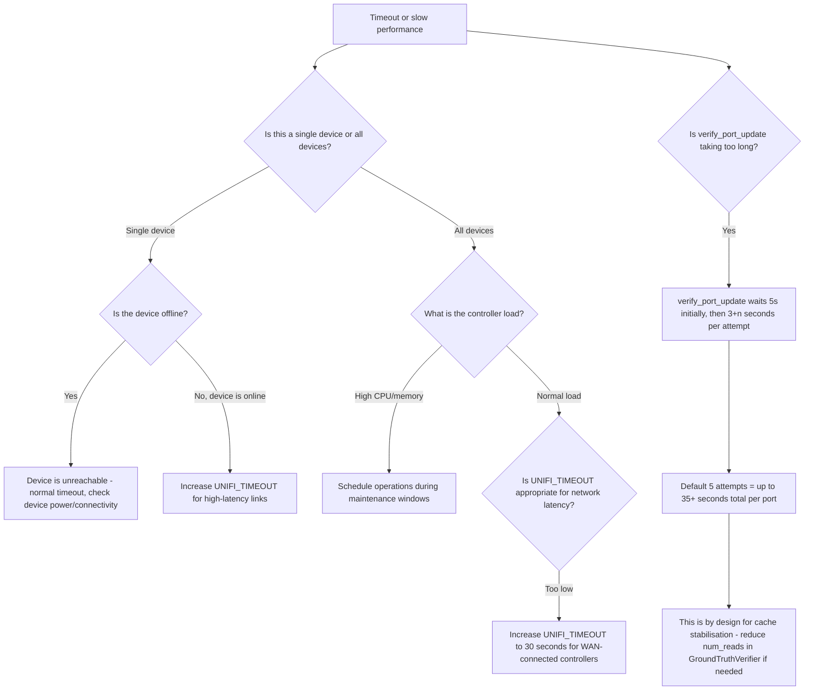

#### Tuning Parameters

Adjust these in `~/.config/unifi_management_cli/prod.env`:

```bash
# For high-latency or WAN-connected controllers (default: 10)
UNIFI_TIMEOUT=30

# For flaky connections, increase retries (default: 3, max: 10)
UNIFI_MAX_RETRIES=5

# For very reliable links, reduce retry delay to speed up failures (default: 1.0)
UNIFI_RETRY_DELAY=0.5
```

Valid ranges (clamped by config validation):
- `UNIFI_TIMEOUT`: 1-300 seconds
- `UNIFI_MAX_RETRIES`: 1-10
- `UNIFI_RETRY_DELAY`: 0.1-10.0 seconds

#### Prevention

Test baseline latency to the controller before setting `UNIFI_TIMEOUT`. For controllers accessed over VPN or WAN, use at minimum `UNIFI_TIMEOUT=20`. The multi-read verification in `GroundTruthVerifier` intentionally adds delay; this is not a bug.

---

## Part 2: Operational Runbook

---

### 10. Daily Operations and Health Checks

#### Standard Daily Health Check Sequence

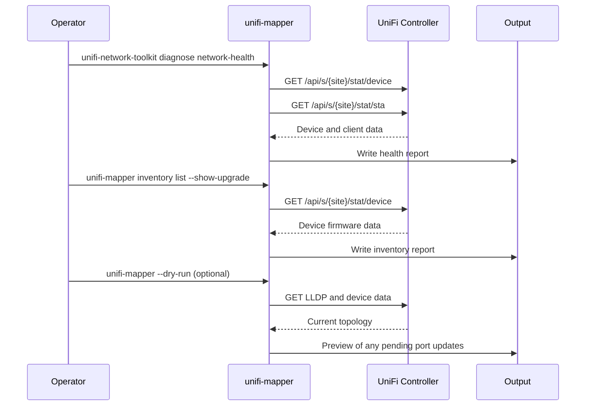

#### Daily Operations Commands

```bash
# 1. Full network health check
uv run unifi-network-toolkit diagnose network-health

# 2. Device inventory with firmware status
uv run unifi-mapper inventory list --filter switch --show-upgrade

# 3. Check for firmware updates available
uv run unifi-mapper inventory check-updates

# 4. Link quality analysis (identifies degraded interfaces)
uv run unifi-network-toolkit analyze link-quality

# 5. Dry-run port mapping to see if topology has changed
uv run unifi-mapper --dry-run --connected-devices
```

#### Interpreting Health Check Output

| Condition | What to Check |
|-----------|---------------|
| Device offline (state != "connected") | Physical connectivity, PoE power, adoption status |
| Firmware update available | Schedule update during next maintenance window |
| High error rate on interface | Check cable, SFP, or connected device |
| New devices in LLDP not in port names | Run `unifi-mapper --verify-updates` to apply names |

---

### 11. Common Maintenance Tasks

#### Firmware Updates

Before updating firmware on any switch, check device compatibility:

```bash
# 1. Check current firmware versions
uv run unifi-mapper inventory list --filter switch --show-upgrade

# 2. Cross-reference against known problematic firmware versions:
#    - 7.2.123: US-8-60W auto-reset issue
#    - 6.5.59: Adoption failures on various models

# 3. After firmware update, verify port names persisted:
uv run unifi-mapper --verify-updates --connected-devices
```

**Firmware update sequence**:

1. Backup current port name configuration (dry-run report)
2. Update one device at a time
3. Wait 5 minutes after device comes back online
4. Verify port names with `--verify-updates`
5. Check for any auto-resets using multi-read consistency check

#### Configuration Backup

```bash
# Generate a current topology report (port names, device connections)
uv run unifi-mapper --format mermaid --output ~/backups/topology-$(date +%Y%m%d).md

# Generate inventory snapshot
uv run unifi-mapper inventory list --format json --output ~/backups/inventory-$(date +%Y%m%d).json
```

#### STP Topology Management

```bash
# Analyze current STP topology
uv run unifi-mapper stp analyze

# Preview optimal priority changes (always dry-run first)
uv run unifi-mapper stp optimize --dry-run

# Apply after review
uv run unifi-mapper stp optimize --apply

# Generate report for documentation
uv run unifi-mapper stp report -o stp-report-$(date +%Y%m%d).md
```

#### Rotating API Credentials

```bash
# 1. Generate new API token in UniFi OS:
#    Settings > Control Plane > API Tokens > Create Token

# 2. Update config file
vim ~/.config/unifi_management_cli/prod.env
# Change: UNIFI_CONSOLE_API_TOKEN=new_token_here

# 3. Verify new token works
uv run unifi-mapper --dry-run

# 4. Update MCP server config if applicable
# Update UNIFI_CONSOLE_API_TOKEN in claude_desktop_config.json
# Restart Claude Desktop
```

---

### 12. Incident Response Procedures

#### Incident: Controller Unreachable

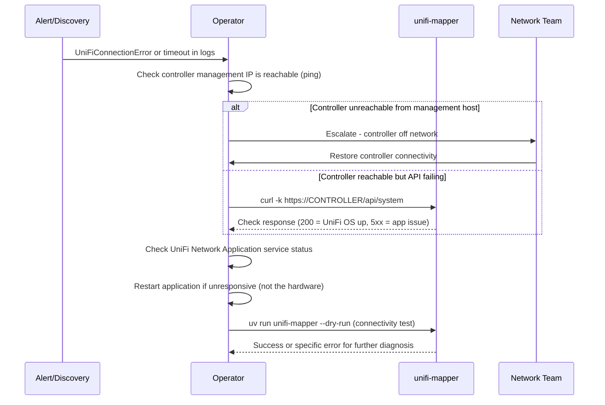

**Immediate actions**:

```bash
# Test basic connectivity
curl -k -o /dev/null -s -w "%{http_code}" https://YOUR_CONTROLLER/api/system

# Test authentication
curl -k -H "X-API-KEY: YOUR_TOKEN" https://YOUR_CONTROLLER/proxy/network/api/s/default/self

# Test with CLI
UNIFI_LOGLEVEL=DEBUG uv run unifi-mapper --dry-run 2>&1 | head -50
```

#### Incident: Device Goes Offline or Stops Responding

```bash
# Locate device by name or IP
uv run unifi-network-toolkit find device "DeviceName"
uv run unifi-network-toolkit find ip 192.168.1.x

# Check port connectivity to uplink device
uv run unifi-network-toolkit analyze link-quality

# Trace client path to the device
uv run unifi-network-toolkit trace client MAC_ADDRESS
```

#### Incident: Mass Port Name Reversion

This indicates either a firmware issue (see Section 6) or a controller-level config push that overwrote port overrides.

**Response**:

```bash
# 1. Identify affected devices
uv run unifi-mapper --verify-updates --connected-devices 2>&1 | grep -E "FAILED|mismatch"

# 2. Check if firmware version changed on affected devices
uv run unifi-mapper inventory list --filter switch

# 3. If firmware 7.2.123 is detected on US-8-60W, stop and do not re-apply
#    (see Section 6 - auto-reset behaviour)

# 4. For other devices, re-apply port names
uv run unifi-mapper --verify-updates --connected-devices

# 5. Confirm with ground truth verification
uv run python -m unifi_mapper.verify_cli --verify-all --consistency-check
```

#### Incident: Authentication Token Compromised

```bash
# 1. Immediately revoke compromised token in UniFi OS
#    Settings > Control Plane > API Tokens > Revoke Token

# 2. Generate new token

# 3. Update all config files
sed -i 's/OLD_TOKEN/NEW_TOKEN/g' ~/.config/unifi_management_cli/prod.env

# 4. Update Claude Desktop MCP config
# Edit ~/Library/Application Support/Claude/claude_desktop_config.json
# Restart Claude Desktop

# 5. Verify access is restored
uv run unifi-mapper --dry-run

# 6. Audit recent API activity in UniFi controller logs for
#    unauthorized operations using the old token
```

---

### 13. Recovery Procedures

#### Rolling Back Port Name Changes

There is no built-in undo command. Recovery options in order of preference:

**Option 1: Re-apply from LLDP** (recommended - accurate, automatic)

```bash
# LLDP-based naming uses actual network topology, not stored state
# Simply re-run the mapper - it will re-derive names from LLDP discovery
uv run unifi-mapper --verify-updates --connected-devices
```

**Option 2: Manual UI reset**

1. Open UniFi Network Application
2. Navigate to Devices > select device > Ports tab
3. Click the port and clear the name field
4. Click Apply

**Option 3: API reset via curl**

```bash
# Set a port back to its default name via API
curl -k -X PUT \
  -H "X-API-KEY: YOUR_TOKEN" \
  -H "Content-Type: application/json" \
  -d '{
    "_id": "DEVICE_ID",
    "mac": "DEVICE_MAC",
    "port_overrides": [
      {"port_idx": PORT_NUMBER, "name": "Port PORT_NUMBER"}
    ]
  }' \
  https://YOUR_CONTROLLER/proxy/network/api/s/default/rest/device/DEVICE_ID
```

#### Re-authentication After Session Expiry

The client handles re-authentication automatically on 401/403 within API calls. However, if a long-running process (such as the Protect client) loses its session, the async client must reconnect manually:

```python
# In Python code:
if not client.is_connected:
    await client.connect()

# Or use the context manager which handles lifecycle automatically:
async with UniFiProtectClient(config) as client:
    # Session managed automatically
    pass
```

For CLI tools, simply re-run the command. The `UnifiApiClient` re-authenticates as part of `get_devices()` and similar calls if `is_authenticated` is `False`.

#### Recovering from Corrupt `port_overrides`

If a device has invalid `port_overrides` (e.g., from a partial write), the device may show unexpected port configurations.

**Recovery**:

```bash
# 1. Diagnose current device state
uv run python -c "
from unifi_mapper.api_client import UnifiApiClient
from unifi_mapper.config import UnifiConfig

config = UnifiConfig.from_env()
client = UnifiApiClient(**config.to_dict())
client.login()
debug = client.debug_device_config('DEVICE_ID')
import json
print(json.dumps(debug['config_fields'], indent=2))
print(json.dumps(debug['port_table'][:3], indent=2))
"

# 2. Clear all port_overrides (reset to device defaults)
curl -k -X PUT \
  -H "X-API-KEY: YOUR_TOKEN" \
  -H "Content-Type: application/json" \
  -d '{"_id": "DEVICE_ID", "mac": "DEVICE_MAC", "port_overrides": []}' \
  https://YOUR_CONTROLLER/proxy/network/api/s/default/rest/device/DEVICE_ID

# 3. Re-run mapper to re-apply names from LLDP
uv run unifi-mapper --verify-updates
```

---

### 14. Monitoring and Alerting Thresholds

#### What to Monitor

| Metric | Normal | Warning | Critical | Action |
|--------|--------|---------|----------|--------|
| API response time | < 2s | 2-5s | > 5s | Increase `UNIFI_TIMEOUT`, check controller load |
| Auth failure rate | 0 | 1-2 per day | > 5 per day | Rotate credentials, check for token expiry |
| Port verification failures | 0 | 1-5% | > 10% | Investigate API cache, check firmware |
| Devices offline | 0 | 1-2 | > 3 | Physical check, escalate to network team |
| Controller unreachable | 0 | 1 per week | > 2 per week | Stability issue, engage Ubiquiti support |

#### Log-Based Alerting

Key log patterns to alert on:

```
# Authentication failure (check credentials immediately)
"Authentication failed - all methods exhausted"

# Persistent port change failures (configuration drift)
"Port .* name verification failed after .* attempts"

# API consistently returning stale data
"inconsistent results"

# Device capability issue requiring human intervention
"automatically resets port configurations"

# Connectivity complete failure
"Connection failed after .* attempts"
```

#### Health Check Script

```bash
#!/usr/bin/env bash
# Save as: ~/bin/unifi-health-check.sh

set -euo pipefail

LOGFILE="/var/log/unifi-health-$(date +%Y%m%d).log"

echo "=== UniFi Health Check $(date) ===" | tee -a "$LOGFILE"

# Basic connectivity
if uv run unifi-mapper --dry-run >> "$LOGFILE" 2>&1; then
    echo "OK: Controller reachable and authenticated" | tee -a "$LOGFILE"
else
    echo "CRITICAL: Controller unreachable or authentication failed" | tee -a "$LOGFILE"
    # Send alert here
fi

# Device health
uv run unifi-network-toolkit diagnose network-health >> "$LOGFILE" 2>&1

echo "=== Health check complete ===" | tee -a "$LOGFILE"
```

---

## Part 3: Quick Reference

---

### 15. Common Error Messages

| Error Message | Exception Class | Retried? | Likely Cause |
|---------------|----------------|----------|--------------|
| `Authentication failed - all methods exhausted` | `UniFiAuthenticationError` | No | Wrong credentials, expired token |
| `Authentication failed: 401 Client Error` | `UniFiAuthenticationError` | No | Invalid token or password |
| `Authentication failed: 403 Client Error` | `UniFiAuthenticationError` | No | Valid credentials but insufficient permissions |
| `API token authentication selected but no token provided` | `UniFiValidationError` | No | `UNIFI_CONSOLE_API_TOKEN` is empty |
| `Username/password authentication selected but credentials missing` | `UniFiValidationError` | No | `UNIFI_USERNAME` or `UNIFI_PASSWORD` missing |
| `Request timed out after N attempts: ...` | `UniFiTimeoutError` | Yes (N times) | Controller slow, network latency high |
| `Connection failed after N attempts: ...` | `UniFiConnectionError` | Yes (N times) | Controller unreachable, firewall blocking |
| `SSL error: [SSL: CERTIFICATE_VERIFY_FAILED]` | `UniFiConnectionError` | No | `UNIFI_VERIFY_SSL=true` but cert not trusted |
| `Client error: 400 ...` | `UniFiPermissionError` | No | Invalid request payload (check port_idx, speed) |
| `Client error: 404 ...` | `UniFiPermissionError` | No | Wrong API endpoint for controller type |
| `UNIFI_URL environment variable required` | `ValueError` | N/A | Config file not found or `UNIFI_URL` missing |
| `base_url must start with http:// or https://` | `ValueError` | N/A | `UNIFI_URL` format invalid |
| `Either api_token or username+password required` | `ValueError` | N/A | No authentication credentials configured |
| `Port N name verification failed after N attempts` | (log error) | N/A | Port update did not persist; API cache issue or firmware bug |
| `port_overrides update failed: 400 ...` | (log warning) | No | Invalid `port_overrides` payload; check speed values |
| `Failed to authenticate with Protect controller` | `AuthenticationError` | No | Protect credentials invalid or account lacks Protect access |
| `Failed to connect to Protect controller` | `ConnectionError` | No | Protect host unreachable or port blocked |
| `Not connected to Protect controller` | `ConnectionError` | No | Called `refresh()` or data access before `connect()` |

---

### 16. Environment Variable Reference

| Variable | Required | Default | Valid Values | Description |
|----------|----------|---------|--------------|-------------|
| `UNIFI_URL` | Yes | None | `https://host:port` | Controller URL. Must include `http://` or `https://` scheme. |
| `UNIFI_SITE` | No | `default` | Alphanumeric string | Site name. Strip to alphanumeric and `-_` only. |
| `UNIFI_CONSOLE_API_TOKEN` | One of these two methods | None | String | API token from UniFi OS. Takes precedence over username/password. |
| `UNIFI_USERNAME` | One of these two methods | None | String | Admin username for username/password auth. |
| `UNIFI_PASSWORD` | One of these two methods | None | String | Admin password. |
| `UNIFI_VERIFY_SSL` | No | `false` | `true` / `false` | Enable SSL certificate verification. Set `false` for self-signed certs. |
| `UNIFI_TIMEOUT` | No | `10` | `1`-`300` (seconds) | Per-request connection timeout. Clamped to 1-300. |
| `UNIFI_MAX_RETRIES` | No | `3` | `1`-`10` | Maximum retry attempts for retryable errors. Clamped to 1-10. |
| `UNIFI_RETRY_DELAY` | No | `1.0` | `0.1`-`10.0` (seconds) | Base delay for exponential backoff. Clamped to 0.1-10.0. |
| `UNIFI_DEFAULT_FORMAT` | No | `png` | `png`, `svg`, `html`, `mermaid`, `dot` | Default output format for diagrams. |
| `UNIFI_OUTPUT_DIR` | No | `./reports` | Directory path | Default directory for generated reports. |
| `UNIFI_DIAGRAM_DIR` | No | `./diagrams` | Directory path | Default directory for generated diagrams. |
| `XDG_CONFIG_HOME` | No | `~/.config` | Directory path | Overrides XDG config base directory. |

**Protect-specific variables** (used by `ProtectConfig` and MCP server):

| Variable | Required for Protect | Default | Description |
|----------|---------------------|---------|-------------|
| `PROTECT_HOST` | Yes | None | IP or hostname of UniFi Protect controller |
| `PROTECT_USERNAME` | Yes | None | Local admin username (not Ubiquiti cloud account) |
| `PROTECT_PASSWORD` | Yes | None | Local admin password |
| `PROTECT_VERIFY_SSL` | No | `false` | SSL verification for Protect connection |

---

### 17. CLI Flag Reference

#### `unifi-mapper`

| Flag | Description | Default |
|------|-------------|---------|
| `--config PATH` | Path to `.env` config file | XDG auto-discovery |
| `--dry-run` | Preview changes without applying | Disabled |
| `--verify-updates` | Enable multi-read consistency verification after updates | Disabled |
| `--connected-devices` | Include client devices in LLDP mapping output | Disabled |
| `--format FORMAT` | Output format: `png`, `svg`, `html`, `mermaid`, `dot` | `UNIFI_DEFAULT_FORMAT` or `png` |
| `--output PATH` | Output path for report file | `./reports/` |
| `--diagram PATH` | Output path for diagram file | `./diagrams/` |

**Subcommands**:

| Subcommand | Description |
|-----------|-------------|
| `unifi-mapper stp analyze` | Analyse current STP topology |
| `unifi-mapper stp optimize --dry-run` | Preview optimal STP bridge priorities |
| `unifi-mapper stp optimize --apply` | Apply STP optimisation |
| `unifi-mapper stp report -o FILE` | Generate STP markdown report |
| `unifi-mapper inventory list` | List devices with optional filters |
| `unifi-mapper inventory check-updates` | Check for available firmware updates |
| `unifi-mapper install-completions SHELL` | Install shell completions (`bash` or `zsh`) |

#### `unifi-network-toolkit`

| Subcommand | Description |
|-----------|-------------|
| `diagnose network-health` | Overall infrastructure health check |
| `diagnose performance` | Bottleneck and performance analysis |
| `diagnose connectivity` | Connection troubleshooting |
| `diagnose security` | Security configuration audit |
| `analyze link-quality` | Interface error and drop rate analysis |
| `find device NAME` | Locate device by name |
| `find ip ADDRESS` | Locate device by IP address |
| `find mac ADDRESS` | Locate device by MAC address |
| `trace client MAC` | End-to-end client path analysis |

---

### 18. API Endpoint Reference

The correct endpoint depends on whether the controller is UniFi OS (UDM, UDM Pro, CloudKey Gen2+) or legacy (CloudKey Gen1, self-hosted Java app).

**UniFi OS detection**: `GET /api/system` returns `200` on UniFi OS devices.

| Operation | UniFi OS Endpoint | Legacy Endpoint |
|-----------|------------------|-----------------|
| Authenticate | `POST /api/auth/login` | `POST /api/login` |
| Logout | `POST /api/auth/logout` | `POST /api/logout` |
| Get all devices | `GET /proxy/network/api/s/{site}/stat/device` | `GET /api/s/{site}/stat/device` |
| Get device by ID | `GET /proxy/network/api/s/{site}/stat/device/{id}` | `GET /api/s/{site}/stat/device/{id}` |
| Get device (writable) | `GET /proxy/network/api/s/{site}/rest/device/{id}` | `GET /api/s/{site}/rest/device/{id}` |
| Update device (port_overrides) | `PUT /proxy/network/api/s/{site}/rest/device/{id}` | `PUT /api/s/{site}/rest/device/{id}` |
| Get clients | `GET /proxy/network/api/s/{site}/stat/sta` | `GET /api/s/{site}/stat/sta` |
| Device manager commands | `POST /proxy/network/api/s/{site}/cmd/devmgr` | `POST /api/s/{site}/cmd/devmgr` |
| Verify self/token | `GET /proxy/network/api/s/{site}/self` | `GET /api/s/{site}/self` |

**Request headers**:

```
X-API-KEY: <token>           # Preferred token auth header
Authorization: Bearer <token> # Fallback token auth header
Content-Type: application/json
Accept: application/json
User-Agent: UnifiPortMapper/1.0
```

**Response envelope**: All endpoints return:

```json
{
  "meta": {
    "rc": "ok",
    "msg": ""
  },
  "data": [...]
}
```

`meta.rc` must equal `"ok"` for the operation to have succeeded. A `200` HTTP status with `meta.rc != "ok"` indicates the controller accepted the request but rejected the operation internally. The message in `meta.msg` contains the specific rejection reason.

---

*For issues not covered here, enable debug logging with `UNIFI_LOGLEVEL=DEBUG` and review the output. The codebase comments in `api_client.py` (`_update_port_overrides`) contain inline debug logging that captures the full request payload and response for persistence issues.*
