# UniFi RSPAN Limitations and Port Mirroring Removal

## Overview

This document explains why port mirroring (SPAN) functionality was removed from the UniFi Network Port Mapper, despite initial implementation. The removal was based on comprehensive research revealing fundamental constraints in UniFi's port mirroring architecture that make cross-switch mirroring impractical for most use cases.

## UniFi Port Mirroring Architecture

### What UniFi Supports: Local SPAN Only

**Local SPAN Characteristics:**
- ✅ **GUI Configurable**: Full UniFi Controller support
- ✅ **API Integration**: Works via `port_overrides` updates
- ✅ **Persistent**: Configuration survives reboots
- ✅ **Up to 4 sessions** per switch supported

### What UniFi DOESN'T Support: Remote SPAN (RSPAN)

```mermaid
graph TB
    subgraph "Cross-Switch Mirroring - RSPAN (NOT SUPPORTED)"
        subgraph "Switch A"
            A1[Port 5<br/>Source Traffic]
            A2[Port 24<br/>Reflector Port]
        end

        subgraph "RSPAN VLAN Transport"
            V[VLAN 888<br/>RSPAN Transport]
        end

        subgraph "Switch B"
            B1[Port 24<br/>Reflector Port]
            B2[Port 12<br/>Destination]
            B3[Packet Analyzer]
        end

        A1 -->|Mirror to VLAN| V
        A2 <-->|Dedicated Cable| B1
        V -->|Transport| B1
        B1 -->|Extract| B2
        B2 --> B3

        subgraph "Configuration Requirements"
            C1[❌ CLI Only<br/>SSH Configuration]
            C2[❌ Not Persistent<br/>Lost on Reboot]
            C3[❌ Complex Setup<br/>Extra Cables/VLANs]
            C4[❌ No GUI Support<br/>Manual Management]
        end

        style A1 fill:#ffcdd2
        style B2 fill:#ffcdd2
        style V fill:#fff8e1
        style C1 fill:#ffcdd2
        style C2 fill:#ffcdd2
        style C3 fill:#ffcdd2
        style C4 fill:#ffcdd2
    end
```

## Research Findings: Why RSPAN Was Removed

### Critical Limitations Discovered

Based on comprehensive research using multiple sources (Perplexity, Brave, UniFi community forums):

#### 1. **No GUI Support**
- UniFi Controller interface **only supports local SPAN**
- No checkboxes or fields for cross-switch destinations
- Must use SSH CLI configuration manually

#### 2. **Non-Persistent Configuration**
- CLI-configured RSPAN **lost on device reboot**
- UniFi Controller **overwrites CLI configurations** during adoption
- No integration with controller's configuration management

#### 3. **Complex Network Requirements**

**Requirements:**
- 🔌 **Extra physical cables** between switches for reflector ports
- 🏷️ **Dedicated RSPAN VLAN** configuration
- 🌐 **Spanning Tree Protocol** complexity management
- 🔧 **Manual CLI configuration** on both switches

#### 4. **Maintenance Burden**

**Operational Issues:**
- ⚠️ **Manual reconfiguration** after every reboot
- ⚠️ **Lost on controller changes** or firmware updates
- ⚠️ **No monitoring** of RSPAN session health
- ⚠️ **Troubleshooting complexity** when sessions fail

### 5. **Limited UniFi Model Support**

```mermaid
graph TB
    subgraph "UniFi Product Lines"
        subgraph "EdgeSwitch (RSPAN Capable)"
            A[ES-24-250W]
            B[ES-48-500W]
            C[✅ Full RSPAN Support]
            D[✅ GUI Configuration]
            E[✅ Persistent Config]
        end

        subgraph "UniFi Switch (Limited)"
            F[USW-Pro-24]
            G[USW-48-POE]
            H[❌ Local SPAN Only]
            I[❌ CLI RSPAN Only]
            J[❌ Non-Persistent]
        end

        subgraph "UniFi Flex/Lite (Minimal)"
            K[USW-Flex-Mini]
            L[USW-Lite-8-PoE]
            M[⚠️ Basic Local SPAN]
            N[❌ No RSPAN Support]
        end
    end

    style A fill:#e8f5e8
    style F fill:#fff8e1
    style K fill:#ffcdd2
```

**Key Insight**: Ubiquiti's **EdgeSwitch line supports full RSPAN**, but the **UniFi line does not**. This represents a deliberate product differentiation where advanced features are reserved for the EdgeSwitch product family.

## Decision Rationale: Focus on Practical Features

### What We Removed

```mermaid
graph LR
    subgraph "Removed Functionality"
        A[Mirror Session Management]
        B[SPAN Session Creation]
        C[Cross-Switch Mirroring]
        D[Mirror Capabilities Detection]

        A --> E[❌ Removed Due To]
        B --> E
        C --> E
        D --> E

        E --> F[UniFi Limitations]
        E --> G[Maintenance Complexity]
        E --> H[Non-Persistent Config]
        E --> I[No GUI Support]
    end

    style E fill:#ffcdd2
    style F fill:#fff8e1
    style G fill:#fff8e1
    style H fill:#fff8e1
    style I fill:#fff8e1
```

### What We Kept: Inventory Management

```mermaid
graph TB
    subgraph "Practical Replacement: Device Inventory"
        A[Device Cataloging]
        B[Firmware Tracking]
        C[Update Management]
        D[Device Type Filtering]

        A --> E[✅ Full GUI Integration]
        B --> F[✅ Persistent Configuration]
        C --> G[✅ API Supported]
        D --> H[✅ Production Ready]

        I[Network Operations Value]
        E --> I
        F --> I
        G --> I
        H --> I
    end

    style A fill:#e8f5e8
    style B fill:#e8f5e8
    style C fill:#e8f5e8
    style D fill:#e8f5e8
    style I fill:#fff3e0
```

## Alternative Approaches for Network Monitoring

### Recommended Solutions

Instead of UniFi RSPAN, consider these approaches:

#### 1. **Strategic Local SPAN Deployment**

#### 2. **Distributed Monitoring**

#### 3. **Network TAP Integration**

```mermaid
graph TB
    subgraph "Professional Network TAP Solution"
        A[Critical Network Links]
        B[Dedicated Network TAP<br/>Hardware]
        C[Monitoring Infrastructure]

        A <--> B
        B --> C

        D[✅ No Switch Configuration]
        E[✅ Non-Intrusive Monitoring]
        F[✅ Full Packet Capture]

        style B fill:#e8f5e8
        style C fill:#fff3e0
    end
```

## Implementation Impact

### Before Removal: Complex, Unreliable

```mermaid
flowchart TD
    A[Mirror Session Request] --> B{Local or Remote?}
    B -->|Local| C[✅ Configure via API]
    B -->|Remote| D[❌ Requires Manual SSH]

    D --> E[SSH to Switch A]
    E --> F[Configure RSPAN VLAN]
    F --> G[SSH to Switch B]
    G --> H[Configure Destination]
    H --> I{Working?}
    I -->|No| E
    I -->|Yes| J[⚠️ Will Break on Reboot]

    C --> K[✅ Persistent & Reliable]

    style D fill:#ffcdd2
    style J fill:#fff8e1
    style K fill:#e8f5e8
```

### After Removal: Focused, Reliable

```mermaid
flowchart TD
    A[Network Management Request] --> B{Feature Type?}

    B -->|Port Naming| C[✅ Smart Device-Aware Updates]
    B -->|Network Analysis| D[✅ 25+ Analysis Tools]
    B -->|Device Management| E[✅ Inventory & Firmware]
    B -->|Discovery| F[✅ LLDP-Based Topology]

    C --> G[100% Verification Success]
    D --> G
    E --> G
    F --> G

    style C fill:#e8f5e8
    style D fill:#e8f5e8
    style E fill:#e8f5e8
    style F fill:#e8f5e8
    style G fill:#fff3e0
```

## Lessons Learned

### Research Process

The systematic research approach using multiple MCP tools revealed critical constraints:

1. **Community Forums**: User reports of RSPAN complexity and failures
2. **Official Documentation**: Confirmation of GUI limitations
3. **Technical Analysis**: Understanding of UniFi vs EdgeSwitch product differentiation
4. **Practical Testing**: Device name resolution failures in implementation

### Architectural Decision

**Principle**: Focus on features that provide reliable value rather than implementing complex workarounds for platform limitations.

**Result**: A cleaner, more maintainable system focused on:
- ✅ **Device-aware port naming** with 100% success rate
- ✅ **Comprehensive network analysis** with 25+ tools
- ✅ **Professional inventory management** with firmware tracking
- ✅ **Ground truth verification** preventing phantom configurations

## Future Monitoring Strategy

For network monitoring and packet capture needs:

### Recommended Approach

1. **Use existing analysis tools** for network health and performance monitoring
2. **Deploy strategic local SPAN** on core switches for traffic analysis
3. **Consider professional network TAPs** for critical link monitoring
4. **Implement centralized SIEM** for distributed monitoring data collection

### Migration from RSPAN Concepts

This approach provides **better reliability** and **easier maintenance** than attempting to work around UniFi's RSPAN limitations.

## Conclusion

The removal of port mirroring functionality represents a **strategic architectural decision** to focus on features that work reliably within UniFi's supported capabilities. The comprehensive research revealed that RSPAN implementation would have resulted in:

- ❌ **High maintenance burden** due to non-persistent configuration
- ❌ **Unreliable operation** due to CLI-only configuration
- ❌ **Complex troubleshooting** when sessions fail silently
- ❌ **Limited practical value** given the setup complexity

Instead, the system now provides:

- ✅ **Comprehensive device inventory** with firmware management
- ✅ **100% reliable port naming** with device intelligence
- ✅ **Professional network analysis** with 25+ specialized tools
- ✅ **Verified configuration management** preventing phantom states

The focused approach delivers **enterprise-grade network automation** within UniFi's supported feature set, providing maximum value with minimal operational complexity.