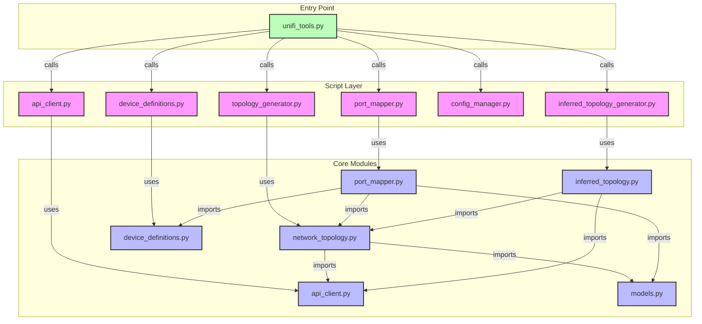

```mermaid
graph TD
    subgraph "Entry Point"
        unifi_tools[unifi_tools.py]
    end

    subgraph "Script Layer"
        topology_gen[topology_generator.py]
        port_map[port_mapper.py]
        inferred_topo[inferred_topology_generator.py]
        api_client_script[api_client.py]
        config_mgr[config_manager.py]
        device_defs[device_definitions.py]
    end

    subgraph "Core Modules"
        network_topology[network_topology.py]
        port_mapper_module[port_mapper.py]
        api_client_module[api_client.py]
        device_defs_module[device_definitions.py]
        models[models.py]
        inferred_topology[inferred_topology.py]
    end

    %% Connections from entry point to scripts
    unifi_tools -->|calls| topology_gen
    unifi_tools -->|calls| port_map
    unifi_tools -->|calls| inferred_topo
    unifi_tools -->|calls| api_client_script
    unifi_tools -->|calls| config_mgr
    unifi_tools -->|calls| device_defs

    %% Connections from scripts to core modules
    topology_gen -->|uses| network_topology
    port_map -->|uses| port_mapper_module
    inferred_topo -->|uses| inferred_topology
    api_client_script -->|uses| api_client_module
    device_defs -->|uses| device_defs_module

    %% Core module dependencies
    network_topology -->|imports| api_client_module
    network_topology -->|imports| models
    port_mapper_module -->|imports| models
    port_mapper_module -->|imports| network_topology
    port_mapper_module -->|imports| device_defs_module
    inferred_topology -->|imports| network_topology
    inferred_topology -->|imports| api_client_module

    %% Legend
    classDef script fill:#f9f,stroke:#333,stroke-width:2px
    classDef module fill:#bbf,stroke:#333,stroke-width:2px
    classDef entry fill:#bfb,stroke:#333,stroke-width:2px

    class unifi_tools entry
    class topology_gen,port_map,inferred_topo,api_client_script,config_mgr,device_defs script
    class network_topology,port_mapper_module,api_client_module,device_defs_module,models,inferred_topology module
```
