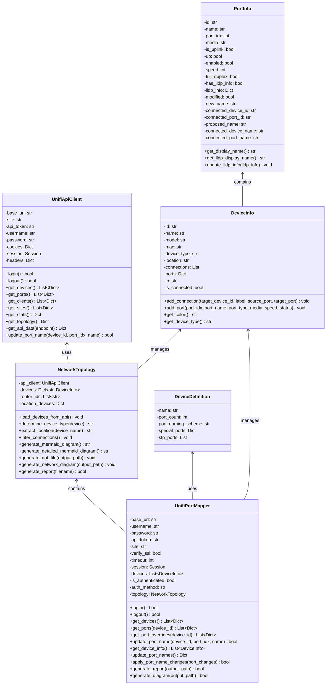

```mermaid
classDiagram
    class UnifiApiClient {
        -base_url: str
        -site: str
        -api_token: str
        -username: str
        -password: str
        -cookies: Dict
        -session: Session
        -headers: Dict
        +login() bool
        +logout() bool
        +get_devices() List~Dict~
        +get_ports() List~Dict~
        +get_clients() List~Dict~
        +get_sites() List~Dict~
        +get_stats() Dict
        +get_topology() Dict
        +get_api_data(endpoint) Dict
        +update_port_name(device_id, port_idx, name) bool
    }

    class PortInfo {
        -id: str
        -name: str
        -port_idx: int
        -media: str
        -is_uplink: bool
        -up: bool
        -enabled: bool
        -speed: int
        -full_duplex: bool
        -has_lldp_info: bool
        -lldp_info: Dict
        -modified: bool
        -new_name: str
        -connected_device_id: str
        -connected_port_id: str
        -proposed_name: str
        -connected_device_name: str
        -connected_port_name: str
        +get_display_name() str
        +get_lldp_display_name() str
        +update_lldp_info(lldp_info) void
    }

    class DeviceInfo {
        -id: str
        -name: str
        -model: str
        -mac: str
        -device_type: str
        -location: str
        -connections: List
        -ports: Dict
        -ip: str
        -is_connected: bool
        +add_connection(target_device_id, label, source_port, target_port) void
        +add_port(port_idx, port_name, port_type, media, speed, status) void
        +get_color() str
        +get_device_type() str
    }

    class NetworkTopology {
        -api_client: UnifiApiClient
        -devices: Dict~str, DeviceInfo~
        -router_ids: List~str~
        -location_devices: Dict
        +load_devices_from_api() void
        +determine_device_type(device) str
        +extract_location(device_name) str
        +infer_connections() void
        +generate_mermaid_diagram() str
        +generate_detailed_mermaid_diagram() str
        +generate_dot_file(output_path) void
        +generate_network_diagram(output_path) void
        +generate_report(filename) bool
    }

    class UnifiPortMapper {
        -base_url: str
        -username: str
        -password: str
        -api_token: str
        -site: str
        -verify_ssl: bool
        -timeout: int
        -session: Session
        -devices: List~DeviceInfo~
        -is_authenticated: bool
        -auth_method: str
        -topology: NetworkTopology
        +login() bool
        +logout() bool
        +get_devices() List~Dict~
        +get_ports(device_id) List~Dict~
        +get_port_overrides(device_id) List~Dict~
        +update_port_name(device_id, port_idx, name) bool
        +get_device_info() List~DeviceInfo~
        +update_port_names() Dict
        +apply_port_name_changes(port_changes) bool
        +generate_report(output_path) bool
        +generate_diagram(output_path) bool
    }

    class DeviceDefinition {
        -name: str
        -port_count: int
        -port_naming_scheme: str
        -special_ports: Dict
        -sfp_ports: List
    }

    UnifiApiClient <-- NetworkTopology : uses
    DeviceInfo <-- NetworkTopology : manages
    PortInfo <-- DeviceInfo : contains
    NetworkTopology <-- UnifiPortMapper : contains
    DeviceDefinition <-- UnifiPortMapper : uses
    DeviceInfo <-- UnifiPortMapper : manages
```
