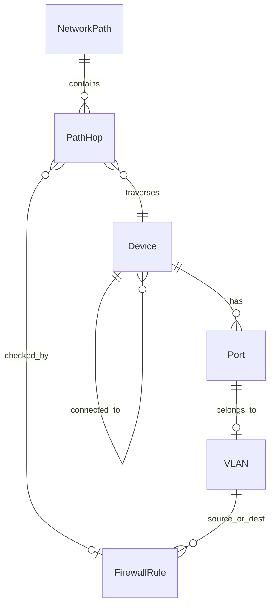
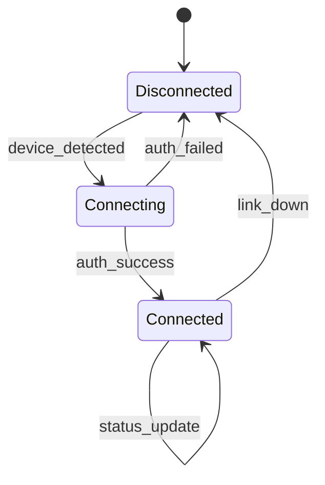
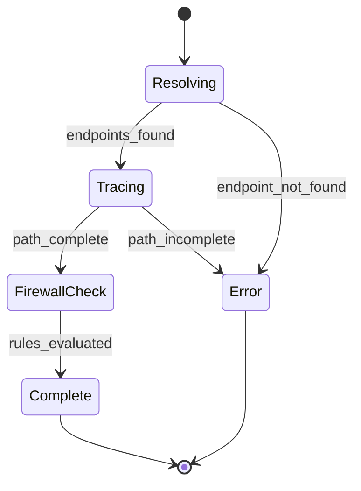

# Data Model: UniFi Network MCP Server

**Feature**: 001-unifi-mcp-server
**Date**: 2024-12-28
**Status**: Complete

## Entity Overview



## Core Entities

### Device

Represents any network device (switch, AP, gateway, client).

```python
from typing import Literal
from pydantic import BaseModel, Field

class Device(BaseModel):
    '''UniFi network device.

    Represents switches, access points, gateways, and clients.
    '''
    mac: str = Field(description='MAC address (primary identifier)')
    name: str = Field(description='Device name/hostname')
    model: str = Field(description='Hardware model (e.g., USW-Pro-48-PoE)')
    ip: str | None = Field(default=None, description='IP address if assigned')
    type: Literal['switch', 'ap', 'gateway', 'client'] = Field(
        description='Device type'
    )
    uptime: int = Field(description='Uptime in seconds')
    connected_to: str | None = Field(
        default=None,
        description='MAC of parent device (switch/AP this connects to)'
    )
    port_idx: int | None = Field(
        default=None,
        description='Port index on parent device'
    )

    # System metrics (optional, populated by system_load tool)
    cpu_percent: float | None = Field(default=None, description='CPU usage %')
    memory_percent: float | None = Field(default=None, description='Memory usage %')
    load_average: float | None = Field(default=None, description='1-min load average')
```

**Validation Rules**:
- `mac` must be valid MAC format (aa:bb:cc:dd:ee:ff or AA-BB-CC-DD-EE-FF)
- `ip` must be valid IPv4 or IPv6 if provided
- `uptime` must be non-negative

### Port

Represents a switch port with configuration and status.

```python
class Port(BaseModel):
    '''Switch port with configuration and status.'''
    port_idx: int = Field(description='Port index (1-based)')
    name: str | None = Field(default=None, description='Port name/label')
    enabled: bool = Field(description='Port administratively enabled')
    up: bool = Field(description='Port link status (up/down)')
    speed: int = Field(description='Link speed in Mbps (10, 100, 1000, 10000)')
    duplex: Literal['full', 'half'] = Field(description='Duplex mode')
    poe_mode: str | None = Field(default=None, description='PoE mode (off, auto, etc.)')
    vlan: int = Field(description='Native/untagged VLAN ID')
    tagged_vlans: list[int] = Field(
        default_factory=list,
        description='Tagged VLANs (trunk mode)'
    )
    is_trunk: bool = Field(description='True if port carries multiple VLANs')
    connected_mac: str | None = Field(
        default=None,
        description='MAC of connected device'
    )
    connected_device_name: str | None = Field(
        default=None,
        description='Name of connected device'
    )

    # Statistics
    rx_bytes: int = Field(default=0, description='Received bytes')
    tx_bytes: int = Field(default=0, description='Transmitted bytes')
    rx_errors: int = Field(default=0, description='Receive errors')
    tx_errors: int = Field(default=0, description='Transmit errors')
```

**Validation Rules**:
- `port_idx` must be >= 1
- `speed` must be in [10, 100, 1000, 2500, 5000, 10000]
- `vlan` must be 1-4094

### VLAN

Represents a Virtual LAN configuration.

```python
class VLAN(BaseModel):
    '''Virtual LAN configuration.'''
    id: int = Field(description='VLAN ID (1-4094)')
    name: str = Field(description='VLAN name')
    subnet: str | None = Field(default=None, description='Subnet CIDR (e.g., 192.168.1.0/24)')
    gateway: str | None = Field(default=None, description='Default gateway IP')
    dhcp_enabled: bool = Field(default=False, description='DHCP server enabled')
    dhcp_start: str | None = Field(default=None, description='DHCP range start')
    dhcp_end: str | None = Field(default=None, description='DHCP range end')
    purpose: str | None = Field(
        default=None,
        description='VLAN purpose (corporate, guest, iot, etc.)'
    )
    port_count: int = Field(default=0, description='Number of ports using this VLAN')
```

**Validation Rules**:
- `id` must be 1-4094
- `subnet` must be valid CIDR notation if provided
- `dhcp_start` and `dhcp_end` must be within subnet

### FirewallRule

Represents a firewall/ACL rule.

```python
class FirewallRule(BaseModel):
    '''Firewall rule definition.'''
    id: str = Field(description='Rule unique identifier')
    name: str = Field(description='Rule name/description')
    action: Literal['allow', 'deny', 'reject'] = Field(description='Rule action')
    enabled: bool = Field(default=True, description='Rule is active')

    # Source
    source_type: Literal['any', 'network', 'ip', 'port_group'] = Field(
        description='Source specification type'
    )
    source: str = Field(description='Source (VLAN name, IP/CIDR, or "any")')

    # Destination
    dest_type: Literal['any', 'network', 'ip', 'port_group'] = Field(
        description='Destination specification type'
    )
    destination: str = Field(description='Destination (VLAN name, IP/CIDR, or "any")')

    # Protocol/Port
    protocol: Literal['all', 'tcp', 'udp', 'icmp', 'tcp_udp'] = Field(
        default='all',
        description='Protocol'
    )
    port: str | None = Field(
        default=None,
        description='Port or port range (e.g., "80", "443", "1000-2000")'
    )

    # Metadata
    order: int = Field(description='Rule order/priority (lower = higher priority)')
    hit_count: int | None = Field(default=None, description='Number of rule matches')
    rule_set: str = Field(
        default='LAN_IN',
        description='Rule set (LAN_IN, WAN_IN, GUEST_IN, etc.)'
    )
```

### NetworkPath

Represents a traced path between two endpoints.

```python
class PathHop(BaseModel):
    '''Single hop in a network path.'''
    hop_number: int = Field(description='Hop sequence number (1-based)')
    device_mac: str = Field(description='Device MAC at this hop')
    device_name: str = Field(description='Device name at this hop')
    device_type: Literal['switch', 'ap', 'gateway', 'client'] = Field(
        description='Device type'
    )
    interface: str = Field(description='Interface name (e.g., "port24", "eth0")')
    vlan: int | None = Field(default=None, description='VLAN at this hop')
    latency_ms: float | None = Field(default=None, description='Latency to this hop (ms)')

    # Firewall check at this hop
    firewall_checked: bool = Field(
        default=False,
        description='Whether firewall rules were checked at this hop'
    )
    firewall_result: Literal['allow', 'deny', 'unknown'] | None = Field(
        default=None,
        description='Firewall verdict at this hop'
    )
    blocking_rule: str | None = Field(
        default=None,
        description='Name of blocking rule if denied'
    )


class NetworkPath(BaseModel):
    '''Complete network path between two endpoints.'''
    source: str = Field(description='Source identifier (IP, MAC, or name)')
    source_resolved: str = Field(description='Resolved source MAC')
    destination: str = Field(description='Destination identifier')
    destination_resolved: str = Field(description='Resolved destination MAC')

    hops: list[PathHop] = Field(description='Path hops from source to destination')
    total_latency_ms: float | None = Field(
        default=None,
        description='Total path latency (ms)'
    )

    # Overall firewall verdict
    firewall_verdict: Literal['allow', 'deny', 'unknown'] = Field(
        description='Overall firewall verdict for this path'
    )
    blocking_rules: list[FirewallRule] = Field(
        default_factory=list,
        description='Rules blocking this path (if denied)'
    )

    # Path characteristics
    crosses_vlans: bool = Field(description='Path crosses VLAN boundaries')
    vlans_traversed: list[int] = Field(
        default_factory=list,
        description='VLANs traversed in order'
    )
    is_l2_only: bool = Field(description='Path is L2 only (same VLAN)')
    is_l3_routed: bool = Field(description='Path requires L3 routing')
```

### Credentials

Internal model for authentication (not exposed via MCP).

```python
class Credentials(BaseModel):
    '''UniFi controller credentials (internal use only).'''
    host: str = Field(description='Controller hostname or IP')
    port: int = Field(default=443, description='Controller port')
    username: str = Field(description='Admin username')
    password: str = Field(description='Admin password', repr=False)
    site: str = Field(default='default', description='Site name')
    verify_ssl: bool = Field(default=False, description='Verify SSL certificate')

    @classmethod
    def from_env(cls) -> 'Credentials':
        '''Load from environment variables.'''
        return cls(
            host=os.environ['UNIFI_HOST'],
            username=os.environ['UNIFI_USERNAME'],
            password=os.environ['UNIFI_PASSWORD'],
            site=os.environ.get('UNIFI_SITE', 'default'),
        )
```

## State Transitions

### Device Connection State



### Path Trace State



## Relationships Summary

| Entity | Relates To | Cardinality | Description |
|--------|------------|-------------|-------------|
| Device | Port | 1:N | Switch has many ports |
| Device | Device | N:1 | Clients connect to switch/AP |
| Port | VLAN | N:1 | Port belongs to native VLAN |
| Port | VLAN | N:M | Trunk ports carry tagged VLANs |
| NetworkPath | PathHop | 1:N | Path contains ordered hops |
| PathHop | Device | N:1 | Hop references device |
| PathHop | FirewallRule | N:1 | Hop may have blocking rule |
| FirewallRule | VLAN | N:M | Rule references source/dest VLANs |
