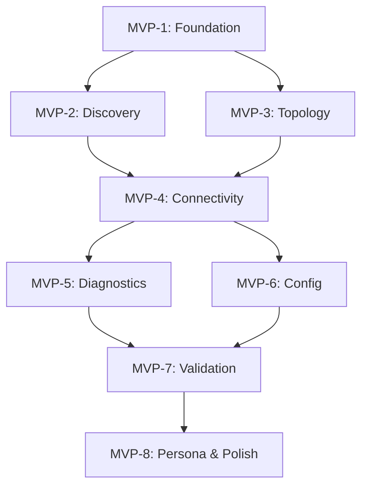

# Implementation Plan: UniFi Network MCP Server

**Branch**: `001-unifi-mcp-server` | **Date**: 2024-12-28 | **Spec**: [spec.md](./spec.md)
**Input**: Feature specification from `/specs/001-unifi-mcp-server/spec.md`

## Summary

Build an MCP server enabling AI agents to troubleshoot UniFi networks through prescriptive tools. The server follows AWS Labs MCP Structured Intelligence pattern: discrete async tools with prescriptive docstrings, a networking specialist persona via MCP resources, and explicit error handling. Target: UDM Pro Max 4.4.6 local controller.

Primary deliverables:
- FastMCP server with 7 tool groups (22+ tools)
- Async UniFi API client with credential chain (env → keyring → 1Password)
- Mermaid diagram generation for network paths
- Verbosity toggle (Guided/Expert modes)
- Claude Code agent/skill for non-expert troubleshooting

## Technical Context

**Language/Version**: Python 3.12+
**Primary Dependencies**: FastMCP >=2.13.1, Pydantic >=2.10, httpx (async HTTP), Loguru >=0.7.0, rich (TUI/tables), keyring (macOS Keychain)
**Storage**: N/A (stateless MCP server; controller provides persistence)
**Testing**: pytest >=8.0 with pytest-asyncio, pytest-cov, pytest-mock, moto
**Target Platform**: macOS (development), Linux server (deployment), MCP-compatible AI agents
**Project Type**: Single project (MCP server library)
**Performance Goals**: Simple queries <5s, Full topology <30s, Traceroute <10s
**Constraints**: 90% test coverage, 100% pass rate, async throughout, read-only by default
**Scale/Scope**: ~50 UniFi devices, 7 tool groups, 22+ individual tools

## Constitution Check

*GATE: Must pass before Phase 0 research. Re-check after Phase 1 design.*

| Principle | Requirement | Status | Notes |
|-----------|-------------|--------|-------|
| I. Code Quality | 90% coverage, binary tests, Pyright strict, Ruff | ✅ PASS | pytest-cov configured, pyright strict mode |
| II. Testing | Unit (mocked) + Integration (@pytest.mark.live) | ✅ PASS | Separate test directories planned |
| III. Documentation | Google docstrings, prescriptive guidance, Mermaid | ✅ PASS | AWS Labs pattern adopted |
| IV. Nomenclature | No forbidden words, descriptive names | ✅ PASS | Naming conventions defined |
| V. Directory Structure | Constitution-defined structure | ✅ PASS | Exact structure from constitution |
| VI. Error Handling | ToolError class, actionable messages | ✅ PASS | AWS Labs pattern adopted |
| VII. Security | Credential chain, HTTPS, no secrets in code | ✅ PASS | env → keyring → op chain |
| VIII. Performance | Response time targets, async, pooling | ✅ PASS | httpx async, connection pooling |
| IX. Logging | Loguru JSON, rotating files, correlation IDs | ✅ PASS | Structured logging configured |
| X. DevOps | Feature branches, pre-commit, branch naming | ✅ PASS | On feature branch 001-unifi-mcp-server |
| XI. Context Protection | project_status.md updates | ✅ PASS | File created and maintained |
| XII. Multi-Model | 5+ models for planning, 2-failure escalation | ✅ PASS | Protocol documented |

**GATE RESULT**: ✅ ALL PRINCIPLES SATISFIED - Proceeding to Phase 0

## Project Structure

### Documentation (this feature)

```text
specs/001-unifi-mcp-server/
├── plan.md              # This file
├── research.md          # Phase 0 output
├── data-model.md        # Phase 1 output
├── quickstart.md        # Phase 1 output
├── contracts/           # Phase 1 output (tool signatures)
├── checklists/          # Quality validation
│   └── requirements.md  # Spec quality checklist
└── tasks.md             # Phase 2 output (/speckit.tasks)
```

### Source Code (repository root)

```text
src/
└── unifi_mcp/
    ├── __init__.py
    ├── server.py                    # FastMCP server entry point
    ├── tools/
    │   ├── __init__.py
    │   ├── connectivity/
    │   │   ├── __init__.py
    │   │   ├── traceroute.py        # L2+L3 path tracing
    │   │   ├── path_analysis.py     # Detailed path analysis
    │   │   └── firewall_check.py    # Firewall rule analysis
    │   ├── topology/
    │   │   ├── __init__.py
    │   │   ├── network_topology.py  # Full network structure
    │   │   ├── device_tree.py       # Hierarchical device view
    │   │   └── port_map.py          # Port status and connections
    │   ├── diagnostics/
    │   │   ├── __init__.py
    │   │   ├── link_quality.py      # Interface stats
    │   │   ├── storm_detector.py    # Broadcast storm detection
    │   │   ├── lag_monitor.py       # Link aggregation status
    │   │   └── system_load.py       # Device health metrics
    │   ├── discovery/
    │   │   ├── __init__.py
    │   │   ├── find_device.py       # Locate by various IDs
    │   │   ├── find_mac.py          # MAC address lookup
    │   │   ├── find_ip.py           # IP address lookup
    │   │   └── client_trace.py      # Client connection path
    │   ├── config/
    │   │   ├── __init__.py
    │   │   ├── vlan_info.py         # VLAN configuration
    │   │   ├── qos_status.py        # QoS settings
    │   │   ├── port_config.py       # Port settings
    │   │   └── config_diff.py       # Configuration changes
    │   ├── validation/
    │   │   ├── __init__.py
    │   │   ├── config_validator.py  # Configuration validation
    │   │   ├── best_practice.py     # Best practice checks
    │   │   └── capacity_planner.py  # Capacity analysis
    │   └── utility/
    │       ├── __init__.py
    │       ├── format_table.py      # Rich table formatting
    │       ├── render_mermaid.py    # Mermaid diagram generation
    │       └── export_markdown.py   # Markdown export
    ├── models/
    │   ├── __init__.py
    │   ├── device.py                # Device model
    │   ├── port.py                  # Port model
    │   ├── network_path.py          # NetworkPath, PathHop models
    │   ├── firewall.py              # FirewallRule model
    │   └── vlan.py                  # VLAN model
    ├── utils/
    │   ├── __init__.py
    │   ├── auth.py                  # Credential chain
    │   ├── client.py                # Async UniFi API client
    │   ├── logging.py               # Structured JSON logging
    │   └── errors.py                # ToolError class
    └── resources/
        ├── __init__.py
        └── persona.py               # Networking specialist persona

tests/
├── __init__.py
├── conftest.py                      # Shared fixtures, markers
├── unit/
│   ├── __init__.py
│   ├── test_models.py
│   ├── test_auth.py
│   ├── test_client.py
│   └── tools/
│       ├── test_discovery.py
│       ├── test_topology.py
│       └── ...
└── integration/
    ├── __init__.py
    ├── test_live_discovery.py       # @pytest.mark.live
    ├── test_live_topology.py
    └── ...

docs/
├── architecture.md                  # System architecture with Mermaid
├── tools/
│   ├── connectivity.md
│   ├── topology.md
│   ├── diagnostics.md
│   └── ...
└── troubleshooting/
    └── common_issues.md

agents/
└── unifi-network/
    ├── AGENT.md                     # Claude Code agent definition
    └── knowledge/
        ├── unifi_api.md
        └── troubleshooting_workflows.md
```

**Structure Decision**: Single project MCP server following AWS Labs pattern. Tool groups organized by domain (connectivity, topology, diagnostics, discovery, config, validation, utility). Models centralized. Utils shared across tools.

## Complexity Tracking

> **No violations identified** - Structure follows constitution exactly.

## MVP Implementation Stages

### MVP-1: Foundation
**Pass Criteria**: Server starts, connects to controller, `pre-commit run --all-files` passes

| Task | Description | Binary Pass/Fail |
|------|-------------|------------------|
| T001 | Create directory structure per constitution | All directories exist |
| T002 | pyproject.toml with all dependencies | `uv sync` succeeds |
| T003 | .pre-commit-config.yaml (AWS Labs pattern) | `pre-commit run --all-files` passes |
| T004 | FastMCP server skeleton in server.py | Server starts without error |
| T005 | Credential chain (env → keyring → op) | Returns credentials from any source |
| T006 | Async UniFi API client | Authenticates to controller |
| T007 | Structured JSON logging | Log file created with JSON |
| T008 | CLAUDE.md with constitution reference | File exists with required content |
| T009 | project_status.md updates | File reflects current state |

### MVP-2: Discovery
**Pass Criteria**: All 4 tools return valid data, 90% test coverage

| Task | Description | Binary Pass/Fail |
|------|-------------|------------------|
| T010 | find_device tool | Returns device by MAC/IP/name |
| T011 | find_mac tool | Returns location of MAC address |
| T012 | find_ip tool | Returns location of IP address |
| T013 | client_trace tool | Returns client connection path |
| T014 | Unit tests (mocked) | 90% coverage, all pass |
| T015 | Integration tests (@live) | All pass with real controller |

### MVP-3: Topology
**Pass Criteria**: Tools render correct topology, Mermaid output validates

| Task | Description | Binary Pass/Fail |
|------|-------------|------------------|
| T016 | get_network_topology tool | Returns full network structure |
| T017 | get_device_tree tool | Returns hierarchical view |
| T018 | get_port_map tool | Returns all port statuses |
| T019 | Mermaid diagram generation | Valid Mermaid syntax |
| T020 | Verbosity toggle | Guided/Expert modes work |

### MVP-4: Connectivity
**Pass Criteria**: Path tracing works L2+L3, firewall rules correctly identified

| Task | Description | Binary Pass/Fail |
|------|-------------|------------------|
| T021 | traceroute tool (L2) | Shows switches, ports, VLANs |
| T022 | traceroute tool (L3) | Shows routing, inter-VLAN |
| T023 | path_analysis tool | Detailed hop analysis |
| T024 | firewall_check tool | Identifies blocking rules |
| T025 | Inter-VLAN handling | Correctly shows VLAN crossings |
| T026 | Firewall overlay | Integrates with traceroute |

### MVP-5: Diagnostics
**Pass Criteria**: Health checks return accurate metrics

| Task | Description | Binary Pass/Fail |
|------|-------------|------------------|
| T027 | link_quality tool | Returns interface stats |
| T028 | storm_detector tool | Detects broadcast storms |
| T029 | lag_monitor tool | Shows LAG status |
| T030 | system_load tool | Returns CPU/memory/uptime |
| T031 | Duplex detection | Flags Half Duplex ports |

### MVP-6: Config
**Pass Criteria**: Config inspection complete, diff shows changes

| Task | Description | Binary Pass/Fail |
|------|-------------|------------------|
| T032 | vlan_info tool | Returns VLAN config |
| T033 | qos_status tool | Returns QoS settings |
| T034 | port_config tool | Returns port settings |
| T035 | config_diff tool | Shows config changes over time |
| T036 | Timeline view | Changes displayed chronologically |

### MVP-7: Validation
**Pass Criteria**: Validation rules execute, clear pass/fail verdicts

| Task | Description | Binary Pass/Fail |
|------|-------------|------------------|
| T037 | config_validator tool | Validates configuration |
| T038 | best_practice_check tool | Checks best practices |
| T039 | capacity_planner tool | Analyzes capacity |
| T040 | Profile validation | Checks profile consistency |
| T041 | Naming convention checks | Validates naming standards |

### MVP-8: Persona & Polish
**Pass Criteria**: Non-expert can complete troubleshooting workflow

| Task | Description | Binary Pass/Fail |
|------|-------------|------------------|
| T042 | Claude Code AGENT.md | Agent definition complete |
| T043 | Knowledge files | Troubleshooting workflows documented |
| T044 | Guided mode refinement | Non-expert friendly output |
| T045 | Documentation complete | README, architecture.md done |
| T046 | Full test coverage | 90%+ overall |

## Dependencies



## Risk Assessment

| Risk | Impact | Mitigation |
|------|--------|------------|
| UniFi API undocumented | HIGH | Reference existing unifi_port_mapper, test against real controller |
| Traceroute complexity | MEDIUM | Start with L2 only, add L3 incrementally |
| Credential chain edge cases | LOW | Test each chain link independently |
| Context window during dev | MEDIUM | Regular project_status.md updates |
