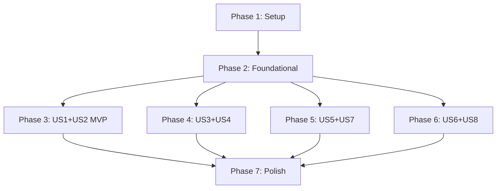

# Tasks: UniFi Network MCP Server

**Input**: Design documents from `/specs/001-unifi-mcp-server/`
**Prerequisites**: plan.md ✅, spec.md ✅, research.md ✅, data-model.md ✅, contracts/ ✅, quickstart.md ✅

**Tests**: Required per Constitution Principle II (90% coverage, binary pass/fail)

**Organization**: Tasks grouped by user story for independent implementation and testing.

## Format: `[ID] [P?] [Story] Description`

- **[P]**: Can run in parallel (different files, no dependencies)
- **[Story]**: Which user story (US1-US8 from spec.md)
- Include exact file paths in descriptions

## Path Conventions

```text
src/unifi_mcp/           # Main package
tests/unit/              # Unit tests (mocked)
tests/integration/       # Integration tests (@pytest.mark.live)
docs/                    # Documentation
agents/                  # Claude Code agent/skills
```

---

## Phase 1: Setup (Project Initialization)

**Purpose**: Create project structure and configure tooling

- [ ] T001 Create directory structure per constitution in src/unifi_mcp/
- [ ] T002 Create tests/ directory with unit/ and integration/ subdirectories
- [ ] T003 Create docs/ directory with tools/ and troubleshooting/ subdirectories
- [ ] T004 Create agents/unifi-network/ directory with knowledge/ subdirectory
- [ ] T005 [P] Initialize pyproject.toml with all dependencies (FastMCP, Pydantic, httpx, Loguru, rich, keyring)
- [ ] T006 [P] Create .pre-commit-config.yaml following AWS Labs pattern
- [ ] T007 [P] Create .python-version file with 3.12
- [ ] T008 [P] Create .gitignore with Python, UV, IDE exclusions
- [ ] T009 Run `uv sync` and verify all dependencies install
- [ ] T010 Run `pre-commit install` and `pre-commit run --all-files`

**Checkpoint**: Project structure exists, tooling configured, pre-commit passes on empty project

---

## Phase 2: Foundational (Blocking Prerequisites)

**Purpose**: Core infrastructure required by ALL user stories

**⚠️ CRITICAL**: No user story work can begin until this phase is complete

### Core Models (Shared by all stories)

- [ ] T011 [P] Create Device model in src/unifi_mcp/models/device.py
- [ ] T012 [P] Create Port model in src/unifi_mcp/models/port.py
- [ ] T013 [P] Create VLAN model in src/unifi_mcp/models/vlan.py
- [ ] T014 [P] Create FirewallRule model in src/unifi_mcp/models/firewall.py
- [ ] T015 [P] Create NetworkPath and PathHop models in src/unifi_mcp/models/network_path.py
- [ ] T016 Create models __init__.py exporting all models in src/unifi_mcp/models/__init__.py

### Utilities (Required by all tools)

- [ ] T017 [P] Create Credentials model and credential chain in src/unifi_mcp/utils/auth.py
- [ ] T018 [P] Create ToolError class following AWS Labs pattern in src/unifi_mcp/utils/errors.py
- [ ] T019 [P] Create structured JSON logging configuration in src/unifi_mcp/utils/logging.py
- [ ] T020 Create async UniFi API client in src/unifi_mcp/utils/client.py
- [ ] T021 Create utils __init__.py exporting all utilities in src/unifi_mcp/utils/__init__.py

### Server Infrastructure

- [ ] T022 Create networking specialist persona in src/unifi_mcp/resources/persona.py
- [ ] T023 Create FastMCP server skeleton with persona in src/unifi_mcp/server.py
- [ ] T024 Create package __init__.py with version in src/unifi_mcp/__init__.py
- [ ] T025 Create tools __init__.py for tool registration in src/unifi_mcp/tools/__init__.py

### Foundation Tests

- [ ] T026 [P] Create pytest conftest.py with fixtures and markers in tests/conftest.py
- [ ] T027 [P] Create unit tests for all models in tests/unit/test_models.py
- [ ] T028 [P] Create unit tests for auth/credential chain in tests/unit/test_auth.py
- [ ] T029 [P] Create unit tests for ToolError in tests/unit/test_errors.py
- [ ] T030 [P] Create unit tests for logging in tests/unit/test_logging.py
- [ ] T031 Create unit tests for UniFi API client (mocked) in tests/unit/test_client.py
- [ ] T032 Create integration test for real controller connection in tests/integration/test_connection.py

### Validation

- [ ] T033 Run `pre-commit run --all-files` - must pass
- [ ] T034 Run `pytest -m "not live"` - must pass with 90%+ coverage
- [ ] T035 Run `uv run python -m unifi_mcp.server` - server must start

**Checkpoint**: Foundation ready - all models, utils, server skeleton working with tests passing

---

## Phase 3: User Story 1 & 2 - Core Connectivity (Priority: P1) 🎯 MVP

**Goal**: Enable VLAN connectivity verification (US1) and device-to-device traceroute (US2)

**Independent Test**: User can verify VLAN-to-VLAN connectivity and trace paths between devices

### Discovery Tools (Required by US1 & US2)

- [ ] T036 [P] [US1] Create find_device tool in src/unifi_mcp/tools/discovery/find_device.py
- [ ] T037 [P] [US1] Create find_mac tool in src/unifi_mcp/tools/discovery/find_mac.py
- [ ] T038 [P] [US1] Create find_ip tool in src/unifi_mcp/tools/discovery/find_ip.py
- [ ] T039 [P] [US1] Create client_trace tool in src/unifi_mcp/tools/discovery/client_trace.py
- [ ] T040 [US1] Create discovery __init__.py with __all__ in src/unifi_mcp/tools/discovery/__init__.py

### Topology Tools (Required by US1 & US2)

- [ ] T041 [P] [US1] Create get_network_topology tool in src/unifi_mcp/tools/topology/network_topology.py
- [ ] T042 [P] [US1] Create get_device_tree tool in src/unifi_mcp/tools/topology/device_tree.py
- [ ] T043 [P] [US1] Create get_port_map tool in src/unifi_mcp/tools/topology/port_map.py
- [ ] T044 [US1] Create topology __init__.py with __all__ in src/unifi_mcp/tools/topology/__init__.py

### Connectivity Tools (Core of US1 & US2)

- [ ] T045 [US2] Create traceroute tool (L2 path) in src/unifi_mcp/tools/connectivity/traceroute.py
- [ ] T046 [US2] Add L3 routing support to traceroute in src/unifi_mcp/tools/connectivity/traceroute.py
- [ ] T047 [P] [US1] Create firewall_check tool in src/unifi_mcp/tools/connectivity/firewall_check.py
- [ ] T048 [P] [US2] Create path_analysis tool in src/unifi_mcp/tools/connectivity/path_analysis.py
- [ ] T049 [US1] Create connectivity __init__.py with __all__ in src/unifi_mcp/tools/connectivity/__init__.py

### Utility Tools (Output formatting)

- [ ] T050 [P] [US1] Create render_mermaid tool in src/unifi_mcp/tools/utility/render_mermaid.py
- [ ] T051 [P] [US1] Create format_table tool in src/unifi_mcp/tools/utility/format_table.py
- [ ] T052 [P] [US1] Create export_markdown tool in src/unifi_mcp/tools/utility/export_markdown.py
- [ ] T053 [US1] Create utility __init__.py with __all__ in src/unifi_mcp/tools/utility/__init__.py

### Server Integration

- [ ] T054 [US1] Register discovery tools in server.py
- [ ] T055 [US1] Register topology tools in server.py
- [ ] T056 [US2] Register connectivity tools in server.py
- [ ] T057 [US1] Register utility tools in server.py
- [ ] T058 [US1] Add verbosity toggle (guided/expert mode) to server.py

### Tests for US1 & US2

- [ ] T059 [P] [US1] Create unit tests for discovery tools in tests/unit/tools/test_discovery.py
- [ ] T060 [P] [US1] Create unit tests for topology tools in tests/unit/tools/test_topology.py
- [ ] T061 [P] [US2] Create unit tests for connectivity tools in tests/unit/tools/test_connectivity.py
- [ ] T062 [P] [US1] Create unit tests for utility tools in tests/unit/tools/test_utility.py
- [ ] T063 [US1] Create integration tests for discovery (@live) in tests/integration/test_live_discovery.py
- [ ] T064 [US1] Create integration tests for topology (@live) in tests/integration/test_live_topology.py
- [ ] T065 [US2] Create integration tests for connectivity (@live) in tests/integration/test_live_connectivity.py

### Validation

- [ ] T066 Run `pytest -m "not live"` - 90%+ coverage for US1/US2 code
- [ ] T067 Run `pytest -m live` - all integration tests pass with real controller
- [ ] T068 Verify VLAN-to-VLAN connectivity check works (US1 acceptance)
- [ ] T069 Verify traceroute between devices works with firewall overlay (US2 acceptance)

**Checkpoint**: MVP complete - VLAN connectivity and device traceroute working independently

---

## Phase 4: User Story 3 & 4 - Port Health (Priority: P2)

**Goal**: Port duplex validation (US3) and port naming audit (US4)

**Independent Test**: User can scan for Half Duplex ports and audit port naming

### Diagnostics Tools (US3)

- [ ] T070 [P] [US3] Create link_quality tool in src/unifi_mcp/tools/diagnostics/link_quality.py
- [ ] T071 [P] [US3] Add duplex detection to link_quality tool
- [ ] T072 [US3] Create diagnostics __init__.py with __all__ in src/unifi_mcp/tools/diagnostics/__init__.py

### Port Audit Features (US4)

- [ ] T073 [US4] Add port naming audit to get_port_map in src/unifi_mcp/tools/topology/port_map.py
- [ ] T074 [US4] Add trunk/access identification to port_map
- [ ] T075 [US4] Add connected device resolution to port_map

### Server Integration

- [ ] T076 [US3] Register diagnostics tools in server.py

### Tests for US3 & US4

- [ ] T077 [P] [US3] Create unit tests for link_quality in tests/unit/tools/test_diagnostics.py
- [ ] T078 [P] [US4] Create unit tests for port audit in tests/unit/tools/test_port_audit.py
- [ ] T079 [US3] Create integration tests for duplex detection (@live) in tests/integration/test_live_diagnostics.py

### Validation

- [ ] T080 Run `pytest` for US3/US4 - 90%+ coverage
- [ ] T081 Verify duplex scan detects Half Duplex ports (US3 acceptance)
- [ ] T082 Verify port naming audit flags unnamed/misnamed ports (US4 acceptance)

**Checkpoint**: Port health tools working - duplex validation and naming audit complete

---

## Phase 5: User Story 5 & 7 - Configuration (Priority: P2)

**Goal**: Configuration change tracking (US5) and firewall visualization (US7)

**Independent Test**: User can view config changes and visualize firewall rules

### Config Tools (US5)

- [ ] T083 [P] [US5] Create vlan_info tool in src/unifi_mcp/tools/config/vlan_info.py
- [ ] T084 [P] [US5] Create qos_status tool in src/unifi_mcp/tools/config/qos_status.py
- [ ] T085 [P] [US5] Create port_config tool in src/unifi_mcp/tools/config/port_config.py
- [ ] T086 [US5] Create config_diff tool in src/unifi_mcp/tools/config/config_diff.py
- [ ] T087 [US5] Create config __init__.py with __all__ in src/unifi_mcp/tools/config/__init__.py

### Firewall Visualization (US7)

- [ ] T088 [US7] Add matrix view to firewall_check in src/unifi_mcp/tools/connectivity/firewall_check.py
- [ ] T089 [US7] Add Mermaid diagram generation for firewall rules
- [ ] T090 [US7] Add hit count display to firewall visualization

### Server Integration

- [ ] T091 [US5] Register config tools in server.py

### Tests for US5 & US7

- [ ] T092 [P] [US5] Create unit tests for config tools in tests/unit/tools/test_config.py
- [ ] T093 [P] [US7] Create unit tests for firewall visualization in tests/unit/tools/test_firewall_viz.py
- [ ] T094 [US5] Create integration tests for config (@live) in tests/integration/test_live_config.py

### Validation

- [ ] T095 Run `pytest` for US5/US7 - 90%+ coverage
- [ ] T096 Verify config_diff shows changes over time (US5 acceptance)
- [ ] T097 Verify firewall matrix displays correctly (US7 acceptance)

**Checkpoint**: Configuration tools working - change tracking and firewall viz complete

---

## Phase 6: User Story 6 & 8 - Advanced Diagnostics (Priority: P3)

**Goal**: Best practices validation (US6) and system load monitoring (US8)

**Independent Test**: User can validate config and monitor device health

### Validation Tools (US6)

- [ ] T098 [P] [US6] Create config_validator tool in src/unifi_mcp/tools/validation/config_validator.py
- [ ] T099 [P] [US6] Create best_practice_check tool in src/unifi_mcp/tools/validation/best_practice.py
- [ ] T100 [P] [US6] Create capacity_planner tool in src/unifi_mcp/tools/validation/capacity_planner.py
- [ ] T101 [US6] Create validation __init__.py with __all__ in src/unifi_mcp/tools/validation/__init__.py

### System Load (US8)

- [ ] T102 [P] [US8] Create system_load tool in src/unifi_mcp/tools/diagnostics/system_load.py
- [ ] T103 [P] [US8] Create storm_detector tool in src/unifi_mcp/tools/diagnostics/storm_detector.py
- [ ] T104 [P] [US8] Create lag_monitor tool in src/unifi_mcp/tools/diagnostics/lag_monitor.py
- [ ] T105 [US8] Update diagnostics __init__.py with new tools

### Server Integration

- [ ] T106 [US6] Register validation tools in server.py

### Tests for US6 & US8

- [ ] T107 [P] [US6] Create unit tests for validation tools in tests/unit/tools/test_validation.py
- [ ] T108 [P] [US8] Create unit tests for system_load in tests/unit/tools/test_system_load.py
- [ ] T109 [US6] Create integration tests for validation (@live) in tests/integration/test_live_validation.py
- [ ] T110 [US8] Create integration tests for system_load (@live) in tests/integration/test_live_system.py

### Validation

- [ ] T111 Run `pytest` for US6/US8 - 90%+ coverage
- [ ] T112 Verify best practice checks provide pass/fail verdicts (US6 acceptance)
- [ ] T113 Verify system_load shows CPU/memory/uptime (US8 acceptance)

**Checkpoint**: All user stories implemented and tested

---

## Phase 7: Polish & Cross-Cutting Concerns

**Purpose**: Documentation, agent files, and final polish

### Documentation

- [ ] T114 [P] Create README.md with installation and usage in project root
- [ ] T115 [P] Create architecture.md with Mermaid diagrams in docs/architecture.md
- [ ] T116 [P] Create connectivity tools documentation in docs/tools/connectivity.md
- [ ] T117 [P] Create topology tools documentation in docs/tools/topology.md
- [ ] T118 [P] Create diagnostics tools documentation in docs/tools/diagnostics.md
- [ ] T119 [P] Create config tools documentation in docs/tools/config.md
- [ ] T120 [P] Create validation tools documentation in docs/tools/validation.md
- [ ] T121 [P] Create common issues guide in docs/troubleshooting/common_issues.md

### Agent Files

- [ ] T122 Create Claude Code AGENT.md in agents/unifi-network/AGENT.md
- [ ] T123 [P] Create UniFi API knowledge file in agents/unifi-network/knowledge/unifi_api.md
- [ ] T124 [P] Create troubleshooting workflows in agents/unifi-network/knowledge/troubleshooting_workflows.md

### Final Validation

- [ ] T125 Run `pre-commit run --all-files` - must pass
- [ ] T126 Run `pytest --cov=src/unifi_mcp --cov-report=term-missing` - 90%+ overall coverage
- [ ] T127 Run `pyright src/` - must pass with no errors
- [ ] T128 Verify quickstart.md scenarios work end-to-end
- [ ] T129 Update project_status.md with completion status

**Checkpoint**: Project complete - all documentation, tests, and validation passing

---

## Dependencies & Execution Order

### Phase Dependencies



### User Story Dependencies

| Story | Depends On | Can Start After |
|-------|------------|-----------------|
| US1 (VLAN Connectivity) | Phase 2 | T035 (server starts) |
| US2 (Device Traceroute) | Phase 2 | T035 (server starts) |
| US3 (Port Duplex) | Phase 2 | T035 (server starts) |
| US4 (Port Naming) | Phase 2 | T035 (server starts) |
| US5 (Config Diff) | Phase 2 | T035 (server starts) |
| US6 (Best Practices) | Phase 2 | T035 (server starts) |
| US7 (Firewall Viz) | US1 (firewall_check) | T049 |
| US8 (System Load) | Phase 2 | T035 (server starts) |

### Parallel Opportunities

**Phase 1** (10 parallel tasks):
- T005, T006, T007, T008 can run in parallel

**Phase 2** (15 parallel tasks):
- T011-T015 (models) can run in parallel
- T017-T019 (utils) can run in parallel
- T026-T030 (tests) can run in parallel

**Phase 3** (18 parallel tasks):
- T036-T039 (discovery) can run in parallel
- T041-T043 (topology) can run in parallel
- T047-T048 (connectivity) can run in parallel
- T050-T052 (utility) can run in parallel
- T059-T062 (unit tests) can run in parallel

---

## Parallel Example: Phase 2 Foundation

```bash
# Launch all model tasks in parallel:
Task: "Create Device model in src/unifi_mcp/models/device.py"
Task: "Create Port model in src/unifi_mcp/models/port.py"
Task: "Create VLAN model in src/unifi_mcp/models/vlan.py"
Task: "Create FirewallRule model in src/unifi_mcp/models/firewall.py"
Task: "Create NetworkPath model in src/unifi_mcp/models/network_path.py"

# Then sequential task:
Task: "Create models __init__.py in src/unifi_mcp/models/__init__.py"
```

## Parallel Example: Phase 3 Discovery Tools

```bash
# Launch all discovery tool tasks in parallel:
Task: "Create find_device tool in src/unifi_mcp/tools/discovery/find_device.py"
Task: "Create find_mac tool in src/unifi_mcp/tools/discovery/find_mac.py"
Task: "Create find_ip tool in src/unifi_mcp/tools/discovery/find_ip.py"
Task: "Create client_trace tool in src/unifi_mcp/tools/discovery/client_trace.py"

# Then sequential:
Task: "Create discovery __init__.py in src/unifi_mcp/tools/discovery/__init__.py"
```

---

## Implementation Strategy

### MVP First (Phase 1-3 Only)

1. Complete Phase 1: Setup (T001-T010)
2. Complete Phase 2: Foundational (T011-T035)
3. Complete Phase 3: US1+US2 (T036-T069)
4. **STOP and VALIDATE**: Test MVP independently
5. Demo/deploy if ready

**MVP Scope**: VLAN connectivity verification + device-to-device traceroute with firewall analysis

### Incremental Delivery

1. MVP (Phase 1-3) → Deploy
2. Add Phase 4 (Port Health) → Deploy
3. Add Phase 5 (Config) → Deploy
4. Add Phase 6 (Advanced) → Deploy
5. Add Phase 7 (Polish) → Final release

---

## Task Summary

| Phase | Tasks | Parallel | Story Coverage |
|-------|-------|----------|----------------|
| Phase 1: Setup | T001-T010 (10) | 4 | - |
| Phase 2: Foundational | T011-T035 (25) | 15 | - |
| Phase 3: US1+US2 MVP | T036-T069 (34) | 18 | US1, US2 |
| Phase 4: US3+US4 | T070-T082 (13) | 4 | US3, US4 |
| Phase 5: US5+US7 | T083-T097 (15) | 6 | US5, US7 |
| Phase 6: US6+US8 | T098-T113 (16) | 8 | US6, US8 |
| Phase 7: Polish | T114-T129 (16) | 10 | - |
| **TOTAL** | **129 tasks** | **65 parallel** | **8 stories** |

---

## Notes

- [P] tasks = different files, no dependencies within phase
- [Story] label maps task to spec.md user story
- Each phase checkpoint validates independent functionality
- Binary pass/fail for all tests per Constitution Principle I
- Commit after each task or logical group
- Update project_status.md at each checkpoint
